# Face Recognition on Olivetti Datasets

本次实战课程，我们将使用 Olivetti 数据集中的面部图像在不使用任何深度学习网络的情况下进行面部识别，本次人脸识别大约会执行如下步骤

- 通过 PCA 获得脸部图像的主要成分
- 确定足够的主成分数量
- 根据三种不同的分类模型，获得准确性得分
- 根据三种不同的分类模型，获得了交叉验证的准确性得分
- 对最优模型进行一定的参数优化

## Before We Start

### Basic Package

```python
import numpy as np      # linear algebra
import pandas as pd     # data processing, CSV file I/O (e.g. pd.read_csv)

# Visualization
import matplotlib.pyplot as plt

# Machine Learning
from sklearn.model_selection import train_test_split
from sklearn.decomposition import PCA
from sklearn.svm import SVC
from sklearn.naive_bayes import GaussianNB
from sklearn.neighbors import KNeighborsClassifier
from sklearn.tree import DecisionTreeClassifier
from sklearn.linear_model import LogisticRegression
from sklearn.discriminant_analysis import LinearDiscriminantAnalysis
from sklearn import metrics
```

### Data Loading

```python
import os

# 设置数据路径（注意相对路径位置关系）
BASIC_DIR = os.path.abspath('.')
DATA_DIR = os.path.join(BASIC_DIR, "datas/olivetti")

# 查看数据文件
print(os.listdir(DATA_DIR))
```

**Output**

```console
['olivetti_faces_target.npy', 'olivetti_faces.npy']
```

### Ignore Warnings

```
import warnings
warnings.filterwarnings("ignore")
```

## About Face Recognition

1964 年至 1966 年，Bledsoe 对自动面部识别系统进行了首次研究，该研究是半自动的，面部上的特征点是手动确定的，并放置在称为 RAND 的表中，然后，计算机将通过对这些点进行分类来执行识别过程，紧接着，Kanade 于 1977 年在研究中提出了一种基于特征的方法，执行了功能齐全的面部识别应用程序，在此之后，二维（2D）人脸识别被深入得研究，2000 年以后三维（3D）面部研究也逐步开始

3D 面部识别方法的开发方式与 2D 面部识别方法不同，因此，在讨论人脸识别方法时，以 2D 和 3D 进行区分将更加准确

我们可以把用 2D 方法进行的人脸识别研究分为三类，分析方法（基于特征，局部），全局方法（外观）和混合方法，分析方法希望通过比较面部成分的属性来识别，而全局方法则试图通过从所有面部获得的数据来实现识别，混合方法结合局部和全局方法，试图获得能更准确地表达人脸的数据

在本实例中执行的人脸识别可以在全局人脸识别方法下进行评估

在分析方法中，从人脸图像中可以确定特征点的距离和它们之间的角度，人脸特征的形状或包含区域特征的变量，都是用于人脸识别的，分析方法根据模式和几何特性，以两种不同的方式对人脸图像进行检查，在这些方法中，人脸图像是用较小尺寸的数据来表示的，所以解决了人脸识别中增加计算成本的大数据尺寸问题

因为基于全局的方法在进行人脸识别时无需进行特征提取，而特征提取在基于特征的方法中是很麻烦的，所以基于全局的方法从 20 世纪 90 年代开始被应用于人脸识别，并且它能显著提高人脸识别效率，Kirby 和 Sirovich（1990）首先开发了一种称为 Eigenface 的方法，该方法用基于主成分分析的面部表示和识别，通过这种方法，Turk 和 Pentland 将整个人脸图像转化为向量，并用一组样本计算出特征面，PCA 能够通过图像获得的数据，获得最佳水平的代表人脸的数据，同一个人的不同面部和亮度水平被评价为 PCA 的弱点

本实例中的人脸识别完全基于 Turk 和 Pentland 的工作

### Recommended Reading

谷歌开源项目 [face_recognition](https://github.com/ageitgey/face_recognition) 是一个强大、简单、易上手的人脸识别开源项目，并且配备了完整的开发文档和应用案例

该项目的人脸识别是基于业内领先的 C++ 开源库 [dlib](http://dlib.net/) 中的深度学习模型，用 [Labeled Faces in the Wild](http://vis-www.cs.umass.edu/lfw/) 人脸数据集进行测试，有高达 99.38% 的准确率，但对小孩和亚洲人脸的识别准确率尚待提升

> [Labeled Faces in the Wild](http://vis-www.cs.umass.edu/lfw/) 是美国麻省大学安姆斯特分校（University of Massachusetts Amherst) 制作的人脸数据集，该数据集包含了从网络收集的 13,000 多张面部图像

仅仅需要简易的 `face_recognition` 命令行工具，就可以用来处理整个文件夹里的图片

## Olivetti Dataset

关于 Olivetti 数据集的简短摘要

- 人脸图像采集于 1992 年 4 月至 1994 年 4 月之间
- 一共有 $40$ 位不同的测试者，每位测试者采集了 $10$ 张不同的照片
- 在数据集中共有 $400$ 张人脸图像
- 面部图像是在不同时间拍摄的，光线，面部表情和面部细节各不相同
- 所有脸部图像都有黑色背景
- 图像为灰度图片
- 每张图像的大小为 $64\times64$
- 图像像素值缩放到 $[0，1]$ 区间
- $40$ 位测试者的姓名编码为 $0$ 到 $39$ 之间的整数

```python
data = np.load(os.path.join(DATA_DIR, "olivetti_faces.npy"))
target = np.load(os.path.join(DATA_DIR, "olivetti_faces_target.npy"))
```

我么可以验证一下数据的信息

```python
print("There are {} images in the dataset".format(len(data)))
print("There are {} unique targets in the dataset".format(len(np.unique(target))))
print("Size of each image is {}x{}".format(data.shape[1], data.shape[2]))
print("Pixel values were scaled to [0,1] interval. e.g:{}".format(data[0][0,:4]))
```

**Output**

```console
There are 400 images in the dataset
There are 40 unique targets in the dataset
Size of each image is 64x64
Pixel values were scaled to [0,1] interval. e.g:[0.30991736 0.3677686  0.41735536 0.44214877]
```

查看一下标签

```python
print("unique target number:", np.unique(target))
```

**Output**

```console
unique target number: [ 0  1  2  3  4  5  6  7  8  9 10 11 12 13 14 15 16 17 18 19 20 21 22 23
 24 25 26 27 28 29 30 31 32 33 34 35 36 37 38 39]
```

### Show 40 Disticnt People in the Olivetti Dataset

```python
def show_40_distinct_people(images, unique_ids):
    # 创建 4x10 的子图
    fig, axarr = plt.subplots(nrows=4, ncols=10, figsize=(18, 9))
    # 为了易于迭代，将 4X10 子图矩阵扁平化为一个含有 40 个元素的数组
    axarr = axarr.flatten()
    
    # 遍历用户 ID
    for unique_id in unique_ids:
        image_index = unique_id * 10
        axarr[unique_id].imshow(images[image_index], cmap='gray')
        axarr[unique_id].set_xticks([])
        axarr[unique_id].set_yticks([])
        axarr[unique_id].set_title("face id:{}".format(unique_id))
    plt.suptitle("There are 40 distinct people in the dataset")
```

查看 $40$ 张人脸的示意

```python
show_40_distinct_people(data, np.unique(target))
```

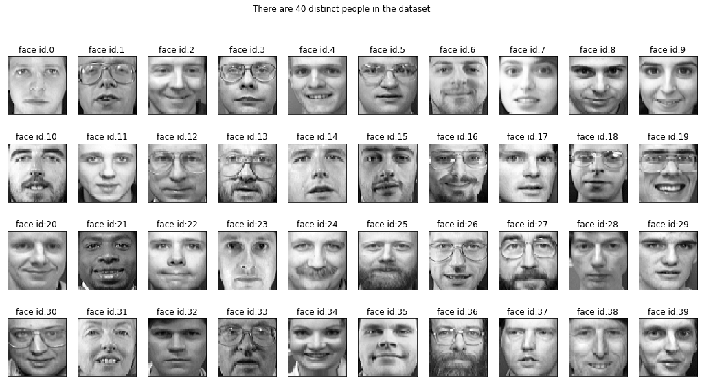

从上方的照片库中可以看到，数据集包含 $40$ 张不同的个人面部图像

### Show 10 Face Images of Selected Target

```python
def show_10_faces_of_n_subject(images, subject_ids):
    cols=10 # 每个对象有 10 张不同的面部图像
    rows=(len(subject_ids) * 10) / cols 
    rows=int(rows)
    
    fig, axarr=plt.subplots(nrows=rows, ncols=cols, figsize=(18,9))
    # axarr=axarr.flatten()
    
    for i, subject_id in enumerate(subject_ids):
        for j in range(cols):
            image_index=subject_id * 10 + j
            axarr[i,j].imshow(images[image_index], cmap="gray")
            axarr[i,j].set_xticks([])
            axarr[i,j].set_yticks([])
            axarr[i,j].set_title("face id:{}".format(subject_id))
```

可以选择若干被试者进行查看

```python
show_10_faces_of_n_subject(images=data, subject_ids=[0, 5, 21, 24, 36])
```

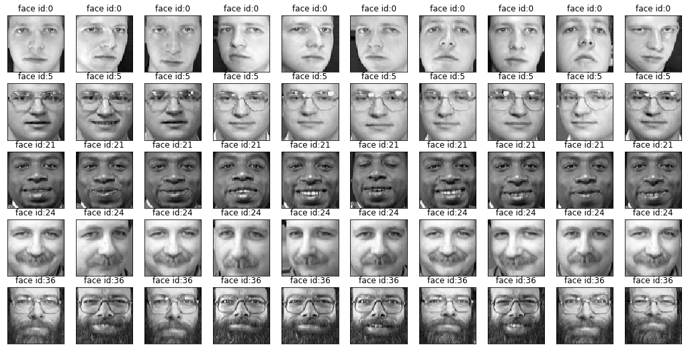

在不同的光线、面部表情和面部细节（眼镜、胡须）的情况下，被摄者的每张脸都有不同的特征

## Machine Learning Model fo Face Recognition

机器学习模型可以在向量上工作，由于图像数据是矩阵形式的，所以我们先将其转换为向量

```python
# 我们对图像进行重塑，以建立机器学习模型
X = data.reshape((data.shape[0], data.shape[1] * data.shape[2]))
print("X shape:", X.shape)
```

**Output**

```console
X shape: (400, 4096)
```

### Split Data and Target into Random Train and Test Subsets

数据集包含每位被试的 $10$ 张人脸图像，在这些人脸图像中，我们将 $70\%$ 用于训练，$30\%$ 用于测试，使用分层特征为每个被试者提供相同数量的训练和测试图像，因此，每位对象将有 $7$ 张训练图像和 $3$ 张测试图像，正如我们以前所学，也可以适当调整这个比率

```python
X_train, X_test, y_train, y_test=train_test_split(X, target, test_size=0.3, stratify=target, random_state=0)
print("X_train shape:", X_train.shape)
print("y_train shape:{}".format(y_train.shape))
```

**Output**

```console
X_train shape: (280, 4096)
y_train shape:(280,)
```

利用 pandas 查看训练集样本数

```python
y_frame = pd.DataFrame()
y_frame['subject ids'] = y_train
y_frame.groupby(['subject ids']).size().plot.bar(
    figsize=(15, 8),
    color=['orangered', 'springgreen', 'orange', 'dodgerblue', 'pink'],
    title="Number of Samples for Each Classes")
```

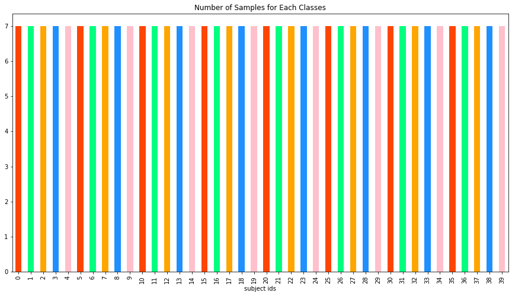

### Principle Component Analysis

回顾降维算法中，主成分分析（PCA）是一种让数据以较小的尺寸来表示的方法，根据这种方法，将数据转化为新的分量，通过选择最重要的分量来减小数据的尺寸

```python
import mglearn
```

```python
mglearn.plots.plot_pca_illustration()
```

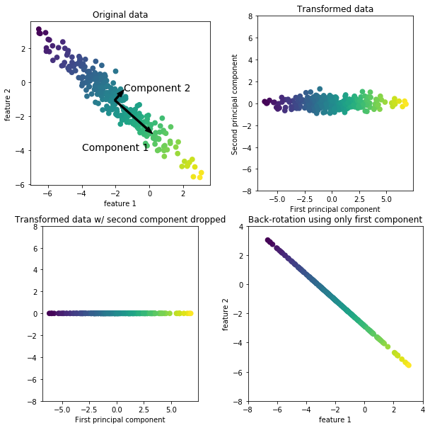

上面的插图显示了一个在合成二维数据集上的简单例子，第一张图显示的是原始数据点，用颜色区分点，算法首先通过寻找标注为 "分量 1 " 的最大方差的方向进行，这指的是大部分数据关联的方向，换句话说，就是相互之间关联度最高的属性

然后，当算法正交（直角）时，它就会找到第一个方向上包含信息最多的方向，在二维空间中，直角时只有一个可能的方向，但在高维空间中会有很多正交方向（无限）

### PCA Projection of Defined Number of Target

```python
from sklearn.decomposition import PCA
pca = PCA(n_components=2)
pca.fit(X)
X_pca = pca.transform(X)
```

查看 $10$ 位被试前两个主成分上的分量

```python
number_of_people = 10
index_range = number_of_people * 10
fig = plt.figure(figsize=(10, 8))
ax = fig.add_subplot(1, 1, 1)
scatter = ax.scatter(
    X_pca[:index_range, 0],
    X_pca[:index_range, 1], 
    c=target[:index_range],
    s=10,
    cmap=plt.get_cmap('jet', number_of_people)
)

ax.set_xlabel("First Principle Component")
ax.set_ylabel("Second Principle Component")
ax.set_title("PCA projection of {} people".format(number_of_people))

fig.colorbar(scatter)
```

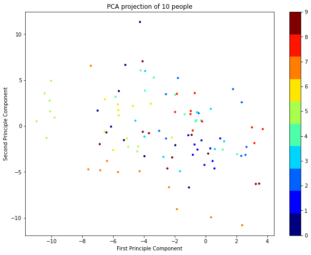

### Finding Optimum Number of Principle Component

```python
pca = PCA()
pca.fit(X)

fig, ax1 = plt.subplots(figsize=(12, 8))

ax1.plot(pca.explained_variance_, 'b--', linewidth=2, label = 'Variance')
 
plt.xlabel('Components', size=16)
plt.ylabel('Explained Variaces', size=16, color='r')
plt.tick_params(labelsize=15)

# 右轴显示累积的方差解释率
ax2 = ax1.twinx()

plt.plot(np.cumsum(pca.explained_variance_ratio_), 'r', linewidth=2,
         label = 'Cumsum Variance Ratio (%)')

plt.ylabel('Cumsum of Explained Variaces', size=16, color='r')
plt.tick_params(labelsize=15)

# fig.legend(loc='best', prop={'size': 14}, bbox_transform=ax1.transAxes)
fig.legend(prop={'size': 14}, bbox_transform=ax1.transAxes)
plt.show()
```

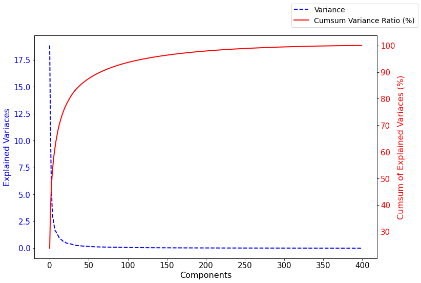

在上图中，可以看到 $90$ 个及以上的 PCA 分量的方差解释率占比已经超过 $90\%$，现在让我们用 $90$ 个 PCA 分量来进行分类处理

```python
n_components = 90
```

使用 PCA 拟合

```python
pca = PCA(n_components=n_components, whiten=True)   # 让每个特征的方差等于 1
pca.fit(X_train)
```

**Output**

```console
PCA(copy=True, iterated_power='auto', n_components=90, random_state=None,
    svd_solver='auto', tol=0.0, whiten=True)
```

### Show Average Face

```python
fig, ax = plt.subplots(1, 1, figsize=(8, 8))
ax.imshow(pca.mean_.reshape((64, 64)), cmap="gray")
ax.set_xticks([])
ax.set_yticks([])
ax.set_title('Average Face')
```

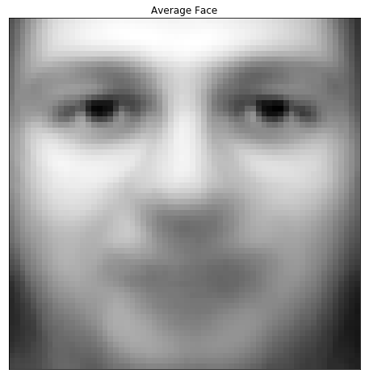

### Show Eigen Faces

```python
number_of_eigenfaces = len(pca.components_)
eigen_faces = pca.components_.reshape((number_of_eigenfaces, data.shape[1], data.shape[2]))

cols = 10
rows = int(number_of_eigenfaces/cols)
fig, axarr = plt.subplots(nrows=rows, ncols=cols, figsize=(15,15))
axarr = axarr.flatten()
for i in range(number_of_eigenfaces):
    axarr[i].imshow(eigen_faces[i], cmap="gray")
    axarr[i].set_xticks([])
    axarr[i].set_yticks([])
    axarr[i].set_title("eigen id:{}".format(i))
plt.suptitle("All Eigen Faces".format(10 * "=", 10 * "="))
```

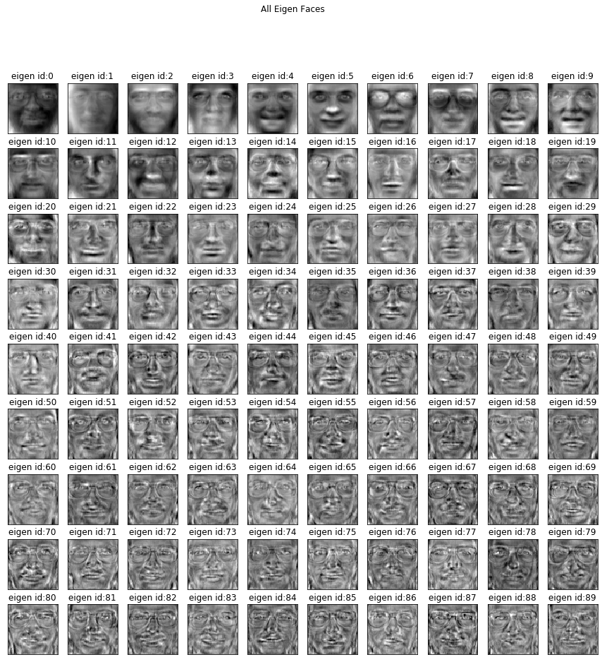

### Classification Results

首先我们使用 PCA 的特征空间，转换数据

```python
X_train_pca = pca.transform(X_train)
X_test_pca = pca.transform(X_test)
```

我们以 SVM 为例

```python
from sklearn.svm import SVC
from sklearn import metrics
clf = SVC()
clf.fit(X_train_pca, y_train)
y_pred = clf.predict(X_test_pca)
print("accuracy score: {:.2f}".format(metrics.accuracy_score(y_test, y_pred)))
```

**Output**

```console
accuracy score: 0.92
```


```python
import seaborn as sns
plt.figure(1, figsize=(12,8))
sns.heatmap(metrics.confusion_matrix(y_test, y_pred))
```

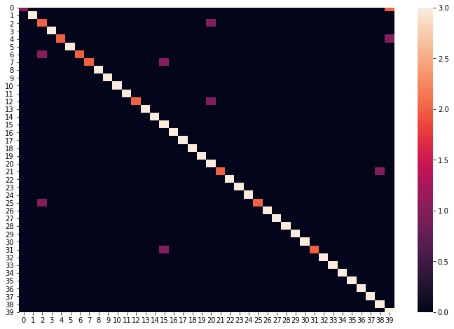

获取统计报告

```python
print(metrics.classification_report(y_test, y_pred))
```

**Output**

```console
              precision    recall  f1-score   support

           0       0.50      0.33      0.40         3
           1       1.00      1.00      1.00         3
           2       0.50      0.67      0.57         3
           3       1.00      1.00      1.00         3
           4       1.00      0.67      0.80         3
           5       1.00      1.00      1.00         3
           6       1.00      0.67      0.80         3
           7       1.00      0.67      0.80         3
           8       1.00      1.00      1.00         3
           9       1.00      1.00      1.00         3
          10       1.00      1.00      1.00         3
          11       1.00      1.00      1.00         3
          12       1.00      0.67      0.80         3
          13       1.00      1.00      1.00         3
          14       1.00      1.00      1.00         3
          15       0.75      1.00      0.86         3
          16       1.00      1.00      1.00         3
          17       1.00      1.00      1.00         3
          18       1.00      1.00      1.00         3
          19       1.00      1.00      1.00         3
          20       0.60      1.00      0.75         3
          21       1.00      0.67      0.80         3
          22       1.00      1.00      1.00         3
          23       1.00      1.00      1.00         3
          24       1.00      1.00      1.00         3
          25       1.00      0.67      0.80         3
          26       1.00      1.00      1.00         3
          27       1.00      1.00      1.00         3
          28       1.00      1.00      1.00         3
          29       1.00      1.00      1.00         3
          30       1.00      1.00      1.00         3
          31       1.00      0.67      0.80         3
          32       1.00      1.00      1.00         3
          33       1.00      1.00      1.00         3
          34       1.00      1.00      1.00         3
          35       1.00      1.00      1.00         3
          36       1.00      1.00      1.00         3
          37       1.00      1.00      1.00         3
          38       0.75      1.00      0.86         3
          39       0.50      1.00      0.67         3

    accuracy                           0.92       120
   macro avg       0.94      0.92      0.92       120
weighted avg       0.94      0.92      0.92       120
```

### More Results

我们可以得到不同机器学习模型的精确结果

```python
models=[]
models.append(('LDA', LinearDiscriminantAnalysis()))
models.append(("LR", LogisticRegression()))
models.append(("NB", GaussianNB()))
models.append(("KNN", KNeighborsClassifier(n_neighbors=5)))
models.append(("DT", DecisionTreeClassifier()))
models.append(("SVM", SVC()))

for name, model in models:
    
    clf = model

    clf.fit(X_train_pca, y_train)

    y_pred = clf.predict(X_test_pca)
    print(10 * "=", "{} Result".format(name).upper(), 10 * "=")
    print("Accuracy score:{:0.2f}".format(metrics.accuracy_score(y_test, y_pred)))
    print()
```

**Output**

```console
========== LDA RESULT ==========
Accuracy score:0.93

========== LR RESULT ==========
Accuracy score:0.93

========== NB RESULT ==========
Accuracy score:0.88

========== KNN RESULT ==========
Accuracy score:0.68

========== DT RESULT ==========
Accuracy score:0.64

========== SVM RESULT ==========
Accuracy score:0.92
```

根据上述结果，线性判别分析和 Logistic 回归似乎有最好的表现，SVM 分类器也较为优秀

### Validated Results

```python
from sklearn.model_selection import cross_val_score
from sklearn.model_selection import KFold

pca = PCA(n_components=n_components, whiten=True)
pca.fit(X)
X_pca = pca.transform(X)
for name, model in models:
    kfold = KFold(n_splits=5, shuffle=True, random_state=0)
    
    cv_scores = cross_val_score(model, X_pca, target, cv=kfold)
    print("{} mean cross validations score:{:.2f}".format(name, cv_scores.mean()))
```

**Output**

```console
LDA mean cross validations score:0.98
LR mean cross validations score:0.94
NB mean cross validations score:0.78
KNN mean cross validations score:0.68
DT mean cross validations score:0.48
SVM mean cross validations score:0.88
```

根据交叉验证得分，线性判别分析和 Logistic 回归仍具有最佳性能

```python
lr = LinearDiscriminantAnalysis()
lr.fit(X_train_pca, y_train)
y_pred = lr.predict(X_test_pca)
print("Accuracy score: {:.2f}".format(metrics.accuracy_score(y_test, y_pred)))
```

**Output**

```console
Accuracy score: 0.93
```

查看数据支持的热图

```python
cm = metrics.confusion_matrix(y_test, y_pred)

plt.subplots(1, figsize=(12, 8))
sns.heatmap(cm)
```

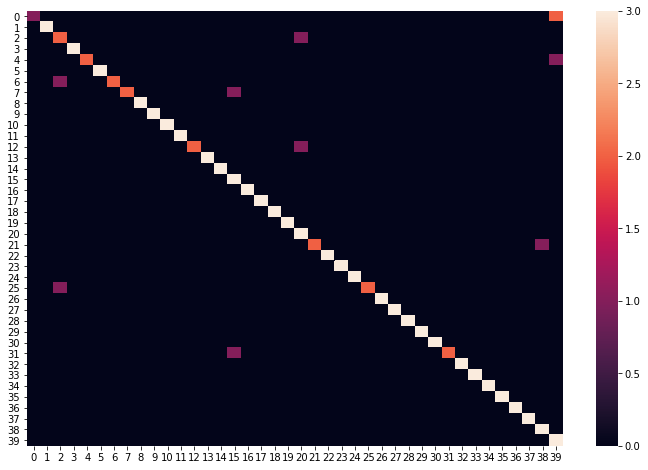

查看统计结果

```python
print("Classification Results:\n{}".format(metrics.classification_report(y_test, y_pred)))
```

**Output**

```console
Classification Results:
              precision    recall  f1-score   support

           0       1.00      0.33      0.50         3
           1       1.00      1.00      1.00         3
           2       0.50      0.67      0.57         3
           3       1.00      1.00      1.00         3
           4       1.00      0.67      0.80         3
           5       1.00      1.00      1.00         3
           6       1.00      0.67      0.80         3
           7       1.00      0.67      0.80         3
           8       1.00      1.00      1.00         3
           9       1.00      1.00      1.00         3
          10       1.00      1.00      1.00         3
          11       1.00      1.00      1.00         3
          12       1.00      0.67      0.80         3
          13       1.00      1.00      1.00         3
          14       1.00      1.00      1.00         3
          15       0.60      1.00      0.75         3
          16       1.00      1.00      1.00         3
          17       1.00      1.00      1.00         3
          18       1.00      1.00      1.00         3
          19       1.00      1.00      1.00         3
          20       0.60      1.00      0.75         3
          21       1.00      0.67      0.80         3
          22       1.00      1.00      1.00         3
          23       1.00      1.00      1.00         3
          24       1.00      1.00      1.00         3
          25       1.00      0.67      0.80         3
          26       1.00      1.00      1.00         3
          27       1.00      1.00      1.00         3
          28       1.00      1.00      1.00         3
          29       1.00      1.00      1.00         3
          30       1.00      1.00      1.00         3
          31       1.00      0.67      0.80         3
          32       1.00      1.00      1.00         3
          33       1.00      1.00      1.00         3
          34       1.00      1.00      1.00         3
          35       1.00      1.00      1.00         3
          36       1.00      1.00      1.00         3
          37       1.00      1.00      1.00         3
          38       0.75      1.00      0.86         3
          39       0.50      1.00      0.67         3

    accuracy                           0.92       120
   macro avg       0.95      0.92      0.92       120
weighted avg       0.95      0.92      0.92       120
```

### More Validated Results: Leave One Out Cross-Validation

Olivetti 数据集包含每个被试者的 $10$ 张人脸图像，对于训练和测试机器学习模型来说，数据实在是太小，在类的例子很少的情况下，为了更好地评估机器学习模型，有一种推荐的交叉验证方法，Leave One Out 交叉验证，在 LOO 方法中，一个类的样本中只有一个用于测试，其他样本用于训练，这个过程重复进行，直到每个样本都用于测试

```python
from sklearn.model_selection import LeaveOneOut

loo_cv = LeaveOneOut()
clf = LogisticRegression(solver='liblinear')
cv_scores = cross_val_score(clf, X_pca, target, cv=loo_cv)
print("{} Leave One Out cross-validation mean accuracy score: {:.2f}".format(
    clf.__class__.__name__, cv_scores.mean()))
```

**Output**

```console
LogisticRegression Leave One Out cross-validation mean accuracy score: 0.96
```

对于线性分类器

```python
loo_cv = LeaveOneOut()
clf = LinearDiscriminantAnalysis()
cv_scores = cross_val_score(clf, X_pca, target, cv=loo_cv)
print("{} Leave One Out cross-validation mean accuracy score: {:.2f}".format(
    clf.__class__.__name__, cv_scores.mean()))
```

**Output**

```console
LinearDiscriminantAnalysis Leave One Out cross-validation mean accuracy score: 0.98
```

### Hyperparameter Tunning: GridSearcCV

我们可以用 GridSearchCV 来提高模型泛化性能

事实上，GridSearchCV，的主要功能就是自动调参，只要把参数输进去，就能给出最优化的结果和参数，但是这个方法适合于小数据集，一旦数据的量级上去了，很难得出结果，数据量比较大的时候可以使用一个快速调优的方法 —— 坐标下降

GridSearchCV 其实是一种贪心算法，拿当前对模型影响最大的参数调优，直到最优化；再拿下一个影响最大的参数调优，如此下去，直到所有的参数调整完毕，这个方法的缺点就是可能会调到局部最优而不是全局最优，但是省时间省力，后续也有更多优化算法

通常算法会有一些需要调试的关键参数（即使有时默认参数效果也不错），比如 SVM 的惩罚因子 `C`，核函数 `kernel` 和 `gamma` 参数等，对于不同的数据使用不同的参数，结果效果可能差 $1\sim 5$ 个百分点，Sklearn 为我们提供专门调试参数的函数 `GridSearchCV`

为此，我们将对 Logistic 回归分类器的超参数进行调整

```python
from sklearn.model_selection import GridSearchCV
```

```python
from sklearn.model_selection import LeaveOneOut

# This process takes long time. You can use parameter:{'C': 1.0, 'penalty': 'l2'} 
# grid search cross validation score: 0.93

params = {'penalty':['l1', 'l2'], 'C':np.logspace(0, 4, 10)}
clf = LogisticRegression()
# kfold = KFold(n_splits=3, shuffle=True, random_state=0)
loo_cv = LeaveOneOut()
gridSearchCV = GridSearchCV(clf, params, cv=loo_cv)
gridSearchCV.fit(X_train_pca, y_train)
print("Grid search fitted..")
print(gridSearchCV.best_params_)
print(gridSearchCV.best_score_)
print("grid search cross validation score: {:.2f}".format(gridSearchCV.score(X_test_pca, y_test)))
```

**Output**

```console
Grid search fitted..
{'C': 3593.813663804626, 'penalty': 'l2'}
0.9178571428571428
grid search cross validation score:0.93
```

利用最优化参数 `{'C': 3593.813663804626, 'penalty': 'l2'}` 重新运行 `LogisticRegression` 分类器

```python
lr = LogisticRegression(C=3594.0, penalty="l2")
lr.fit(X_train_pca, y_train)
print("lr score: {:.2f}".format(lr.score(X_test_pca, y_test)))
```

**Output**

```console
lr score: 0.93
```

### Precision-Recall-ROC Curves

Precision-Recall-ROC Curves 是针对二元分类的，在 Olivetti 数据集中，有 40 个不同的类，不过 sklearn 允许我们说明多标签设置下的 Precision-Recall

针对多类问题的分类中，具体讲有两种，即 **Multiclass Classification** 和 **Multilabel Classification**

- Multiclass 是指分类任务中包含不止一个类别时，每条数据仅仅对应其中一个类别，不会对应多个类别
- Multilabel 是指分类任务中不止一个分类时，每条数据可能对应不止一个类别标签，例如一条新闻，可以被划分到多个板块

无论是 Multiclass，还是 Multilabel，做分类时都有两种策略，一个是 **One-vs-​the-Rest (One-vs-All)**，另一个是 **One-vs-One**

在 **One-vs-All** 策略中，假设有 $n$ 个类别，那么就会建立 $n$ 个二项分类器，每个分类器针对其中一个类别和剩余类别进行分类，进行预测时，利用这 $n$ 个二项分类器进行分类，得到数据属于当前类的概率，选择其中概率最大的一个类别作为最终的预测结果

在 **One-vs-One** 策略中，同样假设有 $n$ 个类别，则会针对两两类别建立二项分类器，得到 $k=n\times(n-1)/2$ 个分类器，对新数据进行分类时，依次使用这 $k$ 个分类器进行分类，每次分类相当于一次投票，分类结果是哪个就相当于对哪个类投了一票，在使用全部 $k$ 个分类器进行分类后，相当于进行了 $k$ 次投票，选择得票最多的那个类作为最终分类结果​

```python
from sklearn.preprocessing import label_binarize
from sklearn.multiclass import OneVsRestClassifier

Target = label_binarize(target, classes=range(40))
print(Target.shape)
print(Target[0])

n_classes = Target.shape[1]
```

**Output**

```console
(400, 40)
[1 0 0 0 0 0 0 0 0 0 0 0 0 0 0 0 0 0 0 0 0 0 0 0 0 0 0 0 0 0 0 0 0 0 0 0 0
 0 0 0]
```

类似前面的操作

```python
X_train_multiclass, X_test_multiclass, y_train_multiclass, y_test_multiclass = train_test_split(
    X, Target, test_size=0.3, stratify=Target, random_state=0)
```

```python
pca = PCA(n_components=n_components, whiten=True)
pca.fit(X_train_multiclass)

X_train_multiclass_pca = pca.transform(X_train_multiclass)
X_test_multiclass_pca = pca.transform(X_test_multiclass)
```

```python
oneRestClassifier = OneVsRestClassifier(lr)

oneRestClassifier.fit(X_train_multiclass_pca, y_train_multiclass)
y_score = oneRestClassifier.decision_function(X_test_multiclass_pca)
```


```python
# For each class
precision = dict()
recall = dict()
average_precision = dict()
for i in range(n_classes):
    precision[i], recall[i], _ = metrics.precision_recall_curve(y_test_multiclass[:, i],y_score[:, i])
    average_precision[i] = metrics.average_precision_score(y_test_multiclass[:, i], y_score[:, i])

# A "micro-average": quantifying score on all classes jointly
precision["micro"], recall["micro"], _ = metrics.precision_recall_curve(y_test_multiclass.ravel(), y_score.ravel())
average_precision["micro"] = metrics.average_precision_score(y_test_multiclass, y_score, average="micro")

print('Average precision score, micro-averaged over all classes: {0:0.2f}'
    .format(average_precision["micro"]))
```

**Output**

```console
Average precision score, micro-averaged over all classes: 0.97
```

ROC 绘制

```python
# from sklearn.utils.fixes import signature
from funcsigs import signature

step_kwargs = ({'step': 'post'}
                if 'step' in signature(plt.fill_between).parameters
                else {})
plt.figure(1, figsize=(12,8))
plt.step(recall['micro'], precision['micro'], color='b', alpha=0.2, where='post')
plt.fill_between(recall["micro"], precision["micro"], alpha=0.2, color='b', **step_kwargs)

plt.xlabel('Recall')
plt.ylabel('Precision')
plt.ylim([0.0, 1.05])
plt.xlim([0.0, 1.0])
plt.title('Average precision score, micro-averaged over all classes: AP={0:0.2f}'
        .format(average_precision["micro"]))
```

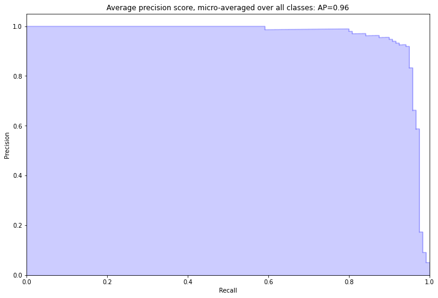

## Linear Discriminant Analysis Lite

```python
from sklearn.discriminant_analysis import LinearDiscriminantAnalysis
```

```python
lda = LinearDiscriminantAnalysis(n_components=n_classes-1)
X_train_lda = lda.fit(X_train, y_train).transform(X_train)
X_test_lda = lda.transform(X_test)
```

```python
lr = LogisticRegression(C=1.0, penalty="l2")
lr.fit(X_train_lda, y_train)
y_pred = lr.predict(X_test_lda)
```

```python
print("Accuracy score: {:.2f}".format(metrics.accuracy_score(y_test, y_pred)))
print("Classification Results:\n{}".format(metrics.classification_report(y_test, y_pred)))
```

**Output**

```console
Accuracy score: 0.95
Classification Results:
              precision    recall  f1-score   support

           0       1.00      0.33      0.50         3
           1       1.00      1.00      1.00         3
           2       0.60      1.00      0.75         3
           3       1.00      1.00      1.00         3
           4       1.00      1.00      1.00         3
           5       1.00      1.00      1.00         3
           6       1.00      1.00      1.00         3
           7       1.00      0.67      0.80         3
           8       1.00      1.00      1.00         3
           9       1.00      1.00      1.00         3
          10       1.00      1.00      1.00         3
          11       1.00      1.00      1.00         3
          12       1.00      0.67      0.80         3
          13       1.00      1.00      1.00         3
          14       0.75      1.00      0.86         3
          15       1.00      1.00      1.00         3
          16       1.00      1.00      1.00         3
          17       1.00      1.00      1.00         3
          18       1.00      1.00      1.00         3
          19       1.00      1.00      1.00         3
          20       1.00      1.00      1.00         3
          21       1.00      0.67      0.80         3
          22       1.00      1.00      1.00         3
          23       1.00      1.00      1.00         3
          24       1.00      1.00      1.00         3
          25       1.00      0.67      0.80         3
          26       1.00      1.00      1.00         3
          27       1.00      1.00      1.00         3
          28       1.00      1.00      1.00         3
          29       1.00      1.00      1.00         3
          30       0.60      1.00      0.75         3
          31       1.00      1.00      1.00         3
          32       1.00      1.00      1.00         3
          33       1.00      1.00      1.00         3
          34       1.00      1.00      1.00         3
          35       1.00      1.00      1.00         3
          36       1.00      1.00      1.00         3
          37       1.00      1.00      1.00         3
          38       0.75      1.00      0.86         3
          39       1.00      1.00      1.00         3

    accuracy                           0.95       120
   macro avg       0.97      0.95      0.95       120
weighted avg       0.97      0.95      0.95       120
```

## Machine Learning Automated Workflow: Pipeline

在数据集上应用机器学习有一个标准的工作流程，Sklearn 提供了 Pipeline 对象来自动化这个工作流，Pipeline 允许执行机器学习操作的标准工作流，如缩放、特征提取和建模，Pipeline 保证在整个数据集中进行相同的操作，保证训练数据和测试数据的一致性

```python
from sklearn.pipeline import Pipeline
```

```python
work_flows_std = list()
work_flows_std.append(('lda', LinearDiscriminantAnalysis(n_components=n_classes-1)))
work_flows_std.append(('logReg', LogisticRegression(C=1.0, penalty="l2")))
model_std = Pipeline(work_flows_std)
model_std.fit(X_train, y_train)
y_pred = model_std.predict(X_test)
```

```python
print("Accuracy score: {:.2f}".format(metrics.accuracy_score(y_test, y_pred)))
print("Classification Results:\n{}".format(metrics.classification_report(y_test, y_pred)))
```

**Output**

```console
Accuracy score: 0.95
Classification Results:
              precision    recall  f1-score   support

           0       1.00      0.33      0.50         3
           1       1.00      1.00      1.00         3
           2       0.60      1.00      0.75         3
           3       1.00      1.00      1.00         3
           4       1.00      1.00      1.00         3
           5       1.00      1.00      1.00         3
           6       1.00      1.00      1.00         3
           7       1.00      0.67      0.80         3
           8       1.00      1.00      1.00         3
           9       1.00      1.00      1.00         3
          10       1.00      1.00      1.00         3
          11       1.00      1.00      1.00         3
          12       1.00      0.67      0.80         3
          13       1.00      1.00      1.00         3
          14       0.75      1.00      0.86         3
          15       1.00      1.00      1.00         3
          16       1.00      1.00      1.00         3
          17       1.00      1.00      1.00         3
          18       1.00      1.00      1.00         3
          19       1.00      1.00      1.00         3
          20       1.00      1.00      1.00         3
          21       1.00      0.67      0.80         3
          22       1.00      1.00      1.00         3
          23       1.00      1.00      1.00         3
          24       1.00      1.00      1.00         3
          25       1.00      0.67      0.80         3
          26       1.00      1.00      1.00         3
          27       1.00      1.00      1.00         3
          28       1.00      1.00      1.00         3
          29       1.00      1.00      1.00         3
          30       0.60      1.00      0.75         3
          31       1.00      1.00      1.00         3
          32       1.00      1.00      1.00         3
          33       1.00      1.00      1.00         3
          34       1.00      1.00      1.00         3
          35       1.00      1.00      1.00         3
          36       1.00      1.00      1.00         3
          37       1.00      1.00      1.00         3
          38       0.75      1.00      0.86         3
          39       1.00      1.00      1.00         3

    accuracy                           0.95       120
   macro avg       0.97      0.95      0.95       120
weighted avg       0.97      0.95      0.95       120
```