# Anaconda and Pycharm Installation

## Anaconda

参考安装步骤

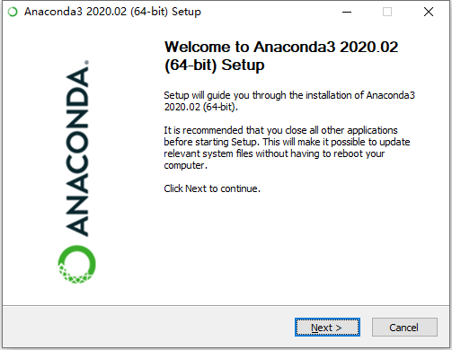

进入欢迎页面

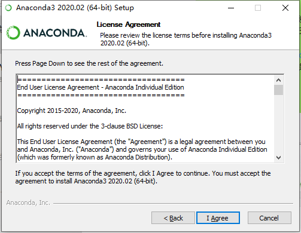

同意协议

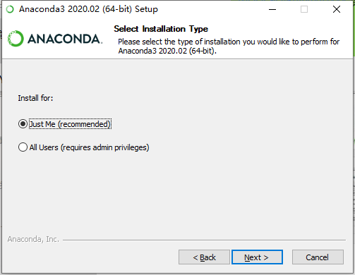

两个选项差别不大

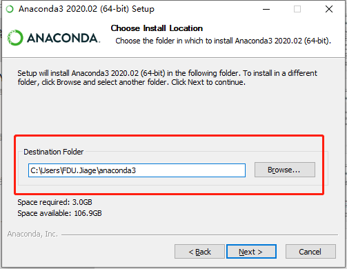

跟换路径也可以，但请不要出现中文，最好还是一个名为 `anaconda3` 的文件夹

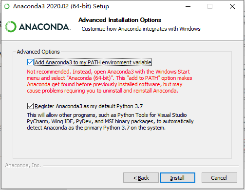

将 Anaconda3 **添加至环境变量**，后续也可以自行设置

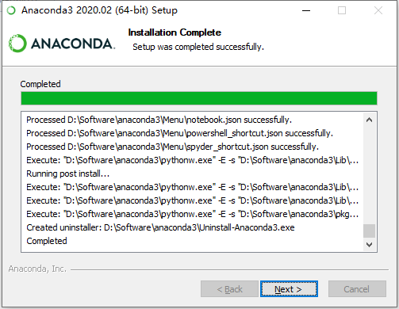

等待安装完成

推荐安装 Pycharm

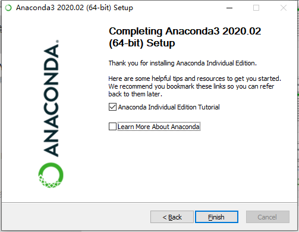

安装完成

## Pycharm

如果是 Python 的初学者，可以不用安装

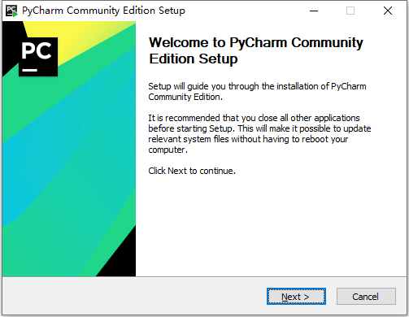

进入欢迎页面

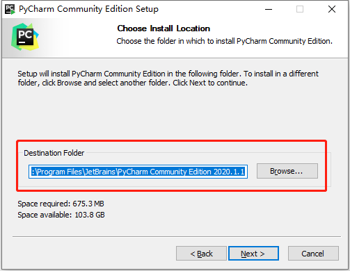

跟换路径也可以，但请不要出现中文

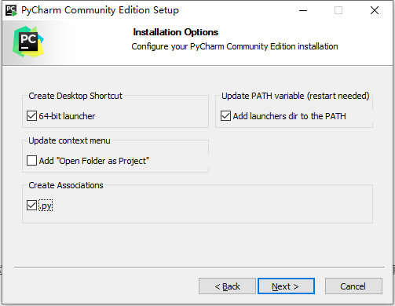

按照需求进行个性化设置，建议增加环境变量

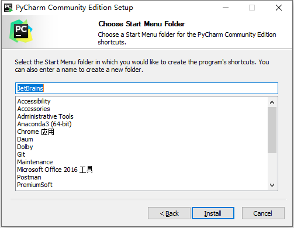

在开始菜单创建一个文件夹，默认就行

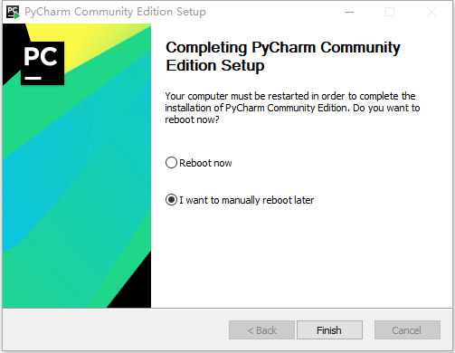

进行 Pycharm 后续的设置

同意协议