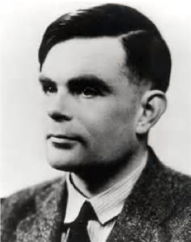
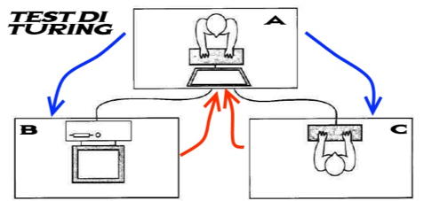
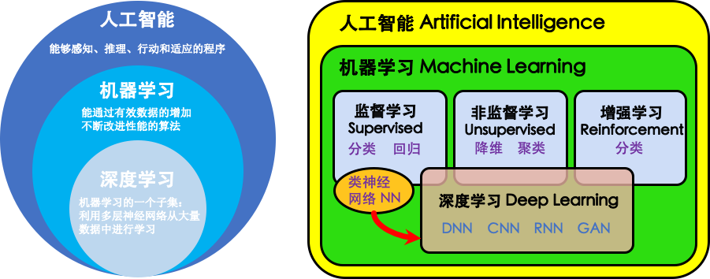
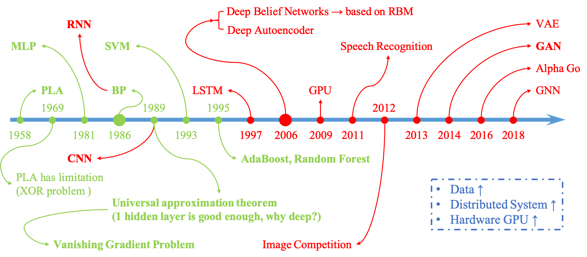

# Introduction from AI to Machine Learning

## Start with Artificial Intelligence

**人工智能**，即 Artificial Intelligence，英文缩写为 AI，是计算机科学的一个庞大分支，并且是一门与哲学、数学、经济学、神经科学、心理学、控制论、语言学等综合在一起的交叉学科

人工智能是对人的意识、思维的信息过程的模拟，人工智能不是人的智能，但能像人那样思考，未来也可能超过人的智能

一种常见分类是

- 强人工智能，BOTTOM-UP AI
    - 目前较弱
    - 强人工智能观点认为有可能制造出真正能推理（Reasoning）和解决问题（Problem Solving）的智能机器
    - 这些智能机器将被认为是有知觉的，有自我意识的
    - 可以独立思考问题并制定解决问题的极优方案，有自己的价值观和世界观体系
    - 有和生物一样的各种本能，比如生存和安全需求
    - 在某种意义上可以看作一种新的文明
- 弱人工智能，TOP-DOWN AI
    - 目前较强
    - 指不能制造出真正地推理（Reasoning）和解决问题（Problem Solving）的智能机器
    - 这些机器只不过看起来像是智能的，但是并不真正拥有智能，也不会有自主意识

### Make Machines with Human Intelligence.

- 机器感知（计算机视觉、语音信息处理）
- 学习（模式识别、机器学习、强化学习）
- 语言（自然语言处理）
- 记忆（知识表示）
- 决策（规划、数据挖掘）

提起人工智能就不得不提到人工智能之父——图灵，以及图灵测试，有兴趣的朋友可以重温一遍 “模仿游戏”

| Alan Turing                           | Turing Test                                       |
| ------------------------------------- | -----------------------------------------------   |
|  |    |

1950 年 **图灵测试** 的概念被提出， “一个人在不接触对方的情况下，通过一种特殊的方式，和对方进行一系列的问答，如果在相当长时间内，他无法根据这些问题判断对方是人还是计算机，那么就可以认为这个计算机是智能的”

图灵测试是促使人工智能从哲学探讨到科学研究的一个重要因素，引导了人工智能的很多研究方向，因为要使得计算机能通过图灵测试，计算机必须具备 **理解语言**、**学习**、**记忆**、**推理**、**决策** 等能力

在 1956 年的 **达特茅斯（Dartmouth）会议** 上，“人工智能” 被提出并作为本研究领域的名称，同时，人工智能研究的使命也得以确定，John McCarthy 提出了人工智能的定义：人工智能就是要让机器的行为看起来就象是人所表现出的智能行为一样。其后，人工智能就一直萦绕于人们的脑海之中，并在科研实验室中慢慢孵化，之后的几十年，人工智能一直在两极反转，或被称作人类文明耀眼未来的预言，或被当成技术疯子的狂想扔到垃圾堆里

## From AI to Machine Learning

### Relations

### Abbreviated History

## About Machine Learning

**机器学习（Machine Learning，ML）**，是人工智能的核心，属于人工智能的一个重要分支

关于机器学习的定义，早在 1997 年，Tom Mitchell 曾提出

---

A computer program is said **to learn from experience E** with respect to **some class of tasks T** and **performance measure P**, if its performance at tasks in T, as measured by P, improves with experience E. 

假设用 P 来评估计算机程序在某任务类 T 上的性能，若一个程序通过利用经验 E 在 T 中任务上获得了性能改善，则我们说关于 T 和 P，该程序对 E 进行了学习

---

机器学习理论主要是设计和分析一些让计算机可以自动 “学习” 的算法，从数据中自动分析获得规律后，利用规律对未知数据进行预测

所以机器学习的核心就是 **数据**，**算法（模型）**，**算力（计算机运算能力）**

### Three Elements of Machine Learning
也有机器学习三要素的说法
- **模型**
    - 线性方法
        $$
        f(X,\theta) = W^T x + b
        $$
    - 广义线性方法
        $$
        f(X,\theta) = W^T \Phi(x) + b
        $$
        如果 $\Phi(x)$ 为可学习的非线性基函数，$f(X,\theta)$ 就等价于神经网络
- **学习准则**
    - **期望风险**，对 **所有样本**（包含未知样本和已知的训练样本）的预测能力，是全局概念，理想的模型（决策）函数应该是让所有的样本的损失函数最小（即期望风险最小化），但是期望风险函数往往不可得，所以用局部最优代替全局最优，这就是经验风险最小化的理论基础
        $$
        \mathcal{R}(f) = \mathbb{E}_{(X,y)\sim p(X,y)} [\mathcal{L}(f(X),y)]
        $$

    - **经验风险**，对 **所有训练样本** 都求一次损失函数，再累加求平均，即，模型 $f(x)$ 对训练样本中所有样本的预测能力，所谓经验风险最小化即对训练集中的所有样本点损失函数的平均最小化，经验风险越小说明模型 $f(x)$ 对训练集的拟合程度越好
        $$
        \mathcal{R}(\theta) = \frac1N \sum\limits_{i=1}^{N} \mathcal{L}(y^{(i)},f(X^{(i)}))
        $$

    - **结构风险**，对经验风险和期望风险的折中，在经验风险函数后面加一个正则化项（惩罚项），是一个大于 $0$ 的系数 $\lambda$，$J(\theta)$ 可以控制模型的复杂度
        $$
        \mathcal{R}(\theta) + \lambda J(\theta)
        $$

- **优化**
    
    - 梯度下降

### Applications Machine Learning

机器学习应用领域十分广泛，例如

- 数据挖掘
- 数据分类
- 计算机视觉
- 自然语言处理（NLP）
- 生物特征识别
- 搜索引擎
- 医学诊断
- 检测信用卡欺诈
- 证券市场分析
- DNA 序列测序
- 语音和手写识别
- 战略游戏
- 机器人运用

#### Application Examples for Machine Learning

- 语音识别

    

- 图像识别

    

- 围棋

    

- 机器翻译

    

- 医学诊断

    

- 证券市场分析

    

## Schedule

- 人工智能及机器学习的相关介绍
- 环境配置（推荐使用 Conda）
    - Python 3.X 的基本语法，数据类型，数据结构，模型导入
    - NumPy、SciPy、Matplotlib 及 Pandas 的简介
- 监督学习
    - k-Nearest Neighbors
    - Linear Models (Ridge Regression, Lasso)
    - Perceptron Learning Algorithm
    - Logistic Regression
    - Support Verctor Machines
    - Multilayer Perceptron / Artificial Neural Network
    - Naive Bayes
- 模型相关
    - Uncertainty Estimates
    - Model-Evaluation
    - Pre-Processing
- 非监督学习
    - Principal Components Analysis
    - Non-negative Matrix Factorization
    - k-Means Clustering
    - Agglomerative Clustering
    - Density-Based Spatial Clustering of Applications with Noise (DBSCAN)
- 实战
    - 在 Olivetti 人脸数据集上的应用
    - AI 在边缘云场景中的优化技巧
