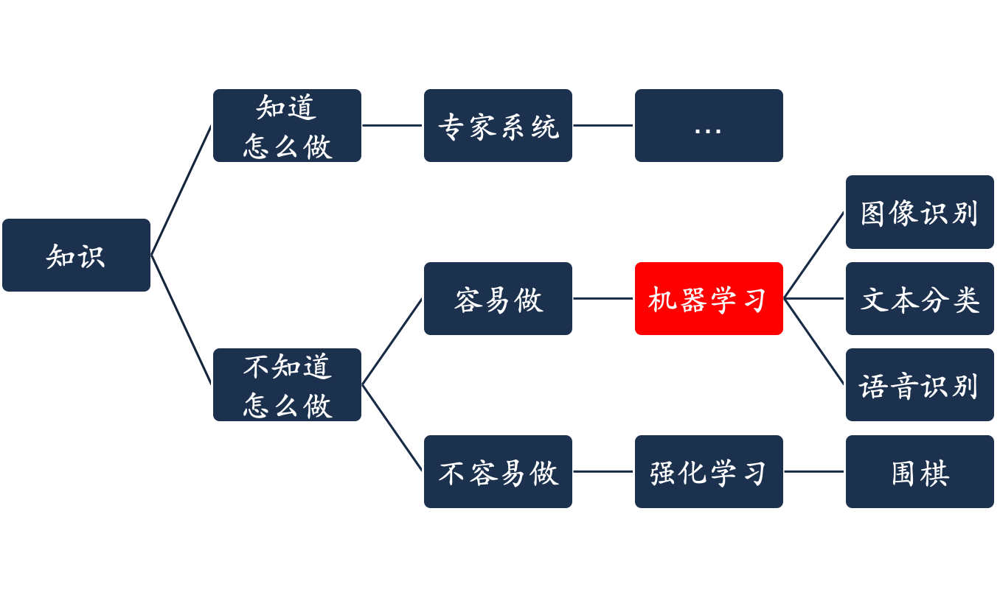
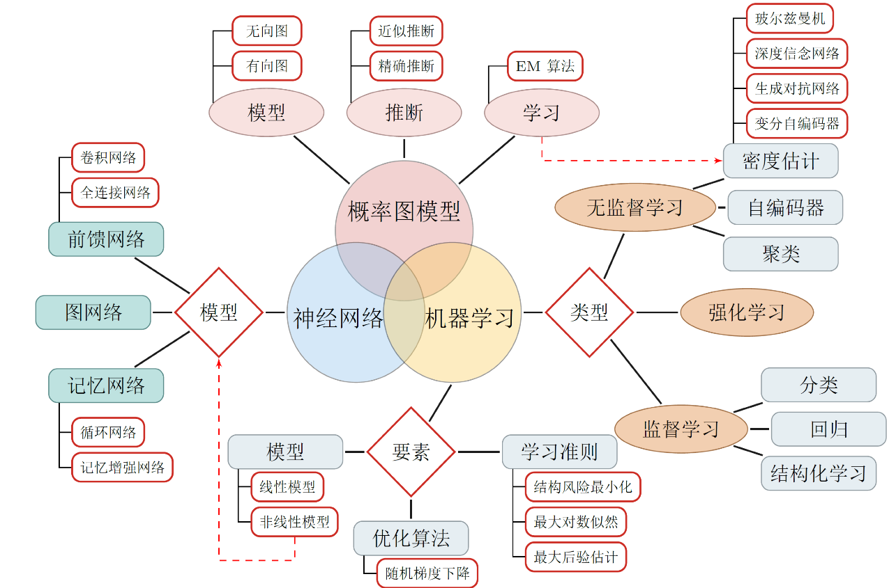

# Introduction from AI to Machine Learning

## 从人工智能开始

**人工智能**，即 Artificial Intelligence，英文缩写为 AI，是计算机科学的一个庞大分支，人工智能是对人的意识、思维的信息过程的模拟，人工智能不是人的智能，但能像人那样思考、也可能超过人的智能

一种常见分类是

- 强人工智能BOTTOM-UP AI
    - 目前较弱
    - 强人工智能观点认为有可能制造出真正能推理（Reasoning）和解决问题（Problem Solving）的智能机器
    - 这些智能机器将被认为是有知觉的，有自我意识的
    - 可以独立思考问题并制定解决问题的极优方案，有自己的价值观和世界观体系
    - 有和生物一样的各种本能，比如生存和安全需求
    - 在某种意义上可以看作一种新的文明
- 弱人工智能TOP-DOWN AI
    - 目前较强
    - 指不能制造出真正地推理（Reasoning）和解决问题（Problem Solving）的智能机器
    - 这些机器只不过看起来像是智能的，但是并不真正拥有智能，也不会有自主意识

值得警醒的是，数学常被认为是多种学科的基础科学，也包括语言、思维领域，而人工智能学科也必须借用数学工具

### 让机器具有人类的智能

- 机器感知（计算机视觉、语音信息处理）
- 学习（模式识别、机器学习、强化学习）
- 语言（自然语言处理）
- 记忆（知识表示）
- 决策（规划、数据挖掘）

提起人工智能就不得不提到人工智能之父——图灵，以及图灵测试，有兴趣的朋友可以重温一遍 “模仿游戏”

| Alan Turing                           | Turing Test                                       |
| ------------------------------------- | -----------------------------------------------   |
|  |    |

1950 年 **图灵测试** 的概念被提出， “一个人在不接触对方的情况下，通过一种特殊的方式，和对方进行一系列的问答，如果在相当长时间内，他无法根据这些问题判断对方是人还是计算机，那么就可以认为这个计算机是智能的”

图灵测试是促使人工智能从哲学探讨到科学研究的一个重要因素，引导了人工智能的很多研究方向，因为要使得计算机能通过图灵测试，计算机必须具备 **理解语言**、**学习**、**记忆**、**推理**、**决策** 等能力

在 1956 年的 **达特茅斯（Dartmouth）会议** 上，“人工智能” 被提出并作为本研究领域的名称，同时，人工智能研究的使命也得以确定，John McCarthy 提出了人工智能的定义：人工智能就是要让机器的行为看起来就象是人所表现出的智能行为一样。其后，人工智能就一直萦绕于人们的脑海之中，并在科研实验室中慢慢孵化，之后的几十年，人工智能一直在两极反转，或被称作人类文明耀眼未来的预言，或被当成技术疯子的狂想扔到垃圾堆里

#### 如何开发一个人工智能系统

## 从 AI 到机器学习

### 关系

### AI 的冰山一角

### 缩略发展史

## 机器学习

**机器学习（Machine Learning，ML）**，是人工智能的核心，属于人工智能的一个分支

关于机器学习的定义，早在 1997 年，Tom Mitchell 曾提出

---

A computer program is said **to learn from experience E** with respect to **some class of tasks T** and **performance measure P**, if its performance at tasks in T, as measured by P, improves with experience E. 

假设用 P 来评估计算机程序在某任务类 T 上的性能，若一个程序通过利用经验 E 在 T 中任务上获得了性能改善，则我们说关于 T 和 P，该程序对 E 进行了学习

---

机器学习理论主要是设计和分析一些让计算机可以自动“学习”的算法，从数据中自动分析获得规律后，利用规律对未知数据进行预测

所以机器学习的核心就是 **数据**，**算法（模型）**，**算力（计算机运算能力）**

也有机器学习三要素的说法
- **模型**
    - 线性方法 
        $$
        f(X,\theta) = W^T x + b
        $$
    - 广义线性方法
        $$
        f(X,\theta) = W^T \Phi(x) + b
        $$
        如果 $\Phi(x)$ 为可学习的非线性基函数，$f(X,\theta)$ 就等价于神经网络
- **学习准则**
    - 期望风险
        $$
        \mathcal{R}(f) = \mathbb{E}_{(X,y)\sim p(X,y)} [\mathcal{L}(f(X),y)]
        $$
    - 经验风险
        $$
        \mathcal{R}(\theta) = \frac1N \sum\limits_{i=1}^{N} \mathcal{L}(y^{(i)},f(X^{(i)}))
        $$
    - 结构风险
        $$
        \mathcal{R}(\theta) + \lambda\Vert \theta \Vert^2
        $$
- **优化**
    
    - 梯度下降

### 机器学习的应用

机器学习应用领域十分广泛，例如

- 数据挖掘
- 数据分类
- 计算机视觉
- 自然语言处理（NLP）
- 生物特征识别
- 搜索引擎
- 医学诊断
- 检测信用卡欺诈
- 证券市场分析
- DNA 序列测序
- 语音和手写识别
- 战略游戏
- 机器人运用

#### 机器学习的应用映射示例

- 语音识别

    

- 图像识别

    

- 围棋

    

- 机器翻译

    

- 医学诊断

    

- 证券市场分析

    

