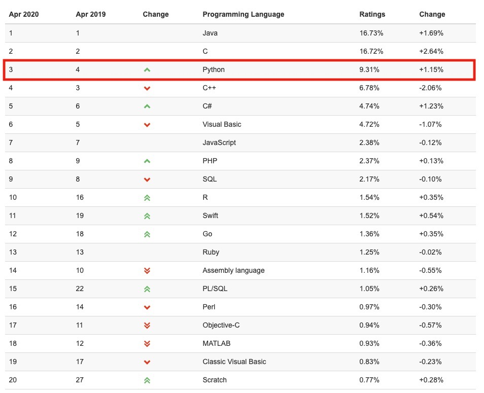
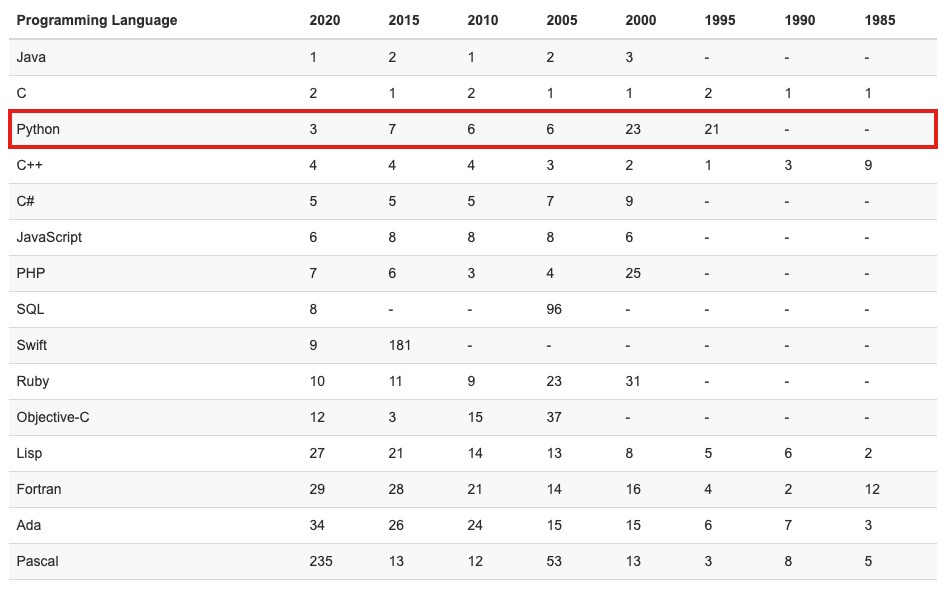
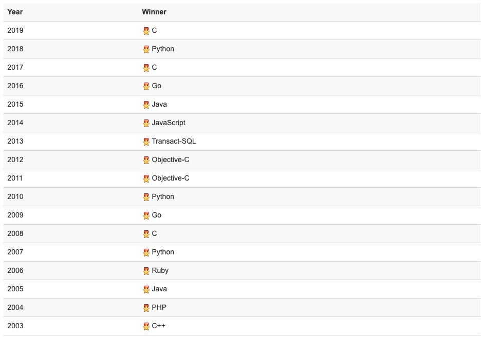
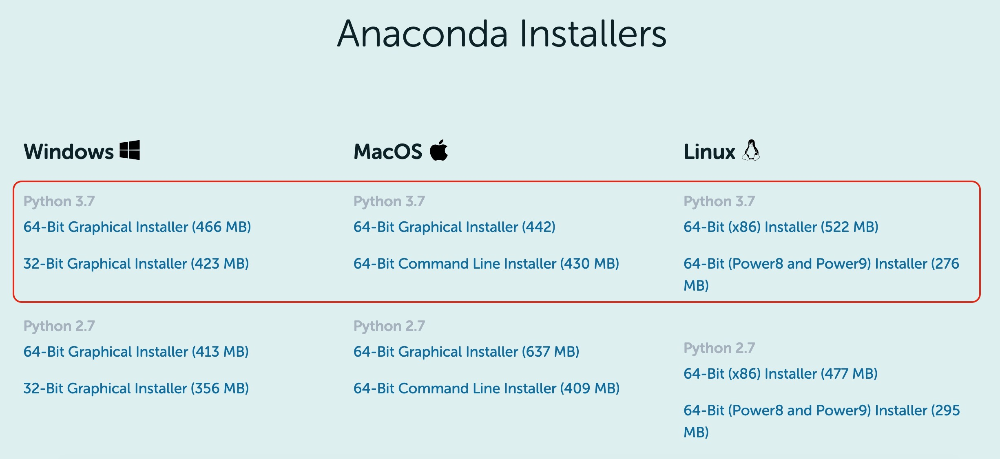
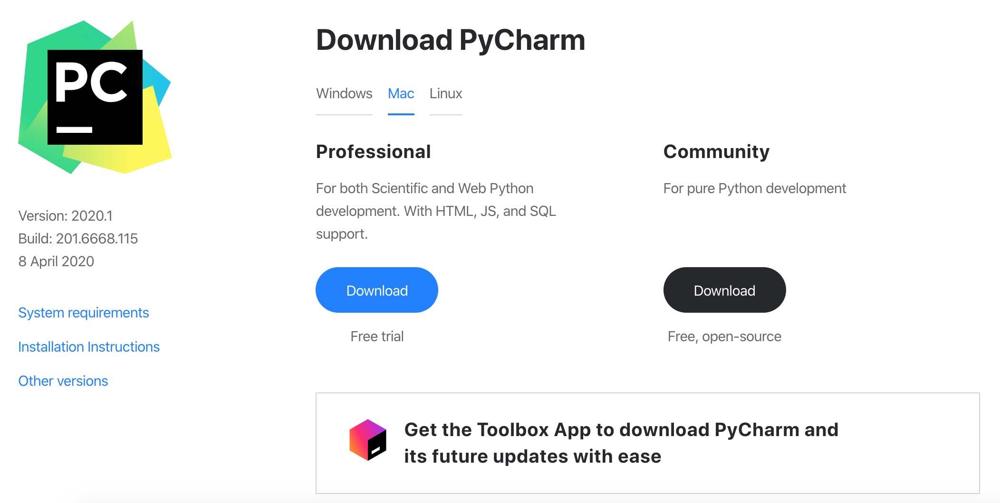

# Introduction of Python and Setup the Enviroment

## Mainstream Programming Language Rankings

世界上的编程语言有 $600$ 多种，但真正大家主流在使用的最多二三十种，不同的语言有自己的特点和擅长领域，随着计算机的不断发展，新语言在不断诞生，也同时有很多老旧的语言慢慢无人使用了

有个权威的语言排名网站 [TIOBE](https://www.tiobe.com/tiobe-index/)，可以看到主流的编程语言是哪些

### TIOBE Index for April 2020



### Very Long Term History



### Programming Language Hall of Fame 



Python 是一门优秀的综合语言， Python 的宗旨是简明、优雅、强大，在人工智能、云计算、金融分析、大数据开发、WEB开发、自动化运维、测试等方向应用广泛，已是全球第 $4$ 大最流行的语言

## Current Main Application Areas of Python

- **WEB 开发** 最火的 Python web 框架 Django, 支持异步高并发的 Tornado 框架，短小精悍的 Flask 等
- **网络编程** 支持高并发的 Twisted 网络框架， py3 引入的 asyncio 使异步编程变的非常简单
- **爬虫** 爬虫领域，Python 几乎是霸主地位，Scrapy\Request\BeautifuSoap\urllib 等
- **云计算** 目前最火最知名的云计算框架就是 OpenStack，Python 目前的热门，很大一部分就是因为云计算
- **自动化运维** 几乎是中国每位运维人员必备的语言
- **人工智能** Python 是目前公认的人工智能和数据分析领域的必备语言，得益于其强大的计算库
- **金融分析** 许多趋势分析、高频交易软件都是基于 Python，到目前为止，Python 仍是金融分析、量化交易领域里使用率最高的语言
- **科学运算** 1997 年开始，NASA 就在大量使用 Python 进行各种复杂的科学运算，随着 NumPy, SciPy, Matplotlib, Enthought librarys 等众多程序库的开发，使得 Python 越来越适合于做科学计算、绘制高质量的 2D 和 3D 图像，和科学计算领域最流行的商业软件 Matlab 相比，Python 是一门通用的程序设计语言，比 Matlab 所采用的脚本语言的应用范围更广泛

## Environment Configuration

### About Anaconda

Anaconda 是一个用于科学计算的 Python 发行版，支持 Linux, Mac, Windows, 包含了众多流行的科学计算、数据分析的 Python 包

Anaconda 安装包可以到 [官网](https://www.anaconda.com/products/individual) 或者 [清华镜像](https://mirrors.tuna.tsinghua.edu.cn/anaconda/archive/?C=M&O=D) 下载

**注意** 我们选择 Python 3.X 的版本（比如目前是 3.7）



下载之后，除了想修改安装路径以外，基本都可以选择默认设置，一路 “Next”，不过，如果遇到如下选项，记得勾选

- [x] Add Anaconda to system PATH environment variable

安装结束后，打开命令行（Mac 的 Terminal，Windows 的 Anaconda Prompt 均可），输入 `conda --version`，出现版本号表示安装成功

```console
$ conda --version
conda 4.5.12
```

**Anaconda 仓库与第三方源** 各系统都可以通过修改用户目录下的 `.condarc` 文件来设置
Windows 用户无法直接创建名为 `.condarc` 的文件，可先执行 `conda config --set show_channel_urls yes` 生成该文件之后再修改

```console
channels:
  - defaults
show_channel_urls: true
channel_alias: https://mirrors.tuna.tsinghua.edu.cn/anaconda
default_channels:
  - https://mirrors.tuna.tsinghua.edu.cn/anaconda/pkgs/main
  - https://mirrors.tuna.tsinghua.edu.cn/anaconda/pkgs/free
  - https://mirrors.tuna.tsinghua.edu.cn/anaconda/pkgs/r
  - https://mirrors.tuna.tsinghua.edu.cn/anaconda/pkgs/pro
  - https://mirrors.tuna.tsinghua.edu.cn/anaconda/pkgs/msys2
custom_channels:
  conda-forge: https://mirrors.tuna.tsinghua.edu.cn/anaconda/cloud
  msys2: https://mirrors.tuna.tsinghua.edu.cn/anaconda/cloud
  bioconda: https://mirrors.tuna.tsinghua.edu.cn/anaconda/cloud
  menpo: https://mirrors.tuna.tsinghua.edu.cn/anaconda/cloud
  pytorch: https://mirrors.tuna.tsinghua.edu.cn/anaconda/cloud
  simpleitk: https://mirrors.tuna.tsinghua.edu.cn/anaconda/cloud
```

即可添加 Anaconda Python 免费仓库

运行 `conda clean -i` 清除索引缓存，保证用的是镜像站提供的索引

如果习惯软件式操作，可以打开 Anaconda 的软件，里面有众多应用，这里我们简单介绍其中两款

- **spyder** 集成开发环境，类似于 Matlab
- **jupyter** 基于网络的 Web 应用程序，可作为学习笔记本 

### About Pycharm

很多语言都有比较流行的开发工具，比如 JAVA 的 Eclipse，C# 与 C++ 的 Visual Studio，那 Python 的是啥呢？答案就是 Pycharm

这是 PyCharm 的下载地址 http://www.jetbrains.com/pycharm/download/

之后页面会根据系统自动进入相应的下载页面



Professional 表示专业版，功能会更齐全一些，Community 是社区版，推荐安装社区版，因为是免费使用的，专业版是收费的，一年一千多，土豪请随意

### Conda Virtual Environment

在 Python 开发中，很多时候我们希望每个应用有一个独立的 Python 环境（比如应用 1 需要用到 TensorFlow 1.X，而应用 2 使用 TensorFlow 2.0，再比如我的某个应用需要用到 python 的不同版本），这时，Conda 虚拟环境即可为一个应用创建一套 “隔离” 的 Python 运行环境，使用 Python 的包管理器 conda 即可轻松地创建 Conda 虚拟环境，常用命令如下

```bash
conda create --name [env-name]      # 建立名为[env-name]的Conda虚拟环境
conda activate [env-name]           # 进入名为[env-name]的Conda虚拟环境
conda deactivate                    # 退出当前的Conda虚拟环境
conda env remove --name [env-name]  # 删除名为[env-name]的Conda虚拟环境
conda env list                      # 列出所有Conda虚拟环境
```

以下命令可以对 `conda` 以及 `anaconda` 更新， 但不建议频繁使用

```bash
conda update conda
conda update anaconda               # 需要先更新 conda
```

以下命令可以对 `python` 更新， 但不建议频繁使用

```
conda install python=3.7            # 3.7 为示例
```

此外虚拟环境还可以使用 virtualenv 等，这里不再展开

### pip and conda Package Managers

pip 是最为广泛使用的 Python 包管理器，可以帮助我们获得最新的 Python 包并进行管理

#### pypi Image Help

pypi 镜像每 5 分钟同步一次

##### Temporary Use

```bash
pip install -i https://pypi.tuna.tsinghua.edu.cn/simple some-package
```

注意，`simple` 不能少, 是 `https` 而不是 `http`

##### Set as Default

升级 pip 到最新的版本 (`>=10.0.0`) 后进行配置

```bash
pip install pip -U
pip config set global.index-url https://pypi.tuna.tsinghua.edu.cn/simple
```

如果您到 pip 默认源的网络连接较差，临时使用本镜像站来升级 pip

```bash
pip install -i https://pypi.tuna.tsinghua.edu.cn/simple pip -U
```

#### pip Common Commands

```bash
pip install [package-name]              # 安装名为[package-name]的包
pip install [package-name]==X.X         # 安装名为[package-name]的包并指定版本X.X
pip install [package-name] --proxy=代理服务器IP:端口号         # 使用代理服务器安装
pip install [package-name] --upgrade    # 更新名为[package-name]的包
pip uninstall [package-name]            # 删除名为[package-name]的包
pip list                                # 列出当前环境下已安装的所有包
```

#### conda Package Manager

conda 包管理器是 Anaconda 自带的包管理器，可以帮助我们在 conda 环境下轻松地安装各种包，相较于 pip 而言，conda 的通用性更强（不仅是 Python 包，其他包如 CUDA Toolkit 和 cuDNN 也可以安装），但 conda 源的版本更新往往较慢，常用命令如下

```bash
conda install [package-name]        # 安装名为[package-name]的包
conda install [package-name]=X.X    # 安装名为[package-name]的包并指定版本X.X
conda update [package-name]         # 更新名为[package-name]的包
conda remove [package-name]         # 删除名为[package-name]的包
conda list                          # 列出当前环境下已安装的所有包
conda search [package-name]         # 列出名为[package-name]的包在conda源中的所有可用版本
```

conda 中配置代理，在用户目录下的 `.condarc` 文件中添加以下内容

```console
proxy_servers:
    http: http://代理服务器IP:端口号
```
