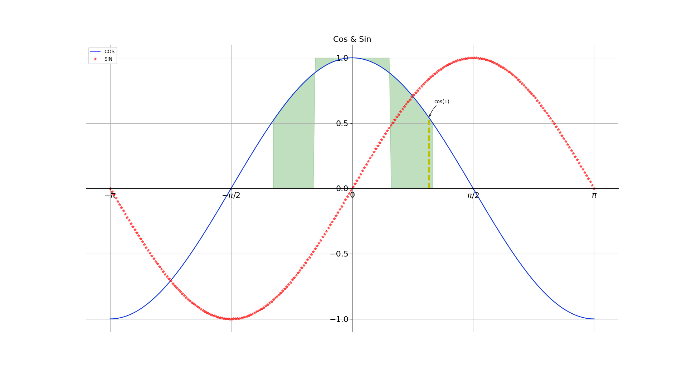
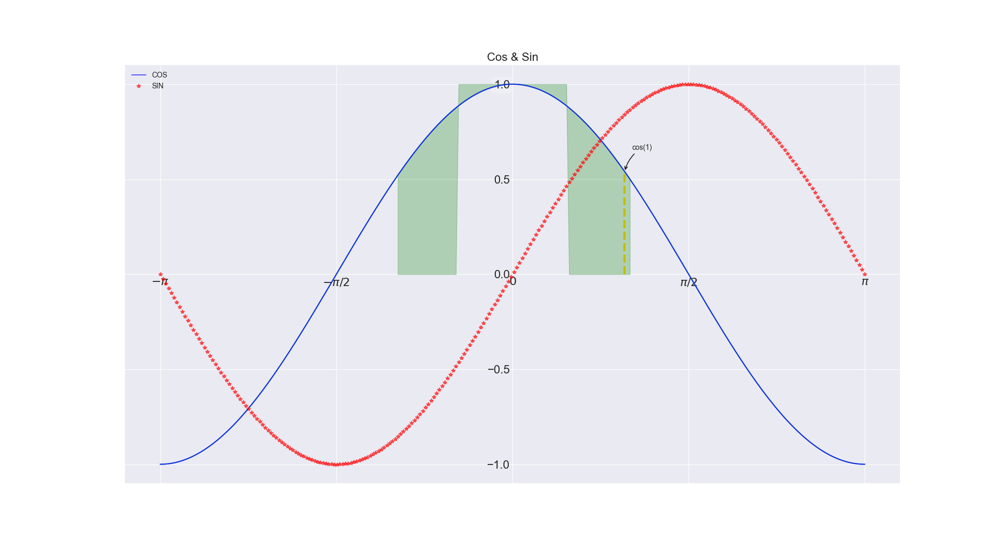
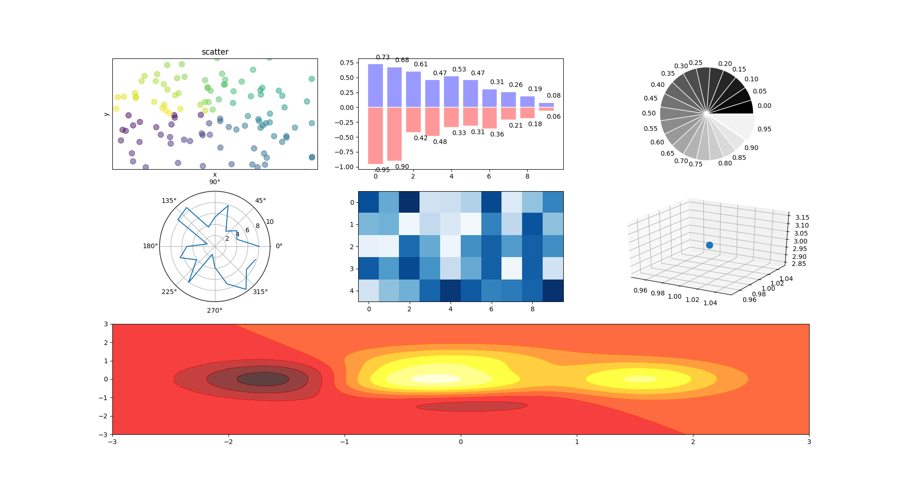
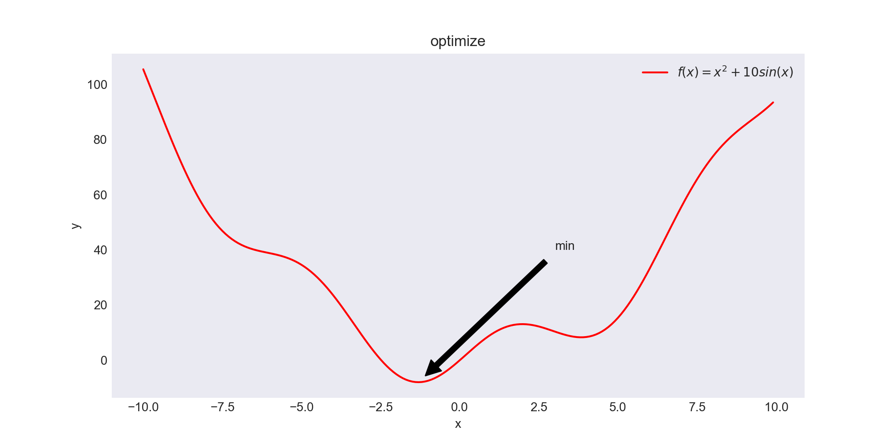
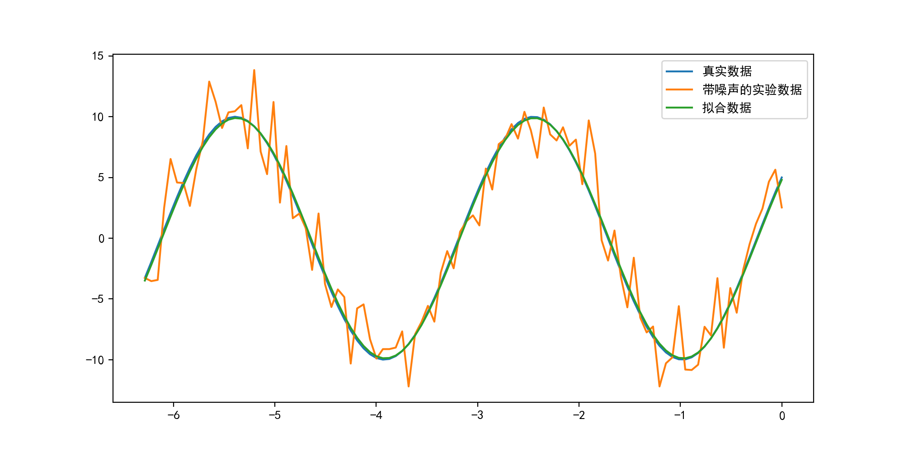

# Frequently Used Python Package

## NumPy

NumPy （Numeric Python）是 Python 中科学计算的基础包，它是一个 Python 库，提供多维数组对象，各种派生对象（如掩码数组和矩阵），以及用于数组快速操作的各种 API，有包括数学、逻辑、形状操作、排序、选择、输入输出、离散傅立叶变换、基本线性代数，基本统计运算和随机模拟等等

NumPy 包的核心是 `ndarray` 对象，它封装了 Python 原生的同数据类型的 `n` 维数组，为了保证其性能优良，其中有许多操作都是代码在本地进行编译后执行的，NumPy 相当于将 Python 变成一种免费的更强大的 MatLab 系统

NumPy 数组 和 原生 Python Array（数组）之间有几个重要的区别

- NumPy 数组在创建时具有固定的大小，与 Python 的原生数组对象（可以动态增长）不同，更改 ndarray 的大小将创建一个新数组并删除原来的数组。
- NumPy 数组中的元素都需要具有相同的数据类型，因此在内存中的大小相同，例外情况，Python 的原生数组里包含了 NumPy 的对象的时候，这种情况下就允许不同大小元素的数组
- NumPy 数组有助于对大量数据进行高级数学和其他类型的操作，通常，这些操作的执行效率更高，比使用 Python 原生数组的代码更少
- 越来越多的基于 Python 的科学和数学软件包使用 NumPy 数组; 虽然这些工具通常都支持 Python 的原生数组作为参数，但它们在处理之前会还是会将输入的数组转换为 NumPy 的数组，而且也通常输出为 NumPy 数组，为了高效地使用当今科学/数学基于 Python 的工具（大部分的科学计算工具），知道如何使用 NumPy 数组是必备的

**扩展阅读** 【[NumPy 中文文档](https://www.numpy.org.cn/)】

### ndarray

- 排列成 array-like 结构的数值数据可以通过使用 `array()` 函数转换为数组

```console
In [1]: import numpy as np

In [2]: lst=[[1,2,3],[2,4,6]]

In [3]: type(lst)
Out[3]: list

In [4]: np_lst=np.array(lst)

In [5]: type(np_lst)
Out[5]: numpy.ndarray
```

- 数组的数据类型

```console
In [6]: np_lst=np.array(lst, dtype=np.float)

In [7]: np_lst.dtype
Out[7]: dtype('float64')
```

- 数组的参数

```console
In [8]: np_lst.shape        # 行列数
Out[8]: (2, 3)

In [9]: np_lst.ndim         # 维数
Out[9]: 2

In [10]: np_lst.itemsize    # 每个数据的数据存储大小
Out[10]: 8

In [11]: np_lst.size        # 元素个数
Out[11]: 6
```

### Some kinds of Array

```console
In [12]: np.zeros([2, 4])       # 生成 2 行 4 列的全 0 的数组
Out[12]:
array([[0., 0., 0., 0.],
       [0., 0., 0., 0.]])

In [13]: np.ones([3, 5])        # 生成 3 行 5 列的全 1 的数组
Out[13]:
array([[1., 1., 1., 1., 1.],
       [1., 1., 1., 1., 1.],
       [1., 1., 1., 1., 1.]])

In [14]: np.random.rand(2, 4)   # 生成 2 行 4 列数组，每个元素为 0-1 内均匀分布随机数
Out[14]:
array([[0.3492512 , 0.53278383, 0.67421472, 0.37741499],
       [0.13505288, 0.56624554, 0.05743534, 0.47994088]])

In [15]: np.random.randint(1, 10, 3)    # 生成 3 个 1-10 内随机分布整数
Out[15]: array([6, 3, 5])

In [16]: np.random.randn(2, 4)          # 生成 2 行 4 列的标准正态随机数数组
Out[16]:
array([[ 0.7297433 , -1.31910919,  1.3258419 , -0.37062597],
       [ 0.91714998,  2.0291667 ,  0.59648187, -1.54048607]])

In [17]: np.random.choice([10, 20, 30]) # 指定范围内的随机数
Out[17]: 20

In [18]: np.random.beta(1, 10, 20)      # 生成一个包含 20 个元素满足 Beta 分布的数组
Out[18]:
array([0.01745944, 0.19434248, 0.08223912, 0.04432289, 0.2939484 ,
       0.13065389, 0.05528825, 0.20747935, 0.00320723, 0.11942977,
       0.00388593, 0.00574769, 0.07600872, 0.08523846, 0.13702178,
       0.01265392, 0.11381335, 0.01214367, 0.0733919 , 0.0779095 ])
```

### Array Opeartion

- 数学运算

```console
In [19]: lst = np.arange(1, 11).reshape([2, 5])

In [20]: lst
Out[20]:
array([[ 1,  2,  3,  4,  5],
       [ 6,  7,  8,  9, 10]])

In [21]: np.exp(lst)
Out[21]:
array([[2.71828183e+00, 7.38905610e+00, 2.00855369e+01, 5.45981500e+01, 1.48413159e+02],
       [4.03428793e+02, 1.09663316e+03, 2.98095799e+03, 8.10308393e+03, 2.20264658e+04]])

In [22]: np.exp2(lst)
Out[22]:
array([[   2.,    4.,    8.,   16.,   32.],
       [  64.,  128.,  256.,  512., 1024.]])

In [23]: np.sqrt(lst)
Out[23]:
array([[1.        , 1.41421356, 1.73205081, 2.        , 2.23606798],
       [2.44948974, 2.64575131, 2.82842712, 3.        , 3.16227766]])

In [24]: np.sin(lst)
Out[24]:
array([[ 0.84147098,  0.90929743,  0.14112001, -0.7568025 , -0.95892427],
       [-0.2794155 ,  0.6569866 ,  0.98935825,  0.41211849, -0.54402111]])

In [25]: np.log(lst)
Out[25]:
array([[0.        , 0.69314718, 1.09861229, 1.38629436, 1.60943791],
       [1.79175947, 1.94591015, 2.07944154, 2.19722458, 2.30258509]])
```

- 描述性统计

```console
In [26]: lst = np.array([[[1, 2, 3, 4], [4, 5, 6, 7]],
    ...:                 [[7, 8, 9, 10], [10, 11, 12, 13]],
    ...:                 [[14, 15, 16, 17], [18, 19, 20, 21]]])

In [27]: lst
Out[27]:
array([[[ 1,  2,  3,  4],
        [ 4,  5,  6,  7]],

       [[ 7,  8,  9, 10],
        [10, 11, 12, 13]],

       [[14, 15, 16, 17],
        [18, 19, 20, 21]]])

In [28]: lst.sum()          # 所有元素求和
Out[28]: 252

In [29]: lst.sum(axis=0)    # 最外层求和
Out[29]:
array([[22, 25, 28, 31],
       [32, 35, 38, 41]])

In [30]: lst.sum(axis=1)    # 第二层求和
Out[30]:
array([[ 5,  7,  9, 11],
       [17, 19, 21, 23],
       [32, 34, 36, 38]])

In [31]: lst.sum(axis=-1)   # 最里层求和
Out[31]:
array([[10, 22],
       [34, 46],
       [62, 78]])

In [32]: lst.max()
Out[32]: 21

In [33]: lst.min()
Out[33]: 1
```

- 数组间操作

```console
In [34]: lst1 = np.array([10, 20, 30, 40])

In [35]: lst2 = np.array([4, 3, 2, 1])

In [36]: lst1 + lst2
Out[36]: array([14, 23, 32, 41])

In [37]: lst1 - lst2
Out[37]: array([ 6, 17, 28, 39])

In [38]: lst1 * lst2
Out[38]: array([40, 60, 60, 40])

In [39]: lst1 / lst2
Out[39]: array([ 2.5       ,  6.66666667, 15.        , 40.        ])

In [40]: lst1 ** lst2
Out[40]: array([10000,  8000,   900,    40])

In [41]: np.dot(lst1.reshape([2, 2]), lst2.reshape([2, 2]))
Out[41]:
array([[ 80,  50],
       [200, 130]])

In [42]: np.concatenate((lst1, lst2), axis=0)   # 向量拼接
Out[42]: array([10, 20, 30, 40,  4,  3,  2,  1])

In [43]: np.vstack((lst1, lst2))                # 按照行拼接
Out[43]:
array([[10, 20, 30, 40],
       [ 4,  3,  2,  1]])

In [44]: np.hstack((lst1, lst2))                # 按照列拼接
Out[44]: array([10, 20, 30, 40,  4,  3,  2,  1])

In [45]: np.split(lst1, 2)                      # 向量拆分
Out[45]: [array([10, 20]), array([30, 40])]

In [46]: np.copy(lst1)                          # 向量拷贝
Out[46]: array([10, 20, 30, 40])
```

### Liner Algebra

```console
In [47]: np.eye(3)      # 生成单位矩阵
Out[47]:
array([[1., 0., 0.],
       [0., 1., 0.],
       [0., 0., 1.]])

In [48]: from numpy.linalg import *

In [49]: lst = np.array([[1, 2],
    ...:                 [3, 4]])

In [50]: inv(lst)       # 生成给定矩阵的逆矩阵
Out[50]:
array([[-2. ,  1. ],
       [ 1.5, -0.5]])

In [51]: lst.transpose()    # 生成给定矩阵的转置
Out[51]:
array([[1, 3],
       [2, 4]])

In [52]: det(lst)       # 求矩阵的行列式
Out[52]: -2.0000000000000004

In [53]: eig(lst)       # 求矩阵的特征值和特征向量
Out[53]:
(array([-0.37228132,  5.37228132]),
 array([[-0.82456484, -0.41597356],
        [ 0.56576746, -0.90937671]]))
```

**注意**

关于特征值和特征向量，例子中的两个特征值分别为

$$
\lambda_1=-0.37228132,\quad\lambda_2=5.37228132
$$

对应的特征向量分别为

$$
\xi_1=
\left[
\begin{matrix}
-0.82456484 \\ 0.56576746
\end{matrix}
\right]
,\quad
\xi_2=
\left[
\begin{matrix}
-0.41597356 \\ -0.90937671
\end{matrix}
\right]
$$

可以验证如下等式

$$
\left[
\begin{matrix}
1 & 2 \\ 3 & 4
\end{matrix}
\right]
\left[
\begin{matrix}
-0.82456484 \\ 0.56576746
\end{matrix}
\right] = 
-0.37228132 \times
\left[
\begin{matrix}
-0.82456484 \\ 0.56576746
\end{matrix}
\right]
$$

- 解线性方程

```console
In [54]: y = np.array([[5], [7]])

In [55]: solve(lst, y)
Out[55]:
array([[-3.],
       [ 4.]])
```

**注意** 相当于求解如下线性方程组

$$
\begin{cases}
x+2y=5 \\
3x+4y=7
\end{cases}
$$

### NumPy Others

```console
In [56]: np.corrcoef([1, 0, 1], [0, 2, 1])
Out[56]:
array([[ 1.       , -0.8660254],
       [-0.8660254,  1.       ]])

In [57]: p = np.poly1d([2, 1, 3])         # 定义一元多项式 2 * x^2 + x + 3

In [58]: p(0.5)      # 多项式在 x = 0.5 时的值
Out[58]: 4.0

In [59]: p.r         # 多项式等于 0 时的根
Out[59]: array([-0.25+1.19895788j, -0.25-1.19895788j])

In [60]: q = np.poly1d([2, 1, 3], True)   # 把数组中的值作为根，反推多项式

In [61]: print(q)
   3     2
1 x - 6 x + 11 x - 6
```

**注意** 把数组中的值作为根，反推多项式，即

$$
(x-2)(x-1)(x-3)=x^3-6x^2+11x-6
$$

## Matplotlib

如果要想象两个变量之间的关系，想要显示值随时间变化，就需要用到可视化工具

简单来说，Matplotlib 提供图形可视化 Python 包，它提供了一种高度交互式界面，便于用户能够做出各种有吸引力的统计图表

我们只需几行代码就可以生成图表、直方图、功率谱、条形图、误差图、散点图等

为了简单绘图，该 `pyplot` 模块提供了类似于MATLAB的界面，尤其是与IPython结合使用时。 对于高级用户，您可以通过面向对象的界面或 MATLAB 用户熟悉的一组功能来完全控制线型，字体属性，轴属性等

**扩展阅读** 【[Matplotlib 中文文档](https://www.matplotlib.org.cn/)】

### Line

```console
In [62]: import matplotlib.pyplot as plt

In [63]: def plt1():
    ...:     x = np.linspace(-np.pi, np.pi, 256, endpoint=True)
    ...:     c, s = np.cos(x), np.sin(x)
    ...:     plt.plot(x, c)
    ...:     plt.figure(1)
    ...:     plt.plot(x, c, color="blue", linewidth=1.5, linestyle="-",
    ...:              label="COS", alpha=0.6)    # 散点图
    ...:     plt.plot(x, s, "r*", label="SIN", alpha=0.6)
    ...:     plt.title("Cos & Sin", size=16)     # 标题
    ...:     ax = plt.gca()  # 轴编辑器
    ...:     ax.spines["right"].set_color("none")
    ...:     ax.spines["top"].set_color("none")
    ...:     ax.spines["left"].set_position(("data", 0))
    ...:     ax.spines["bottom"].set_position(("data", 0))
    ...:     ax.xaxis.set_ticks_position("bottom")
    ...:     ax.yaxis.set_ticks_position("left")
    ...:     plt.xticks([-np.pi, -np.pi / 2, 0, np.pi / 2, np.pi],
    ...:                [r'$-\pi$', r'$-\pi/2$', r'$0$', r'$\pi/2$', r'$\pi$'])  # 正则表达
    ...:     plt.yticks(np.linspace(-1, 1, 5, endpoint=True))
    ...:
    ...:     for label in ax.get_xticklabels() + ax.get_yticklabels():
    ...:         label.set_fontsize(16)
    ...:     label.set_bbox(dict(facecolor="white", edgecolor="none", alpha=0.2))
    ...:     plt.legend(loc="upper left")    # 图例位置
    ...:     plt.grid()                      # 网格线
    ...:     # fill
    ...:     plt.fill_between(x, np.abs(x) < 0.5, c, c > 0.5, color="green", alpha=0.25)
    ...:     t = 1
    ...:     plt.plot([t, t], [0, np.cos(t)], "y", linewidth=3, linestyle="--")
    ...:     plt.annotate("cos(1)", xy=(t, np.cos(1)), xycoords="data",
    ...:                  xytext=(+10, +30), textcoords="offset points",
    ...:                  arrowprops=dict(arrowstyle="->", connectionstyle="arc3,rad=.2"))
    ...:     plt.show()      # 显示

In [64]: plt1()
```

在填充画图代码中

```python
plt.fill_between(x, np.abs(x) < 0.5, c, c > 0.5, color="green", alpha=0.25)
```

第一个参数 `x` 表示 $x$ 轴，第二个参数 `np.abs(x)` 表示 $x$ 的绝对值，`np.abs(x) < 0.5` 是一个判定变量，`c` 表示 $y$ 轴，`c > 0.5` 是一个判定条件

- 当 `np.abs(x) < 0.5` 为 `True`（即值为 `1`），从 $y$ 轴的 $1$（满足 $c>0.5$ ）开始往两边填充（当然 $x$ 轴上是 $-0.5$ 到 $0.5$ 之间的区域），此时填充的也就是图上方的两小块
- 当 `np.abs(x) >= 0.5` 为 `False`（即值为 `0`），从 $y$ 轴的 $0$ 开始向上填充，当然只填充 $c>0.5$ 的区域，也就是图中那两块大的对称区域



### Style

```console
In [65]: plt.style.available       # 查看可用画风
Out[65]:
['Solarize_Light2',
 '_classic_test_patch',
 'bmh',
 'classic',
 'dark_background',
 'fast',
 'fivethirtyeight',
 'ggplot',
 'grayscale',
 'seaborn',
 'seaborn-bright',
 'seaborn-colorblind',
 'seaborn-dark',
 'seaborn-dark-palette',
 'seaborn-darkgrid',
 'seaborn-deep',
 'seaborn-muted',
 'seaborn-notebook',
 'seaborn-paper',
 'seaborn-pastel',
 'seaborn-poster',
 'seaborn-talk',
 'seaborn-ticks',
 'seaborn-white',
 'seaborn-whitegrid',
 'tableau-colorblind10']

In [66]: plt.style.use('seaborn-dark')    # 应用风格

In [67]: plt1()

In [68]: plt.style.use('default')         # 重回默认风格
```



### Many types of Figures

```python
import numpy as np
import matplotlib.pyplot as plt


def plt2():
    fig = plt.figure()
    # scatter
    ax = fig.add_subplot(3, 3, 1)
    n = 128
    X = np.random.normal(0, 1, n)
    Y = np.random.normal(0, 1, n)
    T = np.arctan2(Y, X)
    # plt.axes([0.025, 0.025, 0.95, 0.95])
    plt.scatter(X, Y, s=75, c=T, alpha=.5)
    plt.xlim(-1.5, 1.5), plt.xticks([])
    plt.ylim(-1.5, 1.5), plt.yticks([])
    plt.axis()
    plt.title("scatter")
    plt.xlabel("x")
    plt.ylabel("y")

    # bar
    fig.add_subplot(332)
    n = 10
    X = np.arange(n)
    Y1 = (1 - X / float(n)) * np.random.uniform(0.5, 1, n)
    Y2 = (1 - X / float(n)) * np.random.uniform(0.5, 1, n)
    plt.bar(X, +Y1, facecolor='#9999ff', edgecolor='white')
    plt.bar(X, -Y2, facecolor='#ff9999', edgecolor='white')
    for x, y in zip(X, Y1):
        plt.text(x + 0.4, y + 0.05, '%.2f' % y, ha='center', va='bottom')
    for x, y in zip(X, Y2):
        plt.text(x + 0.4, - y - 0.05, '%.2f' % y, ha='center', va='top')

    # Pie
    fig.add_subplot(333)
    n = 20
    Z = np.ones(n)
    Z[-1] *= 2
    # explode扇形离中心距离
    plt.pie(Z, explode=Z * .05, colors=['%f' % (i / float(n)) for i in range(n)],
            labels=['%.2f' % (i / float(n)) for i in range(n)])
    plt.gca().set_aspect('equal')  # 圆形
    plt.xticks([]), plt.yticks([])

    # polar
    fig.add_subplot(334, polar=True)
    n = 20
    theta = np.arange(0, 2 * np.pi, 2 * np.pi / n)
    radii = 10 * np.random.rand(n)
    plt.polar(theta, radii)
    # plt.plot(theta, radii)

    # heatmap
    fig.add_subplot(335)
    from matplotlib import cm
    data = np.random.rand(5, 10)
    cmap = cm.Blues
    map = plt.imshow(data, interpolation='nearest', cmap=cmap, aspect='auto', vmin=0, vmax=1)

    # 3D
    from mpl_toolkits.mplot3d import Axes3D
    ax = fig.add_subplot(336, projection="3d")
    ax.scatter(1, 1, 3, s=100)

    # hot map
    fig.add_subplot(313)

    def f(x, y):
        return (1 - x / 2 + x ** 5 + y ** 3) * np.exp(- x ** 2 - y ** 2)

    n = 256
    x = np.linspace(-3, 3, n * 2)
    y = np.linspace(-3, 3, n)
    X, Y = np.meshgrid(x, y)
    plt.contourf(X, Y, f(X, Y), 8, alpha=.75, cmap=plt.cm.hot)

    plt.show()      # 显示
```



### Scipy

SciPy 函数库在 NumPy 库的基础上增加了众多的数学、科学以及工程计算中常用的库函数，例如线性代数、常微分方程数值求解、信号处理、图像处理、稀疏矩阵等等

**扩展阅读**【[SciPy 官网](https://www.scipy.org/)】

#### 非线性方程组求解

optimize 库中的 `fsolve` 函数可以用来对非线性方程组进行求解，它的基本调用形式如下

```python
fsolve(func, x0)
```

`func(x)` 是计算方程组误差的函数，它的参数 $x$ 是一个矢量，表示方程组的各个未知数的一组可能解，`func` 返回将 $x$ 代入方程组之后得到的误差；$x_0$ 为未知数矢量的初始值，如果要对如下方程组进行求解的话

$$
\begin{cases}
\begin{array}{cc}
f_1(u_1,u_2,u_3)=0 \\
f_2(u_1,u_2,u_3)=0 \\
f_3(u_1,u_2,u_3)=0
\end{array}
\end{cases}
$$

那么 `func` 可以如下定义

```python
def func(x):
    u1,u2,u3 = x
    return [f1(u1,u2,u3), f2(u1,u2,u3), f3(u1,u2,u3)]
```

下面是一个实际的例子，求解如下方程组的解

$$
\begin{cases}
\begin{array}{ll}
5\cdot x_1+3=0 \\
4\cdot {x_0}^2-2\sin(x_1\cdot x_2)=0 \\
x_1\cdot x_2-1.5 =0
\end{array}
\end{cases}
$$

程序如下

```python
from scipy.optimize import fsolve
from math import sin


def f(x):
    x0 = float(x[0])
    x1 = float(x[1])
    x2 = float(x[2])
    return [
        5 * x1 + 3,
        4 * x0 * x0 - 2 * sin(x1 * x2),
        x1 * x2 - 1.5
    ]


result = fsolve(f, [1, 1, 1])

print('[x0,x1,x2] =', result)
print('[f1,f2,f3] =', f(result))
```

输出为

```console
[x0,x1,x2] = [-0.70622057 -0.6        -2.5       ]
[f1,f2,f3] = [0.0, -9.126033262418787e-14, 5.329070518200751e-15]
```

由于 `fsolve` 函数在调用函数f时，传递的参数为数组，因此如果直接使用数组中的元素计算的话，计算速度将会有所降低，因此这里先用 `float` 函数将数组中的元素转换为 Python 中的标准浮点数，然后调用标准 math 库中的函数进行运算

#### 函数最值

以寻找函数 

$$
f(x)=x^2+10sin(x)
$$

的最小值为例，首先绘制目标函数的图形

```python
from scipy import optimize
import numpy as np
import matplotlib.pyplot as plt


# 定义目标函数
def f(x):
    return x ** 2 + 10 * np.sin(x)


# 绘制目标函数的图形
plt.figure(figsize=(10, 5))
x = np.arange(-10, 10, 0.1)
plt.xlabel('x')
plt.ylabel('y')
plt.title('optimize')
plt.plot(x, f(x), 'r-', label='$f(x)=x^2+10sin(x)$')
# 图像中的最低点函数值
a = f(-1.3)
plt.annotate('min', xy=(-1.3, a), xytext=(3, 40), arrowprops=dict(facecolor='black', shrink=0.05))
plt.legend()
plt.show()
```



显然这是一个非凸优化问题，对于这类函数得最小值问题一般是从给定的初始值开始进行一个梯度下降，在 optimize 中一般使用 `bfgs` 算法

```python
optimize.fmin_bfgs(f, 0)
```

结果显示在经过五次迭代之后找到了一个局部最低点 `-7.945823`，显然这并不是函数的全局最小值，只是该函数的一个局部最小值，这也是拟牛顿算法（BFGS）的局限性，如果一个函数有多个局部最小值，拟牛顿算法可能找到这些局部最小值而不是全局最小值，这取决与初始点的选取

```console
Optimization terminated successfully.
         Current function value: -7.945823
         Iterations: 5
         Function evaluations: 18
         Gradient evaluations: 6
```

在我们不知道全局最低点，并且使用一些临近点作为初始点，那将需要花费大量的时间来获得全局最优，此时可以采用暴力搜寻算法，它会评估范围网格内的每一个点，对于本例，如下

```python
grid = (-10, 10, 0.1)
xmin_global = optimize.brute(f, (grid,))
print(xmin_global)
```

搜寻结果如下

```console
[-1.30641113]
```

但是当函数的定义域大到一定程度时，`scipy.optimize.brute()` 变得非常慢，`scipy.optimize.basinhopping()` 提供了一个解决思路

```python
x0 = -10
xmin_global_2 = optimize.basinhopping(f, x0, stepsize=5).x
print(xmin_global_2)
```

搜寻结果如下

```console
[-1.30644]
```

#### 最小二乘拟合

假设有一组实验数据 $(x[i], y[i])$，我们知道它们之间的函数关系 $y = f(x)$，通过这些已知信息，需要确定函数中的一些参数项

例如，如果 $f$ 是一个线型函数 $f(x) = k \times x+b$ ，那么参数 $k$ 和 $b$ 就是我们需要确定的值，如果将这些参数用 $\bold{p}$ 表示的话，那么我们就是要找到一组 $\bold{*p}$ 值使得如下公式中的 $S$ 函数最小

$$
S(\bold{p})=\sum\limits_{i=1}^{m}[y_i-f(x_i,\bold{p})]^2
$$

这种算法被称之为最小二乘拟合（Least-square fitting）

scipy 中的子函数库 optimize 已经提供了实现最小二乘拟合算法的函数 `leastsq`

下面是用 `leastsq` 进行数据拟合的一个例子

```python
import numpy as np
from scipy.optimize import leastsq
import pylab as pl
pl.mpl.rcParams['font.sans-serif'] = ['SimHei']
pl.mpl.rcParams['axes.unicode_minus'] = False


def func(x, p):
    """
    数据拟合所用的函数: A*sin(2*pi*k*x + theta)
    """
    A, k, theta = p
    return A*np.sin(2*np.pi*k*x+theta)


def residuals(p, y, x):
    """
    实验数据x, y和拟合函数之间的差，p为拟合需要找到的系数
    """
    return y - func(x, p)


x = np.linspace(0, - 2 * np.pi, 100)
A, k, theta = 10, 0.34, np.pi/6         # 真实数据的函数参数
y0 = func(x, [A, k, theta])             # 真实数据
y1 = y0 + 2 * np.random.randn(len(x))   # 加入噪声之后的实验数据

p0 = [7, 0.2, 0]                        # 第一次猜测的函数拟合参数

# 调用 leastsq 进行数据拟合
# residuals 为计算误差的函数
# p0 为拟合参数的初始值
# args 为需要拟合的实验数据
plsq = leastsq(residuals, p0, args=(y1, x))

print(u"真实参数:", [A, k, theta])
print(u"拟合参数:", plsq[0])  # 实验数据拟合后的参数

pl.plot(x, y0, label=u"真实数据")
pl.plot(x, y1, label=u"带噪声的实验数据")
pl.plot(x, func(x, plsq[0]), label=u"拟合数据")
pl.legend()
pl.show()
```



输出结果

```console
真实参数: [10, 0.34, 0.5235987755982988]
拟合参数: [10.22216161  0.34359989  0.50580946]
```

这个例子中我们要拟合的函数是一个正弦波函数，它有三个参数 $\bold{A}$, $\bold{k}$, $\bold{theta}$，分别对应振幅、频率、相角，假设我们的实验数据是一组包含噪声的数据 $x$, $y_1$，其中 $y_1$ 是在真实数据 $y_0$ 的基础上加入噪声得到的
