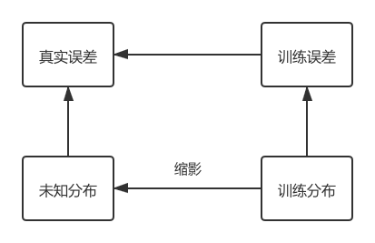
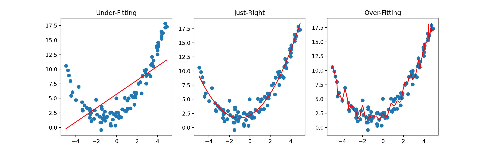
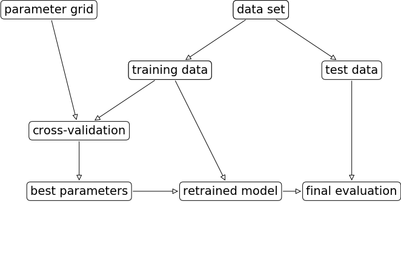
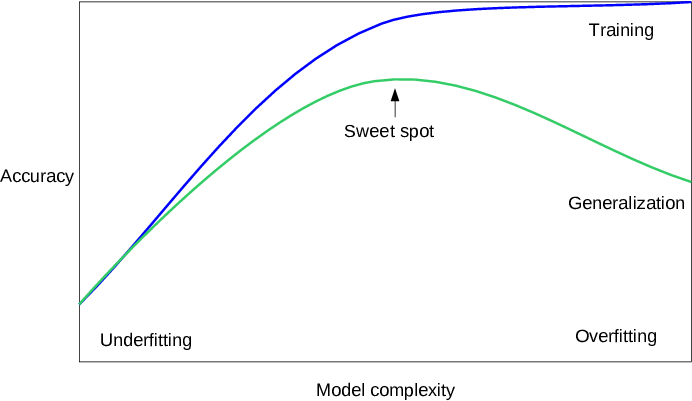
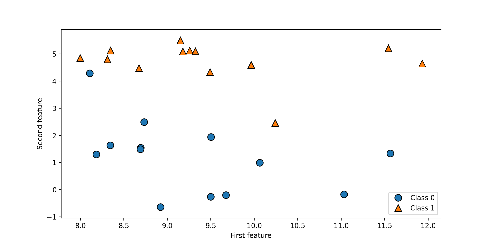
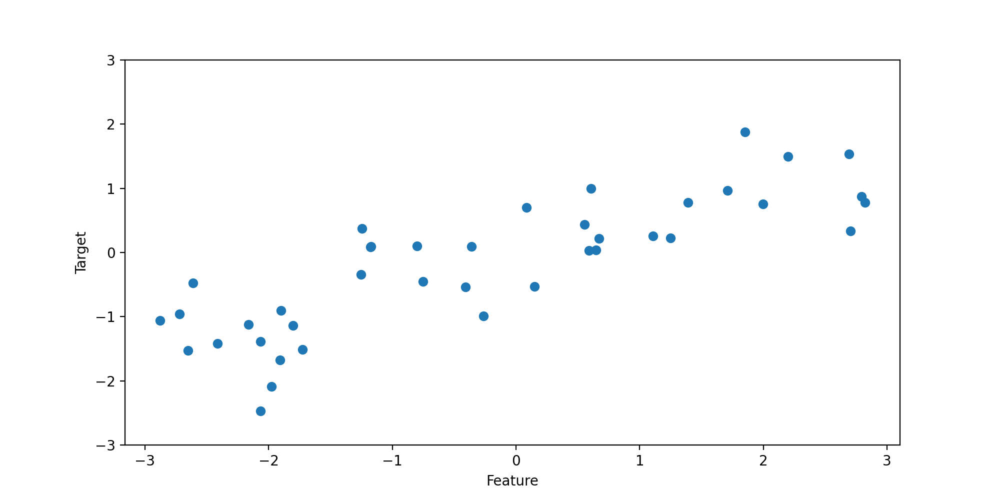

# Introduction of Machine Learing

## Basic Concept

### About Machine Learning

**机器学习 Machine Learning, ML** 是一门多领域交叉学科，涉及概率论、统计学、逼近论、凸分析、算法复杂度理论等多门学科，专门研究计算机怎么模拟或实现人类的学习行为，以获取新的知识或技能，重新组织已有的知识结构使之不断改善自身的性能

### ML Input

- **特征列**

    $$ X=(x_1, x_2,\cdots,x_m) $$

- **标签**

    $$ \{y|y \in \{-1,0,1,2\}\} $$

- **数据集**

    $$ S=\{(X_1,y_1),(X_2,y_2),\cdots,(X_m,y_m)\} $$

#### Classification of Dataset

- **训练集 Training Set** 用于建立模型
- **验证集 Validation Set** 用于检验最终选择最优的模型的性能如何
- **测试集 Test Set** 用来检验最终选择最优的模型的性能如何

### ML Output

给定输入的特征向量

$$ X=(x_1, x_2,\cdots,x_m) $$

特定的算法经过计算，输出对应的标签 $y$

### Objectives and Evaluation

- **目标**
    - 遇到新数据时能够准确的对该数据进行分析
- **评价**
    - 任务不同，评价方式不同
    - 用量化的方式来评价算法的效果
    - 输出正确的数量越多效果越好

#### Evaluation Example

回归任务通常使用均方误差来衡量算法的效果

$$
Loss=\frac{1}{n}\sum\limits_{i=1}^n(f(X_i)-y_i)^2
$$

其中，$f(X_i)$ 为算法的输出， $y_i$ 为正确标签

**经验风险最小化**

- 定义，最小化在训练集上的误差
- 前提，训练集能有代表性地反映真实分布



#### Underfitting and Overfitting

- 构建一个过于简单的模型，无法刻画训练数据的所有变化，称为 **欠拟合（underfitting）**
    - 训练集，效果不好
    - 测试集，效果也不好
- 构建一个对现有信息量来说过于复杂的模型，被称为 **过拟合（overfitting）**，在训练集上表现很好、但不能泛化到新数据上的模型，那么就存在过拟合
- 如果一个模型能够对没见过的数据做出准确预测，我们就说它能够从训练集 **泛化（generalize）** 到测试集



#### Inductive Bias

**归纳偏置** 事先对机器学习算法的一种假设，一种偏好，从概率论的角度来看，归纳偏置是加入的模型中的先验信息

#### i.i.d Condition

**独立同分布条件** 训练集和测试集是从同一个数据分布中抽取的，并且抽取的过程是独立的（independent and identically distributed）

**推论**
- 数据集越大，越能反应数据的真实分布（ImageNet 数百万张图片）
- 数据集的质量很重要

## About scikit-learn

scikit-learn 是基于 Python 语言的机器学习工具

- 简单高效的数据挖掘和数据分析工具
- 可供大家在各种环境中重复使用
- 建立在 NumPy ，SciPy 和 matplotlib 上
- 开源，可商业使用 - BSD 许可证

**扩展阅读** 【[sklearn 官方文档中文翻译](https://www.cntofu.com/book/170/index.html)】,【[sklearn 中文文档](http://www.scikitlearn.com.cn/)】

## Surprised Learning

利用一组已知类别的样本调整算法的参数，使其达到所要求性能的过程，也称为监督训练或有教师学习



### Feature Project

特征很重要，甚至超过算法的重要性

在机器学习中有一句名言，“进入算法的是垃圾，那么算法输出的也是垃圾”

#### Defects with too many Features

- 增加了算法的复杂度和运行时间
- 简单的模型更具有鲁棒性
- 有用的维度数量少的时候可解释性更强

#### Two Ways of Features

- **特征选取** 从 $d$ 个特征中选择 $k$ 个，将其余的 $d-k$ 个舍去
    - 前向选择
    - 后项选择
- **特征提取** 将 $d$ 个特征经过一定的运算之后得到 $k$ 个特征，比如将两个特征进行相加得到一个新特征
    - 主成分分析（PCA）
    - 线性判别分析（LDA）

### Classification and Regression

- **分类** 对离散型随机变量建模或预测的监督学习算法（即最后输出的是特征向量所属的类别或者标签，是离散值）
- **回归** 对数值型连续随机变量进行预测和建模的监督学习算法（即最后输出的是特征向量的标签是连续值）

### Model Complexity

- 模型越复杂，在训练数据上的预测结果就越好
- 模型过于复杂，我们开始过多关注训练集中每个单独的数据点，模型就不能很好地泛化到新数据上
- 二者存在一个最佳位置，可以得到最好地泛化性能，这就是我们想要的模型

### The Amount of Dataset

- 收集更多数据，适当构建更复杂的模型，对监督学习任务往往特别有用
- 在现实世界中，收集多少数据是可以人为掌握的，这可能比模型调参更为有效
- 永远不要低估更多数据的力量



## Some Sample Datasets

### Import module

需要先导入一些常用的模块，没有安装的可以通过 `pip` 命令来安装

```python
import numpy as np
import pandas as pd
import matplotlib.pyplot as plt
import mglearn
from sklearn.model_selection import train_test_split
from sklearn.datasets import load_breast_cancer, load_boston
```

#### Ignore Warnings

```python
import warnings
warnings.filterwarnings("ignore", category=Warning)
```

### About Mglean Warnings

如果你的 Mglearn 版本低于 `0.1.9` ，有可能得到如下错误

#### Six Warnings

在 `import mglearn` 中，会抛出 `DeprecationWarning` 警告，这是因为版本不兼容的问题

```console
DeprecationWarning: The module is deprecated in version 0.21 and will be removed in version 0.23 since we've dropped support for Python 2.7. Please rely on the official version of six (https://pypi.org/project/six/).
  "(https://pypi.org/project/six/).", DeprecationWarning)
```

并不影响实际操作，但可能会影响运行速度，可以将 `Users/[username]/anaconda3/envs/[env-name]/lib/python3.7/site-packages/mglearn` 包中包含

```python
from sklearn.externals.six import StringIO
```

的语句改为

```python
from six import StringIO
```

即可，目前已知涉及的文件为 `plot_interactive_tree.py`

#### Joblib Warnings

在 `import mglearn` 中，会抛出 `DeprecationWarning` 警告，这是因为版本不兼容的问题

```console
DeprecationWarning: sklearn.externals.joblib is deprecated in 0.21 and will be removed in 0.23. Please import this functionality directly from joblib, which can be installed with: pip install joblib. If this warning is raised when loading pickled models, you may need to re-serialize those models with scikit-learn 0.21+.
  warnings.warn(msg, category=DeprecationWarning)
```

并不影响实际操作，但可能会影响运行速度，可以将 `Users/[username]/anaconda3/envs/[env-name]/lib/python3.7/site-packages/mglearn` 包中包含

```python
from sklearn.externals.joblib import Memory
```

的语句改为

```python
from joblib import Memory
```

即可，目前已知涉及的两个文件为 `plot_nmf.py` 和 `plot_pca.py`

### Some Sample Datasets

#### Forge Dataset

```python
# generate dataset
X, y = mglearn.datasets.make_forge()
# plot dataset
mglearn.discrete_scatter(X[:, 0], X[:, 1], y)
plt.legend(["Class 0", "Class 1"], loc=4)
plt.xlabel("First feature")
plt.ylabel("Second feature")
plt.show()
print("X.shape:", X.shape)
```

**Output**



```console
X.shape: (26, 2)
```

#### Wave Dataset

```python
X, y = mglearn.datasets.make_wave(n_samples=40)
plt.plot(X, y, 'o')
plt.ylim(-3, 3)
plt.xlabel("Feature")
plt.ylabel("Target")
```

**Output**



#### Cancer Dataset

```python
cancer = load_breast_cancer()
print("cancer.keys():\n", cancer.keys())
print("Shape of cancer data:", cancer.data.shape)
print("Sample counts per class:\n",
      {n: v for n, v in zip(cancer.target_names, np.bincount(cancer.target))})
print("Feature names:\n", cancer.feature_names)
```

**Output**

```console
cancer.keys():
 dict_keys(['data', 'target', 'target_names', 'DESCR', 'feature_names', 'filename'])
Shape of cancer data: (569, 30)
Sample counts per class:
 {'malignant': 212, 'benign': 357}
Feature names:
 ['mean radius' 'mean texture' 'mean perimeter' 'mean area'
 'mean smoothness' 'mean compactness' 'mean concavity'
 'mean concave points' 'mean symmetry' 'mean fractal dimension'
 'radius error' 'texture error' 'perimeter error' 'area error'
 'smoothness error' 'compactness error' 'concavity error'
 'concave points error' 'symmetry error' 'fractal dimension error'
 'worst radius' 'worst texture' 'worst perimeter' 'worst area'
 'worst smoothness' 'worst compactness' 'worst concavity'
 'worst concave points' 'worst symmetry' 'worst fractal dimension']
```

#### Boston Dataset

```python
boston = load_boston()
print("Data shape:", boston.data.shape)
X, y = mglearn.datasets.load_extended_boston()
print("X.shape:", X.shape)
```

**Output**

```console
Data shape: (506, 13)
X.shape: (506, 104)
```
