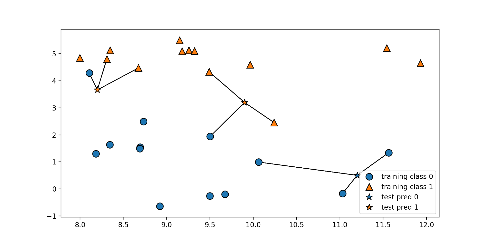
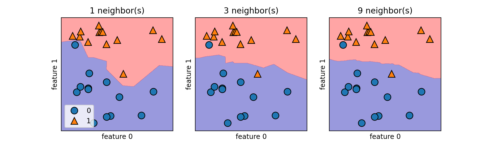
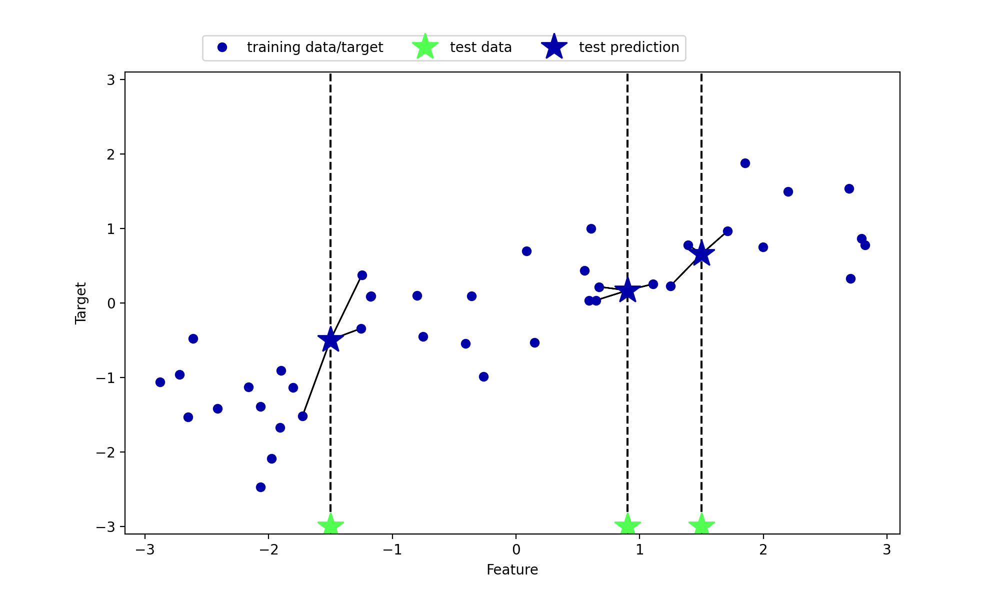
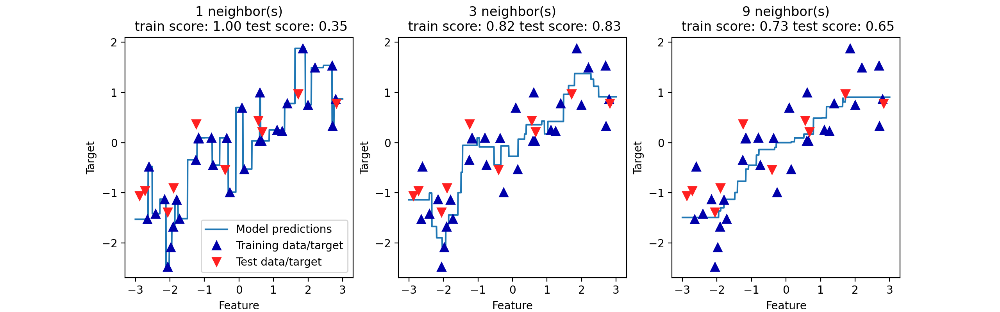
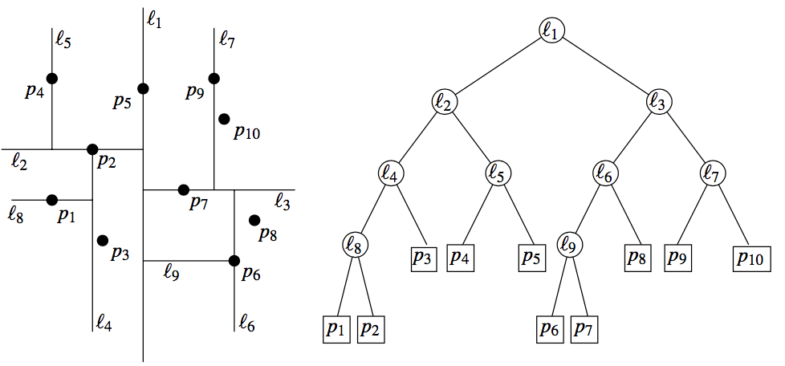

# k-Nearest Neighbors Algorithm

## Foreword of kNN

**k 近邻法（k-Nearest Neighbors, kNN）** 是一种很基本的机器学习方法，在我们平常的生活中也会不自主的应用，就是 **物以类聚，人以群分** 

比如，我们判断一个人的人品，只需要观察他来往最密切的几个人的人品好坏就可以得出了，这里就运用了 kNN 的思想，kNN 方法既可以做分类，也可以做回归，这点和决策树算法相同

kNN 做回归和分类的主要区别在于最后做预测时候的决策方式不同，**kNN 做分类预测时，一般是选择多数表决法** ，即训练集里和预测的样本特征最近的 $k$ 个样本，预测为里面有最多类别数的类别， 而 kNN 做回归时，一般是选择平均法 ，即最近的 $k$ 个样本的样本输出的平均值作为回归预测值，由于两者区别不大，所以 kNN 的分类方法思想对 kNN 的回归方法也适用，但 kNN 的分类问题更主流一些

## Basic Elements of kNN

对于一个确定的训练集，只要确定了 **距离度量**、**k 值** 和 **决策规则**，就能对任何一个新的实例，确定它的分类或者预测值

### Distance Measurement

距离度量是描述特征空间中两个实例的距离，也是这两个实例的相似程度，在 $n$ 维实数向量空间中，我们主要使用的距离度量方式是 **欧式距离** ，但也可以使用更加一般化 $L_p$ 距离（闵可夫斯基距离）

在特征空间中，取出两个特征 $x_i,x_j$，它们分别是 $n$ 维的特征向量

- 欧式距离
  $$
  L_2(x_i,x_j)= \left( \sum\limits_{l=1}^n(x_i^l-x_j^l)^2 \right)^\frac12
  $$

- 曼哈顿距离
  $$
  L_1(x_i,x_j)= \sum\limits_{l=1}^n \left\vert x_i^l-x_j^l \right\vert
  $$

- 闵可夫斯基距离
  $$
  L_p(x_i,x_j)= \left( \sum\limits_{l=1}^n(x_i^l-x_j^l)^p \right)^\frac1p
  $$

从上式可以看出，欧氏距离和曼哈顿距离分别是闵可夫斯基距离的 $(p=2,\ p=1)$ 特殊情况

### Choice of k Value

对于 $k$ 值的选择，没有一个固定的经验，一般根据样本的分布，选择一个较小的值， 然后通过交叉验证选择一个合适的 $k$ 值

- 选择较小的 $k$ 值，就相当于用较小的邻域中的训练实例进行预测，训练误差会减小，只有与输入实例较近或相似的训练实例才会对预测结果起作用，与此同时带来的问题是泛化误差会增大， 换句话说，$k$ 值的减小就意味着整体模型变得复杂，容易发生过拟合
- 选择较大的 $k$ 值，就相当于用较大邻域中的训练实例进行预测，其优点是可以减少泛化误差，但缺点是训练误差会增大，这时候，与输入实例较远（不相似的）训练实例也会对预测器作用，使预测发生错误， 换句话说，$k$ 值的增大就意味着整体的模型变得简单，容易发生欠拟合

一个极端是 $k$ 等于样本数 $m$ ，对于分类问题，相当于 kNN 算法完全没有分类操作，此时无论输入实例是什么，都只是简单的预测它属于在训练实例中最多的类，而对于回归问题，相当于 kNN 算法完全没有预测操作，此时无论输入实例是什么，都只是简单的预测它的标签为原始数据所有标签值的平均，模型过于简单

### Decision-Making Rules

- 对于分类决策规则，一般都是使用前面提到的多数表决法
- 对于回归决策规则，一般采用平均法

## k-Neighbors Classification

给定一个训练集，对新输入的实例，在训练集中找到与该实例最邻近的 $k$ 个实例，这  $k$ 个实例的多数属于某个类，我们就把该输入实例分为这个类

### Import moduleq

```python
import numpy as np
import pandas as pd
import matplotlib.pyplot as plt
import mglearn
from sklearn.model_selection import train_test_split

# Ignore Warnings
import warnings
warnings.filterwarnings("ignore", category=Warning)
```

### Principle of kNN Classification

```python
mglearn.plots.plot_knn_classification(n_neighbors=3)
```



### Description of kNN Classification Algorithm

**Input** 训练数据集 $T=\{(x_1,y_1),(x_2,y_2),\cdots,(x_N,y_N)\}$，其中 $x_i\in\mathcal{X}$ 为实例的特征向量，$y_i\in \{c_1,c_2,\cdots,c_m\}$ 为实例的类别

**Output** 实例 $x$ 所属的类别 $y$ 

1. 根据给定的距离度量方式，在训练集 $T$ 中找到与 $x$ 最邻近的 $k$ 个点，涵盖着 $k$ 个点的 $x$ 的邻域记为 $N_k(x)$

2. 在 $N_k(x)$ 中根据分类决策规则决定 $x$ 的类别 $y$ 
  
   $$
   y=\arg\max\limits_{c_j} \sum\limits_{x_i \in N_k(x)} I(y_i=c_j)
   $$
   
   其中 $I(y_i=c_j)$ 为指示函数，当 $y_i=c_j$ 的时候 $I=1$ ，否则 $I=0$

### kNN Classification Example

- **数据获取** 及 **模型拟合**

    ```python
    X, y = mglearn.datasets.make_forge()
    X_train, X_test, y_train, y_test = train_test_split(X, y, random_state=0)

    from sklearn.neighbors import KNeighborsClassifier
    clf = KNeighborsClassifier(n_neighbors=3)
    clf.fit(X_train, y_train)
    ```

    **Output**

    ```console
    KNeighborsClassifier(algorithm='auto', leaf_size=30, metric='minkowski',
                        metric_params=None, n_jobs=None, n_neighbors=3, p=2,
                        weights='uniform')
    ```

- **预测结果及评价**

    ```python
    print("Test set predictions:", clf.predict(X_test))
    print("Test set accuracy: {:.2f}".format(clf.score(X_test, y_test)))
    ```

    **Output**

    ```console
    Test set predictions: [1 0 1 0 1 0 0]
    Test set accuracy: 0.86
    ```

- 不同 $k$ 值的 **可视化**

    ```python
    fig, axes = plt.subplots(1, 3, figsize=(10, 3))

    for n_neighbors, ax in zip([1, 3, 9], axes):
        # the fit method returns the object self, so we can instantiate
        # and fit in one line
        clf = KNeighborsClassifier(n_neighbors=n_neighbors).fit(X, y)
        mglearn.plots.plot_2d_separator(clf, X, fill=True, eps=0.5, ax=ax, alpha=.4)
        mglearn.discrete_scatter(X[:, 0], X[:, 1], y, ax=ax)
        ax.set_title("{} neighbor(s)".format(n_neighbors))
        ax.set_xlabel("feature 0")
        ax.set_ylabel("feature 1")
    axes[0].legend(loc=3)
    ```

    **Output**

    

## k-Neighbors Regression

### Principle of kNN Regression

```python
mglearn.plots.plot_knn_regression(n_neighbors=3)
```



### Description of kNN Regression Algorithm

**Input** 训练数据集 $T=\{(x_1,y_1),(x_2,y_2),\cdots,(x_N,y_N)\}$，其中 $x_i\in\mathcal{X}$ 为实例的特征向量，$y_i\in \{c_1,c_2,\cdots,c_m\}$ 为实例的连续标签值

**Output** 实例 $x$ 对应的连续标签值 $y$

1. 根据给定的距离度量方式，在训练集 $T$ 中找到与 $x$ 最邻近的 $k$ 个点，涵盖着 $k$ 个点的 $x$ 的邻域记为 $N_k(x)$

2. 在 $N_k(x)$ 中根据分类决策规则决定 $x$ 的类别 $y$ 
  
   $$
   y=\frac1k \sum\limits_{x_i \in N_k(x)} y_i
   $$

### k-Neighbors Regression Example

- **数据获取** 及 **模型拟合**

    ```python
    X, y = mglearn.datasets.make_wave(n_samples=40)
    X_train, X_test, y_train, y_test = train_test_split(X, y, random_state=0)

    from sklearn.neighbors import KNeighborsRegressor
    reg = KNeighborsRegressor(n_neighbors=3)
    reg.fit(X_train, y_train)
    ```

    **Output**

    ```console
    KNeighborsRegressor(algorithm='auto', leaf_size=30, metric='minkowski',
                        metric_params=None, n_jobs=None, n_neighbors=3, p=2,
                        weights='uniform')
    ```

- **预测结果及评价**

    ```python
    print("Test set predictions:", reg.predict(X_test))
    print("Test set accuracy: {:.2f}".format(reg.score(X_test, y_test)))
    ```

    **Output**

    ```console
    Test set predictions:
    [-0.05396539  0.35686046  1.13671923 -1.89415682 -1.13881398 -1.63113382
    0.35686046  0.91241374 -0.44680446 -1.13881398]
    Test set R^2: 0.83
    ```

- 分析 `KNeighborsRegressor`

    ```python
    fig, axes = plt.subplots(1, 3, figsize=(15, 4))
    # 创建 1000 个数据点，在 -3 和 3 之间均匀分布
    line = np.linspace(-3, 3, 1000).reshape(-1, 1)
    for n_neighbors, ax in zip([1, 3, 9], axes):
        # 利用 1 个、3 个或 9 个邻居分别进行预测
        reg = KNeighborsRegressor(n_neighbors=n_neighbors)
        reg.fit(X_train, y_train)
        ax.plot(line, reg.predict(line))
        ax.plot(X_train, y_train, '^', c=mglearn.cm2(0), markersize=8)
        ax.plot(X_test, y_test, 'v', c=mglearn.cm2(1), markersize=8)
        ax.set_title("{} neighbor(s)\n train score:{:.2f} test score:{:.2f}".format(
            n_neighbors, reg.score(X_train, y_train), reg.score(X_test, y_test)))
        ax.set_xlabel("Feature")
        ax.set_ylabel("Target")

    axes[0].legend(["Model predictions","Training data/target", "Test data/target"], loc="test")
    ```

    

## Using kNN in sklearn

kNN 在 sklearn 中是放在 `sklearn.neighbors` 的包中的，分类器 `KNeighborsClassifier` 和回归器 `KNeighborsRegressor` 的主要参数是

| 参数        | 意义                                                         |
| :----------- | :------------------------------------------------------------ |
| `n_neighbors` | `k` 值的选择与样本分布有关，一般选择一个较小的 `k` 值，可以通过交叉验证来选择一个比较优的 `k` 值，默认值是 `5` |
| `weights`     | `'uniform'` 是每个点权重一样，`'distance'` 则权重和距离成反比例，即距离预测目标更近的近邻具有更高的权重 |
| `algorithm`   | `'brute'` 对应第一种蛮力实现，`'kd_tree'` 对应第二种 kd 树实现，`'ball_tree'` 对应第三种的球树实现， `'auto'` 则会在上面三种算法中做权衡，选择一个拟合最好的最优算法 |
| `leaf_size`   | 这个值控制了使用 kd 树或者球树时， 停止建子树的叶子节点数量的阈值 |
| `metric`      | k 近邻法和限定半径最近邻法类可以使用的距离度量较多，一般来说默认的欧式距离（即 `p=2` 的闵可夫斯基距离）就可以满足我们的需求 |
| `p`           | `p` 是使用距离度量参数 `metric` 附属参数，只用于闵可夫斯基距离和带权重闵可夫斯基距离中 `p` 值的选择，`p=1` 为曼哈顿距离， `p=2` 为欧式距离，默认为 `2` |

其中，比较重要的应该属 `n_neighbors`，`weights`

### Extension for KD Tree

kNN 算法最简单的实现方式，就是计算输入实例和所有训练实例的距离，然后进行排序，取前 $k$ 个，进行分类，但是训练集特别大的时候，这种方式非常耗时，不可行，下面介绍 kd 树的方式，kd 树是通过减少输入实例和训练实例的计算次数来达到优化的目的

kd 树算法包括三步，第一步是建树，第二部是搜索最近邻，最后一步是预测

#### Constructing the KD Tree

kd 树是一种对 $n$ 维空间的实例点进行存储，以便对其进行快速检索的树形结构，kd 树是二叉树，构造 kd 树相当于不断的用垂直于坐标轴的超平面将 $n$ 维空间进行划分，构成一系列的 $n$ 维超矩阵区域

我们首先来看建树的方法， kd 树建树采用的是从 $m$ 个样本的 $n$ 维特征中，分别计算 $n$ 个特征的取值的方差，用方差最大的第 $k$ 维特征 $n_k$ 来作为根节点，对于这个特征，我们选择特征 $n_k$ 取值的中位数 $n_{kv}$ 对应的样本作为划分点，对于所有第 $k$ 维特征的取值小于 $n_{kv}$ 的样本，我们划入左子树，对于第 $k$ 维特征的取值大于等于 $n_{kv}$ 的样本，我们划入右子树，对于左子树和右子树，我们采用和刚才同样的办法来找方差最大的特征来做更节点，递归的生成 kd 树

构建好的 kd 树，大概如下



#### KD Tree Search for Nearest Neighbors

当我们生成 kd 树以后，就可以去预测测试集里面的样本目标点了，预测的过程如下

1. 对于一个目标点，我们 **首先在 kd 树里面找到包含目标点的叶子节点** ，以目标点为圆心，**以目标点到叶子节点样本实例的距离为半径，得到一个超球体**，最近邻的点一定在这个超球体内部
1. **然后返回叶子节点的父节点，检查另一个子节点包含的超矩形体是否和超球体相交，如果相交就到这个子节点寻找是否有更加近的近邻，有的话就更新最近邻，并且更新超球体** ，如果不相交那就简单了，我们直接返回父节点的父节点，在另一个子树继续搜索最近邻
1. 当回溯到根节点时，算法结束，此时保存的最近邻节点就是最终的最近邻

从上面的描述可以看出，kd 树划分后可以大大减少无效的最近邻搜索，很多样本点由于所在的超矩形体和超球体不相交，根本不需要计算距离，大大节省了计算时间

#### KD Tree Prediction

有了 kd 树搜索最近邻的办法，kd 树的预测就很简单了，在 kd 树搜索最近邻的基础上，我们 **选择到了第一个最近邻样本，就把它置为已选， 在第二轮中，我们忽略置为已选的样本，重新选择最近邻，这样跑 k 次，就得到了目标的 k 个最近邻** ，然后根据多数表决法，如果是 kNN 分类，预测为 k 个最近邻里面有最多类别数的类别，如果是 kNN 回归，用 k 个最近邻样本输出的平均值作为回归预测值

## kNN Summary

### Advantages of kNN

- 解决分类问题
- 天然可以解决多分类问题
- 思想简单，效果强大

### Inadequate of kNN

- 最大缺点，效率低下，如果训练集有 $m$ 个样本，$n$ 个特征，则预测每一个新的数据，需要 $O(m\times n)$
- 维度灾难，随着维度的增加，"看似相近" 的两个点之间的距离会越来越大
- 数据高度相关
- 预测结果不具有可解释性
