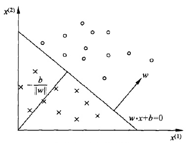
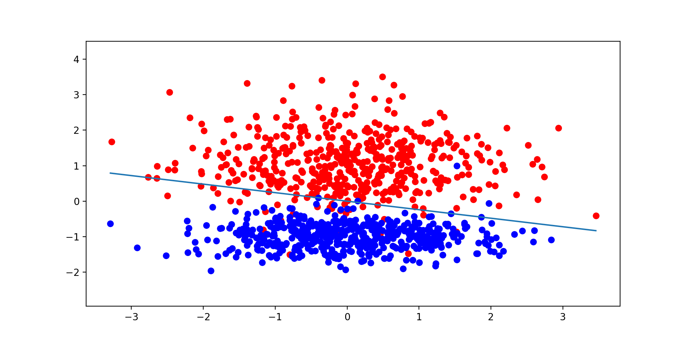

# Perceptron Learning Algorithm

## Basic Knowledge of PLA

**PLA** 全称是 **Perceptron Learning Algorithm**，即 **线性感知机** 算法，属于一种最简单的感知机（Perceptron）模型

感知机是二分类的线性模型，其输入是实例的特征向量，输出的是事例的类别，分别是 $+1$ 和 $-1$ ，属于判别模型

假设训练数据集是线性可分的，感知机学习的目标是求得一个能够将训练数据集 **正实例点和负实例点完全正确分开的分离超平面**，如果是非线性可分的数据，则最后无法获得超平面

### Distance from Point to Line

公式中的直线方程为 $Ax+By+C=0$ ，点 $P(x_0,y_0)$ 到直线的距离为
$$
d=\frac{A𝑥_0+B𝑦_0+C}{\sqrt{A^2+B^2}}
$$

### Distance from Sample to Hyperplane

我们假设超平面是 $h=w\cdot x+b$ ，其中 $w=(w_0,w_1,...,w_m),\ x=(x_0,x_1,...,x_m)$，

样本 $x'$ 到超平面的距离为
$$
d=\frac{w⋅x'+b}{||w||}
$$

### About Hyperplanes

超平面是在空间 $R^d$ 中的一个子空间 $R^{d−1}$ 

在 $2$ 维空间中的超平面是一条线，在 $3$ 维空间中的超平面是一个平面

## Perceptron Model



感知机从输入空间到输出空间的模型如下

$$
f(x)=sign(w\cdot x+b)
$$

$$
sign(x)=\begin{cases} −1,& x<0\\1,&x≥0\end{cases}
$$

我们首先定义对于样本 $(x_i,y_i)$ ，如果

$$
\frac{w\cdot xi+b}{||w||}>0
$$

则记 $y_i=+1$ ，如果

$$
\frac{w\cdot xi+b}{||w||}<0
$$

则记 $y_i=−1$ ，这样取 $y$ 的值有一个好处，就是方便定义损失函数

因为正确分类的样本满足

$$
\frac{y_i(w\cdot xi+b)}{||w||}>0
$$ 

而错误分类的样本满足

$$
\frac{y_i(w\cdot xi+b)}{||w||}<0
$$

我们损失函数的优化目标，就是期望 **使误分类的所有样本，到超平面的距离之和最小**

**所以损失函数定义如下：**
$$
L(w,b)=−\frac1{||w||}\cdot\sum \limits_{x_i\in M}y_i(w\cdot x_i+b)
$$
其中 $M$ 集合是误分类点的集合

不考虑 $\frac1{||w||}$ ，就得到感知机模型的损失函数：
$$
L(w,b)=−\sum \limits_{x_i\in M}y_i(w\cdot x_i+b)
$$

### Why can the $\frac1{||w||}$ be Disregarded

通过参考他人观点结合思考，觉得原因可以列为以下两点：

1. $\frac1{||w||}$ 不影响 $y_i(w\cdot x_i+b)$ 正负的判断，即不影响学习算法的中间过程，因为感知机学习算法是 **误分类驱动** 的，这里需要注意的是所谓的“误分类驱动”指的是我们只需要判断 $−yi(w\cdot xi+b)$ 的正负来判断分类的正确与否，而 $\frac 1{||w||}$ 并不影响正负值的判断，所以 $\frac1{||w||}$ 对感知机学习算法的中间过程可以不考虑
1. $\frac1{||w||}$ 不影响感知机学习算法的最终结果，因为感知机学习算法最终的终止条件是所有的输入都被正确分类，即不存在误分类的点，则此时损失函数为 $0$ ，对应于 $−\frac1{||w||}\cdot\sum \limits_{x_i\in M}y_i(w\cdot x_i+b)$ 即分子为 $0$ ，则可以看出 $\frac1{||w||}$ 对最终结果也无影响

综上所述，即使忽略 $\frac1{||w||}$ ，也不会对感知机学习算法的执行过程产生任何影响，反而还能简化运算，提高算法执行效率

## About Perceptron Learning Algorithm

感知机学习算法是对上述损失函数进行极小化，求得 $w$ 和 $b$

但是用普通的基于所有样本的梯度和的均值的批量梯度下降法（BGD）是行不通的，原因在于我们的损失函数里面有限定，**只有误分类的 M 集合里面的样本才能参与损失函数的优化**，所以我们不能用最普通的批量梯度下降,只能采用随机梯度下降（SGD）

目标函数如下

$$
L(w,b)=arg\min \limits_{w,b}(-\sum \limits_{x_i\in M}y_i(w\cdot x_i+b))
$$

### 原始形式算法

**Input** 训练数据集 $T=(x_1,y_1),(x_2,y_2),...,(x_N,y_N)$，$y_i\in \{−1,+1\}$，学习率 $\eta(0<\eta<1)$

**Output** $w,b$；感知机模型 $f(x)=sign(w\cdot x+b)$

1. 赋初值 $w_0,b_0$
1. 选取数据点 $(x_i,y_i)$
1. 判断该数据点是否为当前模型的误分类点，即判断若
    
    $$y_i(w\cdot x_i+b)\leq0$$
    
    则更新

    $$
    \begin{cases}
    w=w+\eta\cdot y_ix_i \\ b=b+\eta\cdot y_i
    \end{cases}
    $$
   
1. 转到 2，直到训练集中没有误分类点

### 对偶形式算法

由于 $w,b$ 的梯度更新公式
$$
\begin{cases}
w=w+\eta\cdot y_ix_i \\ b=b+\eta\cdot y_i
\end{cases}
$$

我们的 $w,b$ 经过了 $n$ 次修改后的，参数可以变化为下公式，其中 $\alpha=ny$
$$
\begin{cases}
w=\sum \limits_{x_i\in M}\eta\cdot y_ix_i=\sum\limits_{i=1}^n\alpha_i\cdot y_ix_i \\
b=\sum \limits_{x_i\in M}\eta\cdot y_i=\sum\limits_{i=1}^n\alpha_i\cdot y_i
\end{cases}
$$

这样我们就得出了感知机的对偶算法

**Input** 训练数据集 $T=(x_1,y_1),(x_2,y_2),...,(x_N,y_N)$，$y_i\in \{−1,+1\}$，学习率 $\eta(0<\eta<1)$

**Output** $\alpha,b$；感知机模型 $f(x)=sign(\sum\limits_{j=1}^n\alpha_j\cdot y_jx_j\cdot x + b)$

其中 $\alpha=(\alpha_1,\alpha_2,...,\alpha_n)^\mathrm{T}$

1. 赋初值 $\alpha_0,b_0$

2. 选取数据点 $(x_i,y_i)$

3. 判断该数据点是否为当前模型的误分类点，即判断若

    $$
    y_i(\sum\limits_{j=1}^n\alpha_j\cdot y_jx_j\cdot x + b)\leq0
    $$
    
    则更新
    
    $$
    \begin{cases}
    \alpha_i=\alpha_i+\eta \\ b=b+\eta\cdot y_i
    \end{cases}
    $$
   
4. 转到 2，直到训练集中没有误分类点

为了减少计算量，我们可以预先计算式中的内积，得到 $Gram$ 矩阵
$$
G=[x_i,x_j]_{N×N}
$$

### Choice of Primitive and Dyadic Forms

- 在向量维数（特征数）过高时，计算内积非常耗时，应选择对偶形式算法加速
- 在向量个数（样本数）过多时，每次计算累计和就没有必要，应选择原始算法

## Example of PLA

### Using sklearn

```python
import numpy as np
from sklearn.datasets import make_classification
from sklearn.linear_model import Perceptron
from matplotlib import pyplot as plt


sample_num = 1000
sample_rate = 0.8   # 80% 的数据用于训练
data_split = int(sample_num * sample_rate)

x, y = make_classification(
    n_samples=sample_num,       # 生成样本的数量
    n_features=2,               # 生成样本的特征数， 等于后三者之和
    n_redundant=0,              # 多信息特征的个数
    n_informative=1,            # 冗余信息，informative 特征的随机线性组合
    n_clusters_per_class=1      # 某一个类别是由几个 cluster 构成的
)


# 训练数据和测试数据
x_data_train = x[:data_split, :]
x_data_test = x[data_split:, :]
y_data_train = y[:data_split]
y_data_test = y[data_split:]

# 正例和反例
positive_x1 = [x[i, 0] for i in range(sample_num) if y[i] == 1]
positive_x2 = [x[i, 1] for i in range(sample_num) if y[i] == 1]
negative_x1 = [x[i, 0] for i in range(sample_num) if y[i] == 0]
negative_x2 = [x[i, 1] for i in range(sample_num) if y[i] == 0]


# 定义感知机
clf = Perceptron(fit_intercept=True, n_iter_no_change=30, shuffle=False)
# 使用训练数据进行训练
clf.fit(x_data_train, y_data_train)

# 得到训练结果，权重矩阵
print('Coef Matrix:', clf.coef_)

# 决策函数中的常数，此处输出为：[0.]
print('Intercept:', clf.intercept_)

# 利用测试数据进行验证
acc = clf.score(x_data_test, y_data_test)
print('ACC:', acc)

# 画出正例和反例的散点图
plt.figure(figsize=(10, 5))
plt.scatter(positive_x1, positive_x2, c='red')
plt.scatter(negative_x1, negative_x2, c='blue')
# 画出超平面（在本例中即是一条直线）
# line_x = np.arange(-4, 4)
line_x = np.array([x.min(0)[0], x.max(0)[0]])
line_y = - (line_x * clf.coef_[0][0] + clf.intercept_) / clf.coef_[0][1]
plt.plot(line_x, line_y)
plt.ylim(x.min(0)[1] - 1, x.max(0)[1] + 1)
plt.show()
```

**Output**

```console
Coef Matrix: [[0.71858337 2.99245842]]
Intercept: [0.]
ACC: 0.955
```



### Normal Ways

```python
import numpy as np
from matplotlib import pyplot as plt


# Plot Function
def draw_pts(x, y):
    for i in range(len(x)):
        if y[i] == 1:
            plt.plot(x[i][0], x[i][1], 'ro')
        else:
            plt.plot(x[i][0], x[i][1], 'bo')


def draw_line(w, b):
    line_x = [0, 7]
    line_y = [0, 0]

    for i in range(len(line_x)):
        line_y[i] = (- w[0] * line_x[i] - b) / (w[1] + 1e-9)
    plt.plot(line_x, line_y)


# Data & Maker
num = 50
x = np.vstack((
    np.random.randn(num, 2) + 6, np.random.randn(num, 2) + 2
))
y = np.hstack((
    np.ones(num), - np.ones(num)
))

# Initial Parameter & Learning rate
w = [0, 0]
b = 0
lr = 1

# Primitive Form
for j in range(100):
    wrong_pt_cnt = 0
    for i in range(len(y)):
        if y[i] != np.sign(np.dot(w, x[i]) + b):
            w += lr * y[i] * x[i]
            b += lr * y[i]
            wrong_pt_cnt += 1
    if wrong_pt_cnt == 0:
        break

# Dual Form
gram = np.dot(x, x.T)
print('gram: \n', gram)

a = np.zeros(num * 2)
for j in range(100):
    wrong_pt_cnt = 0
    for i in range(len(y)):
        c = 0
        b = 0
        for k in range(len(y)):
            c += a[k] * y[k] * gram[k][i]
            b += a[k] * y[k]
        if y[i] != np.sign(c + b):
            a[i] += 1
            wrong_pt_cnt += 1
    if wrong_pt_cnt == 0:
        break
print('\na: \n', a)

w = [0, 0]
for k in range(len(y)):
    w += a[k] * y[k] * x[k]

plt.figure(figsize=(10, 5))
draw_pts(x, y)
draw_line(w, b)
plt.show()
```


