# Linear Models

## Linear Models for Regression

### Regression Problem

回归问题是非常常见的一类问题，目的是为了找寻变量之间的关系，比如要从数据中找寻房屋面积与价格的关系，年龄与身高的关系，气体压力和体积的关系等等

而机器学习要做的正是要让机器自己来学习这些关系，并为对未知的情况做出预测

对于 **线性回归** ，我们的 **Hypothesis** 就是

$$
h_\theta(x)=\theta_0+\theta_1x_1+\theta_2x_2+⋯+\theta_nx_n=\theta^\mathrm{T}x
$$

其中的 $\theta_i$ 就是学习算法需要学习的参数，而 $x_i$ 是我们对于问题所选取的特征，特征就是一些与问题相关可以度量的值，比如长度、重量、温度等等

$h_\theta(x)$ 是我们预测的结果

### Loss Function

那么如何学习 **预测函数** 中的 $\theta_i$ 呢？

我们需要引入 **损失函数** 的概念，它的作用是评估真实与预测值之间的差异，一旦有了这个函数，学习算法的目标就是找到 $\theta_i$ 使得这个函数的值尽可能的小

对于 **线性回归**，我们使用的 **损失函数** 是

$$
J(\theta)=\frac1{2m}\sum\limits_{i=1}^m(h_\theta(x^{(i)})−y^{(i)})^2
$$

其中 $m$ 是样本数， $y$ 是训练数据集已知标签值，上标 $i$ 表示第几组训练数据，**损失函数** $J(\theta)$ 是关于 $\theta$ 的函数，当然为了是表达更简洁、编写的程序更加清晰，我们通常会使用它的矩阵表达

$$
J(\theta)=\frac1{2m}(X\theta−y)^\mathrm{T}(X\theta−y)
$$

式中 $X$ 为所有训练特征数据组成的矩阵， $i$ 为训练数据集已知标签值的列向量

$$
X=\left[
\begin{matrix}
1 & x_1^{(1)} & x_2^{(1)} & \cdots & x_n^{(1)} \\
1 & x_1^{(2)} & x_2^{(2)} & \cdots & x_n^{(2)} \\
\vdots & \vdots & \vdots & \ddots & \vdots \\
1 & x_1^{(m)} & x_2^{(m)} & \cdots & x_n^{(m)}
\end{matrix}
\right]
\qquad\qquad
y=\left[
\begin{matrix}
y^{(1)} \\ y^{(2)} \\ \vdots \\ y^{(m)}
\end{matrix}
\right]
$$

损失函数的 Python 实现

```python
import numpy as np

def computeCost(X, y, theta):
    inner = np.power(((X * theta.T) - y), 2)
    return np.sum(inner) / (2 * len(X))
```

最后为了承上启下，我们来看看当只有一个特征的时候，损失函数 $J(\theta)$ 的样子

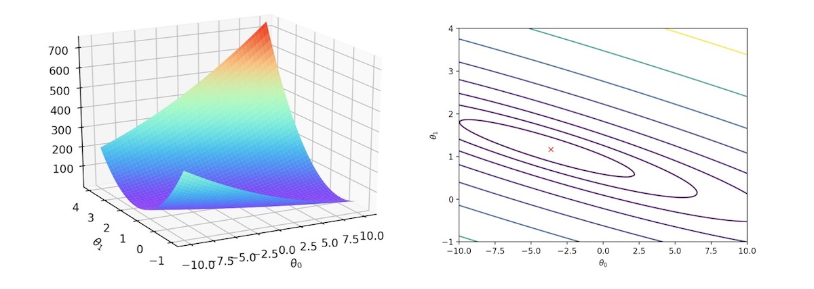

### Gradient Descent

接着刚刚看的单个特征所对应的 **损失函数** 图像加上之前所说的 “学习算法的目标就是找到 $\theta_i$ 使得 **损失函数** 尽可能的小” 

一个很直观的想法就是，在坡上任意取一点，然后沿着下坡方向走最后到达最低点，这也正是梯度下降算法的思路，我们沿着梯度的反向更新 $\theta_i$ 的值（沿着最陡的方向下坡），直到 **损失函数** 收敛到最小值

梯度下降算法更新 $\theta_i$ 的方式为

$$
\theta_i:=\theta_i−\alpha\frac{\partial}{\partial\theta_i}J(\theta)
$$

其中 $\alpha$ 为学习率， $:=$ 表示使用右式的值替换 $\theta_i$ 原有的值

对于 **线性回归**，我们更新 $\theta_i$ 的方式为

$$
\theta:=\theta-\alpha\frac1mX^\mathrm{T}(X\theta-y)
$$

到这里我们就能够完成整个 **线性回归** 的机器学习算法了

设定 $\theta_i$ 的初始值，使用梯度下降算法迭代更新 $\theta_i$ 的值，直到 $J(\theta)$ 收敛

### Regular Equation

对于 **线性回归**，我们完全可以使用数学方法来得到 $J(\theta)$ 取最小值时 $\theta_i$ 的值

这涉及一些导数和线性代数的知识，这里给出求解 $\theta$ 的公式
$$
\theta=(X^\mathrm{T}X)^{-1}\cdot X^\mathrm{T}y
$$
在使用时 **正规方程** 有一定的限制，比 $X^\mathrm{T}X$ 矩阵需要是可逆的

那么有了直接求解问题的方法，为什么我们还需要梯度下降的概念呢？因为梯度下降方法更具有广泛性，可以用于很多问题的求解，比如非线性的 **损失函数**

#### Derivation of the Regular Equation

推导过程，基于损失函数

$$
J(\theta)=\frac1{2m}\sum\limits_{i=1}^m(h_\theta(x^{(i)})−y^{(i)})^2
$$

其中

$$
h_\theta=\theta^{\mathrm{T}}X
=\theta_0x_0+\theta_1x_1+\theta_2x_2+\cdots+\theta_nx_n
$$

将向量表达形式转为矩阵表达形式，则有
$$
J(\theta)=\frac1{2m}(X\theta−y)^\mathrm{T}(X\theta−y)
$$

其中 $X$ 为 $m\times n$ 的矩阵（ $m$ 为样本个数， $n$ 为特征个数）， $\theta$ 为 $n\times 1$ 的矩阵， $y$ 为 $m\times 1$ 的矩阵

对 $J(\theta)$ 进行如下变换

$$
\begin{aligned}
J(\theta) &= \frac1{2m}(X\theta−y)^\mathrm{T}(X\theta−y) \\
&= \frac1{2m}(\theta^\mathrm{T}X^\mathrm{T}−y^\mathrm{T})(X\theta−y) \\
&= \frac1{2m}\left(\theta^\mathrm{T}X^\mathrm{T}X\theta
							-\theta^\mathrm{T}X^\mathrm{T}y
							-y^\mathrm{T}X\theta-y^\mathrm{T}y \right)
\end{aligned}
$$

接下来对 $J(\theta)$ 求偏导，需要用到以下几个矩阵求导的法则

$$
\frac{dX^\mathrm{T}A}{dX}=\frac{dA^\mathrm{T}X}{dX}=A,
\qquad \frac{dX^\mathrm{T}AX}{dX}=(A+A^\mathrm{T})X
$$

所以有

$$
\begin{aligned}
\frac{\partial J(\theta)}{\partial\theta} 
&= \frac1{2m} \left(\frac{\partial\theta^\mathrm{T}X^\mathrm{T}X\theta}{\partial\theta}
							-\frac{\partial\theta^\mathrm{T}X^\mathrm{T}y}{\partial\theta}
							-\frac{\partial y^\mathrm{T}X\theta}{\partial\theta}
							-\frac{\partial y^\mathrm{T}y}{\partial\theta} \right) \\
&= \frac1{2m} \left[(X^\mathrm{T}X+(X^\mathrm{T}X)^\mathrm{T})\theta-X^\mathrm{T}y
                            -(y^\mathrm{T}X)^\mathrm{T}-0 \right] \\
&= \frac1m \left(X^\mathrm{T}X\theta-X^\mathrm{T}y \right)
\end{aligned}
$$

令

$$
\frac{\partial J(\theta)}{\partial\theta} =0
$$

则有

$$
\theta=(X^\mathrm{T}X)^{-1}\cdot X^\mathrm{T}y
$$

#### Gradient Decline Versus Regular Equations

| 梯度下降                        | 正规方程                                                     |
| :----------------------------- | :--------------------------------------------------------- |
| 需要选择学习率 $\alpha$         | 不需要                                                       |
| 需要多次迭代                    | 一次运算得出                                                  |
| 当特征数量 $n$ 大时也能较好适用 | 需要计算 $(X^\mathrm{T}X)^{-1}$ 如果特征数量 $n$ 较大则运算代价大，因为矩阵逆的计算时间复杂度为 $O(n^3)$ ，通常来说当 $n<10000$ 时还是可以接受的 |
| 适用于各种类型的模型            | 只适用于线性模型，不适合逻辑回归模型等其他模型               |

总结一下，只要特征变量的数目并不大，正规方程是一个很好的计算参数 $\theta$ 的替代方法，具体地说，只要特征变量数量小于一万，我通常使用正规方程法，而不使用梯度下降法

随着我们要讲的学习算法越来越复杂，例如，当我们讲到分类算法，像逻辑回归算法，我们会看到，实际上对于那些算法，并不能使用正规方程法

对于那些更复杂的学习算法，我们将不得不仍然使用梯度下降法，因此，梯度下降法是一个非常有用的算法，可以用在有大量特征变量的线性回归问题，但对于这个特定的线性回归模型，标准方程法是一个比梯度下降法更快的替代算法，所以，根据具体的问题，以及特征变量的数量，这两种算法都是值得学习的

### Linear Models for Regression

#### Import module

```python
import numpy as np
import pandas as pd
import matplotlib.pyplot as plt
import mglearn

# Ignore Warnings
import warnings
warnings.filterwarnings("ignore", category=Warning)
```

#### Example of Linear Regression

```python
mglearn.plots.plot_linear_regression_wave()
```

**Output**

```console
w[0]: 0.393906  b: -0.031804
```

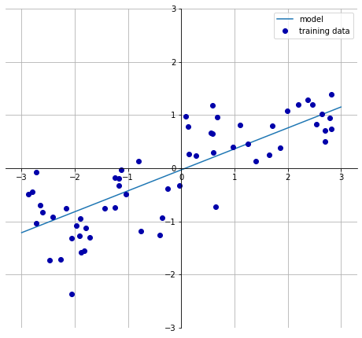

#### Linear Regression on Wave Dataset

- **Dataset and Models**

    ```python
    from sklearn.linear_model import LinearRegression
    from sklearn.model_selection import train_test_split
    X, y = mglearn.datasets.make_wave(n_samples=60)
    X_train, X_test, y_train, y_test = train_test_split(X, y, random_state=42)

    lr = LinearRegression().fit(X_train, y_train)
    ```

    “斜率” 参数（$w$，也叫作权重或系数）被保存在 `coef_` 属性中，而偏移或截距（$b$）被保存在 `intercept_` 属性中

    ```python
    print("lr.coef_:{}".format(lr.coef_))
    print("lr.intercept_:{}".format(lr.intercept_))
    ```

    **Output**

    ```console
    lr.coef_:[0.39390555]
    lr.intercept_:-0.031804343026759746
    ```

    `intercept_` 属性是一个浮点数，而 `coef_` 属性是一个 Numpy 数组，每个元素对应一个输入特征，由于 Wave 数据集中只有一个输入特征，所以 `lr.coef_` 中只有一个元素

- **Evaluation**

    ```python
    print("Training set score: {:.2f}".format(lr.score(X_train, y_train)))
    print("Test set score: {:.2f}".format(lr.score(X_test, y_test)))
    ```

    **Output**

    ```console
    Training set score: 0.67
    Test set score: 0.66
    ```

    $R^2$ 约为 `0.66`，这个结果不是很好，但我们可以看到，训练集和测试集上的分数非常接近，这说明可能存在欠拟合，而不是过拟合，对于这个一维数据集来说，过拟合的风险很小，因为模型非常简单（或受限），然而，对于更高维的数据集（即有大量特征的数据集），线性模型将变得非常强大，过拟合的可能性也会很大

#### Linear Regression on Extended_Boston Dataset

```python
X, y = mglearn.datasets.load_extended_boston()

X_train, X_test, y_train, y_test = train_test_split(X, y, random_state=0)
lr = LinearRegression().fit(X_train, y_train)

print("Training set score:{:.2f}".format(lr.score(X_train, y_train)))
print("Test set score:{:.2f}".format(lr.score(X_test, y_test)))
```

**Output**

```console
Training set score: 0.95
Test set score: 0.61
```

比较一下训练集和测试集的分数就可以发现，我们在训练集上的预测非常准确，但测试上的 $R^2$ 要低很多，训练集和测试集之间的性能差异是过拟合的明显标志，因此我们应该试图找到一个可以控制复杂度的模型

标准线性回归最常用的替代方法之一就是岭回归（Ridge Regerssion）

#### Sklearn and Normal Function

```python
def sklearn_normal_func(n=60):
    X, y = mglearn.datasets.make_wave(n_samples=n)
    X_train, X_test, y_train, y_test = train_test_split(X, y, random_state=42)

    # Plot
    plt.figure(figsize=(10, 5))
    plt.title('Linear Regression')
    plt.scatter(X_train, y_train)
    plt.scatter(X_test, y_test)

    # sklearn
    lr = LinearRegression().fit(X_train, y_train)
    plt.plot(X_train, lr.predict(X_train), 'r')

    # normal function
    X_T_X = np.linalg.inv(X_train.T.dot(X_train))
    theta = np.dot(X_T_X, X_train.T).dot(y_train)
    y_pred = X_train.dot(theta)
    plt.plot(X_train, y_pred, alpha=0.5)

    # legends and show
    plt.legend(["Sklearn Linear", "Normal Function Linear",
                "Train data", "Test data"], loc="best")
    plt.show()
```

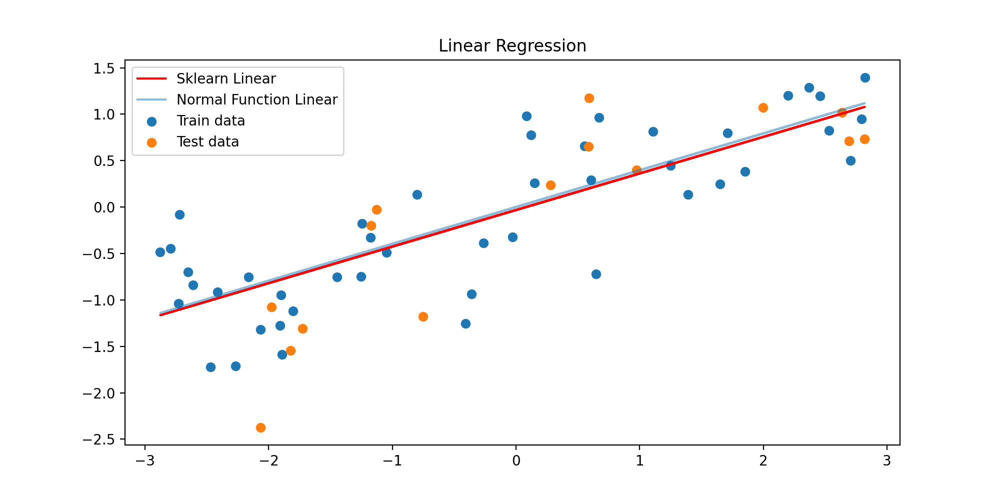

------

### Ridge Regression

在线性回归模型中，其参数估计公式为

$$
\theta=(X^\mathrm{T}X)^{-1}\cdot X^\mathrm{T}y
$$

当 $X^\mathrm{T}X$ 不可逆时无法求出 $\theta$ ，另外如果 $\vert X^\mathrm{T}X \vert \to 0$ ，会使得回归系数趋向于无穷大，此时得到的回归系数是无意义的，解决这类问题可以使用 **岭回归** 和 **LASSO 回归**，主要针对自变量之间存在多重共线性或者自变量个数多于样本量的情况

在岭回归中，对系数（$\theta$）的选择不仅要在训练数据上得到好的预测结果，而且还要附加约束，我们希望 $\theta$ 的所有元素都应该接近于 $0$ ，直观上来看，这意味着每个特征对输出的影响应尽可能小（即斜率很小），同时仍给出很好的预测结果，这种对模型做约束就是是所谓的 **正则化（regularization）**，以避免过拟合，岭回归用到的这种被称为 $L_2$ 正则化

#### Derivation of Ridge Regression

回顾线性回归模型中，正规方程的 **损失函数**

$$
J(\theta)=\frac1{2m}(X\theta−y)^\mathrm{T}(X\theta−y)
$$

为了保证回归系数 $\theta$ 可求，岭回归模型在目标函数上加了一个 $L_2$ 范数的惩罚项

$$
J(\theta) = \frac1{2m}\left[(X\theta−y)^\mathrm{T}(X\theta−y) + \lambda\Vert \theta \Vert_2^2 \right]
$$
 
其中 $\lambda$ 为非负数，$\lambda$ 越大，则为了使 $J(\theta)$ 最小，回归系数 $\theta$ 就越小

$$
\begin{aligned}
J(\theta) &= \frac1{2m}\left[(X\theta−y)^\mathrm{T}(X\theta−y) 
    + \lambda\Vert \theta \Vert_2^2 \right] \\
&= \frac1{2m}\left[(\theta^\mathrm{T}X^\mathrm{T}−y^\mathrm{T})(X\theta−y) 
    + \lambda\theta^\mathrm{T}\theta \right] \\
&= \frac1{2m} \left(\theta^\mathrm{T}X^\mathrm{T}X\theta
							-\theta^\mathrm{T}X^\mathrm{T}y
							-y^\mathrm{T}X\theta-y^\mathrm{T}y
                            + \lambda\theta^\mathrm{T}\theta \right)
\end{aligned}
$$

接下来对 $J(\theta)$ 求偏导，同样需要用到以下几个矩阵求导的法则

$$
\frac{dX^\mathrm{T}A}{dX}=\frac{dA^\mathrm{T}X}{dX}=A,
\qquad \frac{dX^\mathrm{T}AX}{dX}=(A+A^\mathrm{T})X
$$

所以有

$$
\begin{aligned}
\frac{\partial J(\theta)}{\partial\theta} 
&= \frac1{2m} \left(\frac{\partial\theta^\mathrm{T}X^\mathrm{T}X\theta}{\partial\theta}
							-\frac{\partial\theta^\mathrm{T}X^\mathrm{T}y}{\partial\theta}
							-\frac{\partial y^\mathrm{T}X\theta}{\partial\theta}
							-\frac{\partial y^\mathrm{T}y}{\partial\theta}
                            +\lambda\frac{\partial \theta^\mathrm{T}\theta}{\partial\theta} \right) \\
&= \frac1{2m} \left[(X^\mathrm{T}X+(X^\mathrm{T}X)^\mathrm{T})\theta-X^\mathrm{T}y
                            -(y^\mathrm{T}X)^\mathrm{T}-0 + 2\lambda I\theta \right] \\
&= \frac1m \left(X^\mathrm{T}X\theta - X^\mathrm{T}y + \lambda I\theta \right)
\end{aligned}
$$

令

$$
\frac{\partial J(\theta)}{\partial\theta} = 0
$$

则有

$$
\theta=(X^\mathrm{T}X + \lambda I)^{-1}\cdot X^\mathrm{T}y
$$

$L_2$ 范数惩罚项的加入使得 $X^\mathrm{T}X + \lambda I$ 满秩，保证了可逆，但是也由于惩罚项的加入，使得回归系数 $\theta$ 的估计不再是无偏估计，所以岭回归是以放弃无偏性、降低精度为代价解决不可逆矩阵问题的回归方法

单位矩阵 $I$ 的对角线上全是 $1$，像一条山岭一样，这也是岭回归名称的由来

#### Example of Ridge Regression

```python
import mglearn
from sklearn.linear_model import Ridge
from sklearn.model_selection import train_test_split

X, y = mglearn.datasets.load_extended_boston()
X_train, X_test, y_train, y_test = train_test_split(X, y, random_state=0)

ridge = Ridge().fit(X_train, y_train)
print("Training set score: {:.2f}".format(ridge.score(X_train, y_train)))
print("Test set score: {:.2f}".format(ridge.score(X_test, y_test)))
```

**Output**

```console
Training set score: 0.89
Test set score: 0.75
```

可以看出，Ridge 回归在训练集上的分数要低于线性回归，但在测试集上的分数更高，毕竟线性回归对数据存在过拟合

Ridge 是一种约束更强的模型，所以更不容易过拟合，复杂度小的模型意味着在训练集上的性能较差，但泛化性能更好，由于我们只对泛化性能感兴趣，所以应该选择 Ridge 模型而不是 线性回归模型

#### Alpha Parameter in Ridge

Ridge 模型还可以通过 `alpha` 参数（相当于公式推到中的 $\lambda$ ）控制模型的性能

```python
ridge10 = Ridge(alpha=10).fit(X_train, y_train)
print("Training set score:{:.2f}".format(ridge10.score(X_train, y_train)))
print("Test set score:{:.2f}".format(ridge10.score(X_test, y_test)))
```

```console
Training set score:0.79
Test set score:0.64
```

降低 `alpha`，使系数的限制性降低
对于很小的 `alpha` 值，系数几乎不受限制，最终我们得到的模型类似于线性回归

```python
ridge01 = Ridge(alpha=0.1).fit(X_train, y_train)
print("Training set score: {:.2f}".format(ridge01.score(X_train, y_train)))
print("Test set score: {:.2f}".format(ridge01.score(X_test, y_test)))
```

```console
Training set score: 0.93
Test set score: 0.77
```

这里，`alpha=0.1` 似乎效果不错，我们可以尝试降低 `alpha`，甚至更多地降低 `alpha` 以提高通用性

我们还可以通过检查不同 `alpha` 值对应模型的 `coef_` 属性，来了解 `alpha` 参数是如何改变模型的，较大的 `alpha` 意味着模型的限制性更强，所以我们预计，大 `alpha` 值的 `coef_` 中的权重项比小 `alpha` 值对应模型的幅度要小

```python
plt.figure(figsize=(10, 5))
plt.plot(ridge.coef_, 's', label="Ridge alpha=1")
plt.plot(ridge10.coef_, '^', label="Ridge alpha=10")
plt.plot(ridge01.coef_, 'v', label="Ridge alpha=0.1")

# lr = LinearRegression().fit(X_train, y_train)
plt.plot(lr.coef_, 'o', label="LinearRegression")
plt.xlabel("Coefficient index")
plt.ylabel("Coefficient magnitude")
xlims = plt.xlim()
plt.hlines(0, xlims[0], xlims[1])
plt.xlim(xlims)
plt.ylim(-25, 25)
plt.legend()
```

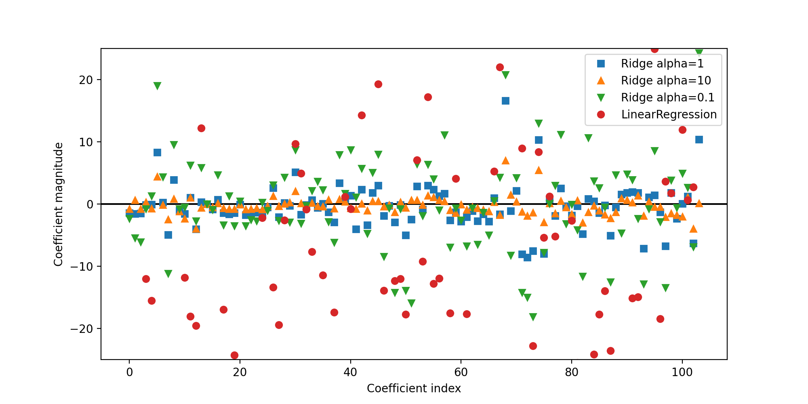

横坐标中枚举了各个特征对应的系数（特征共有 104 个），横轴表示这些系数相应的值

- 这里我们首先来看 `alpha=10` 时（图中向上的三角形），我们发现大部分系数都是集中在区间 $[-3, 3]$ ，而且其他系数也很小
- 将 `alpha` 减小至 `1`，我们得到图中的正方形，大部分特征比 `alpha=10` 的情况稍大一些
- 当 `alpha=0.1` 时，我们得到正则化很弱的模型，大部分系数已经很大，已经类似于普通的线性回归（相当于 `alpha=0`，没有任何正则化过程），部分点甚至已经超出了图像的显示范围

另外，我们可以通过查看数据量对 Ridge 回归和线性回归在训练过程的影响

```python
mglearn.plots.plot_ridge_n_samples()
```

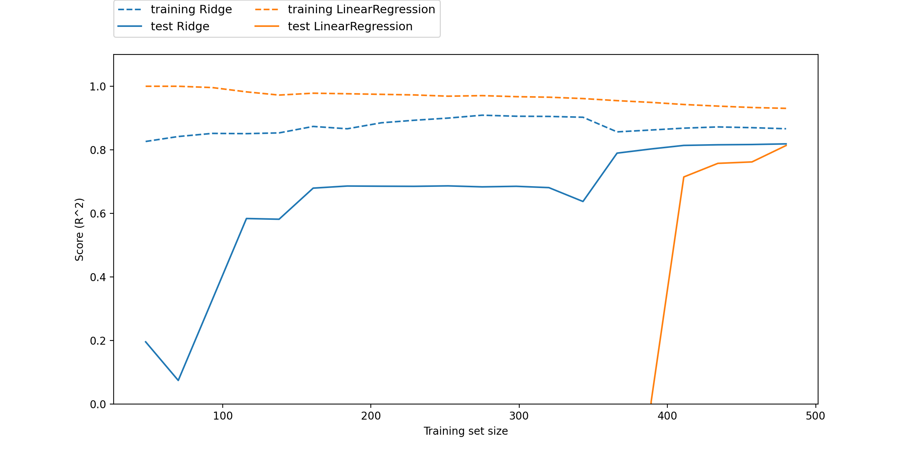

- 无论 Ridge 回归和线性回归，训练集的效果通常都比测试集好
- 由于正则化的关系，Ridge 回归在训练集上的效果是不如线性回归的
- 但是在测试集上，Ridge 回归的效果就明显强于线性回归，尤其是在小样本的情况
- 在样本数小于 400 时，线性回归实际上没有从数据集学到有用的参数
- 当训练样本的数量增加时，Ridge 回归和线性回归在训练集上的效果都有提升，并且线性回归的效果最终追赶成功
- 当数据量足够大的时候，正则化的重要性就被削弱了，Ridge 回归和线性回归的效果几乎相同
- 当数据量增加时，模型过拟合的几率有所下降，数据的特征变得难以刻画，所以线性回归在训练集上的效果是有所下降的

### Lasso

- Lasso 是另外一种正则化的线性回归
  - 与岭回归相同，使用 Lasso 也是约束系数使其接近于 $0$，但用到的方法不同，叫做 $L_1$ 正则化
  - $L_1$ 正则化的结果是，使用 Lasso 时某些系数刚好为 $0$
- Lasso 有一个正则化参数 `alpha`，可以控制系数趋向于 $0$ 的强度，还需要调整参数 `max_iter` 的值（运行迭代的最大次数）
  - 参数 `alpha` 变小，可以拟合一个更复杂的模型
  - 参数 `alpha` 设得太小，那么就会消除正则化的效果，并出现过拟合，得到与 LinearRegression 类似的结果

#### Derivation of Lasso (Streamline Version)

Lasso 模型在目标函数上加了一个 $L_1$ 范数的惩罚项

$$
J(\theta) = \frac1{2m}\left[(X\theta−y)^\mathrm{T}(X\theta−y) + \lambda\vert \theta \vert_1 \right]
$$
 
其中 $\lambda$ 为非负数，$\lambda$ 越大，则为了使 $J(\theta)$ 最小，回归系数 $\theta$ 就越小

$$
\begin{aligned}
J(\theta) &= \frac1{2m}\left[(X\theta−y)^\mathrm{T}(X\theta−y) 
    + \lambda\vert \theta \vert_1 \right] \\
&= \frac1{2m}\left[(\theta^\mathrm{T}X^\mathrm{T}−y^\mathrm{T})(X\theta−y) 
    + \lambda \cdot sign(\theta) \right] \\
&= \frac1{2m} \left(\theta^\mathrm{T}X^\mathrm{T}X\theta
							-\theta^\mathrm{T}X^\mathrm{T}y
							-y^\mathrm{T}X\theta-y^\mathrm{T}y
                            + \lambda \cdot sign(\theta) \right)
\end{aligned}
$$

其中 $sign(x)$ 表示如下

$$
sign(x)=
\begin{cases}
1 & x_i>0 \\
[-1,1] & x_i=0 \\
-1 & x_i<0
\end{cases}
$$

接下来对 $J(\theta)$ 求偏导，同样需要用到以下几个矩阵求导的法则

$$
\frac{dX^\mathrm{T}A}{dX}=\frac{dA^\mathrm{T}X}{dX}=A,
\qquad \frac{dX^\mathrm{T}AX}{dX}=(A+A^\mathrm{T})X
$$

这里由于 $sign(\theta)$ 的偏导比较复杂，我们仅仅展示

$$
\frac{\partial sign(\theta)}{\partial\theta} = I
$$

的公式（实际的公式过于复杂，不必深究），有

$$
\begin{aligned}
\frac{\partial J(\theta)}{\partial\theta} 
&= \frac1{2m} \left(\frac{\partial\theta^\mathrm{T}X^\mathrm{T}X\theta}{\partial\theta}
							-\frac{\partial\theta^\mathrm{T}X^\mathrm{T}y}{\partial\theta}
							-\frac{\partial y^\mathrm{T}X\theta}{\partial\theta}
							-\frac{\partial y^\mathrm{T}y}{\partial\theta}
                            +\lambda\frac{\partial sign(\theta)}{\partial\theta} \right) \\
&= \frac1{2m} \left[(X^\mathrm{T}X+(X^\mathrm{T}X)^\mathrm{T})\theta-X^\mathrm{T}y
                            -(y^\mathrm{T}X)^\mathrm{T}-0 + \lambda I \right] \\
&= \frac1m \left(X^\mathrm{T}X\theta - X^\mathrm{T}y + \frac{\lambda I}{2} \right)
\end{aligned}
$$

令

$$
\frac{\partial J(\theta)}{\partial\theta} = 0
$$

则有

$$
\theta=(X^\mathrm{T}X)^{-1}\cdot \left(X^\mathrm{T}y - \frac{\lambda I}{2} \right)
$$

Lasso 不是从根本上解决多重共线性问题，而是限制多重共线性带来的影响

Ridge 回归和 Lasso 都加了正则化，正则化都会起到压缩系数的大小，对标签贡献少的特征，最后系数会更小，也更容易被压缩，不过，$L_1$ 正则化和 $L_2$ 正则化的区别是，$L_2$ 正则化会将系数压缩 $\to0$ ，但 $L_1$ 正则化主导稀疏性，会将系数压缩到 $0$（因此也说明 Lasso 回归可以用来做特征选择）

#### Example of Lasso

```python
from sklearn.linear_model import Lasso

lasso = Lasso().fit(X_train, y_train)
print("Training set score: {:.2f}".format(lasso.score(X_train, y_train)))
print("Test set score: {:.2f}".format(lasso.score(X_test, y_test)))
print("Number of features used:", np.sum(lasso.coef_ != 0))
```

**Output**

```console
Training set score: 0.29
Test set score: 0.21
Number of features used: 4
```

如你所见，Lasso 在训练集和测试集上的表现都很差，这表示存在欠拟合，我们发现模型只用到了 104 个特征中的 4 个

与 Ridge 回归类似，Lasso 也有一个正则化参数 `alpha`，可以控制系数趋于 `0` 的强度，在上一个例子中，我们用到的默认值`alpha=1.0`，为了降低欠拟合，我们尝试减小 `alpha`，这么做的同时，我们还需要增加 `max_iter` 的值（运行迭代的最大次数）

```python
# we increase the default setting of "max_iter",
lasso001 = Lasso(alpha=0.01, max_iter=100000).fit(X_train, y_train)
print("Training set score: {:.2f}".format(lasso001.score(X_train, y_train)))
print("Test set score: {:.2f}".format(lasso001.score(X_test, y_test)))
print("Number of features used:", np.sum(lasso001.coef_ != 0))
```

**Output**

```console
Training set score: 0.90
Test set score: 0.77
Number of features used: 33
```

参数 `alpha` 值变小后，可以拟合一个更复杂的模型，在训练集和测试集上的表现也更好，模型性能比使用 Ridge 回归时略好一点，而且我们只用到了 104 个特征中的 33 个，这样模型还可能更容易理解

但如果把 `alpha` 设的太小，那么就会消除正则化的效果，并出现过拟合，得到与线性回顾类似的结果

```python
lasso00001 = Lasso(alpha=0.0001, max_iter=100000).fit(X_train, y_train)
print("Training set score: {:.2f}".format(lasso00001.score(X_train, y_train)))
print("Test set score: {:.2f}".format(lasso00001.score(X_test, y_test)))
print("Number of features used:", np.sum(lasso00001.coef_ != 0))
```

**Output**

```python
Training set score:0.95
Test set score:0.65
Number of features used:97
```

同样我们可以向 Ridge 回归那样，画出不同模型的各个系数

```python
plt.plot(lasso.coef_, 's', label="Lasso alpha=1")
plt.plot(lasso001.coef_, '^', label="Lasso alpha=0.01")
plt.plot(lasso00001.coef_, 'v', label="Lasso alpha=0.0001")

plt.plot(ridge01.coef_, 'o', label="Ridge alpha=0.1")
plt.legend(ncol=2, loc=(0, 1.05))
plt.ylim(-25, 25)
plt.xlabel("Coefficient index")
plt.ylabel("Coefficient magnitude")
```

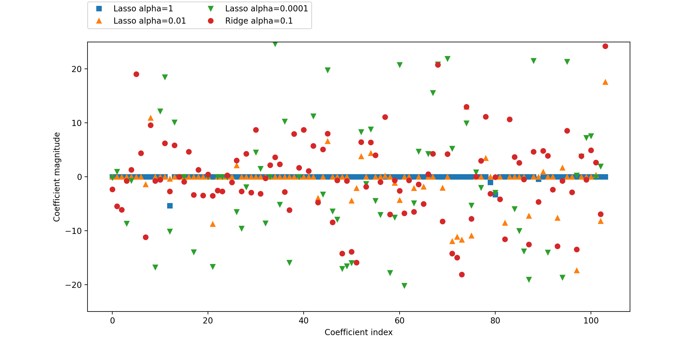

参数 `alpha=1` 时，我们发现大部分系数都是 `0`，而且其他系数也很小，将 `alpha` 减小至 `0.01`，我们得到图中向上的三角形，大部分特征的系数依旧等于 `0`，`alpha=0.0001` 时，我们得到正则化很弱的模型，大部分系数都不为 `0`，并且还很大，为了便于比较，图中用圆形表示 Ridge 回归的最佳结果，我们发现 `alpha=0.1` 的 Ridge 回归模型的预测性能与 `alpha=0.01` 的 Lasso 模型类似，但 Ridge 模型的所有系数都不为 `0`

#### Summary of Ridge Regression and Lasso

- 在实践中，两个模型中一般首选 Ridge 回归
  - 但如果特征很多，你认为只有其中几个是重要的，那么选择 Lasso 可能更好
  - 如果你想要一个容易解释的模型，Lasso 可以给出更容易理解的模型，因为它只选择了一部分输入特征
- scikit-learn 还提供了 `ElasticNet` 类，结合了 Lasso 和 Ridge 的惩罚项
  - 在实践中，这种结合的效果最好
  - 代价是要调节两个参数，一个用于 $L_1$ 正则化，一个用于 $L_2$ 正则化

## Linear Models for Classification

线性模型也可用于分类问题。我们首先来看二分类。我们可以利用下面的公式预测

$$
\hat y = w[0]* x[0]+w[1]* x[1]+\cdots +w[p]*x[p] +b >0
$$

这个公式与线性回归的公式非常相似，但我们没有返回特征的加权求和，而是为预测设置了阈值（$0$），如果函数值 $<0$ ，我们就预测类别 $-1$，如果函数值 $>0$，我们就预测类别 $+1$，对于几乎所有用于分类的线性模型，这个预测规则都是通用的，同样，有很多不同的方法来找出系数（$w$）和截距（$b$）

对于用于回归的线性模型，输出 $\hat y$ 是特征的线性函数，是直线、平面或超平面（对于更高维的数据集），对于用于分类的线性模型，决策边界是输入的线性函数，换句话说，（二元）线性分类器是利用直线、平面或超平面来分开两个类别的分类器

学习线性模型有很多种算法，这些算法的区别在于以下两点

1. 系数和截距的特定组合对训练数据拟合好坏的度量方法
1. 是否使用正则化，以及使用哪种正则化方法

不同的算法使用不同的方法来度量 “对训练集拟合好坏”，由于数学上的技术原因，不可能调节 $w$ 和 $b$ 使得算法产生的误分类数量最少，对于我们的目的，以及对于许多应用而言，上面第一点（称为损失函数）的选择并不重要。

最常见的两种线性分类算法是 Logistic 回归（Logistic Regression，在 `linear_model.LogisticRegression` 中实现）和线性支持向量机（Linear Support Vector Machine，在 `svm.LinearSVC` 中实现，SVC 代表支持分类器），Logistic Regression 尽管含有 Regression 字样，但却是一种分类算法，而不是回归算法，不应该与 Linear Regression 混淆

```python
from sklearn.linear_model import LogisticRegression
from sklearn.svm import LinearSVC

X, y = mglearn.datasets.make_forge()

fig, axes = plt.subplots(1, 2, figsize=(10, 3))

for model, ax in zip([LinearSVC(), LogisticRegression()], axes):
    clf = model.fit(X, y)
    mglearn.plots.plot_2d_separator(clf, X, fill=False, eps=0.5,
                                    ax=ax, alpha=.7)
    mglearn.discrete_scatter(X[:, 0], X[:, 1], y, ax=ax)
    ax.set_title(clf.__class__.__name__)
    ax.set_xlabel("Feature 0")
    ax.set_ylabel("Feature 1")
axes[0].legend()
```

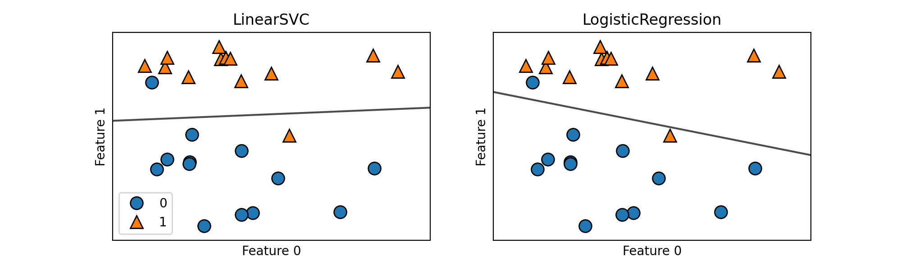

在上述图中，forge 数据集的第一个特征位于 x 轴，第二个特征位于 y 轴

图中分别展示了 `LinearSVC` 和 `LogisticRegression` 得到的决策边界，都是直线，将顶部归为类别 1 的区域和底部归为类别 0 的区域分开了，换句话说，对于每个分类器而言，位于黑线上方的新数据点都会被划为类别 1，而在黑线下方的点都会被划为类别 0，两个模型得到了相似的决策边界

注意，两个模型中都有两个点的分类是错误的，两个模型默认使用 $L_2$ 正则化，就像 Ridge 回归所做的那样

### Regularization in Linear Classification

对于 `LogisticRegression` 和 `LinearSVC`，决定正则化强度的权衡参数叫作 `C`，`C` 值越大，对应的正则化越弱

换句话说，如果参数 `C` 值较大，那么 `LogisticRegression`和 `LinearSVC` 将尽可能将训练集拟合到最好，而如果 `C` 值较小，那么模型更强调使系数向量（`w`）接近于 `0`

参数 `C` 的作用还有另一个有趣之处，较小的 `C` 值可以让算法尽量适应“大多数”数据点，而较大的 `C` 值强调每个数据点都分类正确的重要性

```python
mglearn.plots.plot_linear_svc_regularization()
```

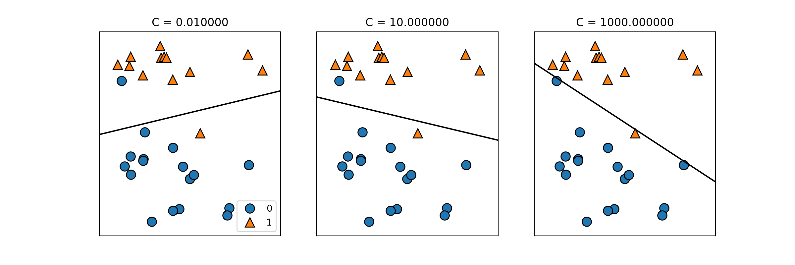

在上述左 1 图中，`C` 值很小，对应强正则化，大部分属于类别 0 的点都位于底部，大部分属于类别 1 的点都位于顶部，强正则化的模型会选择一条相对水平的线，有两个点分类错误

在中间的图中，`C` 值稍大，模型更关注两个分类错误的样本，使决策边界的斜率变大

最后，在右侧的图中，模型的 `C` 值非常大，使得决策边界的斜率也很大，选择模型对类别 0 中所有点的分类都是正确的，但类别 1 中仍有一个点分类错误，这是因为对这个数据集来说，不可能用一条直线将所有点都分类正确，右侧图中的模型尽量使所有点都分类正确，但可能无法掌握类别的整体分布，换句话说，这个模型很可能过拟合

与回归的情况类似，用于分类的线性模型在低维空间中看起来可能非常受限，决策边界只能是直线或平面，同样，在高维空间中，用于分类的线性模型变得非常强大，当考虑更多特征时，避免过拟合变得越来越重要

```python
from sklearn.datasets import load_breast_cancer
from sklearn.model_selection import train_test_split

cancer = load_breast_cancer()
X_train, X_test, y_train, y_test = train_test_split(
    cancer.data, cancer.target, stratify=cancer.target, random_state=42)
logreg = LogisticRegression().fit(X_train, y_train)
print("Training set score: {:.3f}".format(logreg.score(X_train, y_train)))
print("Test set score: {:.3f}".format(logreg.score(X_test, y_test)))
```

**Output**

```console
Training set score: 0.955
Test set score: 0.951
```

`C=1` 的默认值给出了相当好的性能，在训练集和测试集上都达到 95% 的精度，但由于训练集和测试集的性能非常接近，所以模型很可能是欠拟合的。我们尝试增大 `C` 来拟合一个更灵活的模型

```python
logreg100 = LogisticRegression(C=100).fit(X_train, y_train)
print("Training set score:{:.3f}".format(logreg100.score(X_train, y_train)))
print("Test set score:{:.3f}".format(logreg100.score(X_test, y_test)))
```

**Output**

```console
Training set score:0.953
Test set score:0.965
```

使用 `C=100` 可以得到更高的训练集精度，也得到了稍高的测试集精度，这也证实了我们的直觉，即更复杂的模型应该性能更好

```python
logreg001 = LogisticRegression(C=0.01).fit(X_train, y_train)
print("Training set score:{:.3f}".format(logreg001.score(X_train, y_train)))
print("Test set score:{:.3f}".format(logreg001.score(X_test, y_test)))
```

**Output**

```console
Training set score:0.934
Test set score:0.930
```

当我设置 `C=0.01` 时，发现模型在训练集和测试集上的效果相比默认情况都有所下降，说明出现了欠拟合的情况


```python
# plt.figure(figsize=(10, 6))
# plt.subplots_adjust(top=0.94, bottom=0.33)
plt.plot(logreg.coef_.T, 'o', label="C=1")
plt.plot(logreg100.coef_.T, '^', label="C=100")
plt.plot(logreg001.coef_.T, 'v', label="C=0.001")
plt.xticks(range(cancer.data.shape[1]), cancer.feature_names, rotation=90)
xlims = plt.xlim()
plt.hlines(0, xlims[0], xlims[1])
plt.xlim(xlims)
plt.ylim(-5, 5)
plt.xlabel("Feature")
plt.ylabel("Coefficient magnitude")
plt.legend()
# plt.show()
```


Logistic Regression 模型默认应用 $L_2$ 正则化，更强的正则化使的系数更趋向于 0，但系数永远不会正好等于0

进一步观察图像，还可以第 3 个系数那里发现有趣之处，这个系数是 “平均周长”（mean perimeter），`C=1` 和 `C=100` 时这个系数为负，但 `C=0.001` 时该系数为正，且其绝对值比 `C=1` 时的还要大，在解释这样的模型时，系数可以告诉我们某个特征与哪个类别有关

例如，人们可能会认为高 “纹理错误”（texture error）特征与 “恶性” 样本有关，但 “平均周长” 系数的正负号发生变化，说明较大的 “平均周长” 特征被当作 “良性” 指标或 “恶性” 指标，具体取决于我们考虑的是哪个模型，这也说明，对线性模型系数的解释应该始终持保留态度

如果想要一个可解释性更强的模型，使用 $L_1$ 正则化可能更好，因为它约束模型只使用少数几个特征

```python
for C, marker in zip([0.001, 1, 100], ['o', '^', 'v']):
    lr_l1 = LogisticRegression(C=C, solver='liblinear', penalty="l1").fit(X_train, y_train)
    print("Training accuracy of l1 logreg with C={:.3f}: {:.2f}".format(
          C, lr_l1.score(X_train, y_train)))
    print("Test accuracy of l1 logreg with C={:.3f}: {:.2f}".format(
          C, lr_l1.score(X_test, y_test)))
    plt.plot(lr_l1.coef_.T, marker, label="C={:.3f}".format(C))

plt.xticks(range(cancer.data.shape[1]), cancer.feature_names, rotation=90)
xlims = plt.xlim()
plt.hlines(0, xlims[0], xlims[1])
plt.xlim(xlims)
plt.xlabel("Feature")
plt.ylabel("Coefficient magnitude")

plt.ylim(-5, 5)
plt.legend(loc=3)
```

**Output**

```console
Training accuracy of l1 logreg with C=0.001: 0.91
Test accuracy of l1 logreg with C=0.001: 0.92
Training accuracy of l1 logreg with C=1.000: 0.96
Test accuracy of l1 logreg with C=1.000: 0.96
Training accuracy of l1 logreg with C=100.000: 0.99
Test accuracy of l1 logreg with C=100.000: 0.98
```

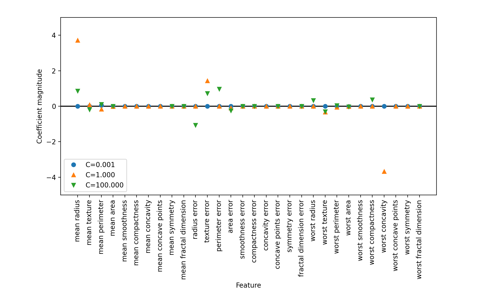

我们发现线性回归和 2 分类问题有许多的相似之处，在回归中，模型的区别来自于惩罚项，这将影响特征是被全部选取还是部分使用

### Linear Models for Multiple Classification

将二分类算法推广到多分类算法的一种常见方法是 “一对其余”（one-vs.-rest）方法，在 “一对其余” 方法中，对每个类别都学习一个二分类模型，将这个类别与所有其他类别尽量分开，这样就生成了与类别个数一样多的二分类模型，在测试点上运行所有二分类器来进行预测，在对应类别上分数最高的分类器 “胜出”，将这个类别标签返回作为预测结果

每个类别都对应一个二类分类器，这样每个类别都有一个系数（$w$）向量与一个截距（$b$）
我们将 “一对多余” 法应用在一个简单的三分类数据集上，我们用到了一个二维数据集，每个类别的数据都是从一个高斯分布中采样得出的

```python
from sklearn.datasets import make_blobs

X, y = make_blobs(random_state=42)
mglearn.discrete_scatter(X[:, 0], X[:, 1], y)
plt.xlabel("Feature 0")
plt.ylabel("Feature 1")
plt.legend(["Class 0", "Class 1", "Class 2"])
```

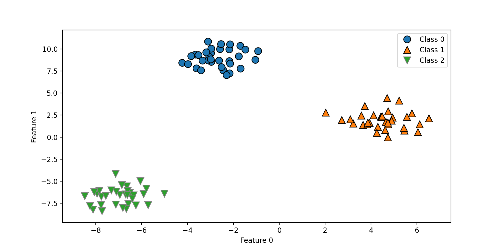

在上面的数据集上训练一个 `LinearSVC()` 分类器

```python
linear_svm = LinearSVC().fit(X, y)
print("Coefficient shape: ", linear_svm.coef_.shape)
print("Intercept shape: ", linear_svm.intercept_.shape)
```

**Output**

```console
Coefficient shape:  (3, 2)
Intercept shape:  (3,)
```

我们看到，`coef_` 的形状是 `(3,2)`，说明 `coef_` 每行包含三个类别之一的系数向量，每列包含某个特征（这个数据集有 2 个特征）对应的系数值，现在 `intercetp_` 是一维数组，保存每个类别的截距，我们将这 3 个二分类器给出的直线可视化

```python
mglearn.discrete_scatter(X[:, 0], X[:, 1], y)
line = np.linspace(-15, 15)
for coef, intercept, color in zip(linear_svm.coef_, linear_svm.intercept_,
                                  mglearn.cm3.colors):
    plt.plot(line, -(line * coef[0] + intercept) / coef[1], c=color)
plt.ylim(-10, 15)
plt.xlim(-10, 8)
plt.xlabel("Feature 0")
plt.ylabel("Feature 1")
plt.legend(['Class 0', 'Class 1', 'Class 2', 'Line class 0', 'Line class 1',
            'Line class 2'], loc=(1.01, 0.3))
```

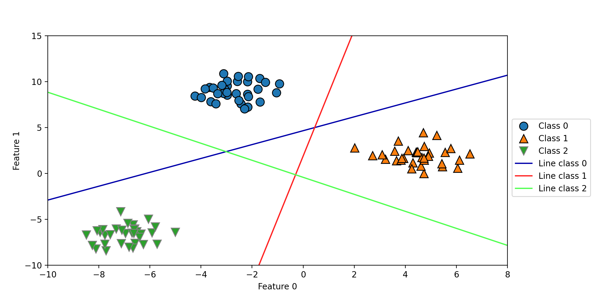

可以看到，训练集中所有属于类别 0 的点都在类别 0 对应的直线上方，这说明它们位于这个二分类器属于 “类别0” 的那一侧，属于类别 0 的点位于与类别 2 对应的直线上方，这说明它们被类别 2 的二分类器划为 “其余”；属于类别 0 的点位于与类别 1 对应的直线左侧，这说明类别 1 的二元分类器将它们划为 “其余”；因此，这一区域的所有点都会被最终分类器划为类别 0（类别 0 的分类器的分类置信方程的结果大于 0，其他两个类别对应的结果小于 0）
但图像中间的三角形区域属于哪一个类别呢，3 个分类器都将这一区域内的点划为 “其余”，这里的点应该应该划归到哪一个类别呢？答案是分类方程结果最大的那个类别，即最接近的那条线对应的类别

```python
mglearn.plots.plot_2d_classification(linear_svm, X, fill=True, alpha=.7)
mglearn.discrete_scatter(X[:, 0], X[:, 1], y)
line = np.linspace(-15, 15)
for coef, intercept, color in zip(linear_svm.coef_, linear_svm.intercept_,
                                  mglearn.cm3.colors):
    plt.plot(line, -(line * coef[0] + intercept) / coef[1], c=color)
plt.legend(['Class 0', 'Class 1', 'Class 2', 'Line class 0', 'Line class 1',
            'Line class 2'], loc=(1.01, 0.3))
plt.xlabel("Feature 0")
plt.ylabel("Feature 1")
```

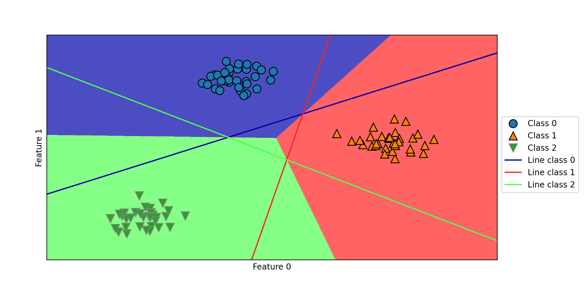

## Strengths, Weaknesses and Parameters in Linear Models

- 线性模型的主要参数是正则化参数，在回归模型中叫做 `alpha`，在 LinearSVC 和 LogisticRegression 中叫做 `C`
    - `alpha` 值较大或 `C` 值较小，说明模型比较简单，特别是对于回归模型而言，调节这些参数非常重要
    - 通常在对数尺度上对 `C` 和 `alpha` 进行搜索

- 你还需要确定的是用 $L_1$ 正则化还是 $L_2$ 正则化
    - 如果你假定只有几个特征是真正重要的，那么你应该用 $L_1$ 正则化，否则应默认使用 $L_2$ 正则化
    - 如果模型的可解释性是很重要的话，使用 $L_1$ 也会有帮助
    - 由于 $L_1$ 只用到几个特征，所以更容易解释哪些特征对模型是重要的，以及这些特征的作用

- 线性模型的训练速度非常快，预测速度也很快，这种模型可以推广到非常大的数据集，对稀疏数据也很有效
    - 如果数据包包含数十万甚至上百万个样本，可能需要研究如何使用 LogisticRegression 和 Ridge 模型的 `solver='sag'` 选项，在处理大型数据时，这一选项比默认值要更快
    - 其它选项还有 `SGDClassifier` 和 `SGDRegressor` 类，它们对线性模型实现了可扩展性更强的版本
- 线性模型的另一个优点在于，利用我们之前见过的用于回归和分类的公式，理解如何进行预测是相对比较容易的
- 不幸的是，往往并不完全清楚系数为什么是这样的，如果数据集中包含高度相关的特性，这一问题尤为突出，可能很难对系数做出解释
- 如果特征数量大于样本数量，线性模型的表现通常都很好
    - 常用于非常大的数据集，只是因为训练其他模型并不可行
    - 但在更低维的空间中，其他模型的泛化性能可能更好
