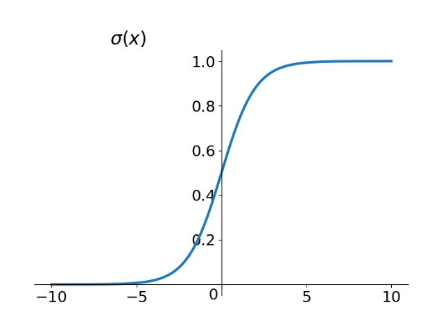
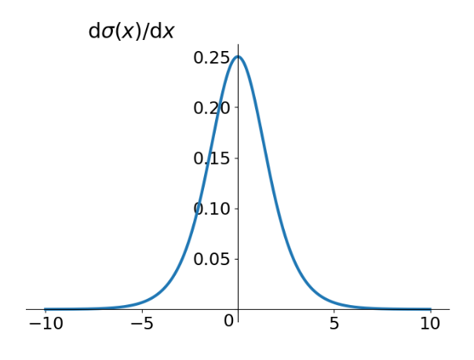
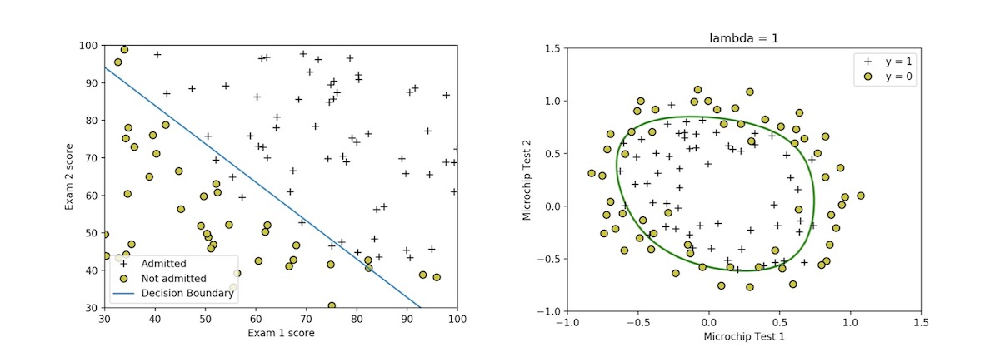
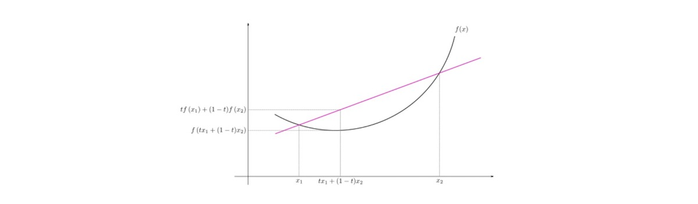
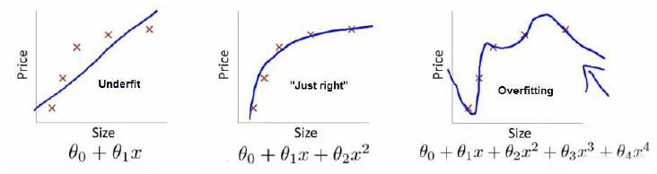
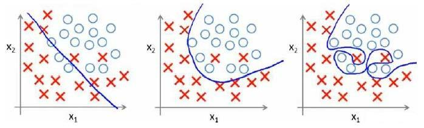
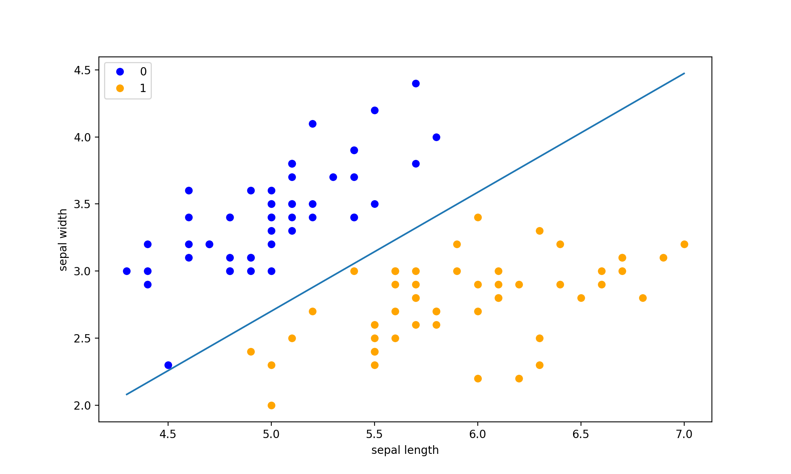

# Logistic Regression

## Classification Problems

对于监督学习中的分类问题，通常已知一些数据并知道它们各自属于什么类别，然后希望基于这些数据来判断新数据是属于什么类别的

比如已知一些症状特征和是否患有某种疾病的数据，基于这些数据来判断新的病人是否患病

再比如根据过去的垃圾邮件数据来判断新邮件是否为垃圾邮件

### Prediction Function

对于 **线性回归** 我们的 **预测函数** 为

$$
h_\theta(x)=\theta_0+\theta_1x_1+\theta_2x_2+⋯+\theta_nx_n=\theta^{\mathrm{T}}x
$$

但这个 **预测函数** 的输出是个没有范围的连续值，并不适合分类问题。因此在 **逻辑回归** 中使用了

$$
\begin{aligned}
h_\theta(x) &= g(\theta^\mathrm{T}x) \\
g(z) &= \frac1{1+e^{−z}}
\end{aligned}
$$

来作 **预测函数**，其中 $g(z)$ 被称为 **Sigmoid** 函数，其 Python 实现为

```python
import numpy as np
def sigmoid(z):
    return 1 / (1 + np.exp(-z))
```

它很好地将 **预测函数** $h_\theta(x)\in [-\infty,+\infty]$ 映射到 $y\in\{−1,+1\}$ 上，下图为 **Sigmoid** 函数及其导函数的图像

|Sigmoid Function   |The Derivative of Sigmoid  |
|:---               |:---                       |
|   ||

Sigmoid 函数处处可导，导数很简洁

$$
\begin{aligned}
S'(x) &= \left( \frac{1}{1+e^{-x}} \right)' = -\frac{(1+e^{-x})'}{(1+e^{-x})^2}
    = -\frac{- e^{-x}}{(1+e^{-x})^2} = \frac{1}{1+e^{-x}} \cdot \frac{1+e^{-x}-1}{1+e^{-x}} \\
    &= S(x)(1−S(x))
\end{aligned}
$$

从图中可以看出导数范围是 $S'\in[0,0.25]$ ，顺便说下，在深度学习中，如果激活函数是 Sigmoid 的话，会出现梯度消失问题

这样就可以将 **预测函数** 解释为在给定 $x$ 及参数 $\theta$ 的情况下 $y=1$ （ 属于这个分类 ）的概率

$$
h_\theta(x)=\mathrm{P}(y=1|x;\theta)
$$

### Decision-Making Boundaries

对于分类问题，有一个新的概念称为 **决策边界**

由于最终我们必须决定输入数据是否属于某个分类，我们设定了 $0.5$ 作为阈值，**预测函数** 输出大于 $0.5$ 的就属于该分类，反之不属于

而 $h_\theta(x)=0.5$ 时，对应于 $\theta^\mathrm{T}x=0$ ，我们将 $\theta^\mathrm{T}x=0$ 对应的曲线称为决策边界（ 注意这里的 $x$ 并不是指训练数据，决策边界是 $h_\theta(x)$ 的属性，下图为决策边界示例 ）



## Loss Function

### Loss Function Improvement

如果沿用 **线性回归** 中的损失函数，我们会得到类似下图的曲线（ 单个特征 $\theta_0$ 所对应的 **损失函数** 曲线 ）


在这样的函数上使用梯度下降算法，最终很有可能在平坡处停止

在数学上我们已知如果一个函数是凸的，那么使用梯度下降一定能找到全局最小值

**凸函数** 是一个很强的限制，可以形象地理解为，在函数上任取一段都是向外凸的（如下图）



所以我们使用新的 **损失函数** 使得它满足 **凸函数** 的性质

### Loss Function Derivation

逻辑回归使用极大似然法来推导出损失函数

根据逻辑回归的定义，假设我们的样本输出是 $0$ 或者 $1$ 两类，那么我们有

$$
\begin{aligned}
& P(y=1|x,\theta)=h_\theta(x) \\
& P(y=0|x,\theta)=1−h_\theta(x)
\end{aligned}
$$

把两种情况和一起就是如下公式

$$
P(y|x,\theta)=h_\theta(x)^y(1−h_\theta(x))^{1−y}
$$

得到了概率分布函数表达式，就可以用似然函数最大化来求解我们需要的模型系数，**最大似然函数** 为

$$
L(\theta)=\prod\limits_{i=1}^m(h_\theta(x^{(i)}))^{y^{(i)}}(1−h_\theta(x^{(i)}))^{1−y^{(i)}}
$$

损失函数就是 **对数似然函数基于** $\mathbf{m}$ **个均值的负值**

$$
J(\theta)=−\frac1m\ln L(\theta)=
−\frac1m\sum\limits_{i=1}^m \left[y^{(i)}\log(h_\theta(x^{(i)}))+(1−y^{(i)})\log(1−h_\theta(x^{(i)})) \right]
$$

其 Python 实现为

```python
import numpy as np
det cost(theta, X, y):
    theta = np.matrix(theta)
    X = np.matrix(X)
    y = np.matrix(y)
    first = np.multiply(- y, np.log(sigmoid(X * theta.T)))
    second = np.multiply(1 - y), np.log(1 - sigmoid(X * theta.T))
    return np.sum((first - second) / len(X))
```

## Gradient Decline

### Gradient Decline Algorithm

在得到这样一个损失函数以后，我们便可以用梯度下降算法来求得能使损失函数最小的参数了，算法为

**Repeat** {

$$
\theta_j:=\theta_j−\alpha\frac{\partial}{\partial\theta_j}J(\theta)
$$

(**simultaneously update all** $\theta_j$) 

} 

求导后得到

**Repeat** { 

$$
\theta_j:=\theta_j
−\alpha\frac1m\sum\limits_{i=1}^m(h_\theta(x^{(i)})-y^{(i)})x_j^{(i)}
$$

(**simultaneously update all** $\theta_j$ )

} 

我们定义了单训练样本的损失函数，事实上，所选的代价值函数会给我们一个凸优化问题，损失函数 $J(\theta)$ 会是一个凸函数，并且没有局部最优值

### Gradient Descent Derivation

考虑

$$
h_\theta=\frac{1}{1+e^{-\theta^\mathrm{T}x^{(i)}}}
$$

则

$$
\begin{aligned}
\ln L(\theta^{(i)})
&=\ y^{(i)}\log(h_\theta(x^{(i)})) + (1−y^{(i)})\log(1−h_\theta(x^{(i)})) \\
&=\ y^{(i)}\log(\frac{1}{1+e^{-\theta^\mathrm{T}x^{(i)}}})
			+ (1−y^{(i)})\log(1−\frac{1}{1+e^{-\theta^\mathrm{T}x^{(i)}}}) \\
&=\ -y^{(i)}\log(1+e^{-\theta^\mathrm{T}x^{(i)}})
			- (1−y^{(i)})\log(1+e^{\theta^\mathrm{T}x^{(i)}})
\end{aligned}
$$

所以

$$
\begin{aligned}
\frac{\partial}{\partial\theta_j} J(\theta)
& = \frac{\partial}{\partial\theta_j}
	   \left[−\frac1m\sum\limits_{i=1}^m(-y^{(i)}\log(1+e^{-\theta^\mathrm{T}x^{(i)}})
	    -(1−y^{(i)})\log(1+e^{\theta^\mathrm{T}x^{(i)}})) \right] \\
& = −\frac1m\sum\limits_{i=1}^m \left[
	   -y^{(i)}\frac{-x_j^{(i)}e^{-\theta^\mathrm{T}x^{(i)}}}{1+e^{-\theta^\mathrm{T}x^{(i)}}}
	   -(1−y^{(i)})\frac{x_j^{(i)}
	    e^{\theta^\mathrm{T}x^{(i)}}}{1+e^{\theta^\mathrm{T}x^{(i)}}} \right] \\
& = −\frac1m\sum\limits_{i=1}^m \left[
		 y^{(i)}\frac{x_j^{(i)}}{1+e^{\theta^\mathrm{T}x^{(i)}}}
	   -(1−y^{(i)})\frac{x_j^{(i)}
	    e^{\theta^\mathrm{T}x^{(i)}}}{1+e^{\theta^\mathrm{T}x^{(i)}}} \right] \\
& = −\frac1m\sum\limits_{i=1}^m
		 \frac{y^{(i)}x_j^{(i)} - x_j^{(i)}e^{\theta^\mathrm{T}x^{(i)}}
		 + y^{(i)}x_j^{(i)}e^{\theta^\mathrm{T}x^{(i)}}}
		 {1+e^{\theta^\mathrm{T}x^{(i)}}} \\
& = −\frac1m\sum\limits_{i=1}^m
		 \frac{y^{(i)}(1+e^{\theta^\mathrm{T}x^{(i)}})-e^{\theta^\mathrm{T}x^{(i)}}}
		 {1+e^{\theta^\mathrm{T}x^{(i)}}} x_j^{(i)} \\
& = −\frac1m\sum\limits_{i=1}^m
		 (y^{(i)}-\frac{e^{\theta^\mathrm{T}x^{(i)}}}{1+e^{\theta^\mathrm{T}x^{(i)}}})
		 x_j^{(i)} \\
& = −\frac1m\sum\limits_{i=1}^m
		 (y^{(i)}-\frac{1}{1+e^{-\theta^\mathrm{T}x^{(i)}}})x_j^{(i)} \\
& = −\frac1m\sum\limits_{i=1}^m[y^{(i)}-h_\theta(x^{(i)})]x_j^{(i)} \\
& = \frac1m\sum\limits_{i=1}^m[h_\theta(x^{(i)})-y^{(i)}]x_j^{(i)}
\end{aligned}
$$

虽然得到的梯度下降算法表面上看上去与线性回归的梯度下降算法一样，但是这里的 $h_\theta(x)=g(\theta^\mathrm{T}x)$ 与线性回归中不同，所以实际上是不一样的

另外，在运行梯度下降算法之前，进行特征缩放依旧是非常必要的

### Optimization Methods

除了梯度下降算法以外，还有一些常被用来令损失函数最小的算法，这些算法更加复杂和优越，而且通常不需要人工选择学习率，通常比梯度下降算法要更加快速，这些算法有

- 共轭梯度（**Conjugate Gradient**）
- 局部优化法（**Broyden Fletcher Goldfarb Shann，BFGS**）
- 有限内存局部优化法（**LBFGS**） 

## Regularization

### Discuss Overfitting Problem Again

**正则化** 的引入是为了防止学习中的 **过拟合现象**，简单来说 **过拟合现象** 就是我们的学习算法将很多对问题并不重要的 细节特征甚至 噪声 都考虑了进来，认为它们是决策依据，从而导致我们在机器学习应用时效果很差

如果我们有非常多的特征，我们通过学习得到的假设可能能够非常好地适应训练集（损失函数可能几乎为 $0$ ），但是可能会不能推广到新的数据

回顾一下 **回归问题** 的例子



- 第一个模型是一个线性模型，欠拟合，不能很好地适应我们的训练集
- 第三个模型是一个四次方的模型，过于强调拟合原始数据，而丢失了算法的本质：预测新数据，我们可以看出，若给出一个新的值使之预测，它将表现的很差，是过拟合，虽然能非常好地适应我们的训练集但在新输入变量进行预测时可能会效果不好
- 而中间的模型似乎最合适

**分类问题** 中也存在这样的问题



就以多项式理解，$x$ 的次数越高，拟合的越好，但对新数据集预测的能力就可能变差

处理过拟合问题的方法

1. 丢弃一些不能帮助我们正确预测的特征，可以是手工选择保留哪些特征，或者使用一些模型选择的算法来帮忙（例如 **PCA**）
1. 正则化，保留所有的特征，但是减少参数的大小（**magnitude**）

### Regularized Loss Function

比如对于以下的模型

$$
h_\theta(x)=\theta_0+\theta_1x_1+\theta_2{x_2}^2+\theta_3{x_3}^3+\theta_4{x_4}^4
$$

正是那些高次项导致了过拟合的产生，如果能让这些高次项的系数接近于 $0$ 的话，我们就能很好的拟合了

所以我们要做的就是在一定程度上减小这些参数 $\theta$ 的值，这就是正则化的基本方法

我们要做的便是修改损失函数，在其中 $\theta_3$ 和 $\theta_4$ 设置一点惩罚，这样做的话，我们在尝试最小化代价时也需要将这个惩罚纳入考虑中，并最终导致选择较小一些的 $\theta_3$ 和 $\theta_4$ 

修改后的损失函数如下

$$
\min\limits_\theta\frac1{2m} \left[\sum\limits_{i=1}^m((h_\theta(x^{(i)})-y^{(i)})^2
+1000\theta_3^2+10000\theta_4^2) \right]
$$

通过这样的损失函数选择出的 $\theta_3$ 和 $\theta_4$ 对预测结果的影响就比之前要小许多

假如我们有非常多的特征，我们并不知道其中哪些特征我们要惩罚，我们将对所有的特征进行惩罚，并且让损失函数最优化的软件来选择这些惩罚的程度，这样的结果是得到了一个较为简单的能防止过拟合问题的假设

$$
J(\theta)=\min\limits_\theta\frac1{2m}
	\left[\sum\limits_{i=1}^m((h_\theta(x^{(i)})-y^{(i)})^2
	+\lambda\sum\limits_{j=1}^n{\theta_j}^2) \right]
$$

其中 $\lambda$ 又称为正则化参数（**Regularization Parameter**），根据惯例，我们不对 $\lambda$ 进行惩罚

如果我们令 $\lambda$ 值很大的话，为了使 **Cost Function** 尽可能的小，所有 $\theta$ （不包括 $\theta_0$ ）都会在一定程度上减小，但若 $\lambda$ 值太大了，那么 $\theta$ （不包括 $\theta_0$ ）都会趋近于 $0$ ，这样我们所得到的只能是一条平行于 $x$ 轴的直线

所以对于正则化，我们要取一个合理的 $\lambda$ 的值，这样才能更好的应用正则化

### Regularized Linear Regression

对于 **线性回归** 的求解，推导过两种学习算法，一种基于梯度下降，一种基于正规方程

正则化线性回归的损失函数为

$$
J(\theta)=\min\limits_\theta\frac1{2m} 
	\left[\sum\limits_{i=1}^m((h_\theta(x^{(i)})-y^{(i)})^2
	+\lambda\sum\limits_{j=1}^n{\theta_j}^2) \right]
$$

使用梯度下降法令这个损失函数最小化时，因为我们未对 $\theta_0$ 进行正则化，所以梯度下降算法将分两种情形

> Repeat until convergence {
> 
> $$
> \begin{aligned}
> \theta_0 &:=\theta_0 
> 	-\alpha\frac1m\sum\limits_{i=1}^m(h_\theta(x^{(i)})-y^{(i)})x_0^{(i)} \\
> \theta_j &:=\theta_j 
> 	-\alpha\frac1m\sum\limits_{i=1}^m \left[(h_\theta(x^{(i)})-y^{(i)})x_j^{(i)}
> 	+\frac{\lambda}{m}\theta_j \right]
> \end{aligned}
> $$
> 
> } Repeat

对上面的算法中 $j=1,2,\cdots,n$ 时的更新式子进行调整可得

$$
\theta_j :=\theta_j(1-\alpha\frac{\lambda}{m}) 
	-\alpha\frac1m\sum\limits_{i=1}^m(h_\theta(x^{(i)})-y^{(i)})x_j^{(i)}
$$

可以看出，正则化线性回归的梯度下降算法的变化在于，每次都在原有算法更新规则的基础上令 $\theta$ 值减少了一个额外的值

我们同样也可以利用正规方程来求解正则化线性回归模型，方法如下所示

$$
\theta = \left(
X^\mathrm{T}X+\lambda
\left[
\begin{matrix}
0 & & & & \\
& 1 & & & \\
& & 1 & & \\
& & & \ddots & \\
& & & & 1
\end{matrix}
\right]
\right)
^{-1}X^\mathrm{T}y
$$
图中的矩阵尺寸为 $(n+1)\times(n+1)$ 

### Regularized Logistic Regression

我们给代价函数增加一个正则化的表达式，得到新的损失函数

$$
J(\theta)=
	\frac1m\sum\limits_{i=1}^m\left[-y^{(i)}\log(h_\theta(x^{(i)})) - (1−y^{(i)})\log(1−h_\theta(x^{(i)}))\right]
	+ \frac{\lambda}{2m}\sum\limits_{j=1}^n{\theta_j}^2
$$

Python 代码示例

```python
import numpy as np
def costReg(theta, X, y, learningRate):
    theta = np.matrix(theta)
    X = np.matrix(X)
    y = np.matrix(y)
    first = np.multiply(- y, np.log(sigmoid(X * theta.T)))
    second = np.multiply((1 - y), np.log(1 - sigmoid(X * theta.T)))
    reg = (learningRate / (2 * len(X))) * np.sum(np.power(theta[:, 1:theta.shape[1]], 2))
    return np.sum(first - second) / (len(X)) + reg
```

要最小化该代价函数，通过求导，得出梯度下降算法为

> Repeat until convergence { 
> 
> $$
> \begin{aligned}
> \theta_0 &:=\theta_0 	-\alpha\frac1m\sum\limits_{i=1}^m(h_\theta(x^{(i)})-y^{(i)})x_0^{(i)} \\
> \theta_j &:=\theta_j 	-\alpha\frac1m\sum\limits_{i=1}^m \left[
    (h_\theta(x^{(i)})-y^{(i)})x_j^{(i)}	+\frac{\lambda}{m}\theta_j
    \right] \qquad j=1,2,\cdots,n
> \end{aligned}
> $$
> 
> } 

**注意**

1. 看上去同线性回归一样，但是知道 $h_\theta(x)=g(\theta^\mathrm{T}x)$ ，所以与线性回归不同
1. $\theta_0$ 不参与其中的任何一个正则化

## A simple example in sklearn

首先我们导入一些常用的 package

```python
import numpy as np
import pandas as pd
import matplotlib.pyplot as plt
from sklearn.datasets import load_iris
from sklearn.model_selection import train_test_split
from sklearn.linear_model import LogisticRegression
```

然后我们编写一个符合数据要求的数据

```python
def create_data():
    iris = load_iris()
    df = pd.DataFrame(iris.data, columns=iris.feature_names)
    df['label'] = iris.target
    df.columns = ['sepal length', 'sepal width', 'petal length', 'petal width', 'label']
    data = np.array(df.iloc[:100, [0,1,-1]])	# 前 100 个数据正好只有两类
    return data[:,:2], data[:,-1]
```

切分数据集

```python
X, y = create_data()
X_train, X_test, y_train, y_test = train_test_split(X, y, test_size=0.3)
```

实例化分类器，并拟合训练集

```python
clf = LogisticRegression(max_iter=200)
clf.fit(X_train, y_train)
```

**Output**

```console
LogisticRegression(max_iter=200)
```

查看系数信息

```python
print(clf.coef_, clf.intercept_)
```

**Output**

```console
[[ 2.50541504 -2.82843411]] [-4.88781603]
```

查看评分

```python
clf.score(X_test, y_test)
```

**Output**

```console
1.0
```

对于比较好的数据集，Logistics 回归的效果还是不错的，我们可以将数据可视化

```python
x_ponits = np.array([X.min(0)[0], X.max(0)[0]])
y_ = -(clf.coef_[0][0]*x_ponits + clf.intercept_)/clf.coef_[0][1]

plt.figure(figsize=(10, 6))
plt.plot(x_ponits, y_)

plt.plot(X[:50, 0], X[:50, 1], 'bo', color='blue', label='0')
plt.plot(X[50:, 0], X[50:, 1], 'bo', color='orange', label='1')
plt.xlabel('sepal length')
plt.ylabel('sepal width')
plt.legend()
```



## Summary of Logistic Regression

逻辑回归是假设数据服从 **伯努利分布**，在线性回归的基础上，再作用一个二分类的 Sigmoid 函数，使用 **极大似然法** 来推导出损失函数，最后用梯度下降法优化损失函数的一个 **判别式的分类算法**

### Strengths

1. 实现简单，广泛的应用于工业问题上
1. 训练速度较快，分类速度很快
1. 内存占用少
1. 便利的观测样本概率分数，可解释性强

### Weaknesses

1. 当特征空间很大时，逻辑回归的性能不是很好
1. 一般准确度不太高
1. 很难处理数据不平衡的问题