# Support Vector Machine

## Lagrange Duality

在约束最优化问题中，常常利用拉格朗日对偶性将原始问题转化为对偶问题，通过求解对偶问题获得原始问题的解，该方法应用在许多统计学方法中，如最大熵模型、支持向量机

### Original Problem

考虑一般的 **凸优化问题**

$$
\begin{aligned}
\min\limits_\omega\quad & f(\omega)  \\
s.t\quad & g_i(\omega) \leq 0,	& i=1,\cdots,k \\
& h_i(\omega)=0，&i=1,\cdots,l
\end{aligned} \tag{1}
$$

称此约束最优化问题为 **原始最优化问题或原始问题**，设它的 **拉格朗日函数** 为

$$
\mathcal{L}(\omega,\alpha,\beta) = f(\omega)+ \sum\limits_{i=1}^k\alpha_ig_i(\omega) + \sum\limits_{i=1}^l\beta_ih_i(\omega)
$$

这里 $\alpha_i,\beta_i$ 是拉格朗日乘子，$\alpha_i \geq 0 $ ， 考虑 $\omega$ 的函数，这里下标 $\mathcal{P}$ 表示原始问题，考虑函数

$$
\theta_\mathcal{P}(\omega)=\max \limits_{\alpha,\beta:\;\alpha_i\geq0} 	\mathcal{L}(\omega,\alpha, \beta)
$$

在 $w$ 满足约束条件的时候 $\theta_\mathcal{P}(\omega)=f(\omega)$ ，在不满足时 $\theta_\mathcal{P}(\omega)=\infty$ 

$$
\min\limits_\omega \theta_\mathcal{P}(x)= \min\limits_\omega \max \limits_{\alpha,\beta:\;\alpha_i\geq0} 	\mathcal{L}(\omega,\alpha, \beta)
$$

此问题称为 **广义拉格朗日函数的极小极大问题**，定义原始问题的最优值 $p^\star$

$$
p^\star= \min\limits_\omega \theta_\mathcal{P}(x)
$$

### Lagrange's Dual Problem

有意思的是对于这样的问题，总有一个与之对应问题（**对偶问题**），并且在特定条件下的解与原问题相同

要得到 **对偶问题**，我们只需要交换 $\min,\max$ 的顺序，考虑函数

$$
\theta_\mathcal{D}(\alpha,\beta) = \min\limits_\omega\mathcal{L}(\omega,\alpha,\beta)
$$

再考虑极大化上式

$$
\max \limits_{\alpha,\beta:\;\alpha_i\geq0} \theta_\mathcal{D}(\alpha,\beta)=
	\max \limits_{\alpha,\beta:\;\alpha_i\geq0} \min\limits_\omega
	\mathcal{L}(\omega,\alpha,\beta)
$$

该问题称为 **广义拉格朗日函数的极大极小问题**

可将广义拉格朗日函数的极大极小问题表示为约束最优化问题

$$
\begin{aligned}
\max \limits_{\alpha,\beta:\;\alpha_i\geq0} & \theta_\mathcal{D}(\alpha,\beta)=
	\max \limits_{\alpha,\beta:\;\alpha_i\geq0} \min\limits_\omega
	\mathcal{L}(\omega,\alpha,\beta) \\
& s.t. \quad \alpha_i \geq 0, \quad i=1,2,\cdots,k
\end{aligned} \tag{2}
$$

称为原始问题的对偶问题，定义对偶问题的最优值，称为对偶问题的值

$$
d^\star= \max \limits_{\alpha,\beta:\;\alpha_i\geq0} \theta_\mathcal{D}(\alpha,\beta)
$$

### The Relationship between the Original Problem and the Dual Problem

#### Theorem 1

若原始问题和对偶问题都有最优值，则

$$
d^\star= \max \limits_{\alpha,\beta:\;\alpha_i\geq0} \theta_\mathcal{D}(\alpha,\beta)
\leq\min\limits_\omega \theta_\mathcal{P}(\omega)=p^\star
$$

#### Inference 1

设 $\omega^\star$ 和 $\alpha^\star,\ \beta^\star$ 分别是原始问题 （公式 $(1)$ ）和对偶问题(公式 $(2)$ )的可行解，并且 $d^\star=q^\star$ ，则 $\omega^\star$ 和 $\alpha^\star,\ \beta^\star$ 分别是原始问题和对偶问题的最优解

#### Theorem 2

考虑原始问题（公式 $(1)$）和对偶问题（公式 $(2)$）

设函数 $f(x)$ 和 $g_i(x)$ 是凸函数，$h_j(x)$ 是仿射函数；并且假设不等式约束 $g_i(x)$ 是严格可行的，即存在 $\omega$ ， 对所有 $i$ 有 $c_i(x)<0$， 则存在 $\omega^\star,\ \alpha^\star,\ \beta^\star$ 使 $\omega^\star$ 是原始问题的解， $\alpha^\star,\ \beta^\star$  是对偶问题的解，并且

$$
d^\star=p^\star=\mathcal{L}(\omega^\star,\alpha^\star,\beta^\star)
$$

#### Theorem 3

最后再来看看 **对偶问题** 的解在什么情况下与 **原问题** 相同，如果函数 $f,g$ 都是 **凸函数**，$h$ 是 **仿射射函数**（ 线性的 ），并且存在 $\omega$ 使得 $g_i(\omega)<0$，则优化问题若有解 $\omega^\star,\ \alpha^\star,\ \beta^\star$ ， 则需要满足 **KKT** 条件，反之满足 **KKT** 条件的解也是优化问题的解（ **KKT** 条件如下 ）

> $$
> KKT\ Conditions \quad
> \begin{cases}
> \frac{\partial}{\partial\omega_i}\mathcal{L}(\omega^\star,\alpha^\star,\beta^\star)=0,	
> & i=1,\cdots,m \\
> \frac{\partial}{\partial\alpha_i}\mathcal{L}(\omega^\star,\alpha^\star,\beta^\star)=0, 	
> & i=1,\cdots,k \\
> \frac{\partial}{\partial\beta_i}\mathcal{L}(\omega^\star,\alpha^\star,\beta^\star)=0, 	
> & i=1,\cdots,l \\
> \alpha_i^\star g_i(\omega^\star) = 0, & i=1,\cdots,k \\
> g_i(\omega^\star) \leq 0, & i=1,\cdots,k \\
> \alpha_i \geq 0, & i=1,\cdots,k \\
> h_i(\omega^\star) = 0, & i=1,\cdots,l \\
> \end{cases}
> $$

## SVM Mentality

从 **最大间距分类器** 开始，通过 **拉格朗日对偶** 得到原问题的 **对偶** 问题，使得我们可以应用 **核技巧（ kernel trick ）**，用高效的方式解决高维问题

### Maximum Spacing Classifier

考虑 **逻辑回归** 的 **预测函数**

$$
h_\theta(x)=g(\theta^\mathrm{T}x)
$$

- 当 $\theta^\mathrm{T}x\gg0$ 时，$h_\theta\to 1$ 

- 或当 $\theta^\mathrm{T}x \ll 0$ 时，$h_\theta\to 0$ 

因此我们能十分确信该样本的分类，直观的表达就是样本越是远离 **决策边界**，它的分类也就越清晰，所以自然想到如果在多个 **决策边界** 之间选择，我们会选择离所有样本都比较远的那个（ 考虑线性的情况 ）

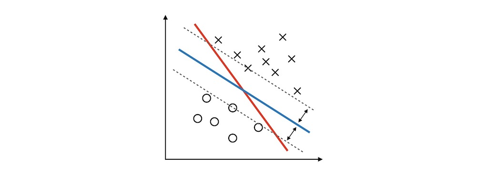

为了得到这样的决策边界，我们首先来看看如何用数学方式表达这个问题

通过一些简单的 **计算几何** 知识可以计算出每个样本到 **决策边界** 的距离（ **geometric margin** ），$\gamma^{(i)}$

为了方便之后的推导，还需要定义一个 **functional margin**，$\hat\gamma^{(i)}$ 

$$
\begin{aligned}
\hat\gamma^{(i)} &= y^{(i)} \left( \omega^\mathrm{T}x^{(i)} + b \right) \\
\gamma^{(i)} &= y^{(i)} \left( 
\left( \frac{\omega}{\Vert\omega\Vert} \right) ^ \mathrm{T} x^{(i)}
    + \frac{b}{\Vert\omega\Vert} \right)
\end{aligned}
$$

在接下来的 **SVM** 讨论中，我们约定 $y^{(i)}$ 的取值为 $\{1,-1\}$ （表示在决策边界的某一侧，这样使得距离的计算都是正值 ），当 $\omega^\mathrm{T}x + b \geq 0$ 时取 $1$ ，当 $\omega^\mathrm{T}x + b \leq 0$ 时取 $-1$  

同时还需要定义 $\hat\gamma$ 为所有 $\hat\gamma^{(i)}$ 中最小的值， $\gamma$ 为所有 $\gamma^{(i)}$ 中最小的值

$$
\gamma=\min\limits_{i=1,2,\cdots,N}\gamma^{(i)}
$$

于是要求离所有样本都比较远的决策边界问题就成为了在给定约束条件下求最值的问题

$$
\begin{aligned}
\max\limits_{\omega,\;b}\quad & \gamma \\
s.t.\quad &  y^{(i)}(\omega^\mathrm{T}x^{(i)}+b) \geq \gamma, \quad i=1,\cdots,m \\
& \Vert\omega\Vert = 1. 
\end{aligned}
$$

然而上面的问题还不是一个直接可解的 [**优化问题**](https://en.wikipedia.org/wiki/Optimization_problem)，需要对它进行转化（ 思路是把它转化为标准的 **凸优化问题** ），首先我们用 **functional margin** 来替换 **geometric margin**，原问题变为

$$
\begin{aligned}
\max\limits_{\omega,\;b}\quad & \frac{\hat\gamma}{\Vert\omega\Vert} \\
s.t. \quad & y^{(i)}(\omega^\mathrm{T}x^{(i)}+b) \geq \hat\gamma, \quad i=1,\cdots,m \\
\end{aligned}
$$

这个问题的解和原先的相同，不同点是在这个问题里，我们可以对 $\omega,b$ 随意加倍而不用考虑 $\Vert\omega\Vert$ 的大小了

为了剔除 $\hat\gamma$ 项的干扰，我们适当地选取 $\omega,b$ 的倍数使得 $\hat\gamma=1$ ，再加上最大化 $\frac{1}{\Vert\omega\Vert}$ 相当于最小化 $\Vert\omega\Vert^2$ ，于是 **优化问题** 的最终形式可以化为

$$
\begin{aligned}
\min\limits_{\omega,\;b}\quad & \frac12\Vert\omega\Vert^2 \\
s.t. \quad & y^{(i)}(\omega^\mathrm{T}x^{(i)}+b) \geq 1, \quad i=1,\cdots,m \\
\end{aligned}
$$

对于这样的问题，已经可以用已知的 **优化问题** 算法来解决

考虑前述的 **拉格朗日对偶**，对于 **SVM**，我们继续考察一个与之相对应的问题

### Dual Problem

通过 **拉格朗日对偶** 我们了解到之前的最大间距问题有一个与它对应的 **对偶** 问题

接下去我们就通过 **拉格朗日对偶** 来得到这个问题，对于之前的问题令

$$
g_i(\omega)=-y^{(i)}(\omega^\mathrm{T}x^{(i)}+b)+1 \leq 0
$$

并设 **拉格朗日函数** 为

$$
\begin{aligned}
\mathcal{L}(\omega,b,\alpha) = \frac12\Vert\omega\Vert^2
    - \sum\limits_{i=1}^m\alpha_i \left[y^{(i)}(\omega^\mathrm{T}x^{(i)}+b) - 1 \right]
\qquad s.t. \; \alpha \geq 0
\end{aligned}
$$

根据对偶问题的定义，我们先对于 $\omega,b$ 求 $\mathcal{L}(\omega,b,\alpha)$ 的最小值，也就是分别对 $\omega$ 和 $b$ 进行求导得到

$$
\begin{cases}
\frac{\partial}{\partial \omega}\mathcal{L}(\omega,b,\alpha) =
	\omega - \sum\limits_{i=1}^m\alpha_iy^{(i)}x^{(i)} \\
\frac{\partial}{\partial b}\mathcal{L}(\omega,b,\alpha) =
	\sum\limits_{i=1}^m\alpha_iy^{(i)}
\end{cases}
$$

令偏导为 $0$ ，可得

$$
\begin{cases}
\omega = \sum\limits_{i=1}^m\alpha_iy^{(i)}x^{(i)} \\
\sum\limits_{i=1}^m\alpha_iy^{(i)} = 0
\end{cases}
$$

将 $w$ 带入 $\mathcal{L}(\omega,b,\alpha)$ 得到

$$
\begin{aligned}
\mathcal{L}(\omega,b,\alpha) 
= & +\frac12 \left[ \sum\limits_{i=1}^m\alpha_iy^{(i)} \boldsymbol x^{(i)} \right] ^\mathrm{T}
	\left[ \sum\limits_{j=1}^m\alpha_j y^{(j)} \boldsymbol x^{(j)} \right] \\
& -\sum\limits_{i=1}^m
	\alpha_i \left\{ y^{(i)} \left[ \left(
		\sum\limits_{j=1}^m\alpha_j y^{(j)} \boldsymbol x^{(j)} \right)
		^\mathrm{T} \boldsymbol x^{(i)} \right] \right\} 
	-b\sum\limits_{i=1}^m\alpha_iy^{(i)} + \sum\limits_{i=1}^m\alpha_i \\
\end{aligned}
$$

为了便于理解，上式的 $x$ 被向量式显示为 $\boldsymbol x$，由于

$$
\sum\limits_{i=1}^m\alpha_iy^{(i)} = 0
$$

所以 $\mathcal{L}(\omega,b,\alpha)$ 可化简为

$$
\mathcal{L}(\omega,b,\alpha) 
= \sum\limits_{i=1}^m\alpha_i 
 -\frac12\sum\limits_{i,j=1}^m y^{(i)} y^{(j)} \alpha_i\alpha_j
 \left[ x^{(i)} \right] ^\mathrm{T} x^{(j)}
$$

再加上 $\alpha \geq 0$ 与 $\sum\limits_{i=1}^m\alpha_iy^{(i)} = 0$ 的约束条件，我们得到了最终的 **对偶** 问题

$$
\begin{aligned}
\max\limits_\alpha \quad & W(\alpha)=
	\sum\limits_{i=1}^m\alpha_i-\frac12\sum\limits_{i,j=1}^m y^{(i)} y^{(j)} \alpha_i\alpha_j
 	\color{red}{\left\langle x^{(i)},x^{(j)} \right\rangle } \\
s.t.\quad & \alpha_i\geq0, \qquad i=1,\cdots,m \\
& \sum\limits_{i=1}^m\alpha_iy^{(i)} = 0
\end{aligned}
$$

红色正是最重要的部分（ 尖括号表示内积 ），它使得我们可以运用 **核函数** 的技巧来降低计算的复杂度，特别是需要将特征映射到很高维甚至是无限维的情况

### Kernel Function

#### Polynomial Regression

在 **线性模型** 中，对于

$$
h_\theta (x)=\theta_0+\theta_1x_1+\cdots +\theta_n x_n
$$

如果这里不仅仅只有 $x$ 的一次方项，比如增加二次方，那么模型就变成了 **多项式回归**

这里写一个只有两个特征的 $p$ 次方多项式回归的模型

$$
h_\theta (x)=\theta_0+\theta_1x_1+\theta_2 x_2
    +\theta_3 x_1^2 +\theta_4 x_2^2 +\theta_5 x_1x_2
$$

令

$$
x_0=1,\ x_1=x_1,\ x_2=x_2,\ x_3=x_1^2,\ x_4=x_2^2,\ x_5=x_1x_2
$$

这样我们就得到了下式

$$
h_\theta(x_1, x_2) = \theta_0+\theta_1x_1+\theta_2 x_2
    +\theta_3 x_3 +\theta_4 x_4 +\theta_5 x_5
$$

可以发现，对于二维的不是线性的数据，我们将其映射到了五维以后，就变成了线性的数据，然后套用线性回归，达到了最终对非线性分类的目的，对于每个二元样本特征 $(x_1,x_2)$，我们得到一个五元样本特征 $(1,x_1,x_2,x_1^2,x_2^2,x_1x_2)$，通过这个改进的五元样本特征，我们重新把不是线性回归的函数变回线性回归

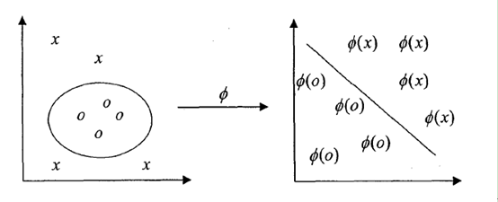

#### Kernel Function Principle

核函数的原理和多项式的原理如出一辙，也就是说对于在低维线性不可分的数据，在映射到了高维以后，就变成线性可分的了，也就是说，对于 SVM 线性不可分的低维特征数据，我们可以将其映射到高维，就能线性可分

假如是一个 $2$ 维特征的数据，我们可以将其映射到 $5$ 维来做特征的内积，如果原始空间是 $3$ 维，可以映射到到 $18$ 维空间，似乎还可以处理，但是如果我们的低维特征是 $100$ 个维度，$1000$ 个维度呢？那么我们要将其映射到超级高的维度来计算特征的内积，这时候映射成的高维维度是爆炸性增长的，这个计算量实在是太大了，而且如果遇到无穷维的情况，就根本无从计算了

假设每个样本有三个特征 $x_1,x_2,x_3$ ，通常需要把它们映射到更高维来拟合更复杂的函数，假设 **映射函数** 为

$$
\phi = \left[
\begin{matrix}
x_1x_1 \\ x_1x_2 \\ x_1x_3 \\
x_2x_1 \\ x_2x_2 \\ x_2x_3 \\
x_3x_1 \\ x_3x_2 \\ x_3x_3 \\
\end{matrix}
\right]
$$

在映射后两个不同样本间的内积为

$$
\begin{aligned}
\left\langle \phi(x),\phi(y) \right\rangle 
&= \sum\limits_{i,j=1}^3 (x_ix_j)(z_iz_j) \\
&= \sum\limits_{i=1}^3\sum\limits_{j=1}^3 x_ix_jz_iz_j \\
&= \left(\sum\limits_{i=1}^3 x_iz_i \right) \left( \sum\limits_{i=1}^3 x_jz_j \right) \\
&= \left( x^\mathrm{T}z \right)^2
\end{aligned}
$$

不难发觉映射后 $9$ 个特征之间的内积就等于原先 $3$ 个特征间的内积的平方

其实等式最后的 $(x^\mathrm{T}z)^2$ 就是 **核函数** 中的一种，对于有 $n$ 个特征的情况 **核函数** $K(x,z)=(x^\mathrm{T}z)^2$ 的计算值等于特征映射为 $n^2$ 个时的内积值，对于原本需要计算 $n^2$ 次的内积，通过 **核函数** 只需要计算 $n$ 次

更一般的，**核函数** 

$$
K(x,z)=(x^\mathrm{T}z+c)^d=\left\langle \phi(x),\phi(z) \right\rangle
$$

相当于把特征映射到 $\binom {n+d}{d}$ 维

至此，我们总结下线性不可分时核函数的引入过程

常用做法是把样例特征映射到高维空间中去，但是遇到线性不可分的样例，一律映射到高维空间，那么这个维度大小是会高到令人恐怖的，此时，核函数就体现出它的价值了，它虽然也是将特征进行从低维到高维的转换，但核函数在低维上进行计算，而将实质上的分类效果（利用了内积）表现在了高维上，这样避免了直接在高维空间中的复杂计算，真正解决了 SVM 线性不可分的问题

#### Introduction of Kernel Functions

- **线性核函数**（Linear Kernel）其实就是我们前两篇的线性可分 SVM ，也就是说，线性可分 SVM 我们可以和线性不可分 SVM 归为一类，区别仅仅在于线性可分 SVM 用的是线性核函数

    $$
    K(x,z)=\langle x,z \rangle
    $$

- **多项式核函数**（Polynomial Kernel）是线性不可分 SVM 常用的核函数之一

    $$
    K(x,z)=(\gamma x\cdot z + r)^d
    $$

- **高斯核函数**（Gaussian Kernel），在 SVM 中也称为 **径向基核函数**（Radial Basis Function, RBF），计算结果相当于把特征映射到无限维，它是非线性分类 SVM 最主流的核函数，`libsvm` 默认的核函数就是它

    $$
    K(x,z)=\exp \left(-\frac{\Vert x-z \Vert ^2}{2\sigma^2} \right)
    $$
  
- **Sigmoid 核函数**（Sigmoid Kernel）也是线性不可分 SVM 常用的核函数之一

    $$
    K(x,z)=tanh(\gamma x \cdot z+r)
    $$

所以现在可以理解 **核函数** 的意义了，由于在 **对偶问题** 中只涉及特征内积的计算，而 **核函数** 在低维计算的值等于特征映射到高维后的内积值，因此我们能够获得相当高效的方法来求解我们的问题

### SVM Regularization

我们对线性可分 SVM 的模型和损失函数优化做了总结，但是支持向量机会无法处理一些情况，比如在有 $\{0,1\}$ 两类，在 $0$ 类的中间出现了几个 $1$ 类的异常点，这样的话要之前最原始的 SVM 绝对分离两个类基本是不可能的了，这里对支持向量机做一个推广，允许超平面能够错分一些点，来达到能分离异常点

#### SVM Anomaly Problem

有时候本来数据的确是可分的，也就是说可以用线性分类 SVM 的学习方法来求解，但是却因为混入了异常点，导致不能线性可分，比如下图，本来数据是可以按下面的实线来做超平面分离的，可以由于一个橙色和一个蓝色的异常点导致我们没法按照原始线性支持向量机中的方法来分类

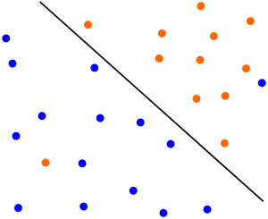

另外一种情况没有这么糟糕到不可分，但是会严重影响我们模型的泛化预测效果，比如下图，本来如果我们不考虑异常点，SVM 的超平面应该是下图中的红色线所示，但是由于有一个蓝色的异常点，导致我们学习到的超平面是下图中的粗虚线所示，这样会严重影响我们的分类模型预测效果


#### Maximizes Soft Separation of Linear SVM

为了解决数据集线性不可分的情况，我们在 SVM 对训练集里面的每个样本 $(x_i,y_i)$ 引入了一个松弛变量 $\xi_i  \geq 0$ ，使得间距可以比 $1$ 小，但相应的我们要在优化目标中加入一定的代价

$$
\begin{aligned}
\min\limits_{\omega,\;b}\quad 
& \frac12\Vert\omega\Vert^2 + C\sum\limits_{i=1}^m\xi_i \\
s.t. \quad & y^{(i)}(\omega^\mathrm{T}x^{(i)}+b) \geq 1-\xi_i, & i=1,\cdots,m \\
& \xi_i\geq0, & i=1,\cdots,m
\end{aligned}
$$

这里，$C>0$ 为惩罚参数，可以理解为我们一般回归和分类问题正则化时候的参数， $C$ **越大，对误分类的惩罚越大**，$C$ **越小，对误分类的惩罚越小** ，也就是说，我们希望 $\frac12\Vert\omega\Vert^2$ 尽量小，误分类的点尽可能的少，$C$ 是协调两者关系的正则化惩罚系数，在实际应用中，需要调参来选择

下面就来看看怎么对线性分类 SVM 的软间隔最大化来进行学习优化

我们将软间隔最大化的约束问题用拉格朗日函数转化为无约束问题公式如下

$$
\begin{aligned}
\mathcal{L}(\omega,b,\xi,\alpha,\mu) = \frac12\Vert\omega\Vert^2
    + C\sum\limits_{i=1}^m\xi_i 
    - \sum\limits_{i=1}^m\alpha_i[y^{(i)}(\omega^\mathrm{T}x^\mathrm{(i)}+b) - 1]
    - \sum\limits_{i=1}^m \mu_i\xi_i
\end{aligned}
$$

我们现在要优化的目标函数是

$$
\min\limits_{\omega,b,\xi}\max\limits_{\alpha_i\geq 0,\mu_i\geq 0}
\mathcal{L}(\omega,b,\xi,\alpha,\mu)
$$

这个优化目标也满足 **KKT** 条件，我们可以通过 **拉格朗日对偶** 将优化问题转化为等价的对偶问题来求解，如下

$$
\max\limits_{\alpha_i\geq 0,\mu_i\geq 0} \min\limits_{\omega,b,\xi}
\mathcal{L}(\omega,b,\xi,\alpha,\mu)
$$

最后求出的结果很干净，和之前的结果也非常像，也就是 **SMO** 算法所要解决的问题，如下

$$
\begin{aligned}
\max\limits_\alpha \quad & W(\alpha)=
	\sum\limits_{i=1}^m\alpha_i-\frac12\sum\limits_{i,j=1}^m y^{(i)} y^{(j)} \alpha_i\alpha_j
 	\color{red}{\left\langle x^{(i)},x^{(j)} \right\rangle } \\
s.t.\quad & 0 \leq \alpha_i \leq C, \qquad i=1,\cdots,m \\
& \sum\limits_{i=1}^m\alpha_iy^{(i)} = 0
\end{aligned}
$$

这就是软间隔最大化时的线性可分 SVM 的优化目标形式，我们仅仅是多了一个约束条件 $0 \leq \alpha_i \leq C$，依然可以通过 SMO 算法来求上式极小化时对应的 $\alpha$ 向量就可以求出 $\omega$ 和 $b$ 了

由对偶规划求得最优解 $\alpha^\star=(\alpha_1^\star,\alpha_2^\star,\dots,\alpha_N^\star)$ ，然后我们可以由 **KKT** 条件得到原始规划的最优解

$$
w^\star=\sum_{i=1}^{N}\alpha_i^\star y_i x_i
$$

选择 $\alpha^\star$ 一个分量满足条件 $0<\alpha_j^\star<C$ ，计算

$$
b^\star=y_j-\sum_{i=1}^N \alpha_i^\star y_i(x_i\cdot x_j)
$$

从而我们就得到了原始规划的最优解

这里需要注意的是，软间隔 SVM 的支持向量和硬间隔 SVM 的支持向量略有差别，硬间隔 SVM 的支持向量是位于边界上的向量，而软间隔 SVM 的支持向量或在间隔边界上，或在间隔边界与分离超平面之间，或在分离超平面误分一侧，具体说来

1. 若 $\alpha_i^\star<C$ ，则 $\xi_i=0$ ，支持向量落在边界上
1. 若 $\alpha_i^\star=C$ ，且 $0<\xi_i<1$ ，则分类正确，支持向量在间隔边界与分离超平面之间
1. 若 $\alpha_i^\star=C$ ，且 $\xi_i=1$ ，则支持向量在分离超平面上
1. 若 $\alpha_i^\star=C$ ，且 $\xi_i>1$ ，则支持向量在分离超平面误分一侧

## Kernelized Support Vector Machines

在线性模型中，我们已经提到了线性支持向量机，而 **核支持向量机** 是可以推广到更复杂模型的扩展，这些模型无法被输入空间的超平面定义，支持向量机可以同时用于分类 `SVC` 和回归 `SVR` 

### Linear Models and Nonlinear Features

线性模型在低维空间中可能非常受限，因为线和平面的灵活性有限，有一种方法可以让线性模型更加灵活，就是添加更多的特征，比如添加输入特征的交互项或多项式

```python
import mglearn
import matplotlib.pyplot as plt
from sklearn.datasets import make_blobs

X, y = make_blobs(centers=4, random_state=8)
y = y % 2

mglearn.discrete_scatter(X[:, 0], X[:, 1], y)
plt.xlabel("Feaature 0")
plt.ylabel("Feaature 1")
```

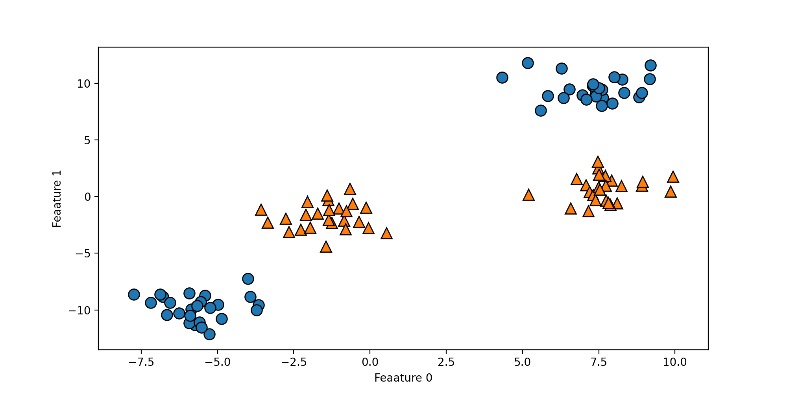

用于分类的线性模型只能用一条直线来划分数据点，对这个数据集无法给出较好的结果

```python
from sklearn.svm import LinearSVC

# Ignore Warnings
import warnings
warnings.filterwarnings("ignore", category=Warning)

linear_svm = LinearSVC().fit(X, y)
mglearn.plots.plot_2d_separator(linear_svm, X)
plt.scatter(X[:, 0], X[:, 1], c=y, s=60, cmap=mglearn.cm2)
plt.xlabel("feature1")
plt.ylabel("feature2")
```

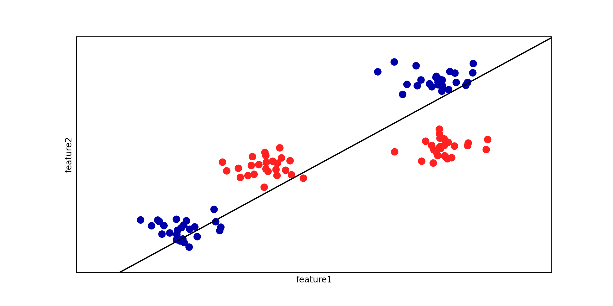

现在我们对输入特征进行扩展，比如说添加第二个特征的平方（`feature1 ** 2`）作为一个新特征，现在将每个数据点表示为三维点 `(feature0, feature1, feature1 ** 2)` ，而不是原先的二维点 `(feature0, feature1)`，画出新特征坐标下的三维散点图

```python
import numpy as np
from mpl_toolkits.mplot3d import Axes3D

X_new = np.hstack([X, X[:, 1:]**2])

figure = plt.figure(figsize=(10, 5))
# 3D 可视化
ax = Axes3D(figure, elev=-152, azim=-26)
# 首先画出所有 y==0 的点，然后画出所有 y==1 的点
mask = y == 0
ax.scatter(X_new[mask, 0], X_new[mask, 1], X_new[mask, 2], c='b', cmap=mglearn.cm2, s=60)
ax.scatter(X_new[~mask, 0], X_new[~mask, 1], X_new[~mask, 2], c='r', marker='^', cmap=mglearn.cm2, s=60)
ax.set_xlabel("feature0")
ax.set_ylabel("feature1")
ax.set_zlabel("feature1**2")
```

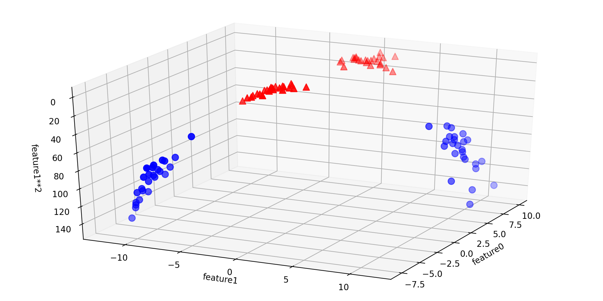

现在，对于新特征坐标下的数据展示，可以用线性模型（三维空间中的平面）将这两个类别分开，我们可以用线性模型拟合扩展后的数据来验证这一点

```python
# separate the 3D datasets with linear SVM
linear_svm_3d = LinearSVC().fit(X_new, y)
coef, intercept = linear_svm_3d.coef_.ravel(), linear_svm_3d.intercept_
# show linear decision boundary
figure = plt.figure(figsize=(10, 5))
ax = Axes3D(figure, elev=-152, azim=-26)
xx = np.linspace(X_new[:, 0].min(), X_new[:, 0].max(), 50)
yy = np.linspace(X_new[:, 1].min(), X_new[:, 1].max(), 50)
XX, YY = np.meshgrid(xx, yy)
ZZ = (coef[0] * XX + coef[1] * YY + intercept) / -coef[2]
ax.scatter(X_new[:, 0], X_new[:, 1], X_new[:, 2], c=y, cmap=mglearn.cm2, s=60)
ax.plot_surface(XX, YY, ZZ, rstride=8, cstride=8, alpha=0.3)
ax.set_xlabel("feature1")
ax.set_ylabel("feature2")
ax.set_zlabel("feature1 ** 2")
```

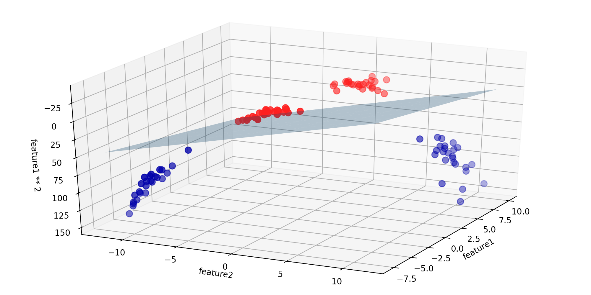

如果将线性模型 SVM 看作原始特征的函数，那么它实际上已经不是线性的了，在原始特征坐标系中，它不是一条直线，而是一个椭圆

```python
# show decision func
ZZ = YY ** 2
dec = linear_svm_3d.decision_function(np.c_[XX.ravel(), YY.ravel(), ZZ.ravel()])	# .c_ 按行连接
plt.contourf(XX, YY, dec.reshape(XX.shape), levels=[dec.min(), 0, dec.max()], cmap=mglearn.cm2, alpha=0.5)	# 绘制等高线
mglearn.discrete_scatter(X[:, 0], X[:, 1], y)
plt.xlabel("Feature 0")
plt.ylabel("Feature 1")
```

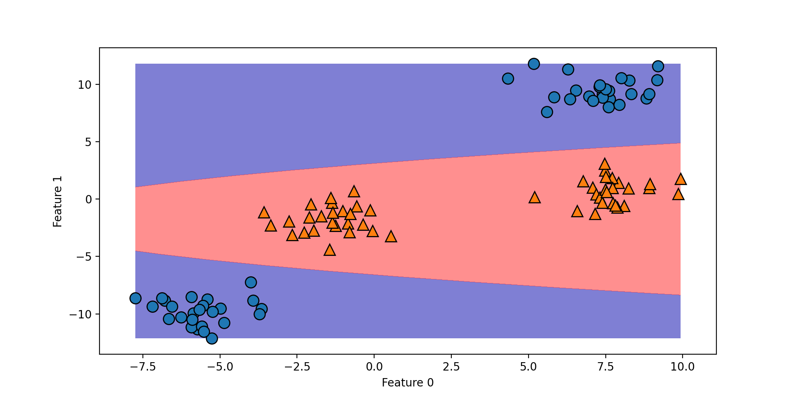

### The Kernel Trick

向数据表示中添加非线性特征，可以让线性模型变得更强大

但是，通常来说我们并不知道要添加哪些特征，而且正如我们前面理论部分所述，添加许多特征（比如 100 维特征空间所有可能的交互项）的计算开销可能很大，幸运的是，有一种巧妙的数学技巧，让我们可以在更高维空间中学习分类器，而不用实际计算可能非常大的新的数据表示，这种技巧叫作核技巧（kernel trick），它的原理是直接计算扩展特征表示表示中数据点之间的距离（更准确地说是内积），而不用对扩展进行计算

对于支持向量机的实际算法，将数据映射到更高维空间中有两种常用的方法

- 一种是多项式核，在一定阶数内计算原始特征所有可能的多项式（比如 `feature1 ** 2 ** feature2 ** 5`）
- 另一种是径向基函数（radial basis function, RBF）核，也叫高斯核，一种对高斯核的解释是它考虑所有阶数的所有可能的多项式，但阶数越高，特征的重要性越小

### Understanding SVMs

在训练过程中，SVM 学习每个训练数据点对于表示两个类别之间的决策边界的重要性，通常只有一部分训练数据点对于定义决策边界来说很重要，位于类别之间边界上的那些点，这些点叫做支持向量（support vector），支持向量机正是由此得名

想要对新样本点进行预测，需要测量它与每个支持向量之间的距离，分类决策是基于它与支持向量之间的距离以及在训练过程中学到的支持向量的重要性（保存在 `SVC` 的 `sual_coef_` 属性中）来做出的

数据点之间的距离有高斯核给出

$$
K_{rbf}(x_1,x_2)=exp(-\gamma \Vert x1-x2 \Vert ^2)
$$

这里 $x_1$ 和 $x_2$ 是数据点，$\Vert x1-x2 \Vert $ 表示欧式距离，$\gamma$ 是控制高斯核宽度的参数

如下是支持向量机对于一个二维二分类数据集的训练结果，决策边界用黑色表示，支持向量是尺寸较大的点

```python
from sklearn.svm import SVC

X, y = mglearn.tools.make_handcrafted_dataset()

svm = SVC(kernel='rbf', C=10, gamma=0.1).fit(X, y)
mglearn.plots.plot_2d_separator(svm, X, eps=.5)
mglearn.discrete_scatter(X[:, 0], X[:, 1], y)
# plot support vectors
sv = svm.support_vectors_
# class labels of support vectors are given by the sign of the dual coefficients
sv_labels = svm.dual_coef_.ravel() > 0
mglearn.discrete_scatter(sv[:, 0], sv[:, 1], sv_labels, s=15, markeredgewidth=3)
plt.xlabel("Feature 0")
plt.ylabel("Feature 1")
```

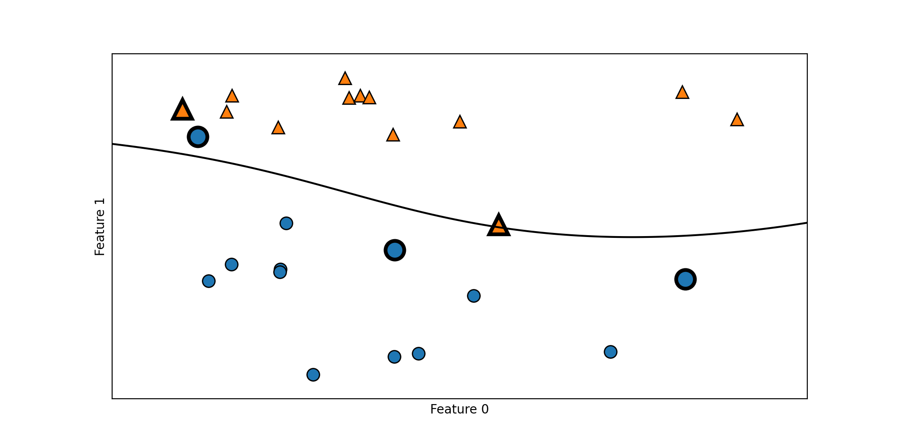

在这个例子中，SVM 给出了非常平滑且非线性（不是直线）的边界，这里我们调节了两个参数，`C` 参数和 `gamma` 参数，下面详细讨论这两个参数

### Tuning SVM Parameters

```python
fig, axes = plt.subplots(3, 3, figsize=(15, 10))

for ax, C in zip(axes, [-1, 0, 3]):
    for a, gamma in zip(ax, range(-1, 2)):
        mglearn.plots.plot_svm(log_C=C, log_gamma=gamma, ax=a)
        
axes[0, 0].legend(["class 0", "class 1", "sv class 0", "sv class 1"],
                  ncol=4, loc=(.9, 1.2))
```

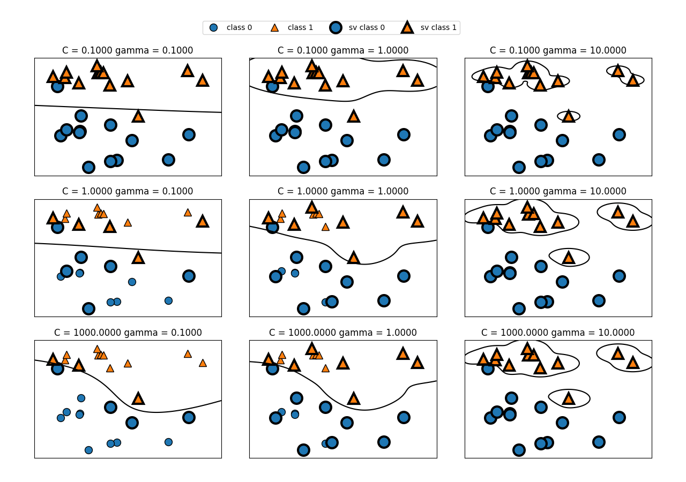

- 在例子中，SVM 给出了非常平滑且非线性的（不是直线）的边界，这里调节了两个参数， `C` 和 `gamma`
    - `gamma` 参数用于控制高斯核的宽度，它决定了点与点之间 “靠近” 是指多远的距离
    - `C` 参数是正则化参数，与线性模型中用到的类似，它限制每个点的重要性（或者确切地说，每个点的 `dual_coef_`）
- 从左到右，我们将参数 `gamma` 的值从 `0.1` 增加到 `10`
    - `gamma` 较小，说明高斯核的半径较大，许多点都被看做比较靠近
    - 这一点可以在图中看出，左侧的图决策边界非常平滑，越向右的图决策边界更关注单个点
    - 小的 `gamma` 值表示决策边界变化很慢，生成的是复杂度较低的模型，而大的 `gamma` 值则会生成更为复杂的模型。
- 从上到下，我们将参数 `C` 的值从 `0.1` 增加到 `1000`
    - 与线性模型相同，`C` 值很小，说明模型非常受限，每个数据点的影响范围都有限
    - 左上角的图中，决策边界看起来几乎是线性的，误分类的点对边界几乎没有任何影响
    - 左下角的图，增大 `C` 之后这些点对模型的影响变大，使得决策边界发生弯曲来将这些点正确分类

我们将 RBF 核 SVM 应用到乳腺癌数据集上，默认情况下，`C=1, gamma=1/n_features`

```python
from sklearn.model_selection import train_test_split
from sklearn.datasets import load_breast_cancer
from sklearn.svm import SVC

cancer = load_breast_cancer()
X_train, X_test, y_train, y_test = train_test_split(cancer.data, cancer.target, random_state=0)
svc = SVC()
svc.fit(X_train, y_train)

print("Accuracy on training set:{:.2f}".format(svc.score(X_train, y_train)))
print("Accuracy on test set:{:.2f}".format(svc.score(X_test, y_test)))
```

**Output**

```console
Accuracy on training set:0.90
Accuracy on test set:0.94
```

虽然 SVM 的表现通常都很好，但它对参数的设定和数据的缩放非常敏感，特别地，它要求所有特征都有相似的变化范围，我们来看一下每个特征的最小值和最大值，将它们绘制在对数坐标上

```python
plt.plot(X_train.min(axis=0), 'o', label='min')
plt.plot(X_train.max(axis=0), '^', label='max')
plt.legend(loc=4)
plt.xlabel("Feature Index")
plt.ylabel("Feature magnitude")
plt.yscale("log")
```

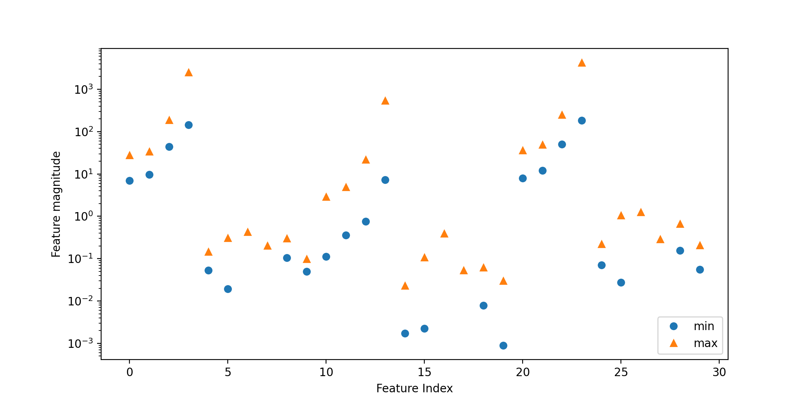

从上述图中，我们可以确定乳腺癌数据集的特征具有完全不同的数量级，这对其他模型来说（比如线性模型）可能是小问题，但对 SVM 却有极大影响，我们来研究处理这个问题的几种方法

### Preprocessing Data for SVMs

解决这个问题的一种方法是对每个特征进行缩放，使其大致都位于同一范围，核 SVM 常用的缩放方法就是将所有特征缩放到 $0$ 和 $1$ 之间

```python
from sklearn.model_selection import train_test_split
from sklearn.datasets import load_breast_cancer
from sklearn.svm import SVC

cancer = load_breast_cancer()
X_train, X_test, y_train, y_test = train_test_split(cancer.data, cancer.target, random_state=0)


# 计算训练集中每个特征的最小值
min_on_training = X_train.min(axis=0)
# 计算训练集中每个特征的范围（最大值-最小值）
range_on_training = (X_train-min_on_training).max(axis=0)
# 减去最小值，然后除以范围
# 这样每个特征都是 min=0 和 max=1
X_train_scaled = (X_train - min_on_training) / range_on_training
print("Minimum for each feature\n{}".format(X_train_scaled.min(axis=0)))
print("Maximum for each feature\n{}".format(X_train_scaled.max(axis=0)))

# 利用训练集的最小值和范围对测试集做相同的变换
X_test_scaled = (X_test-min_on_training)/range_on_training
svc = SVC()
svc.fit(X_train_scaled, y_train)

print("Accuracy on training set:{:.3f}".format(svc.score(X_train_scaled, y_train)))
print("Accuracy on test set:{:.3f}".format(svc.score(X_test_scaled, y_test)))
```

**Output**

```console
Minimum for each feature
[0. 0. 0. 0. 0. 0. 0. 0. 0. 0. 0. 0. 0. 0. 0. 0. 0. 0. 0. 0. 0. 0. 0. 0.
 0. 0. 0. 0. 0. 0.]
Maximum for each feature
[1. 1. 1. 1. 1. 1. 1. 1. 1. 1. 1. 1. 1. 1. 1. 1. 1. 1. 1. 1. 1. 1. 1. 1.
 1. 1. 1. 1. 1. 1.]
Accuracy on training set:0.984
Accuracy on test set:0.972
```

数据缩放的作用很大！我们可以尝试增大 `C` 或 `gamma` 来拟合更为复杂的模型，例如

```python
svc = SVC(C=1000)
svc.fit(X_train_scaled, y_train)

print("Accuracy on training set:{:.3f}".format(svc.score(X_train_scaled, y_train)))
print("Accuracy on test set:{:.3f}".format(svc.score(X_test_scaled, y_test)))
```

**Output**

```console
Accuracy on training set:1.000
Accuracy on test set:0.958
```

### Strengths, Weaknesses and Parameters

核支持向量机是非常强大的模型，在各种数据集上的表现都很好

即使数据只有几个特征， SVM 也允许决策边界很复杂，它在低维数据和高维数据（即很少特征和很多特征）上的表现都很好

但 SVM 对样本个数的缩放表现不好，在多达 10000 个样本的数据上运行 SVM 可能表现良好，但如果数据量达到 100000 甚至更大，在运行时间和内存使用方面可能会面临挑战

SVM 的另一个缺点是，预处理数据和调参都需要非常小心，这也是为什么如今很多应用的都是基于树的模型，比如随机森林或梯度提升（需要很少的预处理，甚至不需要预处理），此外，SVM 模型很难检查，可能很难理解为什么会这么预测，而且也难以将模型向非专家进行解释

不过当所有特征的测量单位相似（比如都是像素密度）而且范围也差不多时，SVM 是非常值得尝试的

核 SVM 的主要参数是正则化参数 `C`、核的选择与核相关的参数，RBF 核只有一个参数 `gamma`，它是高斯核宽度的倒数，`gamma` 和 `C` 控制的都是模型复杂度，较大的值都对应更为复杂的模型，因此，这两个参数的设定通常是强烈相关的，应该同时调节
