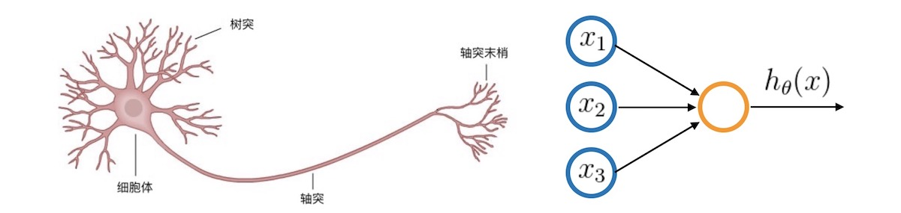
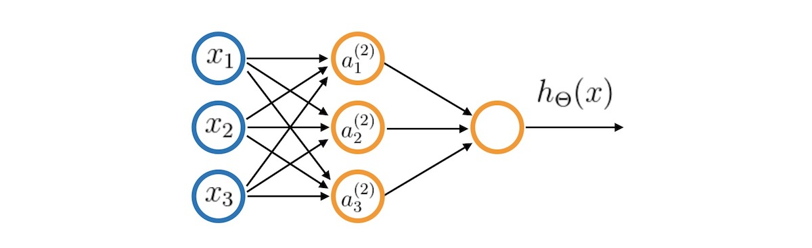
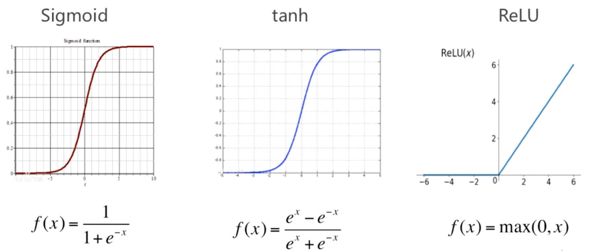
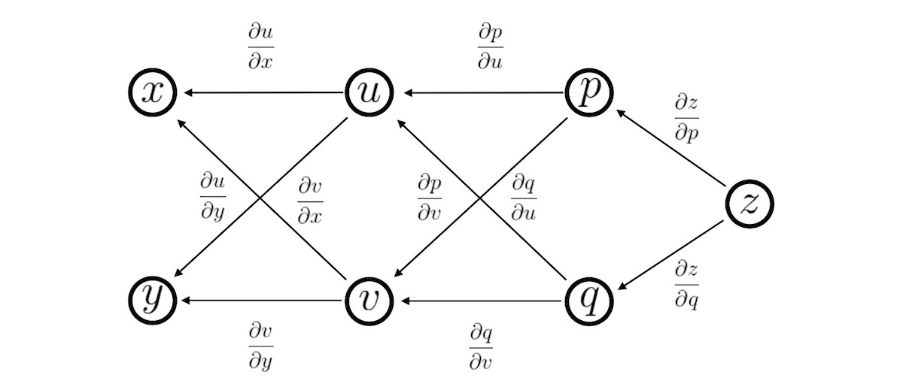

# Neural Network

## Introduction of Neural Network

神经网络是一种很古老的算法，这个算法诞生的目的是为了模拟大脑的算法从而建造智能机器

这个想法产生的原因是神经科学的研究表明大脑并非对不同的信号采取不同的处理方式（ 不同的算法 ），而是使用同一种来应对不同的信号（ 视觉、听觉等 ），这极大地激发了研究人员对寻找这种算法的热情，虽然期间由于各种技术问题（ 没有有效的训练算法和硬件速度限制 ）消声觅迹了一段时间，但最终凭借 **反向传播**、**共享权值**、**GPU 加速** 等技术重现光辉，并成为现代机器学习技术中最有效的方法之一

### Mathematical Representation

我们把单个 **神经元** 抽象为一个 **逻辑单元** ，$x_0,\;x_1,\;x_2,\;x_3$ 为 **树突** 传入的信号（ $x_0$ 为偏置，图中没有画出 ），激活 **神经元** 后从 **轴突** 输出 $h_\theta (x)$

**逻辑单元** 可以使用数学符号表示为如下形式

$$
h_\theta=\frac{1}{1+e^{-\theta^\mathrm{T}x}} \qquad 
x=\left[
\begin{matrix}
x_0 \\ x_1 \\ x_2 \\ x_3
\end{matrix}
\right] \qquad
\theta=\left[
\begin{matrix}
\theta_0 \\ \theta_1 \\ \theta_2 \\ \theta_3
\end{matrix}
\right]
$$

单个 **神经元** 的能力非常有限，而 **神经网络** 强大的地方在于将这些 **神经元** 连接在一起共同工作（ 类似于大脑中神经元的工作方式 ）， **神经网络** 的表示如下

上图是含有一层 **隐含层** 的神经网络，输入单元 $x_0,\;x_1,\;x_2,\;x_3$ 将值传给 **隐含层**（ 每个输入单元传入的 **权值** 是不同的 ），然后 **隐含层** 将输出值再传给输出层的 **神经元** ，用数学语言表达就是

$$
\left[
\begin{matrix}
a_1^{(2)} \\ a_2^{(2)} \\a_3^{(2)}
\end{matrix}
\right]
=g\left(\left[
\begin{matrix}
z_1^{(2)} \\ z_2^{(2)} \\z_3^{(2)}
\end{matrix}
\right]\right)
=g\left(
\left[
\begin{matrix}
\Theta_{10}^{(1)} & \Theta_{11}^{(1)} & \Theta_{12}^{(1)} & \Theta_{13}^{(1)} \\
\Theta_{20}^{(1)} & \Theta_{21}^{(1)} & \Theta_{22}^{(1)} & \Theta_{23}^{(1)} \\
\Theta_{30}^{(1)} & \Theta_{31}^{(1)} & \Theta_{32}^{(1)} & \Theta_{33}^{(1)} \\
\end{matrix}
\right]
\left[\begin{matrix}
x_0 \\ x_1 \\ x_2 \\ x_3
\end{matrix}\right]
\right)
$$

$$
h_\Theta(x)=a_1^{(3)}=g(z_1^{(3)})
=g(\Theta_{10}^{(2)}a_0^{(2)}+\Theta_{11}^{(2)}a_1^{(2)}
+\Theta_{12}^{(2)}a_2^{(2)}+\Theta_{13}^{(2)}a_3^{(2)})
$$

式中

- $g(z)$ 为 **激活函数**，常用的是 **逻辑回归** 中提到的 **Sigmoid** 函数
- $z$ 为中间变量，上一层激活函数值的加权和
- $a_0^{(2)}=1$ 为偏置
- $h_\Theta(x)$ 由于输出层只有一个元素，为了美观没有写为矩阵形式

图中输出层只有一个 **逻辑单元**，但实际可以有多个

### Activation Function

激活函数的作用是提供规模化的非线性化能力

- **Sigmoid** 变化区间 $[0,1]$，优点是全自变量域内可导，缺点是非中心对称
- **tanh** 是 Sigmoid 对于中心对称的改良版，但两者同样存在缺点，输入绝对值较大时，变化平缓
- **ReLU** 非正端存在问题，改进版是 Leaky ReLU

### Expressive Ability

**监督学习** 的目的就是为了使用算法获得问题的 **预测函数**，所以一个 **预测函数** 能够表达的函数越多，应用就能够更广泛，实际上，使用 **逻辑单元** 可以来组成数字电路中的 **逻辑门**，而我们又知道 **逻辑门** 是计算机计算的基础，它们的组合可以表达一切可以计算的函数，所以从某种直觉上来说 **神经网络** 能够表达的东西是非常多的

## Reverse Propagation Process

### Loss Function

假设我们的多分类问题有 $K$ 个分类，神经网络共有 $L$ 层，第 $l$ 层的神经元个数为 $S_l$

那么神经网络的 **损失函数** 为
$$
J(\Theta)=-\frac1m\sum\limits_{i=1}^m\sum\limits_{k=1}^K
\left(
y_k^{(i)}log(h_\Theta(x^{(i)}))_k
+(1-y_k^{(i)})log(1-(h_\Theta(x^{(i)}))_k)
\right)
+\frac{\lambda}{2m}\sum\limits_{l=1}^{L-1}\sum\limits_{i=1}^{S_l}\sum\limits_{j=1}^{S_{l+1}}
(\Theta_{ji}^{(l)})^2
$$
其中的第二项为 **正则化** 项，是网络中所有权值的平方和

第一项与逻辑回归中的 **损失函数** 类似，但这里我们需要累加所有输出神经元的误差

这个看起来复杂很多的代价函数背后的思想还是一样的，我们希望通过代价函数来观察算法预测的结果与真实情况的误差有多大，唯一不同的是，对于每一行特征，我们都会给出 $K$ 个预测，基本上我们可以利用循环，对每一行特征都预测 $K$ 个不同结果，然后在利用循环在 $K$ 个预测中选择可能性最高的一个，将其与 $y$ 中的实际数据进行比较

正则化的那一项只是排除了每一层 $\theta_0$ 后，每一层的 $\theta$ 矩阵的和，最里层的循环 $j$ 循环所有的行（由 $l+1$ 层的激活单元数 $s_{l+1}$ 决定），循环 $i$ 则循环所有的列，由 $s_l$ 层的激活单元数 $s_l$  所决定，即 $h_\theta(x)$ 与真实值之间的距离为每个样本-每个类输出的加和，对参数进行 **regularization** 的 **bias** 项处理所有参数的平方和

### Gradient Calculation

为了能够使用 **梯度下降** 算法来训练网络，我们需要计算代价函数的梯度

一种很直观的方法就是使用数值计算，对于某个 $\Theta_{ij} $ ，给它加上减去一个很小的量 $\epsilon$ 来计算梯度：
$$
\frac{\partial J(\theta)}{\partial\theta_j} \approx 
\frac{J(\theta_1,\cdots,\theta_j+\epsilon,\cdots,\theta_n)
-J(\theta_1,\cdots,\theta_j-\epsilon,\cdots,\theta_n)}{2\epsilon}
$$
但分析一下算法的复杂度就能知道，这样的方法十分缓慢，对于每一组数据，我们需要计算所有权值的梯度

**总的计算次数** = **训练数据个数** $\times$ **网络权值个数** $\times$ **前向传播计算次数** 

在通常情况下这样的复杂度是无法接受的，所以我们仅使用这个方法来验证 **反向传播** 算法计算的梯度是否正确

### The Law of Chains

为了能够理解之后对于 **反向传播** 公式的推导，我们首先要回顾一下关于多元复合函数求导的 **链式法则**，对于多元函数 $z=f(u,v)$ ，其中 $u=h(x,y)$，$v=g(x,y)$，那么

$$
\begin{aligned}
\frac{\partial z}{\partial x}=
 \frac{\partial z}{\partial u}\frac{\partial u}{\partial x}
 +\frac{\partial z}{\partial v}\frac{\partial v}{\partial x} \\
\frac{\partial z}{\partial y}=
 \frac{\partial z}{\partial u}\frac{\partial u}{\partial y}
 +\frac{\partial z}{\partial v}\frac{\partial v}{\partial y}
 \end{aligned}
$$

**链式法则** 告诉我们有多个层次的多元复合函数，下一层次的导数可以由上一层次推得

即使再多加了一层，情况也是类似，这里 $p$ 是 $u,v$ 的函数，$q$ 是 $u,v$ 的函数，$z$ 是 $p,q$ 的函数

对于要计算的 $\frac{\partial z}{\partial x}$ 与 $\frac{\partial z}{\partial y}$，上式仍成立，原因是我们可以把 $z$ 看作 $u,v$ 的函数，这相当于我们把

$$
\frac{\partial z}{\partial x}=
 \frac{\partial z}{\partial p}\frac{\partial p}{\partial u}\frac{\partial u}{\partial x}
 +\frac{\partial z}{\partial p}\frac{\partial p}{\partial v}\frac{\partial v}{\partial x}
 +\frac{\partial z}{\partial q}\frac{\partial q}{\partial u}\frac{\partial u}{\partial x}
 +\frac{\partial z}{\partial q}\frac{\partial q}{\partial v}\frac{\partial v}{\partial x}
$$

简化为了只与上一层相关，利用上一层计算完成的结果 $\frac{\partial z}{\partial u}$  和 $\frac{\partial z}{\partial v}$  而不用从头算起

$$
\frac{\partial z}{\partial x}=
 \frac{\partial z}{\partial u}\frac{\partial u}{\partial x}
 +\frac{\partial z}{\partial v}\frac{\partial v}{\partial x}
$$

一般的，对于函数 $y$，如果它能看做 $z_1,z_2⋯,z_n$ 的函数，而 $z_i$ 为 $t$ 的函数，则

$$
\frac{\partial y}{\partial t} = \sum\limits_{i=1}^{n}
\frac{\partial y}{\partial z_i}\frac{\partial z_i}{\partial t}
$$

神经网络就是一个层次很多的多元函数，我们可以隐约从 **链式法则** 中感觉到反向传播的意味

### Derivation of a Formula

为了施展 **反向传播** 的魔法，我们首要要引入一个中间变量 $ \delta$ ，定义为

$$
\delta_j^l=\frac{\partial J}{\partial z_j^l}
$$

其中 $l$ 表示第 $l$ 层，$j$ 表示第 $l$ 层的第 $j$ 个神经元，$z$ 为中间变量（ 为了让式子看上去更清晰，**反向传播** 中的公式上标不使用括号 ），$δ$ 被称为第 $l$ 层第 $j$ 个神经元的误差，**反向传播** 就是先计算每一层每个神经元的误差，然后通过误差来得到梯度的

首先来看输出层的误差

$$
\delta_j^L=\frac{\partial J}{\partial z_j^L}
$$

对它使用 **链式法则** 得到

$$
\delta_j^l=\sum\limits_{k=1}^K
\frac{\partial J}{\partial a_k^L}\frac{\partial a_k^L}{\partial z_j^L}
$$

注意 $a_j^L = g(z_j^L)$ ，所以上式只有当 $k=j$ 时，右边部分才不为 $0$ ，所以

$$
\delta_j^L=\frac{\partial J}{\partial a_j^L}\frac{a_j^L}{\partial z_j^L}
=\frac{\partial J}{\partial a_j^L}g'(z_j^L)=a_j^L-y_j^L
\tag{1}
$$

对于其它层的误差

$$
\delta_j^l=\frac{\partial J}{\partial z_j^l}
$$

使用 **链式法则**

$$
\delta_j^l=\sum_{k=1}^{S_{l+1}}
 \frac{\partial J}{\partial z_k^{l+1}}\frac{\partial z_k^{l+1}}{\partial z_j^l}
 =\sum_{k=1}^{S_{l+1}}\delta_k^{l+1}\frac{\partial z_k^{l+1}}{\partial z_j^l}
$$

而其中

$$
z_k^{l+1}=\sum\limits_{p=1}^{S_l}\Theta_{kp}^lg(z_p^l)+b_k^l
$$

求偏导得

$$
\frac{\partial z_k^{l+1}}{\partial z_j^l}=\Theta_{kj}^lg'(z_j^l)
$$

并且由于 $g'(x) = g(x)\left( 1-g(x) \right)$， 所以

$$
\delta_j^l=\sum_{k=1}^{S_{l+1}}\Theta_{kj}^l\delta_k^{l+1}g'(z_j^l)
=\sum_{k=1}^{S_{l+1}}\Theta_{kj}^l\delta_k^{l+1}a_j^l(1-a_j^l)
\tag{2}
$$

最后同样使用 **链式法则** 来计算

$$
\frac{\partial J}{\partial \Theta_{ij}^l}=\sum\limits_{k=1}^{S_{l+1}}
\frac{\partial J}{\partial z_k^{l+1}}\frac{\partial z_k^{l+1}}{\partial\Theta_{ij}^l}
=\sum\limits_{k=1}^{S_l}\delta_k^{l+1}\frac{\partial z_k^{l+1}}{\partial\Theta_{ij}^l}
$$

由于

$$
z_k^{l+1}=\sum\limits_{p=1}^{S_l}\Theta_{kp}^lg(z_p^l)+b_k^l
$$

只有当 $k=i,\;p=j$ 时留下一项

$$
\frac{\partial J}{\partial \Theta_{ij}^l}=g(z_j^l)\delta_i^{l+1}=a_j^l\delta_i^{l+1}
\tag{3}
$$

### Reverse Propagation Algorithm

有了 $(1)(2)(3)$ 式，就可以来完成 **反向传播** 算法了，**注意** 刚才所推导的式子都是针对一组训练数据而言的

#### Algorithm Steps
 
> 1. 对于所有的 $l,\ i,\ j$ 初始化 $\Delta_{ij}^l=0$
> 1. 对于 $m$ 组训练数据， $k$ 从 $1$ 取到 $m$ 
> 
>    - 令 $a^1=x^{(k)}$
>    - 前向传播，计算各层激活向量 $a^l$
>     - 使用 $(1)$ 式，计算输出层误差 $\delta_L$
>     - 使用 $(2)$ 式，计算其它层误差 $\delta^{L−1},\delta^{L−2},\cdots,\delta^2$
>     - 使用 $(3)$ 式，累加 $\delta_{ij}^l$， $\delta_{ij}^l:=\delta_{ij}^l+a_j^l\delta_i^{l+1}$
> 1. 计算梯度矩阵
>   
>     $$
>     D_{ij}^l=
>     \begin{cases}
>     \frac1m\Delta_{ij}^l+\frac\lambda m\Theta_{ij}^l & if\;j\neq0 \\
>     \frac1m\Delta_{ij}^l &if\;j=0
>     \end{cases}
>     $$
> 
> 1. 更新权值 $\Theta^l:=\Theta^l+\alpha D^l$

#### Initialization Weight

对于神经网络，不能像之前那样使用相同的 $0$ 值来初始化，这会导致每层的 **逻辑单元** 都相同，因此我们使用随机化的初始化方法，使得

$$
-\delta\leq\Theta_{ij}^l\leq\delta
$$