# Neural Network

## Introduction of Neural Network

神经网络是一种很古老的算法，这个算法诞生的目的是为了模拟大脑的算法从而建造智能机器

这个想法产生的原因是神经科学的研究表明大脑并非对不同的信号采取不同的处理方式（ 不同的算法 ），而是使用同一种来应对不同的信号（ 视觉、听觉等 ），这极大地激发了研究人员对寻找这种算法的热情，虽然期间由于各种技术问题（ 没有有效的训练算法和硬件速度限制 ）消声觅迹了一段时间，但最终凭借 **反向传播**、**共享权值**、**GPU 加速** 等技术重现光辉，并成为现代机器学习技术中最有效的方法之一

### Mathematical Representation

我们把单个 **神经元** 抽象为一个 **逻辑单元** ，$x_0,\;x_1,\;x_2,\;x_3$ 为 **树突** 传入的信号（ $x_0$ 为偏置，图中没有画出 ），激活 **神经元** 后从 **轴突** 输出 $h_\theta (x)$


**逻辑单元** 可以使用数学符号表示为如下形式

$$
h_\theta=\frac{1}{1+e^{-\theta^\mathrm{T}x}} \qquad 
x=\left[
\begin{matrix}
x_0 \\ x_1 \\ x_2 \\ x_3
\end{matrix}
\right] \qquad
\theta=\left[
\begin{matrix}
\theta_0 \\ \theta_1 \\ \theta_2 \\ \theta_3
\end{matrix}
\right]
$$

单个 **神经元** 的能力非常有限，而 **神经网络** 强大的地方在于将这些 **神经元** 连接在一起共同工作（ 类似于大脑中神经元的工作方式 ）， **神经网络** 的表示如下


上图是含有一层 **隐含层** 的神经网络，输入单元 $x_0,\;x_1,\;x_2,\;x_3$ 将值传给 **隐含层**（ 每个输入单元传入的 **权值** 是不同的 ），然后 **隐含层** 将输出值再传给输出层的 **神经元** ，用数学语言表达就是

$$
\left[
\begin{matrix}
a_1^{(2)} \\ a_2^{(2)} \\a_3^{(2)}
\end{matrix}
\right]
=g\left(\left[
\begin{matrix}
z_1^{(2)} \\ z_2^{(2)} \\z_3^{(2)}
\end{matrix}
\right]\right)
=g\left(
\left[
\begin{matrix}
\Theta_{10}^{(1)} & \Theta_{11}^{(1)} & \Theta_{12}^{(1)} & \Theta_{13}^{(1)} \\
\Theta_{20}^{(1)} & \Theta_{21}^{(1)} & \Theta_{22}^{(1)} & \Theta_{23}^{(1)} \\
\Theta_{30}^{(1)} & \Theta_{31}^{(1)} & \Theta_{32}^{(1)} & \Theta_{33}^{(1)} \\
\end{matrix}
\right]
\left[\begin{matrix}
x_0 \\ x_1 \\ x_2 \\ x_3
\end{matrix}\right]
\right)
$$

$$
h_\Theta(x)=a_1^{(3)}=g(z_1^{(3)})
=g(\Theta_{10}^{(2)}a_0^{(2)}+\Theta_{11}^{(2)}a_1^{(2)}
+\Theta_{12}^{(2)}a_2^{(2)}+\Theta_{13}^{(2)}a_3^{(2)})
$$

式中

- $g(z)$ 为 **激活函数**，常用的是 **逻辑回归** 中提到的 **Sigmoid** 函数
- $z$ 为中间变量，上一层激活函数值的加权和
- $a_0^{(2)}=1$ 为偏置
- $h_\Theta(x)$ 由于输出层只有一个元素，为了美观没有写为矩阵形式

图中输出层只有一个 **逻辑单元**，但实际可以有多个

### Activation Function

激活函数的作用是提供规模化的非线性化能力


- **Sigmoid** 变化区间 $[0,1]$，优点是全自变量域内可导，缺点是非中心对称
- **tanh** 是 Sigmoid 对于中心对称的改良版，但两者同样存在缺点，输入绝对值较大时，变化平缓
- **ReLU** 非正端存在问题，改进版是 Leaky ReLU

### Expressive Ability

**监督学习** 的目的就是为了使用算法获得问题的 **预测函数**，所以一个 **预测函数** 能够表达的函数越多，应用就能够更广泛，实际上，使用 **逻辑单元** 可以来组成数字电路中的 **逻辑门**，而我们又知道 **逻辑门** 是计算机计算的基础，它们的组合可以表达一切可以计算的函数，所以从某种直觉上来说 **神经网络** 能够表达的东西是非常多的

## Reverse Propagation Process

### Loss Function

假设我们的多分类问题有 $K$ 个分类，神经网络共有 $L$ 层，第 $l$ 层的神经元个数为 $S_l$

那么神经网络的 **损失函数** 为
$$
J(\Theta)=-\frac1m\sum\limits_{i=1}^m\sum\limits_{k=1}^K
\left(
y_k^{(i)}log(h_\Theta(x^{(i)}))_k
+(1-y_k^{(i)})log(1-(h_\Theta(x^{(i)}))_k)
\right)
+\frac{\lambda}{2m}\sum\limits_{l=1}^{L-1}\sum\limits_{i=1}^{S_l}\sum\limits_{j=1}^{S_{l+1}}
(\Theta_{ji}^{(l)})^2
$$
其中的第二项为 **正则化** 项，是网络中所有权值的平方和

第一项与逻辑回归中的 **损失函数** 类似，但这里我们需要累加所有输出神经元的误差

这个看起来复杂很多的代价函数背后的思想还是一样的，我们希望通过代价函数来观察算法预测的结果与真实情况的误差有多大，唯一不同的是，对于每一行特征，我们都会给出 $K$ 个预测，基本上我们可以利用循环，对每一行特征都预测 $K$ 个不同结果，然后在利用循环在 $K$ 个预测中选择可能性最高的一个，将其与 $y$ 中的实际数据进行比较

正则化的那一项只是排除了每一层 $\theta_0$ 后，每一层的 $\theta$ 矩阵的和，最里层的循环 $j$ 循环所有的行（由 $l+1$ 层的激活单元数 $s_{l+1}$ 决定），循环 $i$ 则循环所有的列，由 $s_l$ 层的激活单元数 $s_l$  所决定，即 $h_\theta(x)$ 与真实值之间的距离为每个样本-每个类输出的加和，对参数进行 **regularization** 的 **bias** 项处理所有参数的平方和

### Gradient Calculation

为了能够使用 **梯度下降** 算法来训练网络，我们需要计算代价函数的梯度

一种很直观的方法就是使用数值计算，对于某个 $\Theta_{ij} $ ，给它加上减去一个很小的量 $\epsilon$ 来计算梯度：
$$
\frac{\partial J(\theta)}{\partial\theta_j} \approx 
\frac{J(\theta_1,\cdots,\theta_j+\epsilon,\cdots,\theta_n)
-J(\theta_1,\cdots,\theta_j-\epsilon,\cdots,\theta_n)}{2\epsilon}
$$
但分析一下算法的复杂度就能知道，这样的方法十分缓慢，对于每一组数据，我们需要计算所有权值的梯度

**总的计算次数** = **训练数据个数** $\times$ **网络权值个数** $\times$ **前向传播计算次数** 

在通常情况下这样的复杂度是无法接受的，所以我们仅使用这个方法来验证 **反向传播** 算法计算的梯度是否正确

### The Law of Chains

为了能够理解之后对于 **反向传播** 公式的推导，我们首先要回顾一下关于多元复合函数求导的 **链式法则**，对于多元函数 $z=f(u,v)$ ，其中 $u=h(x,y)$，$v=g(x,y)$，那么

$$
\begin{aligned}
\frac{\partial z}{\partial x}=
 \frac{\partial z}{\partial u}\frac{\partial u}{\partial x}
 +\frac{\partial z}{\partial v}\frac{\partial v}{\partial x} \\
\frac{\partial z}{\partial y}=
 \frac{\partial z}{\partial u}\frac{\partial u}{\partial y}
 +\frac{\partial z}{\partial v}\frac{\partial v}{\partial y}
 \end{aligned}
$$

**链式法则** 告诉我们有多个层次的多元复合函数，下一层次的导数可以由上一层次推得


即使再多加了一层，情况也是类似，这里 $p$ 是 $u,v$ 的函数，$q$ 是 $u,v$ 的函数，$z$ 是 $p,q$ 的函数

对于要计算的 $\frac{\partial z}{\partial x}$ 与 $\frac{\partial z}{\partial y}$，上式仍成立，原因是我们可以把 $z$ 看作 $u,v$ 的函数，这相当于我们把

$$
\frac{\partial z}{\partial x}=
 \frac{\partial z}{\partial p}\frac{\partial p}{\partial u}\frac{\partial u}{\partial x}
 +\frac{\partial z}{\partial p}\frac{\partial p}{\partial v}\frac{\partial v}{\partial x}
 +\frac{\partial z}{\partial q}\frac{\partial q}{\partial u}\frac{\partial u}{\partial x}
 +\frac{\partial z}{\partial q}\frac{\partial q}{\partial v}\frac{\partial v}{\partial x}
$$

简化为了只与上一层相关，利用上一层计算完成的结果 $\frac{\partial z}{\partial u}$  和 $\frac{\partial z}{\partial v}$  而不用从头算起

$$
\frac{\partial z}{\partial x}=
 \frac{\partial z}{\partial u}\frac{\partial u}{\partial x}
 +\frac{\partial z}{\partial v}\frac{\partial v}{\partial x}
$$

一般的，对于函数 $y$，如果它能看做 $z_1,z_2⋯,z_n$ 的函数，而 $z_i$ 为 $t$ 的函数，则

$$
\frac{\partial y}{\partial t} = \sum\limits_{i=1}^{n}
\frac{\partial y}{\partial z_i}\frac{\partial z_i}{\partial t}
$$

神经网络就是一个层次很多的多元函数，我们可以隐约从 **链式法则** 中感觉到反向传播的意味

### Derivation of a Formula

为了施展 **反向传播** 的魔法，我们首要要引入一个中间变量 $ \delta$ ，定义为

$$
\delta_j^l=\frac{\partial J}{\partial z_j^l}
$$

其中 $l$ 表示第 $l$ 层，$j$ 表示第 $l$ 层的第 $j$ 个神经元，$z$ 为中间变量（ 为了让式子看上去更清晰，**反向传播** 中的公式上标不使用括号 ），$δ$ 被称为第 $l$ 层第 $j$ 个神经元的误差，**反向传播** 就是先计算每一层每个神经元的误差，然后通过误差来得到梯度的

首先来看输出层的误差

$$
\delta_j^L=\frac{\partial J}{\partial z_j^L}
$$

对它使用 **链式法则** 得到

$$
\delta_j^l=\sum\limits_{k=1}^K
\frac{\partial J}{\partial a_k^L}\frac{\partial a_k^L}{\partial z_j^L}
$$

注意 $a_j^L = g(z_j^L)$ ，所以上式只有当 $k=j$ 时，右边部分才不为 $0$ ，所以

$$
\delta_j^L=\frac{\partial J}{\partial a_j^L}\frac{a_j^L}{\partial z_j^L}
=\frac{\partial J}{\partial a_j^L}g'(z_j^L)=a_j^L-y_j^L
\tag{1}
$$

对于其它层的误差

$$
\delta_j^l=\frac{\partial J}{\partial z_j^l}
$$

使用 **链式法则**

$$
\delta_j^l=\sum_{k=1}^{S_{l+1}}
 \frac{\partial J}{\partial z_k^{l+1}}\frac{\partial z_k^{l+1}}{\partial z_j^l}
 =\sum_{k=1}^{S_{l+1}}\delta_k^{l+1}\frac{\partial z_k^{l+1}}{\partial z_j^l}
$$

而其中

$$
z_k^{l+1}=\sum\limits_{p=1}^{S_l}\Theta_{kp}^lg(z_p^l)+b_k^l
$$

求偏导得

$$
\frac{\partial z_k^{l+1}}{\partial z_j^l}=\Theta_{kj}^lg'(z_j^l)
$$

并且由于 $g'(x) = g(x)\left( 1-g(x) \right)$， 所以

$$
\delta_j^l=\sum_{k=1}^{S_{l+1}}\Theta_{kj}^l\delta_k^{l+1}g'(z_j^l)
=\sum_{k=1}^{S_{l+1}}\Theta_{kj}^l\delta_k^{l+1}a_j^l(1-a_j^l)
\tag{2}
$$

最后同样使用 **链式法则** 来计算

$$
\frac{\partial J}{\partial \Theta_{ij}^l}=\sum\limits_{k=1}^{S_{l+1}}
\frac{\partial J}{\partial z_k^{l+1}}\frac{\partial z_k^{l+1}}{\partial\Theta_{ij}^l}
=\sum\limits_{k=1}^{S_l}\delta_k^{l+1}\frac{\partial z_k^{l+1}}{\partial\Theta_{ij}^l}
$$

由于

$$
z_k^{l+1}=\sum\limits_{p=1}^{S_l}\Theta_{kp}^lg(z_p^l)+b_k^l
$$

只有当 $k=i,\;p=j$ 时留下一项

$$
\frac{\partial J}{\partial \Theta_{ij}^l}=g(z_j^l)\delta_i^{l+1}=a_j^l\delta_i^{l+1}
\tag{3}
$$

### Reverse Propagation Algorithm

有了 $(1)(2)(3)$ 式，就可以来完成 **反向传播** 算法了，**注意** 刚才所推导的式子都是针对一组训练数据而言的

#### Algorithm Steps
 
> 1. 对于所有的 $l,\ i,\ j$ 初始化 $\Delta_{ij}^l=0$
> 1. 对于 $m$ 组训练数据， $k$ 从 $1$ 取到 $m$ 
> 
>    - 令 $a^1=x^{(k)}$
>    - 前向传播，计算各层激活向量 $a^l$
>     - 使用 $(1)$ 式，计算输出层误差 $\delta_L$
>     - 使用 $(2)$ 式，计算其它层误差 $\delta^{L−1},\delta^{L−2},\cdots,\delta^2$
>     - 使用 $(3)$ 式，累加 $\delta_{ij}^l$， $\delta_{ij}^l:=\delta_{ij}^l+a_j^l\delta_i^{l+1}$
> 1. 计算梯度矩阵
>   
>     $$
>     D_{ij}^l=
>     \begin{cases}
>     \frac1m\Delta_{ij}^l+\frac\lambda m\Theta_{ij}^l & if\;j\neq0 \\
>     \frac1m\Delta_{ij}^l &if\;j=0
>     \end{cases}
>     $$
> 
> 1. 更新权值 $\Theta^l:=\Theta^l+\alpha D^l$

#### Initialization Weight

对于神经网络，不能像之前那样使用相同的 $0$ 值来初始化，这会导致每层的 **逻辑单元** 都相同，因此我们使用随机化的初始化方法，使得

$$
-\delta\leq\Theta_{ij}^l\leq\delta
$$

## Neural Networks (Deep Learning)

虽然深度学习在许多机器学习应用中都有巨大的潜力，但深度学习算法往往只适用于特定的使用场景，这里讨论一种相对简单的方法，即用于分类和回归的多层感知机（MultiLayer Perceptron，MLP），它可以作为研究更复杂的深度学习方法的起点，MLP 也被称为（普通）前馈神经网络，有以下几个特点

- 可以构建非常复杂的模型，特别是对于大型数据集而言
- 对数据缩放敏感，对参数选取敏感
- 大型网络需要很长的训练时间

### The Neural Network Model

#### Import Module

```python
import numpy as np
import matplotlib.pyplot as plt
import mglearn

# Ignore Warnings
import warnings
warnings.filterwarnings("ignore", category=Warning)
```

#### Model Diagram

MLP也可被视为广义的线性模型，执行多层处理后得到结论，回顾我们的线性模型

$$
\hat y = w[0]+w[1]* x[1] + \cdots + w[p]* x[p] + b
$$

我们将线性模型可视化如下

```python
display(mglearn.plots.plot_logistic_regression_graph())
```

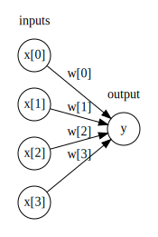

上图中左边的每个结点代表一个输入特征，连线代表学到的系数，右边的结点代表输出，是输入的加权求和

在MLP中，多次重复这个计算加权求和的过程，首先计算代表中间过程的 **隐单元（hidden unit）**，然后计算这些隐单元的加权求和并得到最终结果

```python
display(mglearn.plots.plot_single_hidden_layer_graph())
```

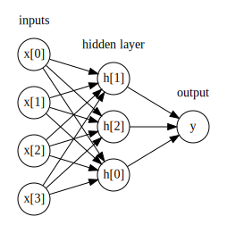

这个模型需要学习更多的系数（也叫作权重），在每个输入与每个隐单元（隐单元组成了隐层）之间有一个系数，在每个隐单元与输出之间也有一个系数

从数学的角度看，计算一系列加权求和与只计算一个加权求和是完全相同的，因此，为了让这个模型真正比线性模型更为强大，我们还需要一个技巧，在计算完成每个隐单元的加权求和之后，对结果再应用一个非线性激活函数，除了前面提到的 `sigmoid` 函数，比如 **校正非线性**（rectifying nonlinearity，也叫校正线性单元或 relu）函数或 **正切双曲**（tangens hyperbolicus，tanh）函数，然后将这个函数的结果用于加权求和，计算得到输出 $\hat y$ ，这两个非线性函数使得神经网络可以学习比线性模型复杂的多的函数，这两个函数的可视化效果如下图

```python
line = np.linspace(-3, 3, 100)
plt.plot(line, np.tanh(line), label="tanh")
plt.plot(line, np.maximum(line, 0), label="relu")
plt.legend(loc="best")
plt.xlabel("x")
plt.ylabel("relu(x), tanh(x)")
```

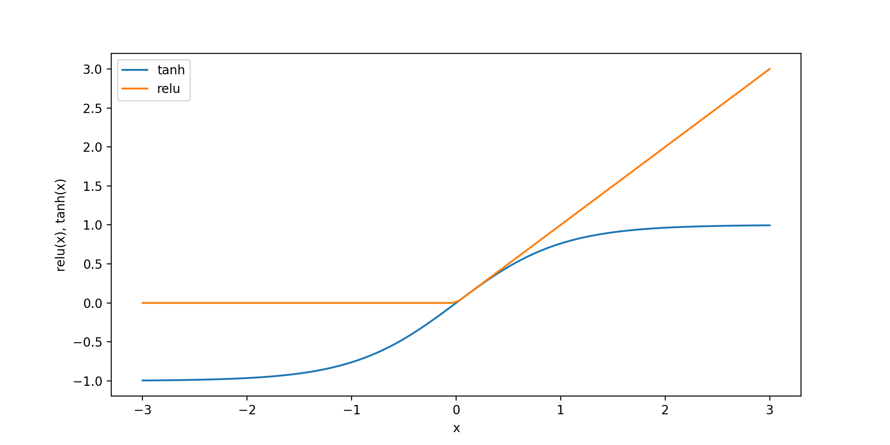

对于上上图的小型神经网络，计算回归问题的 $\hat y$ 的完整公式如下（使用 $tanh$ 非线性）

$$
\begin{aligned}
h[0] &=tanh(w[0,0] * x[0]+w[1,0] * x[1]+w[2,0] * x[2]+w[3,0] * x[3]+b[0]) \\
h[1] &=tanh(w[0,0] * x[0]+w[1,0] * x[1]+w[2,0] * x[2]+w[3,0] * x[3]+b[1]) \\
h[2] &=tanh(w[0,0] * x[0]+w[1,0] * x[1]+w[2,0] * x[2]+w[3,0] * x[3]+b[2]) \\
\hat y &=v[0] * h[0]+v[1] * h[1]+v[2] * h[2]+b
\end{aligned}
$$

其中 $w$ 是输入 $x$ 与隐藏层 $h$ 之间的权重，$v$ 是隐藏层 $h$ 与输出 $y$ 之间的权重，权重 $w$ 和 $v$ 要学习得到，$x$ 是输入特征，$y$ 是计算得到的输出，$h$ 是计算的中间结果，需要用户设置的一个重要参数是隐层中的结点个数，对于非常小或非常简单的数据集，这个值可以小到 `10`；对于非常复杂的数据，这个值可以达到 `10000` ，也可以添加多个隐层，如下图所示

```python
mglearn.plots.plot_two_hidden_layer_graph()
```

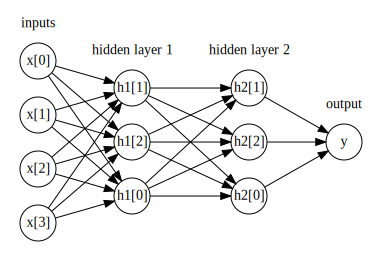

这些由很多计算层组成的大型神经网络，正是术语 “深度学习” 的灵感来源

#### Tuning Neural Networks

我们将 `MLPClassifier` 应用到 two_moons 数据集上

- 默认情况

    ```python
    from sklearn.neural_network import MLPClassifier
    from sklearn.datasets import make_moons
    from sklearn.model_selection import train_test_split

    X, y = make_moons(n_samples=100, noise=0.25, random_state=3)

    X_train, X_test, y_train, y_test = train_test_split(X, y, stratify=y,
                                                        random_state=42)

    mlp = MLPClassifier(solver='lbfgs', random_state=0).fit(X_train, y_train)
    mglearn.plots.plot_2d_separator(mlp, X_train, fill=True, alpha=.3)
    mglearn.discrete_scatter(X_train[:, 0], X_train[:, 1], y_train)
    plt.xlabel("Feature 0")
    plt.ylabel("Feature 1")
    ```

    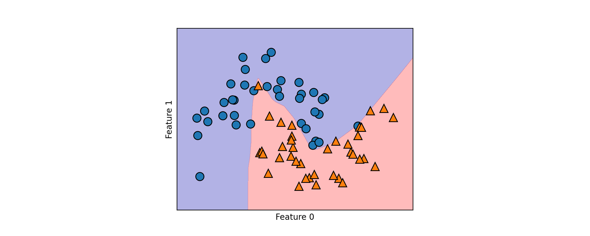

    - 从上图我们可以看到，神经网络学到的决策边界完全是非线性的，但相对平滑
    - 默认情况下，MLP 使用 `100` 个隐结点，这对于这个小型数据集来说已经相当多了，我们可以减少其数量（从而降低了模型复杂度），但仍然可以得到很好的结果

- 单隐藏层 `10` 个隐藏节点的情况

    ```python
    mlp = MLPClassifier(solver='lbfgs', random_state=0, hidden_layer_sizes=[10])
    mlp.fit(X_train, y_train)
    mglearn.plots.plot_2d_separator(mlp, X_train, fill=True, alpha=.3)
    mglearn.discrete_scatter(X_train[:, 0], X_train[:, 1], y_train)
    plt.xlabel("Feature 0")
    plt.ylabel("Feature 1")
    ```

    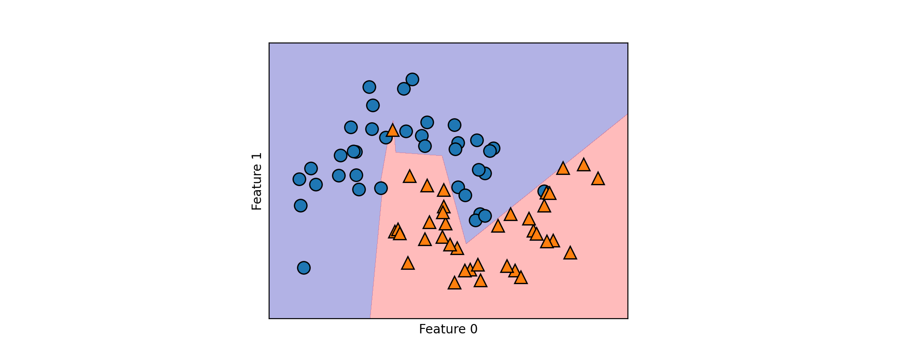


    只有 `10` 个隐单元数时，决策边界看起来更加参差不齐，默认的非线性是 `relu`，我们调整非线性函数和隐藏单元层数看看效果

- 包含 `2` 个隐层，每个隐层包含 `10` 个隐单元的神经网络学到的决策边界（激活函数为 `relu`）

    ```python
    # using two hidden layers, with 10 units each
    mlp = MLPClassifier(solver='lbfgs', random_state=0,
                        hidden_layer_sizes=[10, 10])
    mlp.fit(X_train, y_train)
    mglearn.plots.plot_2d_separator(mlp, X_train, fill=True, alpha=.3)
    mglearn.discrete_scatter(X_train[:, 0], X_train[:, 1], y_train)
    plt.xlabel("Feature 0")
    plt.ylabel("Feature 1")
    ```

    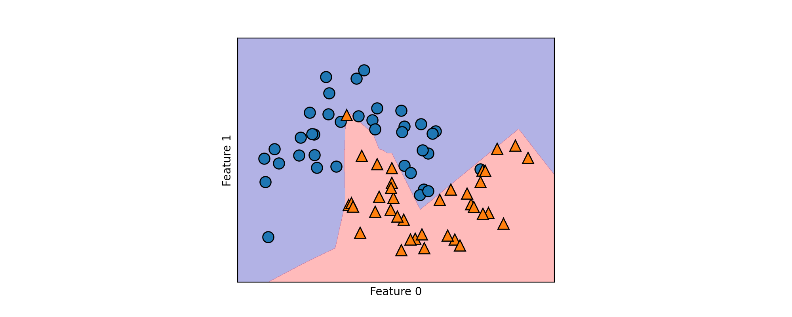

- 包含 `2` 个隐层，每个隐层包含 `10` 个隐单元的神经网络学到的决策边界（激活函数 `tanh`）

    ```python
    # using two hidden layers, with 10 units each, now with tanh nonlinearity.
    mlp = MLPClassifier(solver='lbfgs', activation='tanh',
                        random_state=0, hidden_layer_sizes=[10, 10])
    mlp.fit(X_train, y_train)
    mglearn.plots.plot_2d_separator(mlp, X_train, fill=True, alpha=.3)
    mglearn.discrete_scatter(X_train[:, 0], X_train[:, 1], y_train)
    plt.xlabel("Feature 0")
    plt.ylabel("Feature 1")
    ```

    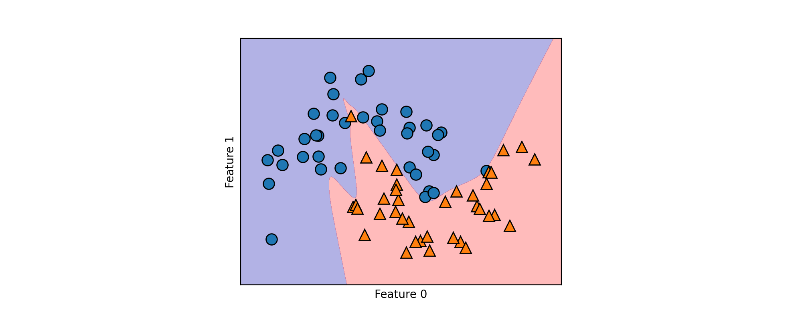

- 不同隐单元个数与 `alpha` 参数（调节 $L_2$ 惩罚）的不同设定下的决策函数

    ```python
    fig, axes = plt.subplots(2, 4, figsize=(16, 6))
    for axx, n_hidden_nodes in zip(axes, [10, 100]):
        for ax, alpha in zip(axx, [0.0001, 0.01, 0.1, 1]):
            mlp = MLPClassifier(solver='lbfgs', random_state=0,
                                hidden_layer_sizes=[n_hidden_nodes, n_hidden_nodes],
                                alpha=alpha)
            mlp.fit(X_train, y_train)
            mglearn.plots.plot_2d_separator(mlp, X_train, fill=True, alpha=.3, ax=ax)
            mglearn.discrete_scatter(X_train[:, 0], X_train[:, 1], y_train, ax=ax)
            ax.set_title("n_hidden=[{}, {}]\nalpha={:.4f}".format(
                        n_hidden_nodes, n_hidden_nodes, alpha))
    ```

    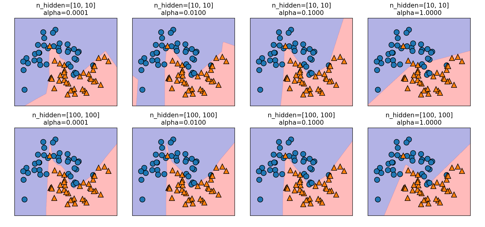

- 相同参数，但不同随机初始化的情况下学到的决策函数

    神经网络的一个重要性质是，在开始学习之前其权重是随机设置的，这种随机初始化会影响学到的模型，但应该记住这一点（特别是对于较小的网络），即使使用完全相同的参数，如果随机种子不同的话，应该不会对精度有太大影响

    ```python
    fig, axes = plt.subplots(2, 4, figsize=(16, 6))
    for i, ax in enumerate(axes.ravel()):
        mlp = MLPClassifier(solver='lbfgs', random_state=i,
                            hidden_layer_sizes=[100, 100])
        mlp.fit(X_train, y_train)
        mglearn.plots.plot_2d_separator(mlp, X_train, fill=True, alpha=.3, ax=ax)
        mglearn.discrete_scatter(X_train[:, 0], X_train[:, 1], y_train, ax=ax)
    ```

    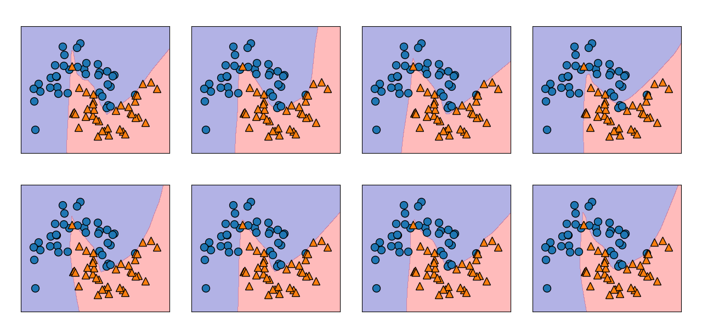

#### Test on Cancer Dataset

**Breast Cancer Dataset**

```python
from sklearn.datasets import load_breast_cancer

cancer = load_breast_cancer()
print("cancer.keys():\n", cancer.keys())
print("Shape of cancer data:", cancer.data.shape)
print("Sample counts per class:\n",
      {n: v for n, v in zip(cancer.target_names, np.bincount(cancer.target))})
print("Feature names:\n", cancer.feature_names)
```

**Output**

```console
cancer.keys():
 dict_keys(['data', 'target', 'target_names', 'DESCR', 'feature_names', 'filename'])
Shape of cancer data: (569, 30)
Sample counts per class:
 {'malignant': 212, 'benign': 357}
Feature names:
 ['mean radius' 'mean texture' 'mean perimeter' 'mean area'
 'mean smoothness' 'mean compactness' 'mean concavity'
 'mean concave points' 'mean symmetry' 'mean fractal dimension'
 'radius error' 'texture error' 'perimeter error' 'area error'
 'smoothness error' 'compactness error' 'concavity error'
 'concave points error' 'symmetry error' 'fractal dimension error'
 'worst radius' 'worst texture' 'worst perimeter' 'worst area'
 'worst smoothness' 'worst compactness' 'worst concavity'
 'worst concave points' 'worst symmetry' 'worst fractal dimension']
```

一般随意查看一下数据的内容

```python
print("Cancer data per-feature maxima:\n{}".format(cancer.data.max(axis=0)))
```

**Output**

```console
Cancer data per-feature maxima:
[2.811e+01 3.928e+01 1.885e+02 2.501e+03 1.634e-01 3.454e-01 4.268e-01
 2.012e-01 3.040e-01 9.744e-02 2.873e+00 4.885e+00 2.198e+01 5.422e+02
 3.113e-02 1.354e-01 3.960e-01 5.279e-02 7.895e-02 2.984e-02 3.604e+01
 4.954e+01 2.512e+02 4.254e+03 2.226e-01 1.058e+00 1.252e+00 2.910e-01
 6.638e-01 2.075e-01]
```

我们将 `MLPClassifier` 应用在乳腺癌数据集上，先使用默认参数

```python
X_train, X_test, y_train, y_test = train_test_split(
    cancer.data, cancer.target, random_state=0)

mlp = MLPClassifier(random_state=42)
mlp.fit(X_train, y_train)

print("Accuracy on training set: {:.2f}".format(mlp.score(X_train, y_train)))
print("Accuracy on test set: {:.2f}".format(mlp.score(X_test, y_test)))
```

**Output**

```console
Accuracy on training set: 0.94
Accuracy on test set: 0.92
```

MLP 的精度相当好，但是默认参数下没有其他模型好，与之前的 SVC 例子相同，原因可能在于数据的缩放，神经网络也要求所有输入特征的变化范围相似，最理想的情况是 $\overline E=0,\ \delta=1$，我们必须对数据进行缩放以满足这些要求


```python
# 计算训练集中每个特征的平均值
mean_on_train = X_train.mean(axis=0)
# 计算训练集中每个特征的标准差
std_on_train = X_train.std(axis=0)

# 减去平均值，然后乘以标准差的倒数
# afterward, mean=0 and std=1
X_train_scaled = (X_train - mean_on_train) / std_on_train
# 对测试集做相同的变化，使用训练集的平均值和标准差
X_test_scaled = (X_test - mean_on_train) / std_on_train

mlp = MLPClassifier(random_state=0)
mlp.fit(X_train_scaled, y_train)

print("Accuracy on training set: {:.3f}".format(
    mlp.score(X_train_scaled, y_train)))
print("Accuracy on test set: {:.3f}".format(mlp.score(X_test_scaled, y_test)))
```

**Output**

```console
Accuracy on training set: 0.991
Accuracy on test set: 0.965
```

缩放之后的结果要好的多，而且模型精度也相当有竞争力，不过模型给出了一个警告，告诉我们已经达到最大迭代次数

```console
ConvergenceWarning: Stochastic Optimizer: Maximum iterations (200) reached and the optimization hasn't converged yet.
  % self.max_iter, ConvergenceWarning)
```

这是用于学习模型 `adam` 算法的一部分，告诉我们应该增加迭代次数

```python
mlp = MLPClassifier(max_iter=1000, random_state=0)
mlp.fit(X_train_scaled, y_train)

print("Accuracy on training set: {:.3f}".format(
    mlp.score(X_train_scaled, y_train)))
print("Accuracy on test set: {:.3f}".format(mlp.score(X_test_scaled, y_test)))
```

**Output**

```console
Accuracy on training set: 1.000
Accuracy on test set: 0.972
```

模型的性能持续提升，我们还可以增大 `alpha` 的值来考察，正则化对模型的影响

```python
mlp = MLPClassifier(max_iter=1000, alpha=1, random_state=0)
mlp.fit(X_train_scaled, y_train)

print("Accuracy on training set: {:.3f}".format(
    mlp.score(X_train_scaled, y_train)))
print("Accuracy on test set: {:.3f}".format(mlp.score(X_test_scaled, y_test)))
```

**Output**

```console
Accuracy on training set: 0.988
Accuracy on test set: 0.972
```

这得到了与我们目前最好地模型相同的性能

虽然可以分析神经网络学到了什么，但这通常比分析线性模型或基于树的模型更为复杂，要想观察模型学到了什么，一种方法是查看模型的权重，下面这张图显示了输入与第一个隐层之间的权重，图中的行对应 `30` 个输入特征，列对应 `100` 个隐单元，浅色代表正值方向较大，而深色代表负值

```python
plt.figure(figsize=(20, 5))
plt.imshow(mlp.coefs_[0], interpolation='none', cmap='viridis')
plt.yticks(range(30), cancer.feature_names)
plt.xlabel("Columns in weight matrix")
plt.ylabel("Input feature")
plt.colorbar()
```

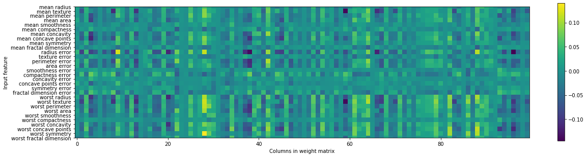

如果某个特征对所有隐单元的权重都很小，那么这个特征对模型来说就“不太重要”，可以看到，与其他特征相比，“mean smoothness”，“mean compactness” 以及 “smoothness error” 和 “fractal dimension error” 之间的特征的权重都相对较小，这可能说明这些特征不太重要，也可能是我们没有用神经网络可以使用的方式来表示这些特征

我们还可以将连接隐层和输出层的特征可视化，但它们更加难以解释

虽然 `MLPClassifier` 和 `MLPRegressor` 为最常见的神经网络架构提供了易于使用的接口，但它们只包含神经网络潜在应用的一部分，如果有兴趣使用更灵活或更强大的模型，可以继续学习除了 scikit-learn 之外的很棒的深度学习库，对于 Python 用户来说，最为完善的是 Keras，Lasagna 和 Tensorflow，以及现在更为流行的 Pytorch

Lasagna 是基于 Theano 库构建的，而 Keras 就可以用 Tensorflow 也可以用 Theano，这些库提供了更为灵活的接口，可以用来构建神经网络并跟踪深度学习研究的快速发展，所有流行的深度学习库也都允许使用高性能的图像处理单元（GPU），但 scikit-learn 不支持 GPU，使用 GPU 可以将计算速度加快 10 到 100 倍，GPU 对于深度学习方法应用到大型数据集上至关重要

### Summary of Neural Network 

#### Strengths

神经网络的主要优点之一是能够获取大量数据中包含的信息，并构建无比复杂的模型

给定足够的计算时间和数据，并且仔细调节参数，神经网络通常可以打败其他机器学习算法（无论是分类任务还是回归任务）

#### Weaknesses 

神经网络，特别是功能强大的大型神经网络，通常需要很长的训练时间，还需要仔细地预处理数据

与 SVM 类似，神经网络在 “均匀” 数据上的性能最好，其中 “均匀” 是指所有特征都具有相似的含义，如果数据包含不同种类的特征，那么基于树的模型可能表现得更好，神经网络调参本身也是一门艺术

#### Complexity

控制神经网络复杂度的方法有很多种

- 隐层的个数
- 每个隐层中的单元个数
- 正则化（`alpha` 参数）

估计神经网络的复杂度，最重要的参数是层数和每层的隐单元个数，首先设置 $1$ 个或 $2$ 个隐层，然后可以逐步增加，每个隐层的结点个数通常与输入特征个数接近

在考虑神经网络的模型复杂度时，一个有用的度量是权重（或系数）的个数

- 如果有一个包含 $100$ 个特征的二分类数据集，模型有 $100$ 个隐单元，那么输入层和第一个隐层之间既有 $100\times 100=10000$ 个权重，在隐层和输出层之间还有 $100\times1=100$ 个权重，总共约有 $10100$ 个权重，如果添加含有 $100$ 个隐单元的第二个隐层，那么在第一个隐层和第二个隐层之间又有 $100\times 100=10000$ 个权重，总数变为约 $20100$ 个权重
- 如果使用包含 $1000$ 个隐单元的单隐层，那么在输入层和隐层单元之间需要学习 $100\times 1000=100000$ 个权重，隐层到输出层之间需要学习 $1000\times 1=1000$ 个权重，总共 $101000$ 个权重，如果再添加第二个隐层，就会增加 $1000\times 1000=1000000$ 个权重，总数变为巨大的 $1101000$ 个权重，这比含有 $2$ 个隐层，每层 $100$ 个单元的模型要大 $50$ 倍

#### Parameters

- 神经网络的一个重要性质是，在开始学习之前其权重是随机设置的，这种随机初始化会影响学到的模型（即使使用完全相同的参数）
- MLP 的精度相当好，但没有其他模型好
    - 由于数据的缩放。神经网络也要求所有输入特征的变化范围相似（与较早的 SVC 例子相同）
    - 最理想的情况是 $\overline E=0,\ \delta=1$
- 神经网络调参的常用方法是
    - 首先创建一个达到足以过拟合的网络，确保这个网络可以对任务进行学习
    - 确保训练数据可以被学习之后，要么缩小网络，要么增大 `alpha` 来增强正则化，以提高泛化性能
- 由 `solver` 参数设定如何学习模型或用来学习参数的算法 `solver` 有两个好用的选项
    - 默认选项是 `adam`，在大多数情况下效果都很好，但对数据的缩放相当敏感（始终将数据缩放为 $\overline E=0,\ \delta=1$ 是很重要的）
    - 另一个选项是 `lbfgs`，其鲁棒性相当好，但在大型模型或大型数据集上的时间会比较长
    - 更高级的 `sgd` 选项，许多深度学习研究人员都会用到，`sgd` 选项还有许多参数需要调节，以便获得最佳结果
    - 在开始使用 MLP 时，建议使用 `adam` 和 `lbfgs`