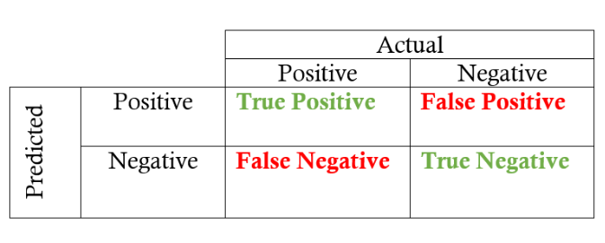

# Naive Bayes

## Introduction of Naive Bayes

### Discrimitive and Generative Models

说到朴素贝叶斯算法，首先涉及 **判别式** 和 **生成式** 的概念

- **判别式**
    - 寻找不同类别之间的最优分类面，反映的是异类数据之间的差异
    - 直接学习出特征输出 $Y$ 和特征 $X$ 之间的关系，如决策函数 $Y=f(X)$ ，或者从概率论的角度，求出条件分布 $P(Y|X)$
    - 代表算法有 **决策树、KNN、逻辑回归、支持向量机、随机条件场 CRF** 等
    - 由于利用了训练数据的类别标识信息，加之分类边界相对灵活，可以比使用纯概率方法的模型更高级，通常性能较好，也适用于较多类别的识别
    - 缺点是不能反映训练数据本身的特性，变量间的关系不清楚，不可视
- **生成式**
    - 对后验概率建模，从统计的角度表示数据的分布情况，能够反映同类数据本身的相似度
    - 直接找出特征输出 $Y$ 和特征 $X$ 的联合分布 $P(X,Y)$ ，然后用 $P(Y|X)=\frac{P(X,Y)}{P(X)}$ 得出
    - 代表算法有 **朴素贝叶斯、隐式马尔可夫链** 等
    - 可以携带更多的信息，研究单类问题的灵活性更强，可以通过增量学习得到，能用于数据不完整的情况
    - 性能相较判别式较差，学习和计算过程较为复杂

**注意** 由生成模式可以得到判别式模式，但由判别模式得不到生成模式

### Principle of Naive Bayes

朴素贝叶斯算法基于 **贝叶斯定理和特征条件独立假设** 

- **贝叶斯定理** <font color=red>*先验概率 + 数据 = 后验概率*</font>，贝叶斯定理解决的是因 $X$ 无法直接观测、测量，而我们希望通过其结果 $Y$ 来反推出原因 $X$ 的问题，也就是知道一部分先验概率，来求后验概率的问题
	
    $$
	P(Y\vert X)=\frac{P(X\vert Y)P(Y)}{P(X)}=\frac{P(X|Y)P(Y)}{\sum_kP(X|Y=Y_k)P(Y_k)}
	$$

- **特征条件独立** 特征条件独立假设 $Y$ 的 $n$ 个特征在类确定的条件下都是条件独立的，大大简化了计算过程，但是因为这个假设太过严格，所以会相应牺牲一定的准确率，这也是为什么称呼为 **朴素** 的原因

### Naive Bayes Algorithm

- **Input** 训练集为 $m$ 个样本 $n$ 个维度

    $$
    T=(x_1,y_1),(x_2,y_2),\cdots,(x_m,y_m)
    $$
        
    &emsp;&emsp;&emsp;&ensp;共有 $K$ 个特征输出类别，分别为 $y\in\{c_1,c_2,\cdots,c_K\}$

- **Output** 实例 $x_{(test)}$ 的分类

- 算法流程如下

1. 首先计算 $Y$ 的 $K$ 个 **先验概率**
	
    $$
	P(Y=c_k)
	$$

1. 然后计算条件概率分布
	
    $$
	P(X=x\vert Y=c_k)=P(X^{(1)}=x^{(1)},\cdots,X^{(n)}=x^{(n)}\vert Y=c_k)
	$$
	
    由于上式的参数是指数级别，无法计算，所以根据特征条件独立假设，可以化简为下式
	
    $$
	P(X=x|Y=c_k)=\prod\limits_{j=1}^n P(X^{(j)}=x^{(j)}|Y=c_k)	  \tag{1}
	$$

1. 根据贝叶斯原理，计算 **后验概率** 
	
    $$
	P(Y=c_k|X=x)=\frac {P(X=x|Y=c_k)P(Y=c_k)}{\sum_kP(X=x|Y=c_k)P(Y=c_k)}
	$$
	
    带入 $(1)$ 式，得到
	
    $$
	P(Y=c_k|X=x)=\frac{\prod\limits_{j=1}^n P(X^{(j)}=x^{(j)}|Y=c_k)P(Y=c_k)}
	{\sum_k\prod\limits_{j=1}^n P(X^{(j)}=x^{(j)}|Y=c_k)P(Y=c_k)}
	$$
	
    对于每一个 $y=c_k$, 分母都是相同的，上式再变为如下
	
    $$
	P(Y=c_k|X=x)=\prod\limits_{j=1}^n P(X^{(j)}=x^{(j)}|Y=c_k)P(Y=c_k)
	$$

1. 计算 $X_{(test)}$ 的类别
	
    $$
	y_{(test)}=\arg \max\limits_{c_k} 
	\prod\limits_{j=1}^n P(X^{(j)}=x_{(test)}^{(j)}|Y=c_k)P(Y=c_k)
	$$

从上面的计算可以看出，没有复杂的求导和矩阵运算，因此效率很高

[**Gaussian Naive Bayes**](https://link.jianshu.com/?t=http://scikit-learn.org/stable/modules/generated/sklearn.naive_bayes.GaussianNB.html#sklearn.naive_bayes.GaussianNB) 属性特征值的条件概率

$$
P(x_i\vert y) = \frac1{\sqrt{2\pi\sigma_y^2}}\exp \left(
-\frac{(x_i-\mu_y)^2}{2\sigma_y^2} \right)
$$

## Naive Bayes Classifiers

朴素贝叶斯分类器是和线性模型非常相似的一种分类器，但它的训练速度往往更快，这种高效率所付出的代价是，朴素贝叶斯模型的泛化能力要比线性分类器（如 Logistic Regression 和 Linear SVC）稍差

朴素贝叶斯模型如此高效的原因在于，它通过单独查看每个特征来学习参数，并从每个特征中收集简单的类别统计数据，scikit-learn 中实现了三种朴素贝叶斯分类器，`GaussianNB`，`BernoulliNB` 和 `MultinomialNB`，`GaussianNB` 可应用于任意连续数据，而 `BernoulliNB` 假定输入数据为二分类数据，`MultinomialNB` 假定输入数据为计数数据（即每个特征代表某个对象的整数计数，比如一个单词在句子里出现的次数），`BernoulliNB` 和 `MultinomialNB` 主要用于文本数据分类

### Normal Sample

`BernoulliNB` 分类器计算每个类别中每个特征不为 $0$ 的元素个数

用一个例子来说明会很容易理解

```python
X = np.array([[0, 1, 0, 1],
              [1, 0, 1, 1],
              [0, 0, 0, 1],
              [1, 0, 1, 0]])
y = np.array([0,1,0,1])
```

这里我们有 4 个数据点，每个点有 4 个二分类特征，一共有两个类别，0 和 1，对于类别 0（第 1、3 个数据点），第一个特征有 2 个为零，0 个不为零，第二个特征有 1 个为零，1 个不为零，以此类推，然后对类别1中的数据点计算相同的计数，计算每个类别中的非零元素个数，大体上看起来像这样

```python
counts={}
for label in np.unique(y):
    # 对每个类别进行遍历
    # 计算（求和）每个特征中 1 的个数
    counts[label]=X[y==label].sum(axis=0)
print("Feature counts:\n{}".format(counts))
```

**Output**

```console
Feature counts:
{0: array([0, 1, 0, 2]), 1: array([2, 0, 2, 1])}
```

另外两种朴素贝叶斯模型（`MultinomialNB` 和 `GaussianNB`）计算的统计数据类型略有不同，`Multinomial` 计算每个类别中每个特征的平均值，而 `GaussianNB` 会保存每个类别中国每个特征的平均值和标准差

要想做出预测，需要将数据点与每个类别的统计数据进行比较，并将最匹配的类别作为预测结果，有趣的是，`MultinomialNB` 和 `BernoulliNB` 预测公式的形式都与线性模型完全相同，不幸的是，朴素贝叶斯模型 `coef_` 的含义与线性模型稍有不同，因为`coef_` 不同于 `w`

### Sample of Text Classification

我们来看一个 `MultinomialNB` 用于新闻分类的例子，首先我们获取数据集

```
from sklearn.datasets import fetch_20newsgroups
news = fetch_20newsgroups(subset='all')
```

如果是第一次导入数据，程序会从网站上自动下载数据至 `$HOME/scikit_learn_data` 路径下， 文件名为 `20news-bydate_py3.pkz`，此后只要该文件及路径无改动，则不会重复下载

```console
Downloading 20news dataset. This may take a few minutes.
Downloading dataset from https://ndownloader.figshare.com/files/5975967 (14 MB)
```

我们在查看一下，数据集中包含的新闻数

```python
print(len(news.data), len(news.target_names))
```

**Output**

```console
18846 20
```

一共有 18846 条新闻，标签一共有 20 类，我们可以看一下新闻示例以及部分标签号

```python
from sklearn.model_selection import train_test_split
X_train, X_test, y_train, y_test = train_test_split(
    news.data, news.target, test_size=0.25, random_state=33
)                       # 随机采样 25% 的数据样本作为测试集
print(X_train[0])       # 查看训练样本
print(y_train[0:100])   # 查看标签
```

**Output**

```console
From: scotts@math.orst.edu (Scott Settlemier)
Subject: FORSALE: MAG Innovision MX15F 1280x1024
Article-I.D.: gaia.1r7hir$9sk
Distribution: world
Organization: Oregon State University Math Department
Lines: 7
NNTP-Posting-Host: math.orst.edu

MAG Innovision MX15F
Fantastic 15" multiscan monitor that can display up to
1280x1024 noninterlaced (!) with .26 mm dot pitch.
If you are looking for a large crystal clear super vga
monitor then this is for you.
$430   call Scott at (503) 757-3483 or
email scotts@math.orst.edu

[ 6  1  5  6  5  3 19  8 19 19  3 16  3  1 13 14  4  8  0 13 13 11 19 16
 10 18  9 19  5  3 15  2  0  8 19 12  9  3 19  0  3  3  8 16 16  6 13  8
  8 11 11 11  6  0 13  3 11  9 15  8  8 14 18  2  3  5 14  8 12 15  0 18
  1  0 13 16 14  7 18  5 15  3  5 17 15  2  8  9 14 10  3 14 11 11  3 15
  6 10 14 19]
```

接着我们将训练数据，即这些文本信息转化为标记特征的数字向量形式

```python
from sklearn.feature_extraction.text import CountVectorizer  # 导入文本特征向量化模块

vec = CountVectorizer()
X_train = vec.fit_transform(X_train)
X_test = vec.transform(X_test)
```

这将会产生一个稀疏矩阵，我们可以查看这个稀疏矩阵的维数

```python
X_train.get_shape()
```

**Output**

```console
(14134, 150725)
```

这里第一个 14134 表示我们训练集的个数（注意 18846 篇新闻报道中有 25% 用作了验证集），而 150725 表示全部的特征个数，由于是稀疏的，所以有值的特征并不会很多，比如，我们查看第一篇新闻的数字特征信息

```python
import scipy.sparse as sps

sps.find(X_train[0])[1:]
```

**Output**

```console
(array([  4447,   5481,   9352,  11905,  14433,  16311,  17937,  22750,
         27541,  34760,  35136,  35665,  44232,  44384,  47467,  51298,
         54291,  56007,  56181,  57011,  59188,  60066,  63584,  65719,
         65921,  66520,  67665,  74779,  76791,  78632,  79874,  87060,
         88624,  89395,  91899,  93010,  96571,  97204,  98705,  99226,
        101912, 102088, 104942, 105052, 105079, 105230, 109290, 110519,
        122222, 122236, 123300, 127872, 128977, 129553, 132568, 132665,
        132903, 133800, 137926, 138437, 140565, 144286, 144786, 148646],
       dtype=int32),
 array([2, 1, 1, 1, 1, 1, 1, 1, 1, 1, 1, 1, 1, 1, 1, 1, 1, 1, 1, 1, 3, 1,
        1, 2, 1, 1, 1, 1, 1, 2, 1, 1, 1, 1, 2, 4, 1, 2, 1, 2, 1, 1, 1, 1,
        1, 3, 1, 1, 2, 2, 1, 1, 1, 1, 1, 1, 1, 1, 1, 1, 1, 1, 1, 2]))
```

最后我们使用朴素贝叶斯的 `MultinomialNB` 方法进行参数估计，并在验证集进行预测，最后查看结果报告

```python
from sklearn.naive_bayes import MultinomialNB
from sklearn.metrics import classification_report

mnb = MultinomialNB()               # 使用默认配置初始化朴素贝叶斯
mnb.fit(X_train, y_train)           # 利用训练数据对模型参数进行估计
y_predict = mnb.predict(X_test)     # 对验证集进行预测

print('The Accuracy of Naive Bayes Classifier is:', mnb.score(X_test, y_test))
print(classification_report(y_test, y_predict, target_names=news.target_names))
```

**Output**

```console
The Accuracy of Naive Bayes Classifier is: 0.8397707979626485
                          precision    recall  f1-score   support

             alt.atheism       0.86      0.86      0.86       201
           comp.graphics       0.59      0.86      0.70       250
 comp.os.ms-windows.misc       0.89      0.10      0.17       248
comp.sys.ibm.pc.hardware       0.60      0.88      0.72       240
   comp.sys.mac.hardware       0.93      0.78      0.85       242
          comp.windows.x       0.82      0.84      0.83       263
            misc.forsale       0.91      0.70      0.79       257
               rec.autos       0.89      0.89      0.89       238
         rec.motorcycles       0.98      0.92      0.95       276
      rec.sport.baseball       0.98      0.91      0.95       251
        rec.sport.hockey       0.93      0.99      0.96       233
               sci.crypt       0.86      0.98      0.91       238
         sci.electronics       0.85      0.88      0.86       249
                 sci.med       0.92      0.94      0.93       245
               sci.space       0.89      0.96      0.92       221
  soc.religion.christian       0.78      0.96      0.86       232
      talk.politics.guns       0.88      0.96      0.92       251
   talk.politics.mideast       0.90      0.98      0.94       231
      talk.politics.misc       0.79      0.89      0.84       188
      talk.religion.misc       0.93      0.44      0.60       158

                accuracy                           0.84      4712
               macro avg       0.86      0.84      0.82      4712
            weighted avg       0.86      0.84      0.82      4712
```

我们看到，实际的分类准确度将近达到了 $84\%$，可以说还是相对不错的效果

朴素贝叶斯被广泛应用于海量互联网文本分类任务，由于其较强的特征条件独立假设，使得模型预测所需要估计的参数规模从幂指数量级向线性量级减少，极大地节约了内存消耗和计算时间，但是，也正是受这种强假设的限制，模型训练时无法将各个特征之间的联系考量在内，使得该模型在其他数据特征关联性较强的分类任务上的性能表现不佳

#### About Text Feature Vectorization

朴素贝叶斯模型去给文本数据分类，就必须对文本数据进行处理

##### General Processing

1. 对文本分词（作为特征）
1. 统计各词在句子中是否出现（词集模型）
1. 统计各词在句子中出现次数（词袋模型）
1. 统计各词在这个文档的 TF-IDF 值（词袋模型 及 IDF 值）

其中，对于词条 $w$，如果在某类文档出现的次数为 $Nc_w$，而该类别总共有 $Nc_T$ 条词汇，则定义 **词频率（Term Frequency）**

$$
TF_w = \frac{Nc_w}{Nc_T}
$$

而 **逆向文件频率（Inverse Document Frequency）** 的主要思想是，如果包含词条 $w$ 的文档越少，IDF 越大，则说明词条具有很好的类别区分能力，某一特定词语的 IDF，可以由总文件数目 $Nf_T$ 除以包含该词语之文件的数目 $Nf_w$，再将得到的商取对数得到

$$
IDF = \log\frac{Nf_T}{Nf_w + 1}
$$

为了防止分母为 $0$，通常在分母中 $+1$

某一特定文件内的高词语频率，以及该词语在整个文件集合中的低文件频率，可以产生出高权重的 TF-IDF，因此，TF-IDF 倾向于过滤掉常见的词语，保留重要的词语

$$
TF\_IDF = TF\times IDF
$$

##### General Methods

1. 词集模型, one-hot 编码向量化文本

    - one-hot 表示法先将文本数据集中不重复的单词提取出来，得到一个大小为 $V$ 的词汇表，然后用一个 $V$ 维的向量通过逐个词汇来表示一篇文章，向量中的第 $d$ 个维度上的 $1$ 表示词汇表中的第 $d$ 个单词出现在这篇文章中
    - 如果文本数据集太大，那么得到的词汇表中可能存在几千个单词，这样会使得文本的维度太大，不仅会导致计算时间增加，而且带来了稀疏问题（one-hot 矩阵中大多数元素都是 $0$），因此，我们通常在计算词汇表的时候，会排除那些出现次数太少的单词，从而降低文本维度

2. 词袋模型 + IDF，TF-IDF 向量化文本
    
    - 不仅考虑了单词在文章中的出现次数，还考虑了其在整个文本数据集中的出现次数
    - 如果某个词或短语在一篇文章中出现的频率 TF 高，并且在其他文章中很少出现，则认为此词或者短语具有很好的类别区分能力

3. 哈希向量化文本
    - TF-IDF Vectorizer 在执行时，需要先将词袋矩阵放入内存，再计算各位置单词的 TF-IDF 值，如果词袋维度大，将占用过多内存，效率低，此时可以使用哈希向量化
    - 哈希向量化可以缓解 TF-IDF Vectorizer 在处理高维文本时内存消耗过大的问题

### Some Supplement

#### Confusion Matrix

首先要介绍一下混淆矩阵，给定一个模型的预测标签时，它可以被用来快速计算精度和召回率，二分类的混淆矩阵总共包含四个不同的结果，*真正例（TP）*、*假正例（FP*）、*真反例（TN）* 以及 *假反例（FN）*，列表示真实值，行表示预测值，行和列的交叉点指的就是这四种结果，对于二分类问题

- **真正例（TP）** 实际上是正例的数据点被标记为正例
- **假正例（FP）** 实际上是反例的数据点被标记为正例
- **真反例（TN）** 实际上是反例的数据点被标记为反例
- **假反例（FN）** 实际上是正例的数据点被标记为反例



显然

$$
TP + FP + FN + TN = Total\ Number\ of\ Samples
$$

#### Evaluation Indicators

##### Accuracy

准确率的计算公式为

$$
ACC=\frac{TP+TN}{TP+TN+FP+FN}
$$

准确率是我们最常见的评价指标，而且很容易理解，就是被预测准确的样本数除以所有的样本数，通常来说，正确率越高，分类器越好

准确率确实是一个很好很直观的评价指标，但是有时候准确率高并不能代表一个算法就好，比如某个地区某天地震的预测，假设我们有一堆的特征作为地震分类的属性，类别只有两个，0 表示不发生地震；1 表示发生地震

一个不加思考的分类器，对每一个测试用例都将类别划分为 0，那那么它就可能达到 99% 的准确率，但真的地震来临时，这个分类器毫无察觉，这个分类带来的损失是巨大的，为什么 99% 的准确率的分类器却不是我们想要的，因为这里数据分布不均衡，类别 1 的数据太少，完全错分类别 1 依然可以达到很高的准确率却忽视了我们关注的东西，在正负样本不平衡的情况下，准确率这个评价指标有很大的缺陷，因此，单纯靠准确率来评价一个算法模型是远远不够科学全面的

##### Error Rate

错误率则与准确率相反，描述被分类器错分的比例，计算公式为

$$
r_{error} = \frac{FP+FN}{TP+TN+FP+FN}
$$

对某一个实例来说，分对与分错是互斥事件，所以

$$
ACC = 1 - r_{error}
$$

##### Precision

精确率定义为

$$
Acc_{(Precision)} = \frac{TP}{TP+FP}
$$

精确率是针对我们 **预测结果** 而言的，它表示的是预测为正的样本中有多少是真正的正样本

##### Recall

召回率是覆盖面的度量，公式为

$$
Acc_{(Recall)} = \frac{TP}{TP+FN}
$$

召回率是针对原来的 **样本** 而言的，它表示的是样本中的正例有多少被预测正确了

##### F-Measure

Precision 和 Recall 指标有时候会出现的矛盾的情况，这样就需要综合考虑他们，最常见的方法就是 F-Measure（又称为 F-Score）

F-Measure 是 Precision 和 Recall 加权调和平均

$$
F = \frac{1}{\frac{1}{k_1+k_2}(k_1\cdot\frac1P+k_2\cdot\frac1R)} 
= \frac{(k_1+k_2)P\cdot R}{k_1\cdot R + k_2\cdot P}
$$

其中

$$
k_1 + k_2 = 1, \qquad 0\leq k_1,k_2\leq 1
$$

当 Precision 和 Recall 等权重，即 $k_1=k_2$ 时，就是最常见的 $F1$

$$
F1 = \frac{2\times Acc_{(Precision)} \times Acc_{(Recall)}}{Acc_{(Precision)} + Acc_{(Recall)}}
$$

可知 $F1$ 综合了 $P$ 和 $R$ 的结果，当 $F1$ 较高时则能说明试验方法比较有效

## Summary

### Parameters

`MultinomialNB` 和 `BernoulliNB` 都只有一个参数 `alpha`，用于控制模型复杂度，`alpha` 的工作原理是，算法向数据中添加 `alpha` 这么多的虚拟数据点，这些点对所有特质都取正值，这可以将统计数据 “平滑化”（smoothing），`alpha` 越大，平滑化越强，模型复杂度就越低，算法性能对 `alpha` 值的鲁棒性相对较好，也就是说，`alpha` 值对模型性能并不重要，但调整这个参数通常都会使精度略有提高

`GaussianNB` 主要用于高维数据，而另外两种朴素贝叶斯模型则更广泛用于稀疏统计数据，比如文本，`MultinomialNB` 的性能通常要优于 `BernoulliNB`，特别是在很多非零特征的数据集（即大型文档）上

### Advantage

- 朴素贝叶斯模型发源于古典数学理论，**有稳定的分类效率**
- 朴素贝叶斯的训练和预测速度都很快，训练过程也很容易理解，该模型对高维稀疏数据的效果很好，对参数的鲁棒性也相对较好
-  **对小规模的数据表现很好** ，能个处理多分类任务，适合 **增量式训练** ，尤其是数据量超出内存时，我们可以一批批的去增量训练
- **对缺失数据不太敏感** ，算法也比较简单，常用于文本分类
- 朴素贝叶斯模型是很好的基准模型

### Disadvantages

- 朴素贝叶斯模型的 **特征条件独立假设在实际应用中往往是不成立的**
- 如果样本数据分布不能很好的代表样本空间分布，那先验概率容易测不准
- 对输入数据的表达形式很敏感
