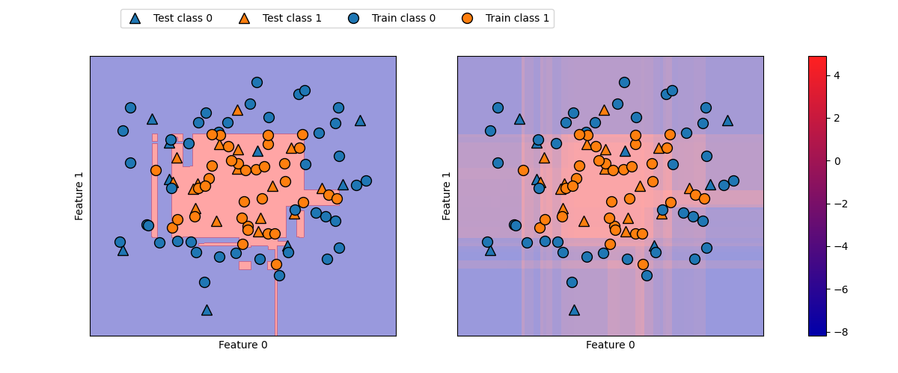
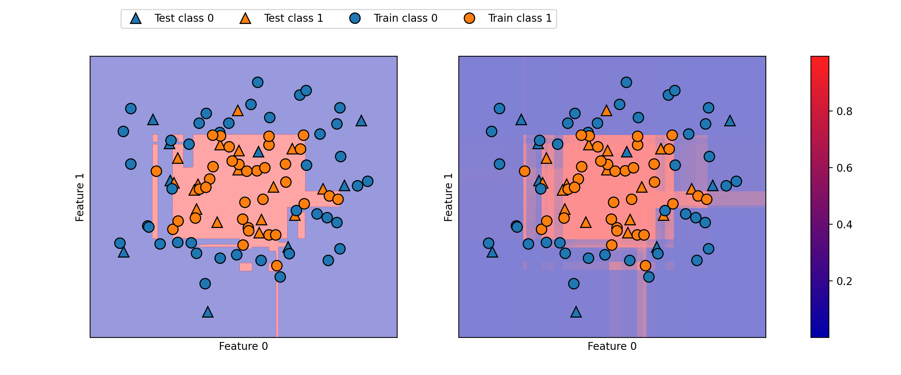
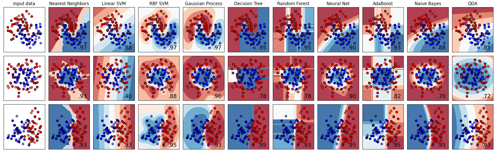

# Uncertainty Estimates from Classifiers

scikit-learn 库中还有对分类预测任务中进行不确定度估计的能力

通常情况下，我们不仅关心分类器将某一具体的测试点预测至哪个类，而且还关心分到这个类的确定度，在实际应用中，不同类型的错误会导致在真实场景中的结果截然不同，想象一下，在应对 COVID-2019 的核酸检测中，做一个错误的阳性预测可能会导致患者接受额外的检查，而一个错误的阴性预测可能会导致患者得不到及时的治疗甚至引发潜在的扩散风险

在 scikit-learn 中，有两个不同的函数可以用来从分类器中获得不确定性估计，分别是 `decision_function` 和 `predict_proba`，大多数（但不是所有的）分类器至少有其中一个，部分分类器同时拥有这两个函数，让我们构建一个 `GradientBoostingClassifier` 分类器，应用在构造的二维数据集上

```python
import numpy as np
from sklearn.model_selection import train_test_split
from sklearn.ensemble import GradientBoostingClassifier
from sklearn.datasets import make_circles

X, y = make_circles(noise=0.25, factor=0.5, random_state=1)

# 为了便于说明，我们将两个类别重命名为 blue 和 red
y_named = np.array(["blue", "red"])[y]

# 我们可以对任意个数组调用 train_test_split
# 所有的数组的划分方式都是一致的
X_train, X_test, y_train_named, y_test_named, y_train, y_test = \
    train_test_split(X, y_named, y, random_state=0)

# 构建梯度提升模型
gbrt = GradientBoostingClassifier(random_state=0)
gbrt.fit(X_train, y_train_named)
```

**Output**

```console
GradientBoostingClassifier(ccp_alpha=0.0, criterion='friedman_mse', init=None,
                           learning_rate=0.1, loss='deviance', max_depth=3,
                           max_features=None, max_leaf_nodes=None,
                           min_impurity_decrease=0.0, min_impurity_split=None,
                           min_samples_leaf=1, min_samples_split=2,
                           min_weight_fraction_leaf=0.0, n_estimators=100,
                           n_iter_no_change=None, presort='deprecated',
                           random_state=0, subsample=1.0, tol=0.0001,
                           validation_fraction=0.1, verbose=0,
                           warm_start=False)
```

## The Decision Function

对于二分类情况，`decision_function` 返回值的形状是 `(n_samples, )`，为每个样本都返回一个浮点数

```python
print("X_test.shape:", X_test.shape)
print("Decision function shape:", gbrt.decision_function(X_test).shape)
```

**Output**

```console
X_test.shape: (25, 2)
Decision function shape: (25,)
```

对于类别 1 来说，这个值表示模型对该数据点属于 “正” 类的置信程度，正值表示对正类的偏好，负值表示对 “反类” (其他类）的偏好

```python
# 显示 decision_function 的前几个数
print("Decision function:", gbrt.decision_function(X_test)[:6])
```

**Output**

```console
Decision function: [ 4.13592629 -1.7016989  -3.95106099 -3.62599351  4.28986668  3.66166106]
```

我们可以通过仅查看决策函数的正负号来再现预测值

```python
print("Thresholded decision function:\n", gbrt.decision_function(X_test) > 0)
print("Predictions:\n", gbrt.predict(X_test))
```

**Output**

```console
Thresholded decision function:
    [ True False False False  True  True False  True  True  True False  True
    True False  True False False False  True  True  True  True  True False
    False]
Predictions:
    ['red' 'blue' 'blue' 'blue' 'red' 'red' 'blue' 'red' 'red' 'red' 'blue'
    'red' 'red' 'blue' 'red' 'blue' 'blue' 'blue' 'red' 'red' 'red' 'red'
    'red' 'blue' 'blue']
```

对于二分类问题，“反” 类始终是 `classes_` 属性的第一个元素，“正” 类是 `classes_` 的第二个元素，因此，如果你想要完全再现 `predict` 的输出，需要利用 `classes_` 属性

```python
# 将布尔值 True/False 转换成 0 和 1
greater_zero = (gbrt.decision_function(X_test) > 0).astype(int)
# 利用 0 和 1 作为 classes_ 的索引
pred = gbrt.classes_[greater_zero]
# pred 与 gbrt.predict 的输出完全相同
print("pred is equal to predictions:", np.all(pred == gbrt.predict(X_test)))
```

**Output**

```console
pred is equal to predictions: True
```

`decision_function` 可以在任意范围取值，这取决于数据与模型参数

```python
decision_function = gbrt.decision_function(X_test)
print("Decision function minimum: {:.2f} maximum: {:.2f}".format(
      np.min(decision_function), np.max(decision_function)))
```

**Output**

```console
Decision function minimum: -7.69 maximum: 4.29
```

由于可以任意缩放，因此 `decision_function` 的输出往往很难解释
在下面的例子中，我们利用颜色编码在二维平面中画出所有点的 `decision_function` ，还有决策边界，我们将训练点画成圆，将测试数据画成三角


```python
import mglearn
import matplotlib.pyplot as plt

fig, axes = plt.subplots(1, 2, figsize=(12, 5))
plt.subplots_adjust(left=0.1, right=0.85, top=0.85, bottom=0.1)
mglearn.tools.plot_2d_separator(gbrt, X, ax=axes[0], alpha=.4, fill=True, cm=mglearn.cm2)
scores_image = mglearn.tools.plot_2d_scores(gbrt, X, ax=axes[1], alpha=.4, cm=mglearn.ReBl)

for ax in axes:
    # 画成训练点和测试点
    mglearn.discrete_scatter(X_test[:, 0], X_test[:, 1], y_test, markers='^', ax=ax)
    mglearn.discrete_scatter(X_train[:, 0], X_train[:, 1], y_train, markers='o', ax=ax)
    ax.set_xlabel("Feature 0")
    ax.set_ylabel("Feature 1")
position = fig.add_axes([0.9, 0.1, 0.02, 0.75])  # 位置 [左, 下, 宽, 高]
cbar = plt.colorbar(scores_image, cax=position, ax=axes.tolist(), orientation="vertical")
cbar.set_alpha(1)
cbar.draw_all()
axes[0].legend(["Test class 0", "Test class 1", "Train class 0",
                "Train class 1"], ncol=4, loc=(.1, 1.1))
```



决策函数既给出预测结果，又给出分类器的置信程度，这样给出的信息量更大，但在上面的图像中，从可视化的角度还是很难分辨出两个类别之间的边界

## Predicting Probabilities

`predict_prob` 的输出是每个类别的概率，通常比 `decision_function` 的输出更容易理解，对于二分类问题，它的形状始终是 `(n_samples, 2)`

```python
print("Shape of probabilities:", gbrt.predict_proba(X_test).shape)
```

**Output**

```
Shape of probabilities: (25, 2)
```

每行的第一个元素是第一个类别的估计概率，第二个元素是第二个类别的估计概率，由于 `predict_proba` 的输出是一个概率，因此总是在 $0$ 和 $1$ 之间，两个类别的元素之和始终为 $1$

```python
# 显示 predict_proba 的前几个元素
print("Predicted probabilities:")
print(gbrt.predict_proba(X_test[:6]))
```

```console
Predicted probabilities:
[[0.01573626 0.98426374]
 [0.84575649 0.15424351]
 [0.98112869 0.01887131]
 [0.97406775 0.02593225]
 [0.01352142 0.98647858]
 [0.02504637 0.97495363]]
```

由于两个类别的概率之和为 $1$，因此只有一个类别的概率超过 $50\%$，这个类别就是模型的预测结果

从上面的输出中可以看到，分类器对大多数点的分类是相对确定的，不确定度在多大程度上反映了数据的不确定性，这取决于模型和参数，一个拟合度较高的模型往往会做出更确定的预测，即使它们可能是错误的，复杂度较低的模型通常会有更多的预测不确定性，如果模型给出的不确定度符合实际情况，那么这个模型被称为 **校正（calibratd）** 模型，在校正模型中，如果预测有 $70\%$ 的确定度，那么它在 $70\%$ 的情况下正确

下面我们再次展示了数据集上的决策边界，

```python
fig, axes = plt.subplots(1, 2, figsize=(12, 5))
plt.subplots_adjust(left=0.1, right=0.85, top=0.85, bottom=0.1)

mglearn.tools.plot_2d_separator(
    gbrt, X, ax=axes[0], alpha=.4, fill=True, cm=mglearn.cm2)
scores_image = mglearn.tools.plot_2d_scores(
    gbrt, X, ax=axes[1], alpha=.5, cm=mglearn.ReBl, function='predict_proba')

for ax in axes:
    # 画出训练点和测试点
    mglearn.discrete_scatter(X_test[:, 0], X_test[:, 1], y_test, markers='^', ax=ax)
    mglearn.discrete_scatter(X_train[:, 0], X_train[:, 1], y_train, markers='o', ax=ax)
    ax.set_xlabel("Feature 0")
    ax.set_ylabel("Feature 1")

position = fig.add_axes([0.9, 0.1, 0.02, 0.75])  # 位置 [左, 下, 宽, 高]
cbar = plt.colorbar(scores_image, cax=position, ax=axes.tolist(), orientation="vertical")
cbar.set_alpha(1)
cbar.draw_all()
axes[0].legend(["Test class 0", "Test class 1", "Train class 0",
                "Train class 1"], ncol=4, loc=(.1, 1.1))
```



上图中的边界更加明确，不确定的小块区域清晰可见

在 scikit-learn 的官网上有一个对各个模型的不确定度进行比较的实例



## Summary

### Algorithm Summary

- **最近邻** 适用于小型数据集，是很好的基准模型，很容易解释
- **线性模型** 非常可靠的首选算法，适用于非常大的数据集，也适用于高维数据
- **朴素贝叶斯** 只适用于分类问题，比线性模型速度还快，适用于非常大的数据集合高维数据，精度通常要低于线性模型
- **支持向量机** 对于特征含义相似的中等大小的数据集很强大，需要数据缩放，对参数敏感
- **神经网络** 对于大型数据集，可以构建非常复杂的模型，对数据缩放敏感，对参数选取敏感，大型网络需要很长的训练时间

### Processing Thoughts

- 面对新数据集，通常最好先从简单模型开始，比如线性模型、朴素贝叶斯或最近邻分类器，看能得到什么样的结果
- 对数据有了进一步了解之后，可以再考虑用于构建更复杂模型的算法，比如随机森林、梯度提升决策树、SVM 或神经网络
- 虽然我们分析了不同的参数设定对算法的影响，但在生产环境中实际构建一个对新数据泛化性能很好的模型要更复杂一些，有机会在后续的研究中介绍正确调参的方法和自动寻找最佳参数的方法