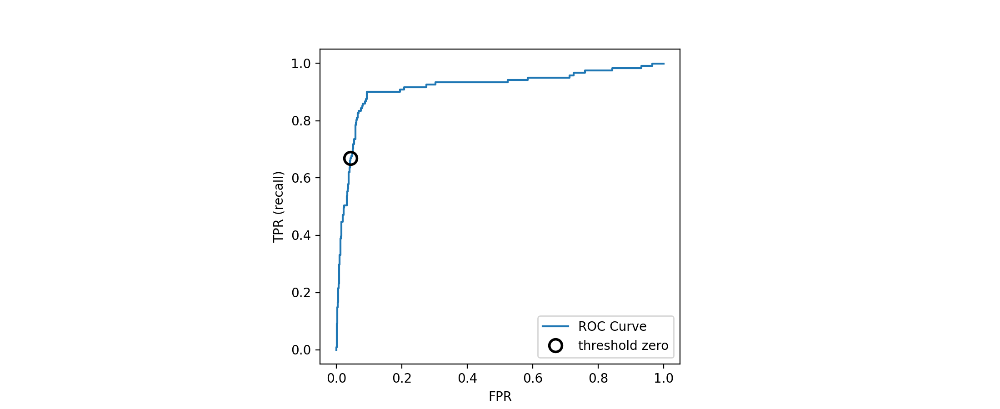
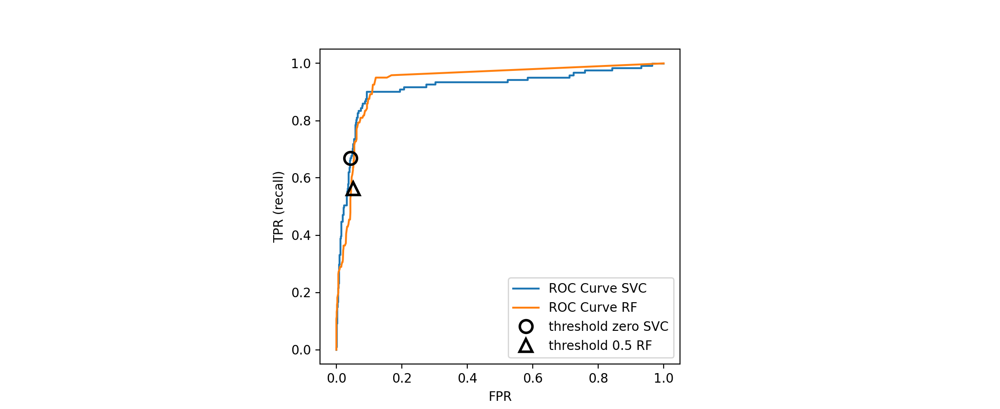

# Model Evaluation

## Metrics for Binary Classification

二元分类可以说是机器学习在实践中最常见的、概念上最简单的应用，然而，即使是这样简单的任务，在评估时也有一些注意事项

在我们深入研究其他指标之前，让我们先来了解一下衡量准确度可能会误导人的方法

通常情况下，准确性并不能很好地衡量预测性能，因为我们所犯的错误数量并不包含我们感兴趣的所有信息

### Imbalanced Dataset

为了说明，我们从数字数据集中创建一个 $9:1$ 的不平衡数据集，将数字 $9$ 与其他 $9$ 个类进行区分

```python
from sklearn.datasets import load_digits
from sklearn.model_selection import train_test_split
import warnings

warnings.filterwarnings("ignore", category=Warning)

digits = load_digits()
y = digits.target == 9

X_train, X_test, y_train, y_test = train_test_split(digits.data, y, random_state=0)
```

我们可以用 `DummyClassifier` 来始终预测多数类（这里 "不是 $9$ 的类"），看一看不携带信息的准确度

```python
import numpy as np
from sklearn.dummy import DummyClassifier

dummy_majority = DummyClassifier(strategy='most_frequent').fit(X_train, y_train)
pred_most_frequent = dummy_majority.predict(X_test)

print("Unique predicted labels: {}".format(np.unique(pred_most_frequent)))
print("Test score: {:.2f}".format(dummy_majority.score(X_test, y_test)))
```

**Output**

```console
Unique predicted labels: [False]
Test score: 0.90
```

我们在没有学到任何东西的情况下，就获得了接近 $90\%$ 的准确率，这可能看起来很惊人，想象一下，有人告诉你模型的准确率是 $90\%$，你可能会认为他们做得非常好，但根据问题的不同，这可能只需要预测一个类就能实现！让我们将其与实际的分类器进行比较

```python
from sklearn.tree import DecisionTreeClassifier
tree = DecisionTreeClassifier(max_depth=2).fit(X_train, y_train)
pred_tree = tree.predict(X_test)
print("Test score: {:.2f}".format(tree.score(X_test, y_test)))
```

**Output**

```console
Test score: 0.92
```

根据准确度，`DecisionTreeClassifier` 模型仅仅比常数预测器要好一些，这可以揭示要么我们在使用 `DecisionTreeClassifier` 时出了问题，或者说准确度在这里本身就不是一个好的指标

为了比较，我们再多评估两个分类器，即 `LogisticRegression` 和默认的 `DummyClassifier` （进行随机预测，但产生的类的比例与训练集中的比例相同）

```python
from sklearn.linear_model import LogisticRegression

dummy = DummyClassifier().fit(X_train, y_train)
pred_dummy = dummy.predict(X_test)
print("dummy score: {:.2f}".format(dummy.score(X_test, y_test)))

logreg = LogisticRegression(C=0.1).fit(X_train, y_train)
pred_logreg = logreg.predict(X_test)
print("logreg score: {:.2f}".format(logreg.score(X_test, y_test)))
```

**Output**

```console
dummy score: 0.82
logreg score: 0.98
```

dummy 分类器产生随机的输出，所以在准确度的指标来说会产生最差的结果，而 `LogisticRegression` 产生的结果就非常好

但是，即使是随机分类器依旧有 $80\%$ 以上的的准确度，所以判断哪个结果更有帮助就显得很困难，毕竟，在这种不平衡的数据集下，精度是一个不足以量化预测性能的衡量标准，我们将探索其他的衡量标准，以提供更好的模型选择指导，特别是，我们希望有一些度量指标来告诉我们一个模型比做 “最频繁” 的预测 `pred_most_frequent` 或随机预测 `pred_dummy` 好多少，如果我们用一个度量标准来评估我们的模型，它肯定应该能够剔除这些无稽之谈的预测

### Confusion Matrix

使用混淆矩阵是表示二元分类评估结果最全面的方法之一，让我们用 `confusion_matrix` 函数来检查上面 `LogisticRegression` 的预测结果，我们已经将测试集上的预测结果存储在 `pred_logreg` 中

```python
from sklearn.metrics import confusion_matrix

confusion = confusion_matrix(y_test, pred_logreg)
print("Confusion matrix:\n{}".format(confusion))
```

**Output**

```console
Confusion matrix:
[[402   1]
 [  6  41]]
```

`confusion_matrix` 的输出是一个二乘二的数组，其中行对应于真实类，列对应于预测类，对于每次预测，计算该行所给的类中有多少个数据点是该列所给的预测类的数据点，这里以是不是数字 $9$ 来区分，我们以图来演示（由于版本问题，数字有一些细微的差别）

```python
import mglearn
mglearn.plots.plot_confusion_matrix_illustration()
```


混淆矩阵的主对角线上的元素（二维数组或矩阵 $A$ 的主对角线是 $A[i,i]$）对应于正确的分类，而其他元素则告诉我们有多少个类别的样本被误归为另一个类别

如果我们定义数字 $9$ 为正类，我们可以把混淆矩阵的元素与假阳性和假阴性的术语联系起来，为了完成图示，我们把属于阳性类的正确分类的样本称为真阳性，而属于阴性类的正确分类的样本称为真阴性，正如我们以前介绍的

- **真正例（TP）** 实际上是正例的数据点被标记为正例
- **假正例（FP）** 实际上是反例的数据点被标记为正例
- **真反例（TN）** 实际上是反例的数据点被标记为反例
- **假反例（FN）** 实际上是正例的数据点被标记为反例

```python
mglearn.plots.plot_binary_confusion_matrix()
```


使用混淆矩阵来比较前面拟合过的模型（两个虚拟模型，决策树 和 Logistic 回归）

```python
print("Most frequent class:")
print(confusion_matrix(y_test, pred_most_frequent))
print("\nDummy model:")
print(confusion_matrix(y_test, pred_dummy))
print("\nDecision tree:")
print(confusion_matrix(y_test, pred_tree))
print("\nLogistic Regression:")
print(confusion_matrix(y_test, pred_logreg))
```

**Output**

```console
Most frequent class:
[[403   0]
 [ 47   0]]

Dummy model:
[[361  42]
 [ 40   7]]

Decision tree:
[[390  13]
 [ 24  23]]

Logistic Regression:
[[402   1]
 [  6  41]]
```

从这个对比可以明确看出，只有决策树和 Logistic 回归给出了不错的结果，并且 Logistic 回归的效果全面好于决策树

#### Evaluation Indicators

显然

$$
TP + FP + FN + TN = Total\ Number\ of\ Samples
$$

##### Accuracy

准确率是所有样本中预测正确的比例，计算公式为

$$
ACC=\frac{TP+TN}{TP+TN+FP+FN}
$$

##### Error Rate

错误率则与准确率相反，描述被分类器错分的比例，计算公式为

$$
r_{error} = \frac{FP+FN}{TP+TN+FP+FN}
$$

对某一个实例来说，分对与分错是互斥事件，所以

$$
ACC = 1 - r_{error}
$$

##### Precision

精确率也称查准率，是所有预测为正样本的集合中预测正确的比例，定义为

$$
Acc_{(Precision)} = \frac{TP}{TP+FP}
$$

##### Recall

召回率是也称查全率、敏感度（Sensitive），是所有正样本中预测正确的比例，即正样本的准确率，公式为

$$
Acc_{(Recall)} = \frac{TP}{TP+FN}
$$

##### Specificity

特异性，是所有负样本中预测正确的比例，即负样本的准确率，计算公式如下

$$
Acc_{(Specificity)} = \frac{TN}{TN+FP}
$$

##### F-Measure

Precision 和 Recall 指标有时候会出现的矛盾的情况，这样就需要综合考虑他们，最常见的方法就是 F-Measure（又称为 F-Score）

F-Measure 是 Precision 和 Recall 加权调和平均

$$
F = \frac{1}{\frac{1}{k_1+k_2}(k_1\cdot\frac1P+k_2\cdot\frac1R)} 
= \frac{(k_1+k_2)P\cdot R}{k_1\cdot R + k_2\cdot P}
$$

其中

$$
k_1 + k_2 = 1, \qquad 0\leq k_1,k_2\leq 1
$$

当 Precision 和 Recall 等权重，即 $k_1=k_2$ 时，就是最常见的 $F1$

$$
F1 = \frac{2\times Acc_{(Precision)} \times Acc_{(Recall)}}{Acc_{(Precision)} + Acc_{(Recall)}}
$$

可知 $F1$ 综合了 $P$ 和 $R$ 的结果，当 $F1$ 较高时则能说明试验方法比较有效

```python
from sklearn.metrics import f1_score

print("f1 score most frequent: {:.2f}".format(f1_score(y_test, pred_most_frequent)))
print("f1 score dummy: {:.2f}".format(f1_score(y_test, pred_dummy)))
print("f1 score tree: {:.2f}".format(f1_score(y_test, pred_tree)))
print("f1 score logistic regression: {:.2f}".format(f1_score(y_test, pred_logreg)))
```

**Output**

```console
f1 score most frequent: 0.00
f1 score dummy: 0.13
f1 score tree: 0.55
f1 score logistic regression: 0.92
```

为获取准确率、召回率和 F1-分数的全面的总结，可以使用 `classification_report` 函数，同时计算这三个值，以美观的格式打印出来

```python
from sklearn.metrics import classification_report
print(classification_report(y_test, pred_most_frequent, target_names=["not nine", "nine"]))
```

**Output**

```console
              precision    recall  f1-score   support

    not nine       0.90      1.00      0.94       403
        nine       0.00      0.00      0.00        47

    accuracy                           0.90       450
   macro avg       0.45      0.50      0.47       450
weighted avg       0.80      0.90      0.85       450
```

`classification_report` 函数会生成一张对于每类（这里是对于数字 $9$ 是 `Flase` 还是 `True`）一行的表格，分别给出`precision`，`recall`，`f1-score` 和 `support` 四个值，其中 `support` 表示支持的个数，前面我们假设的正类是 “是数字 $9$” （相当于这里的第二行），如果我们将假设的正类变为 “不是数字  $9$” 那我们的 `f1-score` 将达到 `0.94`，再下面一行给出了 `accuracy` 的值，最后两行给出了，普通算数平均及加权算数平均的情况

我们继续给出 dummy 分类器和 Logistic 回归的报告

```python
print(classification_report(y_test, pred_dummy, target_names=["not nine", "nine"]))
```

**Output**

```console
              precision    recall  f1-score   support

    not nine       0.90      0.90      0.90       403
        nine       0.14      0.15      0.15        47

    accuracy                           0.82       450
   macro avg       0.52      0.52      0.52       450
weighted avg       0.82      0.82      0.82       450
```

我们发现效果依旧不稳定，没有太大的实际意义

```python
print(classification_report(y_test, pred_logreg, target_names=["not nine", "nine"]))
```

**Output**

```console
              precision    recall  f1-score   support

    not nine       0.99      1.00      0.99       403
        nine       0.98      0.87      0.92        47

    accuracy                           0.98       450
   macro avg       0.98      0.93      0.96       450
weighted avg       0.98      0.98      0.98       450
```

而好的分类器应该像 Logistic 回归一样，至少对于选择哪个类别为分类器不会有天壤之别

### Taking Uncertain into Account

混淆矩阵和分类报告对一组特定的预测结果进行了非常详细的分析，然而，预测本身已经抛出了很多包含在模型中的信息，大多数分类器提供了一个 `decision_function` 或 `predict_proba` 方法来评估预测的确定性程度

进行预测可以看作是将 `decision_function` 或 `predict_proba` 的输出在某一固定点上进行阈值化 —— 在二进制分类中，决策函数为 `0`，预测函数为 `0.5`

下面是一个不平衡二元分类任务的例子，$400$ 个蓝色点对 $50$ 个红色点进行分类

训练数据如图左侧所示，我们在这个数据上训练一个 kernel SVM 模型，图中右侧是决策函数的值作为热图，红色背景表示那里的点会被归为红色，蓝色背景表示那里的点会被归为蓝色

可以看到一个黑色的圆圈，表示决策函数的阈值正好为零，这个圆圈里面的点会被归为红色，外面的点会被归为蓝色

```python
import mglearn
import matplotlib.pyplot as plt
from sklearn.model_selection import train_test_split
from sklearn.svm import SVC
from mglearn.datasets import make_blobs
import warnings

warnings.filterwarnings('ignore', category=Warning)

X, y = make_blobs(n_samples=(400, 50), centers=2, cluster_std=[7.0, 2], random_state=22)
X_train, X_test, y_train, y_test = train_test_split(X, y, random_state=0)
svc = SVC(gamma=.05).fit(X_train, y_train)

mglearn.plots.plot_decision_threshold()
```


在图中，蓝色是负类，红色是正类

我们可以使用 `classification_report` 函数来估计每一个类别的精确度和召回率

```python
print(classification_report(y_test, svc.predict(X_test)))
```

**Output**

```console
              precision    recall  f1-score   support

           0       0.97      0.89      0.93       104
           1       0.35      0.67      0.46         9

    accuracy                           0.88       113
   macro avg       0.66      0.78      0.70       113
weighted avg       0.92      0.88      0.89       113
```


对于类别 1，我们得到的召回率相对较小，但因为类 0 的数量大得多，所以分类器专注于把类 0 弄对，却没有照顾到类 1

让我们假设在我们的应用中，像筛查 COVID-19 例子一样，对于类 1 来说，高召回率更重要，这意味着我们愿意冒更多的假阳性（假 1类）来换取真阳性（这将提高召回率）

上面的 `svc.predict` 所产生的预测确实不符合这个要求，但我们可以通过改变决策阈值远离 `0` 来调整预测，使其专注于更高的召回类 `1`

默认情况下，`decision_function` 值大于 `0` 的点将被归类为 1 类，那么我们希望更多的 1 类点被划分出来，所以我们需要降低阈值

```python
y_pred_lower_threshold = svc.decision_function(X_test) > -.8
print(classification_report(y_test, y_pred_lower_threshold))
```

**Output**

```console
              precision    recall  f1-score   support

           0       1.00      0.82      0.90       104
           1       0.32      1.00      0.49         9

    accuracy                           0.83       113
   macro avg       0.66      0.91      0.69       113
weighted avg       0.95      0.83      0.87       113
```

正如预期的那样，第 1 类的召回率上升了，但精度下降了，我们现在将一个更大的空间区域归类为 1 类，如图中最右方子图所示

如果你看重的是精度而不是召回率，或者你的数据严重不平衡，改变决策阈值是获得更好结果的最简单方法，由于 `decision_function` 可以有任意的范围，所以如何挑选合适的阈值就不好说了，你需要注意的是，最好不要在测试集上去设置阈值，和其他参数一样，在测试集上设置一个决策阈值很可能会给你带来过于乐观的结果，可以使用一个验证集或交叉验证集来代替

对于实现 `predict_proba` 方法的模型来说，选择一个阈值会比较容易，因为 `predict_proba` 输出模型的概率是固定的 $[0, 1]$ 尺度上的，默认情况下，`0.5` 的阈值意味着，如果模型有 `50%` 以上的 “确定性”，即一个点如果属于正类，那么它将被归类为正类，增加阈值意味着模型需要更有信心做出正向决策（而做出负向决策的信心较低），虽然用概率工作可能比用任意阈值工作更直观，但并不是所有的模型都能提供真实的不确定性模型（一个生长到完全深度的决策树总是 `100%` 确定其决策——尽管它经常是错的），这就涉及到了校准的概念，一个被校准的模型是一个能够提供准确测量其不确定性的模型，但是难度就超过了本次学习的内容

### Precision-Recall Curves

正如我们刚才讨论的那样，改变模型中用于分类决策的阈值是调整给定分类器的精度和召回的一种权衡方法，也许你希望错过的阳性样本少于 `10%` —— 意味着期望的召回率为 `90%`，这个决策是一个取决于应用的决定，是（或应该是）由业务目标驱动的，一旦设定了一个特定的目标，比如说一个类的特定召回率或精度值，就可以适当设置一个阈值，总是可以设置一个阈值来完成特定的目标

对分类器设置一个要求，比如 `90%` 的召回率，通常被称为操作点，固定一个操作点，在业务设置中往往有助于向客户或组织内部其他群体做出性能保证

通常情况下，在开发一个新模型时，并不完全清楚操作点是什么，基于这个原因，为了更好地理解建模问题，我们可以一次性地研究所有可能的阈值，或者说所有可能的精度和召回的权衡，这可以用一个叫做 precision-recall 曲线的工具来实现，你可以在 `sklearn.metrics` 模块中找到计算 precision-recall 曲线的函数 `precision_recall_curve`，它需要通过真相标签和 `decision_function` 或 `predict_proba` 创建的预测的不确定性

```python
import numpy as np
import matplotlib.pyplot as plt
from mglearn.datasets import make_blobs
from sklearn.model_selection import train_test_split
from sklearn.svm import SVC
from sklearn.metrics import precision_recall_curve
import warnings

warnings.filterwarnings('ignore', category=Warning)

'''
X, y = make_blobs(n_samples=(400, 50), centers=2, cluster_std=[7.0, 2], random_state=22)
X_train, X_test, y_train, y_test = train_test_split(X, y, random_state=0)
svc = SVC(gamma=.05).fit(X_train, y_train)

precision, recall, thresholds = precision_recall_curve(
    y_test, svc.decision_function(X_test))
'''

# create a similar dataset as before, but with more samples
# to get a smoother curve
X, y = make_blobs(n_samples=(4000, 500), centers=2, cluster_std=[7.0, 2],
                  random_state=22)
X_train, X_test, y_train, y_test = train_test_split(X, y, random_state=0)
svc = SVC(gamma=.05).fit(X_train, y_train)
precision, recall, thresholds = precision_recall_curve(
    y_test, svc.decision_function(X_test))
# find threshold closest to zero
close_zero = np.argmin(np.abs(thresholds))
plt.plot(precision[close_zero], recall[close_zero], 'o', markersize=10,
         label="threshold zero", fillstyle="none", c='k', mew=2)

plt.plot(precision, recall, label="precision recall curve")
plt.xlabel("Precision")
plt.ylabel("Recall")
plt.legend(loc="best")
```


在 **recision_recall_curve** 中，曲线上的每一个点都对应着 `decision_function` 上的一个可能的阈值，例如，在精度约为 `0.75` 的情况下，召回率为 `0.4`，黑色的圆圈标记的点对应的阈值为 `0`，也就是 `decision_function` 的默认阈值，这个点就是调用预测方法时选择的取舍点

曲线越接近右上角，分类器的效果越好，在右上角的点意味着在相同阈值的情况下，精度高，召回率高，曲线从左上角开始，对应着一个很低的阈值，将所有的东西都分类为正类，提高阈值，曲线会向着更高的精度移动，但也会降低召回率，随着阈值越来越高，大多数被归类为阳性的点都是真正的阳性，这就导致了在较低的召回率下，精度非常高

再看一下这个特殊的曲线，用这个模型可以得到一个精度达到 `0.5` 左右的精度下，一个较高召回率的水平，如果我们想要更高的精度，就必须要牺牲很多召回率，换句话说，在左边，曲线是相对平坦的，也就是说，当我们要求精度提高时，召回率不会下降很多，对于精度大于`0.5` 的情况，精度的增益会让我们牺牲很多召回的成本

不同的分类器在曲线的不同部位，也就是在不同的操作点上都能很好地发挥作用，下面我们将我们训练的 `SVC` 与在相同数据集上训练的随机森林进行比较，随机森林分类器（`RandomForestClassifier`）没有 `decision_function`，只有 `predict_proba`， `recision_recall_curve` 函数的第二个参数是正类（类 1）的确定性度量，所以我们传递一个样本为类 1 的概率，即 `rf.profest_proba(x_test)[:, 1]`，在二元分类中，`predict_proba` 的默认阈值是 `0.5`，所以这就是我们在曲线上标记的点

```python
from sklearn.ensemble import RandomForestClassifier

rf = RandomForestClassifier(n_estimators=100, random_state=0, max_features=2)
rf.fit(X_train, y_train)

# RandomForestClassifier has predict_proba, but not decision_function
precision_rf, recall_rf, thresholds_rf = precision_recall_curve(
    y_test, rf.predict_proba(X_test)[:, 1])

plt.plot(precision, recall, label="svc")

plt.plot(precision[close_zero], recall[close_zero], 'o', markersize=10,
         label="threshold zero svc", fillstyle="none", c='k', mew=2)

plt.plot(precision_rf, recall_rf, label="rf")

close_default_rf = np.argmin(np.abs(thresholds_rf - 0.5))
plt.plot(precision_rf[close_default_rf], recall_rf[close_default_rf], '^', c='k',
         markersize=10, label="threshold 0.5 rf", fillstyle="none", mew=2)
plt.xlabel("Precision")
plt.ylabel("Recall")
plt.legend(loc="best")
```


从这张对比图可以看出，随机森林在极值处（要求很高的召回率或很高的准确率）的表现更好，在中间位置（准确率约为 `0.7`）时，SVM 的表现更好

我们来对比一下默认值下 F1 分数的差距

```python
from sklearn.metrics import f1_score

print("f1_score of random forest: {:.3f}".format(
    f1_score(y_test, rf.predict(X_test))))
print("f1_score of svc: {:.3f}".format(f1_score(y_test, svc.predict(X_test))))
```

**Output**

```console
f1_score of random forest: 0.610
f1_score of svc: 0.656
```

比较两个 precision-recall 曲线可以提供很多详细的见解，但这是一个相当人工的过程，对于自动模型的比较，我们可能希望对曲线中包含的信息进行总结，而不局限于某个特定的阈值或操作点

有一种特殊的方法是通过计算 precision-recall 曲线的积分或曲线下的面积来总结 precision-recall 曲线，也叫平均精度

你可以用 `average_precision_score` 来计算平均精度，因为我们需要计算 ROC 曲线，并考虑多个阈值，所以我们需要将 `decision_function` 或 `predict_proba` 的结果传递给 `average_precision_score`

```python
from sklearn.metrics import average_precision_score

ap_rf = average_precision_score(y_test, rf.predict_proba(X_test)[:, 1])
ap_svc = average_precision_score(y_test, svc.decision_function(X_test))
print("Average precision of random forest: {:.3f}".format(ap_rf))
print("Average precision of svc: {:.3f}".format(ap_svc))
```

**Output**

```python
Average precision of random forest: 0.660
Average precision of svc: 0.666
```

当对所有可能的阈值进行平均，我们看到随机森林和 SVC 的表现相似

因为平均精度是曲线下的面积，所以平均精度总是返回一个介于 0（最差）和 1（最好）之间的值，一个分类器随机分配 `decision_function` 的平均精度是数据集中正向样本的百分比

### Receiver Operating Characteristics and AUC

受试者工作特征曲线，简称为 ROC 曲线（ROC curve），与 precision-recall 曲线类似，ROC 曲线考虑了给定分类器的所有可能阈值，但它显示的是假正例率（False Positive Rate，FPR）和真正例率（True Positive Rate，TPR），而不是报告准确率和召回率（真正例率只是召回率的另一个名称，而假正例率则是假正例占所有反类样本的比例）

$$
FPR = \frac{FP}{FP+TN}
$$

可以用 `roc_curve` 函数来计算 `ROC` 曲线

```python
from sklearn.metrics import roc_curve
fpr, tpr, thresholds = roc_curve(y_test, svc.decision_function(X_test))

plt.plot(fpr, tpr, label="ROC Curve")
plt.xlabel("FPR")
plt.ylabel("TPR (recall)")
# find threshold closest to zero
close_zero = np.argmin(np.abs(thresholds))
plt.plot(fpr[close_zero], tpr[close_zero], 'o', markersize=10,
         label="threshold zero", fillstyle="none", c='k', mew=2)
plt.legend(loc=4)
```



对 ROC 曲线，理想的情况是曲线要靠近左上角，我们希望分类器的召回率很高，同时保持假正例率很低，从曲线中可以看出，与默认阈值`0` 相比，我们可以得到明显更高的召回率（约 `0.9`），而 FPR 仅稍有增加，最接近左上角的点很可能比默认值更有效，同样注意，不应该在测试集上选择阈值，而是应该在单独的验证集上选择

下面给出随机森林和 SVM 的 ROC 曲线对比

```python
fpr_rf, tpr_rf, thresholds_rf = roc_curve(y_test, rf.predict_proba(X_test)[:, 1])

plt.plot(fpr, tpr, label="ROC Curve SVC")
plt.plot(fpr_rf, tpr_rf, label="ROC Curve RF")

plt.xlabel("FPR")
plt.ylabel("TPR (recall)")
plt.plot(fpr[close_zero], tpr[close_zero], 'o', markersize=10,
         label="threshold zero SVC", fillstyle="none", c='k', mew=2)
close_default_rf = np.argmin(np.abs(thresholds_rf - 0.5))
plt.plot(fpr_rf[close_default_rf], tpr[close_default_rf], '^', markersize=10,
         label="threshold 0.5 RF", fillstyle="none", c='k', mew=2)

plt.legend(loc=4)
```



与 precision-recall 曲线一样，我们通常希望使用一个数字来总结 ROC 曲线，即曲线下的面积（通常被称为 AUC（area under the curve），这里的曲线指的就是 ROC 曲线），我们可以利用 `roc_auc_sore` 函数来计算 ROC 曲线下的面积

```python
from sklearn.metrics import roc_auc_score
rf_auc = roc_auc_score(y_test, rf.predict_proba(X_test)[:, 1])
svc_auc = roc_auc_score(y_test, svc.decision_function(X_test))
print("AUC for Random Forest: {:.3f}".format(rf_auc))
print("AUC for SVC: {:.3f}".format(svc_auc))
```

**Output**

```console
AUC for Random Forest: 0.937
AUC for SVC: 0.916
```

比较随机森林和 SVC 的 AUC 得分，我们发现随机森林的表现比 SVC 要更好一些

因为平均精度是曲线下的面积，所以总是返回一个介于 `0`（最差）和 `1`（最好）之间的值，无论数据集中的类有多不平衡，随机预测总是会产生一个 `0.5` 的 AUC，这使得它成为不平衡分类问题的衡量标准，比准确度要好得多

AUC 可以理解为评估正类样本的排名，AUC 相当于根据分类器随机抽取的正类点比随机抽取的负类点的得分高的概率，所以完美的 AUC 为 $1$，意味着所有正类点的得分都比所有负类点的得分高

对于不平衡类的分类问题，使用 AUC 进行模型选择往往比使用准确度更有意义，让我们回到前面研究的问题，即对数字数据集中的所有 $9$ 与其他所有数字进行分类，我们将设置 SVM 三种不同的 `gamma` 来分类

```python
from sklearn.datasets import load_digits
digits = load_digits()
y = digits.target == 9

X_train, X_test, y_train, y_test = train_test_split(
    digits.data, y, random_state=0)

plt.figure()

for gamma in [1, 0.05, 0.01]:
    svc = SVC(gamma=gamma).fit(X_train, y_train)
    accuracy = svc.score(X_test, y_test)
    auc = roc_auc_score(y_test, svc.decision_function(X_test))
    fpr, tpr, _ = roc_curve(y_test, svc.decision_function(X_test))
    print("gamma = {:.2f}  accuracy = {:.2f}  AUC = {:.2f}".format(gamma, accuracy, auc))
    plt.plot(fpr, tpr, label="gamma={:.3f}".format(gamma))
plt.xlabel("FPR")
plt.ylabel("TPR")
plt.xlim(-0.01, 1)
plt.ylim(0, 1.02)
plt.legend(loc="best")
```

**Output**

```console
gamma = 1.00  accuracy = 0.90  AUC = 0.50
gamma = 0.05  accuracy = 0.90  AUC = 1.00
gamma = 0.01  accuracy = 0.90  AUC = 1.00
```


`gamma` 的三种设置的准确率都是一样的，都是 $90\%$，不过，看一下 AUC 和相应的曲线，我们可以看到这三种模型之间有明显的区别

当 `gamma=1.0` 时，AUC 实际上处于偶然性水平，也就是说 `decision_function` 的输出和随机性一样，当 `gamma=0.05` 时，性能急剧提高，最后当 `gamma=0.01` 时，我们得到的 AUC 为 `1.0`，这意味着，根据决策函数，所有的正值点的排名都高于所有的负值点，换句话说，在合适的阈值下，这个模型可以对数据进行完美的分类! 

如果详细观察 `gamma=0.05` 的曲线，你可以看到左上角附近有一个小的折痕，这意味着至少有一个点没有被正确排序，`1.0` 的 AUC 是四舍五入到小数点后的结果，知道了这一点，我们就可以调整这个模型的临界值，得到很好的预测结果，当然如果我们只看准确度的话，我们就不能发现这个结论

基于这个原因，我们强烈建议在不平衡数据上评估模型时使用 AUC，请记住，AUC 并不使用默认阈值，所以为从高 AUC 的模型中获得有用的分类结果，调整决策阈值可能是必要的