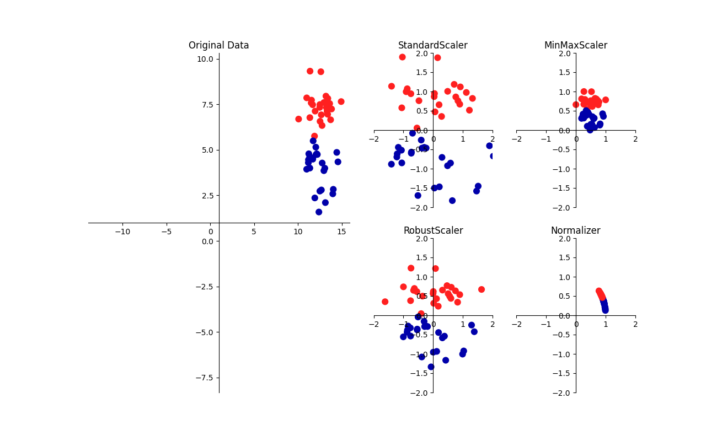
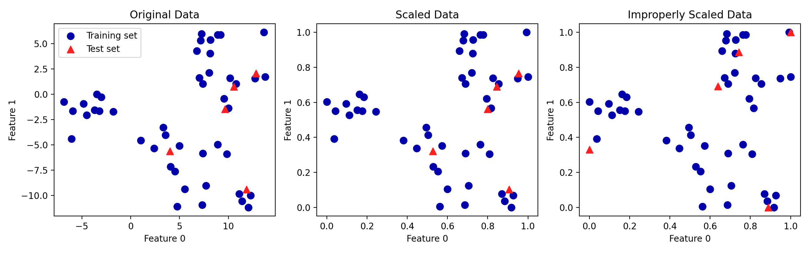

# Introduction of Unsupervised Learning

## Brief of Unsupervised Learning

在未加标签的数据中（比如没有答案的习题集），试图找到隐藏的结构

### Types of Unsupervised Learning

无监督学习主要有两种类型，**数据集变换** 与 **聚类**

#### Dataset Transformation

数据集的无监督变换是 **创建数据新的表示** ，与数据原始表示相比，新的表示可能更容易被人或其他机器学习算法所理解

- 利用无监督学习进行数据变换最常见的目的就是可视化、压缩数据，以及寻找信息量更大的数据表示以用于进一步的处理
- 常见应用是 **降维（dimensionality reduction）**，它接受包含许多特征的数据的高维表示，并找到表示该数据的一种新方法，用较少的特征就可以概括其重要特性，降维的一个常见应用是为了可视化数据降为二维
- 另一个应用是找到 “构成” 数据的各个组成部分，这方面的一个例子就是对文本文档集合进行主题提取，这里的任务是找到每个文档中讨论的未知主题，并学习每个文档中出现了哪些主题，这可以用于追踪社交媒体上的话题讨论，比如选举、枪支管制或流行歌手等话题
- 相关的算法有，**主成分分析**、**非负矩阵分解（NMF）** 和 **流形学习**

#### Clustering 

聚类算法将数据划分成不同的组，每组包含相似的物项，其目的是划分数据，使得一个簇内的数据点非常相似且不同簇内的数据点非常不同

- 聚类算法为每个数据点分配（预测）一个数字，表示这个点属于哪个簇
- 常用的聚类算法有，**k 均值聚类**、**凝聚聚类** 和 **DBSCAN**

### Challenges in Unsupervised Learning

- 无监督学习的一个主要挑战就是评估算法是否学到了有用的东西
- 无监督学习算法一般用于不包含任何标签值的数据，所以不知道正确的输出应该是什么，因此很难判断一个模型是否 “表现良好”
    - 假设聚类算法已经将所有的侧脸照片和所有的正面照片进行分组，这肯定是人脸照片集合的一种可能的划分方法，但并不是想要的那种方法
    - 没有办法 “告诉” 算法要的是什么，通常来说，评估无监督算法结果的一种方法就是 **人工检查**
    - 如果数据科学家想要更好地理解数据，那么无监督算法通常可以用于探索性的目的，而不是作为大型自动化系统的一部分

- 无监督算法的另一个常见应用是作为 **监督算法的预处理步骤**
    - 学习数据的一种新表示，有时可以提高监督算法的精度，或者 **减少内存占用** 和 **时间开销**

## Reprocessing and Scaling

一些算法（如神经网络和 SVM）对数据缩放非常敏感

因此，通常的做法是对特征进行调节，使数据表示更适合于这些算法，通常来说，这是对数据的一种简单的按特征的缩放和移动


```python
import mglearn
mglearn.plots.plot_scaling()
```



### Different Kinds of Preprocessing

#### StandScaler 

- 确保每个特征的平均值为 $0$、方差为 $1$，使所有特征都位于同一量级
- 但这种缩放不能保证特征任何特定的最大值和最小值

#### RobustScaler

- 工作原理与 StandScaler 类似，确保每个特征的统计属性都位于同一范围
- 但 RobustScaler 使用的是中位数和四分位数，而不是平均值和方差，这样 RobustScaler 会忽略与其他点有很大不同的数据点（比如测量误差）
- 这些与众不同的数据点也叫异常值（outlier），可能会给其他缩放方法造成麻烦

#### MinMaxScaler

- 移动数据，使所有特征都刚好位于 $0$ 到 $1$ 之间
- 对于二维数据集来说，所有数据都包含在 $x$ 轴 $0$ 到 $1$ 与 $y$ 轴 $0$ 到 $1$ 组成的矩形中

#### Normalizer

- 用到一种完全不同的缩放方法，它对每个数据点进行缩放，使得特征向量的欧式长度等于 $1$
- 它将一个数据点投射到半径为 $1$ 的圆上（对于更高维度的情况，是球面）
- 每个数据点的缩放比例都不相同（乘以其长度的倒数）
- 如果只有数据的方向（或角度）是重要的，而特征向量的长度无关紧要，那么通常会使用这种归一化

### Applying Data Transformations

将核 SVM（SVC）应用在 cancer 数据集上，需要使用 MinMaxScaler 来预处理数据，首先加载数据集并将其分为训练集和测试集


```python
from sklearn.datasets import load_breast_cancer
from sklearn.model_selection import train_test_split
cancer = load_breast_cancer()

X_train, X_test, y_train, y_test = train_test_split(cancer.data, cancer.target, random_state=1)
print(X_train.shape)
print(X_test.shape)
```

**Output**

```console
(426, 30)
(143, 30)
```

导入实现预处理的类，然后将其实例化

```python
from sklearn.preprocessing import MinMaxScaler

scaler = MinMaxScaler()
```

使用 `fit` 方法拟合缩放器（`scaler`），并将其应用于训练集，对于 MinMaxScaler 来说，`fit` 方法计算训练集中每个特征的最大值和最小值

```python
scaler.fit(X_train)
```

**Output**

```console
MinMaxScaler(copy=True, feature_range=(0, 1))
```

为了应用刚刚学习的变换（即对训练数据进行实际缩放），使用缩放器的 `transform` 方法，在 scikit-learn 中，每当模型返回数据的一种新表示时，都可以使用 transform 方法

```python
# transform data
X_train_scaled = scaler.transform(X_train)
# print dataset properties before and after scaling
print("transformed shape: {}".format(X_train_scaled.shape))
print("per-feature minimum before scaling:\n {}".format(X_train.min(axis=0)))
print("per-feature maximum before scaling:\n {}".format(X_train.max(axis=0)))
print("per-feature minimum after scaling:\n {}".format(
    X_train_scaled.min(axis=0)))
print("per-feature maximum after scaling:\n {}".format(
    X_train_scaled.max(axis=0)))
```

**Output**

```console
transformed shape: (426, 30)
per-feature minimum before scaling:
 [6.981e+00 9.710e+00 4.379e+01 1.435e+02 5.263e-02 1.938e-02 0.000e+00
 0.000e+00 1.060e-01 5.024e-02 1.153e-01 3.602e-01 7.570e-01 6.802e+00
 1.713e-03 2.252e-03 0.000e+00 0.000e+00 9.539e-03 8.948e-04 7.930e+00
 1.202e+01 5.041e+01 1.852e+02 7.117e-02 2.729e-02 0.000e+00 0.000e+00
 1.566e-01 5.521e-02]
per-feature maximum before scaling:
 [2.811e+01 3.928e+01 1.885e+02 2.501e+03 1.634e-01 2.867e-01 4.268e-01
 2.012e-01 3.040e-01 9.575e-02 2.873e+00 4.885e+00 2.198e+01 5.422e+02
 3.113e-02 1.354e-01 3.960e-01 5.279e-02 6.146e-02 2.984e-02 3.604e+01
 4.954e+01 2.512e+02 4.254e+03 2.226e-01 9.379e-01 1.170e+00 2.910e-01
 5.774e-01 1.486e-01]
per-feature minimum after scaling:
 [0. 0. 0. 0. 0. 0. 0. 0. 0. 0. 0. 0. 0. 0. 0. 0. 0. 0. 0. 0. 0. 0. 0. 0.
 0. 0. 0. 0. 0. 0.]
per-feature maximum after scaling:
 [1. 1. 1. 1. 1. 1. 1. 1. 1. 1. 1. 1. 1. 1. 1. 1. 1. 1. 1. 1. 1. 1. 1. 1.
 1. 1. 1. 1. 1. 1.]
```

- 变换后的数据形状与原始数据相同，特征只是发生了移动和缩放，现在所有特征都位于 $0$ 和 $1$ 之间，这也符合预期
- 为了将 SVM 应用到缩放后的数据上，还需要对测试集进行变换，这可以通过对 `X_test` 调用 `transform` 方法来完成


```python
# transform test data
X_test_scaled = scaler.transform(X_test)
# print test data properties after scaling
print("per-feature minimum after scaling:\n{}".format(X_test_scaled.min(axis=0)))
print("per-feature maximum after scaling:\n{}".format(X_test_scaled.max(axis=0)))
```


```console
per-feature minimum after scaling:
[ 0.0336031   0.0226581   0.03144219  0.01141039  0.14128374  0.04406704
  0.          0.          0.1540404  -0.00615249 -0.00137796  0.00594501
  0.00430665  0.00079567  0.03919502  0.0112206   0.          0.
 -0.03191387  0.00664013  0.02660975  0.05810235  0.02031974  0.00943767
  0.1094235   0.02637792  0.          0.         -0.00023764 -0.00182032]
per-feature maximum after scaling:
[0.9578778  0.81501522 0.95577362 0.89353128 0.81132075 1.21958701
 0.87956888 0.9333996  0.93232323 1.0371347  0.42669616 0.49765736
 0.44117231 0.28371044 0.48703131 0.73863671 0.76717172 0.62928585
 1.33685792 0.39057253 0.89612238 0.79317697 0.84859804 0.74488793
 0.9154725  1.13188961 1.07008547 0.92371134 1.20532319 1.63068851]
```

从上边的例子可以发现，对测试集缩放后的最大值和最小值不是 $1$ 和 $0$，有些特征甚至在 $0\sim1$ 范围以外，因为 MinMaxScaler（以及其他所有缩放器）总是对训练集和测试集应用完全相同的变换，也就是说，`transform` 方法总是减去训练集的最小值，然后除以训练集的范围，而这两个值可能与测试集的最小值和范围并不相同

### Scaling Training and Test Data the Same Way

为了让监督模型能够在测试集上运行，对训练集合测试集应用完全相同的变换是很重要的


```python
import numpy as np
import matplotlib.pyplot as plt
import mglearn
from sklearn.datasets import make_blobs
# make synthetic data
X, _ = make_blobs(n_samples=50, centers=5, random_state=4, cluster_std=2)
# split it into training and test sets
X_train, X_test = train_test_split(X, random_state=5, test_size=.1)

# make c argument 2D
cm20 = np.array(mglearn.cm2(0)).reshape(1, -1)
cm21 = np.array(mglearn.cm2(1)).reshape(1, -1)

# plot the training and test sets
fig, axes = plt.subplots(1, 3, figsize=(13, 4))
axes[0].scatter(X_train[:, 0], X_train[:, 1],
                c=cm20, label="Training set", s=60)
axes[0].scatter(X_test[:, 0], X_test[:, 1], marker='^',
                c=cm21, label="Test set", s=60)
axes[0].legend(loc='upper left')
axes[0].set_title("Original Data")

# scale the data using MinMaxScaler
scaler = MinMaxScaler()
scaler.fit(X_train)
X_train_scaled = scaler.transform(X_train)
X_test_scaled = scaler.transform(X_test)

# visualize the properly scaled data
axes[1].scatter(X_train_scaled[:, 0], X_train_scaled[:, 1],
                c=cm20, label="Training set", s=60)
axes[1].scatter(X_test_scaled[:, 0], X_test_scaled[:, 1], marker='^',
                c=cm21, label="Test set", s=60)
axes[1].set_title("Scaled Data")

# rescale the test set separately
# so test set min is 0 and test set max is 1
# DO NOT DO THIS! For illustration purposes only.
test_scaler = MinMaxScaler()
test_scaler.fit(X_test)
X_test_scaled_badly = test_scaler.transform(X_test)

# visualize wrongly scaled data
axes[2].scatter(X_train_scaled[:, 0], X_train_scaled[:, 1],
                c=cm20, label="training set", s=60)
axes[2].scatter(X_test_scaled_badly[:, 0], X_test_scaled_badly[:, 1],
                marker='^', c=cm21, label="test set", s=60)
axes[2].set_title("Improperly Scaled Data")

for ax in axes:
    ax.set_xlabel("Feature 0")
    ax.set_ylabel("Feature 1")
fig.tight_layout()
```



- 第一张图是未缩放的二维数据集，其中训练集用圆形表示，测试集用三角形表示
- 第二张图中是同样的数据，但使用 MinMaxScaler 缩放
    - 这里调用 `fit` 作用在训练集上，然后调用 `transform` 作用在训练集合测试集上
    - 第二张图中的数据集看起来与第一张图中的完全相同，只是坐标轴发生了变化，现在所有特征都位于 $0$ 到 $1$ 之间
    - 还可以发现测试数据（三角形）的特征最大值和最小值并不是 $1$ 和 $0$
- 第三张图展示了如果对训练集和测试集分别进行缩放
    - 在这种情况下，对训练集和测试集而言，特征的最大值和最小值都是 $1$ 和 $0$
    - 现在数据集看起来不一样，测试集相对训练集的移动不一致，因为它们分别做了不同的缩放，随意改变了数据的排列

### The Effect of Preprocessing on Supervised learning

现在回到 cancer 数据集，观察使用 MinMaxScaler 对学习 SVC 的作用，为了对比，再次在原始数据上拟合 SVC


```python
from sklearn.svm import SVC

X_train, X_test, y_train, y_test = train_test_split(cancer.data, cancer.target,
                                                    random_state=0)

svm = SVC(C=100)
svm.fit(X_train, y_train)
print("Test set accuracy: {:.2f}".format(svm.score(X_test, y_test)))
```

**Output**

```console
Test set accuracy: 0.94
```

下面先用 MinMaxScaler 对数据进行缩放，然后再拟合 SVC


```python
# preprocessing using 0-1 scaling
scaler = MinMaxScaler()
scaler.fit(X_train)
X_train_scaled = scaler.transform(X_train)
X_test_scaled = scaler.transform(X_test)

# learning an SVM on the scaled training data
svm.fit(X_train_scaled, y_train)

# scoring on the scaled test set
print("Scaled test set accuracy: {:.2f}".format(
    svm.score(X_test_scaled, y_test)))
```

**Output**

```console
Scaled test set accuracy: 0.97
```

正如上面所见，数据缩放有提升准确率的效果，虽然数据缩放不涉及任何复杂的数学，但良好的做法仍然是使用 scikit-learn 提供的缩放机制，而不是自己重新实现它们


你也可以通过改变使用的类将一种预处理算法轻松替换成另一种，因为所有的预处理都具有相同的接口，都包含 `fit` 和 `transform` 方法

```python
# preprocessing using zero mean and unit variance scaling
from sklearn.preprocessing import StandardScaler
scaler = StandardScaler()
scaler.fit(X_train)
X_train_scaled = scaler.transform(X_train)
X_test_scaled = scaler.transform(X_test)

# learning an SVM on the scaled training data
svm.fit(X_train_scaled, y_train)

# scoring on the scaled test set
print("SVM test accuracy: {:.2f}".format(svm.score(X_test_scaled, y_test)))
```

**Output**

```console
SVM test accuracy: 0.96
```

可以看到，数据缩放的作用非常显著，更换预处理算法也是非常轻松简单
