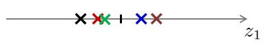

# Principal Component Analysis

## Data Reduction

在实际生产生活中，我们所获得的数据集在特征上往往具有很高的维度，对高维度的数据进行处理时消耗的时间很大，并且过多的特征变量也会妨碍查找规律的建立，**如何在最大程度上保留数据集信息量的前提下进行数据维度的降低**，是我们需要解决的问题

对数据进行降维有以下 **优点**

- 使得数据集更易使用
- 降低很多算法的计算开销
- 去除噪声
- 使得结果易懂

降维技术作为数据预处理的一部分，即可使用在监督学习中也能够使用在非监督学习中，而降维技术主要有以下几种，**主成分分析（Principal Component Analysis，PCA）**、**因子分析（Factor Analysis）**，以及 **独立成分分析（Independent Component Analysis, ICA）** ，其中 **主成分分析 PCA** 应用最为广泛

## Principe of PCA

### Use PCA to Reduce Dimensionality

我们利用一个例子来理解 PCA 如何进行降维的，参考下图，对于样本数据 

$$
D={x(1),\;x(2),\cdots,\;x(m)}
$$

其中

$$
x^{(i)}=\left[x_1^{(i)}, x_2^{(i)} \right]^\mathrm{T}
$$


我们需要将上图的样本数据由 **二维** 降至 **一维** ，如下图


一般来说，这些样本点在坐标图中任意一条向量上都可以投影成一维的，但如何选择 **最佳投影向量**，需要 **在最大程度上保留数据集的信息量的前提下进行数据维度的降低**，因此我们需要有 **优化目标** 来对图中的向量进行选择

而 PCA 的 **优化目标** 就是

- 对于 $2$ 维降到 $1$ 维，找到一个投影方向，使得 **投影误差和最小**
- 对于 $n$ 维降到 $k$ 维，找到 $k$ 个向量定义的 $k$ 维投影平面，使得 **投影误差和最小** 

其中，**投影误差** 即为，每一个样本点到投影向量或者投影平面的距离，而 **投影误差和**  即为所有样本点到投影向量或投影平面的距离的和

下面两幅图展示了两种不同投影向量

|Projection Method I|Projection Method II|
|:---:|:---:|
| ||

我们能够和清楚地看到，对于第一种向量的 **投影误差和** 一定比第二种的 **投影误差和** 要小，对应以上两幅图的投影结果

|Projection Result I|Projection Result II|
|:---:|:---:|
| ||


假设对于原样本中，位于第一象限的三个样本点属于类别 “A” ，位于第三象限的两个样本点属于类别 “B”，经过投影后，我们可以看出，对于第一种降维，在降维后仍旧保持了位于原点右侧的三个样本属于类别 “A”，位于原点左侧的两个样本属于类别 “B”，而对于第二种投影，明显可以看出，已经不能够分辨出样本的类别了，换句话说，第二种投影方式丢失了一些信息

因此，"投影误差和最小" 便成为我们所需要优化的目标，由于数学上已经证明了 **最大可分性（误差最大）** 与 **最近重构性（投影和最小）** 两种优化等价，所以实际 **寻找到方差最大的方向即可**

### Example in Mglearn

主成分分析（Principal Component Analysis，PCA）是一种旋转数据集的方法，**旋转后的特征在统计上不相关**，在做完这种旋转之后，通常是根据新特征对解释数据的重要性来选择它的一个子集

```python
mglearn.plots.plot_pca_illustration()
```


上面的四张图显示了 PCA 算法降维的过程

- 第一张图（左上）显示的是原始数据点，用不同颜色加以区分
    - 算法首先找到方差最大的方向，将其标记为 “成分1”（Component 1），这是数据中包含最多信息的方向（或向量），沿着这个方向的特征之间最为相关
    - 然后，算法找到与第一个方向正交（成直角）且包含最多信息的方向，在二维空间中，只有一个成直角的方向，但在更高维的空间中会有（无穷）多的正交方向
    - 虽然这两个成分都画成箭头，但其头尾的位置并不重要，也可以将第一个成分画成从中心指向左上，而不是指向右下
    - 利用这一过程找到的方向称为主成分（Principal Component），因为它们是数据方差的主要方向
    - 一般来说，主成分的个数与原始特征相同

- 第二张图显示的是同样的数据，但现在将其旋转，使得第一主成分与 $x$ 轴平行且第二主成分与 $y$ 轴平行
    - 在旋转之前，从数据中减去平均值，使得变换后的数据以零为中心，在 PCA 找到的旋转表示中，两个坐标轴是不相关的，对于这种数据表示，除了对角线，相关矩阵全部为零
    - 可以通过仅保留一部分主成分来使用 PCA 进行降维

- 在这个例子中，可以仅保留第一个主成分，正如第三张图所示（左下），这将数据从二维数据降为一维数据集
    - 注意，没有保留原始特征之一，而是找到了最有趣的成分（第一张图中从左上到右下）并保留这一方向，即第一主成分

- 最后，可以反向旋转并将平均值重新加到数据中，这样会得到上面最后一张图的数据
    - 这些数据点位于原始特征空间中，但仅保留了第一主成分中包含的信息
    - 这种变换有时用于去除数据中的噪声影响，或者将主成分中保留的那部分信息可视化

## PCA Algorithm

### Idea PCA Algorithm

**PCA** 的 **算法思路** 主要是，数据从原来的坐标系转换到新的坐标系，由数据本身决定，转换坐标系时，以方差最大的方向作为坐标轴方向，因为数据的最大方差给出了数据的最重要的信息，第一个新坐标轴选择的是原始数据中方差最大的方向，第二个新坐标轴选择的是与第一个新坐标轴正交且方差次大的方向，重复该过程，重复次数为原始数据的特征维数

通过这种方式获得的新的坐标系，我们发现，大部分方差都包含在前面几个坐标轴中，后面的坐标轴所含的方差几乎为 $0$，于是，我们可以忽略余下的坐标轴，只保留前面的几个含有绝大部分方差的坐标轴，事实上，这样也就相当于只保留包含绝大部分方差的维度特征，而忽略包含方差几乎为 $0$ 的特征维度，也就实现了对数据特征的降维处理

### Key Points of PCA Algorithm

根据以上 PCA 算法思路的描述，我们大概可以看出，对于 PCA 算法，其要点主要是 **如何找到方差最大的方向**

这里将提到有关线性代数里的一些内容

- 协方差矩阵
	- 特征 $X_i$ 与特征 $X_j$ 的 **协方差（Covariance）** 为
        $$
	    Cov(X_i,X_j)=\frac{\sum\limits_{k=1}^{n}\left( X_i^{(k)} - \overline{X_i} \right)
		\left( X_j^{(k)} - \overline{X_j} \right)}{n-1}
	    $$

	    其中 $X_i^{(k)}$，$X_i^{(k)}$ 表示特征 $X_i$ ，$X_j$ 的第 $k$ 个样本中的取值，而 $\overline{X_i}$ ， $\overline{X_j}$ 则是表示两个特征的样本均值

	    可以看出，**当** $X_i=X_j$ **时，协方差即为方差**

	- 对于一个只有两个特征的样本来说，其 **协方差矩阵** 为

		$$
		C=\left[
		\begin{matrix}
		Cov(X_1,X_1) & Cov(X_1,X_2) \\
		Cov(X_2,X_1) & Cov(X_2,X_2)
		\end{matrix}
		\right]
		$$

		当特征数为 $n$ 时，协方差矩阵为 $n\times n$ 维的矩阵，且对角线为各特征的方差值

- 特征向量与特征值
	- 对于矩阵 $A$ ，若满足 $A\zeta=\lambda\zeta$ ，则称 $\zeta$ 是矩阵 $A$ 的 **特征向量** ，而 $\lambda$ 则是矩阵 $A$ 的 **特征值**，将特征值按照 **从大到小** 的顺序进行排序，选择前 $k$ 个特征值所对应的 **特征向量** 即为所求投影向量
	- 对于特征值与特征向量的求解，主要是，特征值分解（当 $A$ 为方阵时），奇异值 SVD 分解（当 $A$ 不为方阵时）

### PCA Algorithm Process

**Input** 训练样本集 $D=x(1),x(2),\cdots,x(m)$，低维空间维数 $d'$

**Process**

- 对所有样本进行中心化（去均值操作） $x_j^{(i)}←x_j^{(i)}−\frac1m\sum\limits_{i=1}^mx_j^{(i)}$
- 计算样本的协方差矩阵 $XX^\mathrm{T}$ 
- 对协方差矩阵 $XX^\mathrm{T}$ 做特征值分解 
- 取最大的 $d'$ 个特征值所对应的特征向量 $w_1,w_2,\cdots,w_{d'}$
- 将原样本矩阵与投影矩阵相乘，$X\cdot W$ 即为降维后数据集 $X'$，其中 $X$ 为 $m\times n$ 维， $W=[w_1, w_2, \cdots, w_{d'}]$ 为 $n\times d'$ 维

**Output** 降维后的数据集 $X'$

## PCA Examples

### Data Visualization

PCA 最常见的应用之一就是将高维数据集可视化，对于两个以上特征的数据，很难绘制散点图

#### Iris Dataset

对于 Iris（鸢尾花）数据集，可以创建散点图矩阵，通过展示特征所有可能的两两组合来表示数据的局部图像

##### Meet the Data

本例中我们用到了鸢尾花数据集，这是机器学习和统计学中一个经典的数据集，它包含在 scikit-learn 的 `datasets` 模型中，我们可以调用 `load_iris` 函数来加载数据

```python
from sklearn.datasets import load_iris
iris_dataset = load_iris()
```

`load_iris` 返回的 iris 对象是一个 `Bunch` 对象，与字典非常相似，里面包含键和值

```python
print("Keys of iris_dataset:\n{}".format(iris_dataset.keys()))
```

**Output**

```console
Keys of iris_dataset:
dict_keys(['data', 'target', 'target_names', 'DESCR', 'feature_names', 'filename'])
```

`targte_names` 键对应的值时一个字符串数组，里面包含我们要预测的花的品种

```python
print("Target names:{}".format(iris_dataset['target_names']))
```

**Output**

```console
Target names:['setosa' 'versicolor' 'virginica']
```

`feature_names` 键对应的值是一个字符串列表，对每一个特征进行了说明

```python
print("Feature names:\n{}".format(iris_dataset['feature_names']))
```

**Output**

```console
Feature names:
['sepal length (cm)', 'sepal width (cm)', 'petal length (cm)', 'petal width (cm)']
```

数据包含在 `target ` 和 `data` 字段中，`data` 里面是花萼长度、花萼宽度、花瓣长度、花瓣宽度的测量是，格式为 Numpy 数组

```python
print("Type of data:{}".format(type(iris_dataset['data'])))
```

**Output**

```console
Type of data:<class 'numpy.ndarray'>
```

`data` 数组的每一行对应一朵花，列代表每朵花的四个测量数据

```python
print("Shape of data:{}".format(iris_dataset['data'].shape))
```

**Output**

```console
Shape of data:(150, 4)
```

可以看出，数组中包含 $150$ 朵鸢尾花的测量数据，我们曾说过，机器学习中的个体叫作样本（Sample），其属性叫作特征（Feature），`data` 数组的形状（`shape`）是样本数乘以特征数，这是 scikit-learn 中的约定，你的数据形状应始终遵循这个约定

我们看下前 $5$ 个样本的特征数据

```python
print("First five rows of data:\n{}".format(iris_dataset['data'][:5]))
```

**Output**

```console
First five rows of data:
[[5.1 3.5 1.4 0.2]
 [4.9 3.  1.4 0.2]
 [4.7 3.2 1.3 0.2]
 [4.6 3.1 1.5 0.2]
 [5.  3.6 1.4 0.2]]
```

从数据中可以看出，前 $5$ 朵花的花瓣宽度都是 $0.2cm$，第一朵花的花萼最长，是 $5.1cm$

`target` 数组包含的是测量过的每朵花的品种，也是一个 Numpy 数组

```python
print("Type of target:{}".format(type(iris_dataset['target'])))
```

**Output**

```console
Type of target:<class 'numpy.ndarray'>
```

`target` 是一维数组，每朵花对应其中一个数据

```python
print("Shape of target:{}".format(iris_dataset['target'].shape))
```

**Output**

```console
Shape of target:(150,)
```

品种被转换成从 $0$ 到 $2$ 的整数

```python
print("Targt:\n{}".format(iris_dataset['target']))
```

**Output**

```console
Targt:
[0 0 0 0 0 0 0 0 0 0 0 0 0 0 0 0 0 0 0 0 0 0 0 0 0 0 0 0 0 0 0 0 0 0 0 0 0
 0 0 0 0 0 0 0 0 0 0 0 0 0 1 1 1 1 1 1 1 1 1 1 1 1 1 1 1 1 1 1 1 1 1 1 1 1
 1 1 1 1 1 1 1 1 1 1 1 1 1 1 1 1 1 1 1 1 1 1 1 1 1 1 2 2 2 2 2 2 2 2 2 2 2
 2 2 2 2 2 2 2 2 2 2 2 2 2 2 2 2 2 2 2 2 2 2 2 2 2 2 2 2 2 2 2 2 2 2 2 2 2
 2 2]
```

上述数字的代表含义由 `iris['target_names']` 数组给出，`0` 代表 `setosa`，`1` 代表 `versicolor`，`2` 代表 `virginica`

##### Training and Testing Data

我们将一部分数据用于构建机器学习模型，叫作训练数据（Training Data）或训练集（Training Set），其余的数据用来评估模型性能，叫做测试数据（Test Data）、测试集（Test Set）或留出集（Hold-Out Set）

```python
from sklearn.model_selection import train_test_split
X_train, X_test, y_train, y_test = train_test_split(
    iris_dataset['data'], iris_dataset['target'], random_state=0
)
```

`train_test_split` 函数利用为随机数生成器见数据集打乱，为了确保多次运行同一函数能够得到相同的输出，我们利用`random_state` 参数指定了随机数生成器的种子，这样函数输出是固定不变的，所以这行代码的输出始终相同

```python
print("X_train shape:{}".format(X_train.shape))
print("y_train shape:{}".format(y_train.shape))
```

**Output**

```console
X_train shape:(112, 4)
y_train shape:(112,)
```

我们看到有 $112$ 个样本被划分为训练集，那么测试集就是剩下的 $38$ 个样本

```python
print("X_test shape:{}".format(X_test.shape))
print("y_test shape:{}".format(y_test.shape))
```

**Output**

```console
X_test shape:(38, 4)
y_test shape:(38,)
```

##### Look the Data

在构建机器学习模型之前，通常最好检查一下数据，看看如果不用机器学习能不能轻松完成任务，或者需要的信息有没有包含在数据中，检查数据的最佳方法之一就是将其可视化

一种可视化方法是绘制散点图（Scatter Plot），数据散点图将一个特征作为 $x$ 轴，另一个特征作为 $y$ 轴，将每一个数据点绘制为图上的一个点

不幸的是，屏幕通常只有两个维度，所以我们一次只能绘制两个特征，用这种方法难以对多于 $3$ 个特征的数据集作图，解决这个问题的一种方法是绘制散点图矩阵（Pair Plot），从而可以两两查看所有的特征

```python
import numpy as np
import matplotlib.pyplot as plt
import pandas as pd
import mglearn
# 利用 X_train 中的数据创建 DataFrame
# 利用 iris_dataset.feature_names 中的字符串对数据进行标记
iris_dataframe = pd.DataFrame(X_train, columns=iris_dataset.feature_names)
# 利用 DataFrame 创建散点图矩阵，按 y_train 着色
grr = pd.plotting.scatter_matrix(
    iris_dataframe, c=y_train, figsize=(12, 10), marker='o', 
    hist_kwds={'bins': 20}, s=60, alpha=0.8, cmap=mglearn.cm3
)
```


从上图可以看出，利用花瓣（Petal）和花萼(Sepal）的测量数据基本可以将三个类别区分开，这说明机器学习模型很可能可以学习得到区分它们的模型

#### Applying PCA to the Cancer Dataset for Visualization

但如果想要查看乳腺癌数据集，即使用散点图矩阵也很困难，这个数据集包含 $30$ 个特征，这就导致需要绘制茫茫多张散点图！这就不可能仔细观察所有这些图像，更不用说试图理解它们了

不过可以使用一种更简单的可视化方法 —— 对每个特征分别计算两个类别（良性肿瘤和恶性肿瘤）的直方图

```python
import numpy as np
import matplotlib.pyplot as plt
from sklearn.datasets import load_breast_cancer
import mglearn

cancer = load_breast_cancer()
fig, axes = plt.subplots(15, 2, figsize=(10, 20))
malignant = cancer.data[cancer.target == 0]
benign = cancer.data[cancer.target == 1]

ax = axes.ravel()

for i in range(30):
    _, bins = np.histogram(cancer.data[:, i], bins=50)      # 直方图分成 50 份，需要 51 个锚点
    ax[i].hist(malignant[:, i], bins=bins, color=mglearn.cm3(0), alpha=.5)
    ax[i].hist(benign[:, i], bins=bins, color=mglearn.cm3(2), alpha=.5)
    ax[i].set_title(cancer.feature_names[i])
    ax[i].set_yticks(())
ax[0].set_xlabel("Feature magnitude")
ax[0].set_ylabel("Frequency")
ax[0].legend(["malignant", "benign"], loc="best")
fig.tight_layout()
```


这里为每个特征创建一个直方图，计算具有某一特征的数据点在特定范围内（叫作 `bins`）的出现概率
- 每张图都包含两个直方图，一个是良性类别的所有点（绿色），一个是恶性类别的所有点（蓝色）
- 这样可以了解每个特征在两个类别中的分布情况，也可以猜测哪些特征能够更好地区分良性样本和恶性样本
    - 例如，“smoothness error” 特征似乎没有什么信息量，因为两个直方图大部分都重叠在一起，而 “worst concave points” 特征看起来信息量相当大，因为两个直方图的交集很小
- 但是，这种图无法展示变量之间的相互作用以及这种相互作用与类别之间的关系

利用 PCA，可以获取到主要的相互作用，并得到稍微完整的图像，可以找到前两个主成分，并在这个新的二维空间中利用散点图将数据可视化

在应用 PCA 之前，利用 StandardScaler 缩放数据，使每个特征的方差均为 1


```python
from sklearn.preprocessing import StandardScaler

cancer = load_breast_cancer()
scaler = StandardScaler()
scaler.fit(cancer.data)
X_scaled = scaler.transform(cancer.data)
```

学习并应用 PCA 变换与应用预处理变换一样简单
- 将 PCA 对象实例化，调用 `fit` 方法找到主成分，然后调用 `transform` 来旋转并降维
- 默认情况下，PCA 仅旋转（并移动）数据，但保留所有的主成分
- 为了降低数据的维度，需要在创建 PCA 对象时指定想要保留的主成分个数

```python
from sklearn.decomposition import PCA
# 保留数据的前两个主成分
pca = PCA(n_components=2)
# 对乳腺癌数据拟合 PCA 模型
pca.fit(X_scaled)

# 将数据变换到前两个主成分的方向上
X_pca = pca.transform(X_scaled)
print("Original shape: {}".format(str(X_scaled.shape)))
print("Reduced shape: {}".format(str(X_pca.shape)))
```

**Output**

```console
Original shape: (569, 30)
Reduced shape: (569, 2)
```

现在可以对前两个主成分作图

```python
# 对第一个和第二个主成分作图，按类别着色
plt.figure(figsize=(8, 8))
mglearn.discrete_scatter(X_pca[:, 0], X_pca[:, 1], cancer.target)
plt.legend(cancer.target_names, loc="best")
plt.gca().set_aspect("equal")
plt.xlabel("First principal component")
plt.ylabel("Second principal component")
```


- 重要的是要注意，PCA 是一种无监督方法，在寻找旋转方向时没有用到任何类别信息，它只是观察数据中的相关性
    - 对于这里所示的散点图，绘制了第一主成分与第二主成分的关系，然后利用类别信息对数据点进行着色。
    - 在这个二维空间中两个类别被很好地分离，即使是线性分类器（在这个空间中学习一条直线）也可以在区分这两个类别时表现得相当不错
    - 恶性点比良性点更加分散，这一点也可以从之前的直方图中看出来

- PCA 的一个缺点在于，通常不容易对图中的两个轴做出解释
    - 主成分对应于原始数据中的方向，所以它们是原始特征的组合，但这些组合往往非常复杂
    - 在拟合过程中，主成分被保留在 PCA 对象的 `components_` 属性中


```python
print("PCA component shape: {}".format(pca.components_.shape))
```

**Output**

```console
PCA component shape: (2, 30)
```

`components_` 的每一行对应于一个主成分，它们按重要性（第一主成分排在首位，以此类推），列对应于 PCA 的原始特征属性，在本例中即为 “mean radius”，“mean texture” 等

查看 `components_` 的内容

```python
print("PCA components:\n{}".format(pca.components_))
```

**Output**

```console
PCA components:
[[ 0.21890244  0.10372458  0.22753729  0.22099499  0.14258969  0.23928535
   0.25840048  0.26085376  0.13816696  0.06436335  0.20597878  0.01742803
   0.21132592  0.20286964  0.01453145  0.17039345  0.15358979  0.1834174
   0.04249842  0.10256832  0.22799663  0.10446933  0.23663968  0.22487053
   0.12795256  0.21009588  0.22876753  0.25088597  0.12290456  0.13178394]
 [-0.23385713 -0.05970609 -0.21518136 -0.23107671  0.18611302  0.15189161
   0.06016536 -0.0347675   0.19034877  0.36657547 -0.10555215  0.08997968
  -0.08945723 -0.15229263  0.20443045  0.2327159   0.19720728  0.13032156
   0.183848    0.28009203 -0.21986638 -0.0454673  -0.19987843 -0.21935186
   0.17230435  0.14359317  0.09796411 -0.00825724  0.14188335  0.27533947]]
```

还可以用热图将系数可视化

```python
plt.matshow(pca.components_, cmap='viridis')
plt.yticks([0, 1], ["First component", "Second component"])
plt.colorbar()
plt.xticks(range(len(cancer.feature_names)),
           cancer.feature_names, rotation=60, ha='left')
plt.xlabel("Feature")
plt.ylabel("Principal components")
```


- 在第一个主成分中，所有特征的符号相同（均为正，但前面提到过，箭头指向哪个方向无关紧要），这意味着在所有特征之间存在普遍的相关性，如果一个测量值较大的话，其他的测量值可能也较大
- 第二个主成分的符号有正有负
- 两个主成分都包含所有 30 个特征，这种所有特征的混合使得解释上图中的坐标轴变的十分困难
- 对于二分类的问题，通过降维可以在最大的主成分上就呈现良好的效果

### Accurate PCA

在 scikit-learn 中， [`PCA`](https://scikit-learn.org/stable/modules/generated/sklearn.decomposition.PCA.html#sklearn.decomposition.PCA) 被实现为一个变换器对象， 通过 `fit` 方法可以拟合出 $n$ 个成分， 并且可以将新的数据投影（project 亦可理解为分解）到这些成分中

在应用 SVD（奇异值分解)）之前，PCA 是在为每个特征聚集而不是缩放输入数据，可选参数 `whiten=True` 使得可以将数据投影到奇异（singular）空间上，同时将每个成分缩放到单位方差

以下是 iris 数据集的一个示例，该数据集包含 $4$ 个特征，通过 PCA 降维后投影到方差最大的二维空间上

| PCA  | LDA  |
|:----:|:----:|
| ||

```console
explained variance ratio (first two components): [0.92461872 0.05306648]
```

## Summary

### Strengths

PCA 使得数据更易使用，并且可以去除数据中的噪声，使得其他机器学习任务更加精确，该算法往往作为预处理步骤，在数据应用到其他算法之前清洗数据

### Weakness

数据维度降低并不代表特征的减少，因为降维仍旧保留了较大的信息量，对结果过拟合问题并没有帮助，不能将降维算法当做解决过拟合问题方法，如果原始数据特征维度并不是很大，也并不需要进行降维
