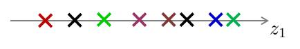

# Principal Component Analysis

## Data Reduction

在实际生产生活中，我们所获得的数据集在特征上往往具有很高的维度，对高维度的数据进行处理时消耗的时间很大，并且过多的特征变量也会妨碍查找规律的建立，**如何在最大程度上保留数据集信息量的前提下进行数据维度的降低**，是我们需要解决的问题

对数据进行降维有以下 **优点**

- 使得数据集更易使用
- 降低很多算法的计算开销
- 去除噪声
- 使得结果易懂

降维技术作为数据预处理的一部分，即可使用在监督学习中也能够使用在非监督学习中，而降维技术主要有以下几种，**主成分分析（Principal Component Analysis，PCA）**、**因子分析（Factor Analysis）**，以及 **独立成分分析（Independent Component Analysis, ICA）** ，其中 **主成分分析 PCA** 应用最为广泛

## Principe of PCA

### Use PCA to Reduce Dimensionality

我们利用一个例子来理解 PCA 如何进行降维的，参考下图，对于样本数据 

$$
D={x(1),\;x(2),\cdots,\;x(m)}
$$

其中

$$
x^{(i)}=\left[x_1^{(i)}, x_2^{(i)} \right]^\mathrm{T}
$$


我们需要将上图的样本数据由 **二维** 降至 **一维** ，如下图



一般来说，这些样本点在坐标图中任意一条向量上都可以投影成一维的，但如何选择 **最佳投影向量**，需要 **在最大程度上保留数据集的信息量的前提下进行数据维度的降低**，因此我们需要有 **优化目标** 来对图中的向量进行选择

而 PCA 的 **优化目标** 就是

- 对于 $2$ 维降到 $1$ 维，找到一个投影方向，使得 **投影误差和最小**
- 对于 $n$ 维降到 $k$ 维，找到 $k$ 个向量定义的 $k$ 维投影平面，使得 **投影误差和最小** 

其中，**投影误差** 即为，每一个样本点到投影向量或者投影平面的距离，而 **投影误差和**  即为所有样本点到投影向量或投影平面的距离的和

下面两幅图展示了两种不同投影向量

 

我们能够和清楚地看到，对于第一种向量的 **投影误差和** 一定比第二种的 **投影误差和** 要小，对应以上两幅图的投影结果

 

假设对于原样本中，位于第一象限的三个样本点属于类别 “A” ，位于第三象限的两个样本点属于类别 “B”，经过投影后，我们可以看出，对于第一种降维，在降维后仍旧保持了位于原点右侧的三个样本属于类别 “A”，位于原点左侧的两个样本属于类别 “B”，而对于第二种投影，明显可以看出，已经不能够分辨出样本的类别了，换句话说，第二种投影方式丢失了一些信息

因此，"投影误差和最小" 便成为我们所需要优化的目标，由于数学上已经证明了 **最大可分性（误差最大）** 与 **最近重构性（投影和最小）** 两种优化等价，所以实际 **寻找到方差最大的方向即可**

### Example in Mglearn

主成分分析（Principal Component Analysis，PCA）是一种旋转数据集的方法，**旋转后的特征在统计上不相关**，在做完这种旋转之后，通常是根据新特征对解释数据的重要性来选择它的一个子集

```python
mglearn.plots.plot_pca_illustration()
```


上面的四张图显示了 PCA 算法降维的过程

- 第一张图（左上）显示的是原始数据点，用不同颜色加以区分
    - 算法首先找到方差最大的方向，将其标记为 “成分1”（Component 1），这是数据中包含最多信息的方向（或向量），沿着这个方向的特征之间最为相关
    - 然后，算法找到与第一个方向正交（成直角）且包含最多信息的方向，在二维空间中，只有一个成直角的方向，但在更高维的空间中会有（无穷）多的正交方向
    - 虽然这两个成分都画成箭头，但其头尾的位置并不重要，也可以将第一个成分画成从中心指向左上，而不是指向右下
    - 利用这一过程找到的方向称为主成分（Principal Component），因为它们是数据方差的主要方向
    - 一般来说，主成分的个数与原始特征相同

- 第二张图显示的是同样的数据，但现在将其旋转，使得第一主成分与 $x$ 轴平行且第二主成分与 $y$ 轴平行
    - 在旋转之前，从数据中减去平均值，使得变换后的数据以零为中心，在 PCA 找到的旋转表示中，两个坐标轴是不相关的，对于这种数据表示，除了对角线，相关矩阵全部为零
    - 可以通过仅保留一部分主成分来使用 PCA 进行降维

- 在这个例子中，可以仅保留第一个主成分，正如第三张图所示（左下），这将数据从二维数据降为一维数据集
    - 注意，没有保留原始特征之一，而是找到了最有趣的成分（第一张图中从左上到右下）并保留这一方向，即第一主成分

- 最后，可以反向旋转并将平均值重新加到数据中，这样会得到上面最后一张图的数据
    - 这些数据点位于原始特征空间中，但仅保留了第一主成分中包含的信息
    - 这种变换有时用于去除数据中的噪声影响，或者将主成分中保留的那部分信息可视化

## PCA Algorithm

### Idea PCA Algorithm

**PCA** 的 **算法思路** 主要是，数据从原来的坐标系转换到新的坐标系，由数据本身决定，转换坐标系时，以方差最大的方向作为坐标轴方向，因为数据的最大方差给出了数据的最重要的信息，第一个新坐标轴选择的是原始数据中方差最大的方向，第二个新坐标轴选择的是与第一个新坐标轴正交且方差次大的方向，重复该过程，重复次数为原始数据的特征维数

通过这种方式获得的新的坐标系，我们发现，大部分方差都包含在前面几个坐标轴中，后面的坐标轴所含的方差几乎为 $0$，于是，我们可以忽略余下的坐标轴，只保留前面的几个含有绝大部分方差的坐标轴，事实上，这样也就相当于只保留包含绝大部分方差的维度特征，而忽略包含方差几乎为 $0$ 的特征维度，也就实现了对数据特征的降维处理

### Key Points of PCA Algorithm

根据以上 PCA 算法思路的描述，我们大概可以看出，对于 PCA 算法，其要点主要是**如何找到方差最大的方向**

这里将提到有关线性代数里的一些内容

- 协方差矩阵

	- 特征 $X_i$ 与特征 $X_j$ 的 **协方差（Covariance）**
		$$
		Cov(X_i,X_j)=\frac{\sum\limits_{k=1}^{n}\left( X_i^{(k)} - \overline{X_i} \right)
		\left( X_j^{(k)} - \overline{X_j} \right)}{n-1}
		$$
		

		其中 $X_i^{(k)}$，$X_i^{(k)}$ 表示特征 $X_i$ ，$X_j$ 的第 $k$ 个样本中的取值，而 $\overline{X_i}$ ， $\overline{X_j}$ 则是表示两个特征的样本均值

		可以看出，**当 $X_i=X_j$ 时，协方差即为方差**

	- 对于一个只有两个特征的样本来说，其 **协方差矩阵** 为
		$$
		C=\left[
		\begin{matrix}
		Cov(X_1,X_1) & Cov(X_1,X_2) \\
		Cov(X_2,X_1) & Cov(X_2,X_2)
		\end{matrix}
		\right]
		$$
		当特征数为 $n$ 时，协方差矩阵为 $n\times n$ 维的矩阵，且对角线为各特征的方差值

- 特征向量与特征值

	对于矩阵 $A$ ，若满足 $A\zeta=\lambda\zeta$ ，则称 $\zeta$ 是矩阵 $A$ 的 **特征向量** ，而 $\lambda$ 则是矩阵 $A$ 的 **特征值**，将特征值按照**从大到小** 的顺序进行排序，选择前 $k$ 个特征值所对应的 **特征向量** 即为所求投影向量

	对于特征值与特征向量的求解，主要是：特征值分解（当 $A$ 为方阵时），奇异值 SVD 分解（当 $A$ 不为方阵时）

## PCA算法过程

**输入** 训练样本集 $D=x(1),x(2),\cdots,x(m)$，低维空间维数 $d′$

**过程**

- 对所有样本进行中心化（去均值操作） $x_j^{(i)}←x_j^{(i)}−\frac1m\sum\limits_{i=1}^mx_j^{(i)}$
- 计算样本的协方差矩阵 $XX^\mathrm{T}$ 
- 对协方差矩阵 $XX^\mathrm{T}$ 做特征值分解 
- 取最大的 $d′$ 个特征值所对应的特征向量 $w_1,w_2,\cdots,w_{d′}$
- 将原样本矩阵与投影矩阵相乘： $X\cdot W$ 即为降维后数据集 $X′$，其中 $X$ 为 $m\times n$ 维， $W=[w_1,w_2,\cdots,w_{d′}]$ 为 $n\times d′$ 维

**输出** 降维后的数据集 $X'$

## PCA在Sklearn中的示例

### 准确的PCA和概率解释

在 scikit-learn 中， [`PCA`](https://scikit-learn.org/stable/modules/generated/sklearn.decomposition.PCA.html#sklearn.decomposition.PCA) 被实现为一个变换器对象， 通过 `fit` 方法可以拟合出 $n$ 个成分， 并且可以将新的数据投影（project 亦可理解为分解）到这些成分中

在应用 SVD（奇异值分解)）之前，PCA 是在为每个特征聚集而不是缩放输入数据，可选参数 `whiten=True` 使得可以将数据投影到奇异（singular）空间上，同时将每个成分缩放到单位方差，如果下游模型对信号的各向同性作出强假设，这通常是有用的，例如，使用 RBF 内核的 SVM 算法和 K-Means 聚类算法

以下是 iris 数据集的一个示例，该数据集包含 $4$ 个特征，通过 PCA 降维后投影到方差最大的二维空间上


```python
explained variance ratio (first two components): [0.92461872 0.05306648]
```

[`PCA`](https://scikit-learn.org/stable/modules/generated/sklearn.decomposition.PCA.html#sklearn.decomposition.PCA) 对象还提供了 PCA 算法的概率解释，其可以基于可解释的方差量给出数据的可能性，PCA 对象实现了在交叉验证（cross-validation）中使用 score 方法


### 增量PCA

[`PCA`](https://scikit-learn.org/stable/modules/generated/sklearn.decomposition.PCA.html#sklearn.decomposition.PCA) 对象非常有用，但针对大型数据集的应用，仍然具有一定的限制，最大的限制是 [`PCA`](https://scikit-learn.org/stable/modules/generated/sklearn.decomposition.PCA.html#sklearn.decomposition.PCA) 仅支持批处理，这意味着所有要处理的数据必须放在主内存， [`IncrementalPCA`](https://scikit-learn.org/stable/modules/generated/sklearn.decomposition.IncrementalPCA.html#sklearn.decomposition.IncrementalPCA) 对象使用不同的处理形式，即允许部分计算以小型批处理方式处理数据的方法进行，而得到和 [`PCA`](https://scikit-learn.org/stable/modules/generated/sklearn.decomposition.PCA.html#sklearn.decomposition.PCA) 算法差不多的结果， [`IncrementalPCA`](https://scikit-learn.org/stable/modules/generated/sklearn.decomposition.IncrementalPCA.html#sklearn.decomposition.IncrementalPCA) 可以通过以下方式实现核外（out-of-core）主成分分析

- 基于从本地硬盘或网络数据库中连续获取的数据块之上，使用 `partial_fit` 方法
- 在 memory mapped file (通过 `numpy.memmap` 创建)上使用 fit 方法

[`IncrementalPCA`](https://scikit-learn.org/stable/modules/generated/sklearn.decomposition.IncrementalPCA.html#sklearn.decomposition.IncrementalPCA) 类为了增量式的更新 explained*variance_ratio* ，仅需要存储估计出的分量和噪声方差，这就是为什么内存使用量依赖于每个批次的样本数量，而不是数据集中需要处理的样本总量

在应用SVD之前，[`IncrementalPCA`](https://scikit-learn.org/stable/modules/generated/sklearn.decomposition.IncrementalPCA.html#sklearn.decomposition.IncrementalPCA)就像[`PCA`](https://scikit-learn.org/stable/modules/generated/sklearn.decomposition.PCA.html#sklearn.decomposition.PCA)一样，为每个特征聚集而不是缩放输入数据


### 核PCA

[`KernelPCA`](https://scikit-learn.org/stable/modules/generated/sklearn.decomposition.KernelPCA.html#sklearn.decomposition.KernelPCA) 是 PCA 的扩展，通过使用核方法实现非线性降维（dimensionality reduction），它具有许多应用，包括去噪，压缩和结构化预测（ structured prediction ）（kernel dependency estimation（内核依赖估计））， [`KernelPCA`](https://scikit-learn.org/stable/modules/generated/sklearn.decomposition.KernelPCA.html#sklearn.decomposition.KernelPCA) 支持 `transform` 和 `inverse_transform` 


# 小结

- **优点**

	使得数据更易使用，并且可以去除数据中的噪声，使得其他机器学习任务更加精确，该算法往往作为预处理步骤，在数据应用到其他算法之前清洗数据

- **缺点**

	数据维度降低并不代表特征的减少，因为降维仍旧保留了较大的信息量，对结果过拟合问题并没有帮助，不能将降维算法当做解决过拟合问题方法，如果原始数据特征维度并不是很大，也并不需要进行降维

### Principal Component Analysis (PCA)


#### Applying PCA to the cancer dataset for visualization

PCA 最常见的应用之一就是将高维数据集可视化,对于两个以上特征的数据，很难绘制散点图
- 对于Iris（鸢尾花）数据集，可以创建散点图矩阵，通过展示特征所有可能的两两组合来表示数据的局部图像
- 但如果想要查看乳腺癌数据集，即使用散点图矩阵也很困难，这个数据集包含 30 个特征，这就导致需要绘制 30*14=420 张散点图！这就不可能仔细观察所有这些图像，更不用说试图理解它们了

不过可以使用一种更简单的可视化方法 —— 对每个特征分别计算两个类别（良性肿瘤和恶性肿瘤）的直方图


```python
fig, axes = plt.subplots(15, 2, figsize=(10, 20))
malignant = cancer.data[cancer.target == 0]
benign = cancer.data[cancer.target == 1]

ax = axes.ravel()

for i in range(30):
    _, bins = np.histogram(cancer.data[:, i], bins=50)
    ax[i].hist(malignant[:, i], bins=bins, color=mglearn.cm3(0), alpha=.5)
    ax[i].hist(benign[:, i], bins=bins, color=mglearn.cm3(2), alpha=.5)
    ax[i].set_title(cancer.feature_names[i])
    ax[i].set_yticks(())
ax[0].set_xlabel("Feature magnitude")
ax[0].set_ylabel("Frequency")
ax[0].legend(["malignant", "benign"], loc="best")
fig.tight_layout()
```


这里为每个特征创建一个直方图，计算具有某一特征的数据点在特定范围内（叫作 `bins`）的出现概率
- 每张图都包含两个直方图，一个是良性类别的所有点（绿色），一个是恶性类别的所有点（蓝色）
- 这样可以了解每个特征在两个类别中的分布情况，也可以猜测哪些特征能够更好地区分良性样本和恶性样本
    - 例如，“smoothness error” 特征似乎没有什么信息量，因为两个直方图大部分都重叠在一起，而 “worst concave points” 特征看起来信息量相当大，因为两个直方图的交集很小
- 但是，这种图无法展示变量之间的相互作用以及这种相互作用与类别之间的关系

利用 PCA，可以获取到主要的相互作用，并得到稍微完整的图像，可以找到前两个主成分，并在这个新的二维空间中利用散点图将数据可视化

在应用 PCA 之前，利用 StandardScaler 缩放数据，使每个特征的方差均为 1


```python
from sklearn.datasets import load_breast_cancer
cancer = load_breast_cancer()

scaler = StandardScaler()
scaler.fit(cancer.data)
X_scaled = scaler.transform(cancer.data)
```

学习并应用 PCA 变换与应用预处理变换一样简单
- 将 PCA 对象实例化，调用 fit 方法找到主成分，然后调用 transform 来旋转并降维
- 默认情况下，PCA 仅旋转（并移动）数据，但保留所有的主成分
- 为了降低数据的维度，需要在创建 PCA 对象时指定想要保留的主成分个数


```python
from sklearn.decomposition import PCA
# keep the first two principal components of the data
pca = PCA(n_components=2)
# fit PCA model to beast cancer data
pca.fit(X_scaled)

# transform data onto the first two principal components
X_pca = pca.transform(X_scaled)
print("Original shape: {}".format(str(X_scaled.shape)))
print("Reduced shape: {}".format(str(X_pca.shape)))
```

    Original shape: (569, 30)
    Reduced shape: (569, 2)


现在可以对前两个主成分作图


```python
# plot first vs. second principal component, colored by class
plt.figure(figsize=(8, 8))
mglearn.discrete_scatter(X_pca[:, 0], X_pca[:, 1], cancer.target)
plt.legend(cancer.target_names, loc="best")
plt.gca().set_aspect("equal")
plt.xlabel("First principal component")
plt.ylabel("Second principal component")
```


    Text(0, 0.5, 'Second principal component')


- 重要的是要注意，PCA 是一种无监督方法，在寻找旋转方向时没有用到任何类别信息，它只是观察数据中的相关性
    - 对于这里所示的散点图，绘制了第一主成分与第二主成分的关系，然后利用类别信息对数据点进行着色。
    - 在这个二维空间中两个类别被很好地分离，即使是线性分类器（在这个空间中学习一条直线）也可以在区分这两个类别时表现得相当不错
    - 还可以看到，恶性点比良性点更加分散，这一点也可以之前的直方图中看出来

- PCA 的一个缺点在于，通常不容易对图中的两个轴做出解释
    - 主成分对应于原始数据中的方向，所以它们是原始特征的组合，但这些组合往往非常复杂
    - 在拟合过程中，主成分被保留在 PCA 对象的 `components_` 属性中


```python
print("PCA component shape: {}".format(pca.components_.shape))
```

    PCA component shape: (2, 30)


`components_` 的每一行对应于一个主成分，它们按重要性（第一主成分排在首位，以此类推），列对应于 PCA 的原始特征属性，在本例中即为 “mean radius”，“mean texture” 等

查看 `components_` 的内容


```python
print("PCA components:\n{}".format(pca.components_))
```

    PCA components:
    [[ 0.219  0.104  0.228  0.221  0.143  0.239  0.258  0.261  0.138  0.064
       0.206  0.017  0.211  0.203  0.015  0.17   0.154  0.183  0.042  0.103
       0.228  0.104  0.237  0.225  0.128  0.21   0.229  0.251  0.123  0.132]
     [-0.234 -0.06  -0.215 -0.231  0.186  0.152  0.06  -0.035  0.19   0.367
      -0.106  0.09  -0.089 -0.152  0.204  0.233  0.197  0.13   0.184  0.28
      -0.22  -0.045 -0.2   -0.219  0.172  0.144  0.098 -0.008  0.142  0.275]]


还可以用热图将系数可视化


```python
plt.matshow(pca.components_, cmap='viridis')
plt.yticks([0, 1], ["First component", "Second component"])
plt.colorbar()
plt.xticks(range(len(cancer.feature_names)),
           cancer.feature_names, rotation=60, ha='left')
plt.xlabel("Feature")
plt.ylabel("Principal components")
```


    Text(0, 0.5, 'Principal components')


- 在第一个主成分中，所有特征的符号相同（均为正，但前面提到过，箭头指向哪个方向无关紧要），这意味着在所有特征之间存在普遍的相关性，如果一个测量值较大的话，其他的测量值可能也较大
- 第二个主成分的符号有正有负
- 两个主成分都包含所有 30 个特征，这种所有特征的混合使得解释上图中的坐标轴变的十分困难
- 对于二分类的问题，通过降维可以在最大的主成分上就呈现良好的效果
