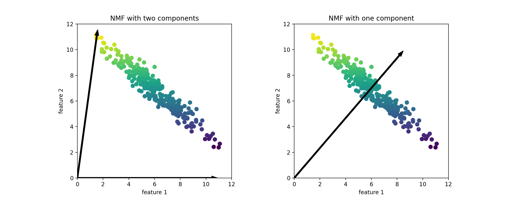
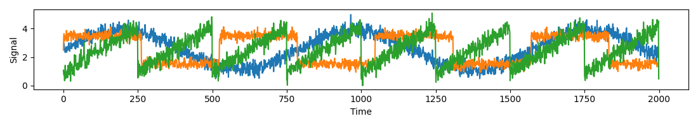
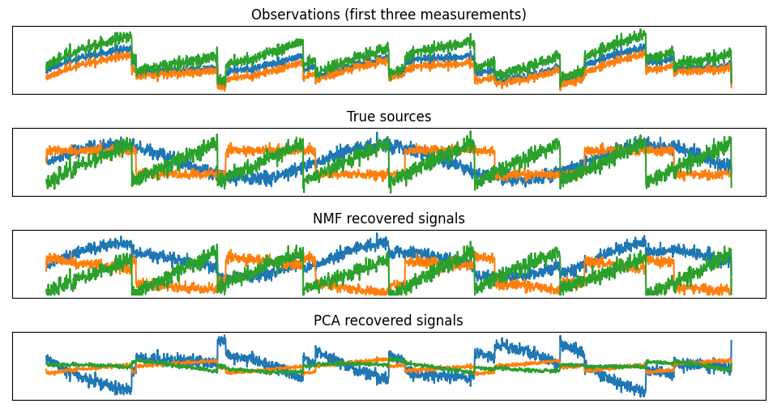
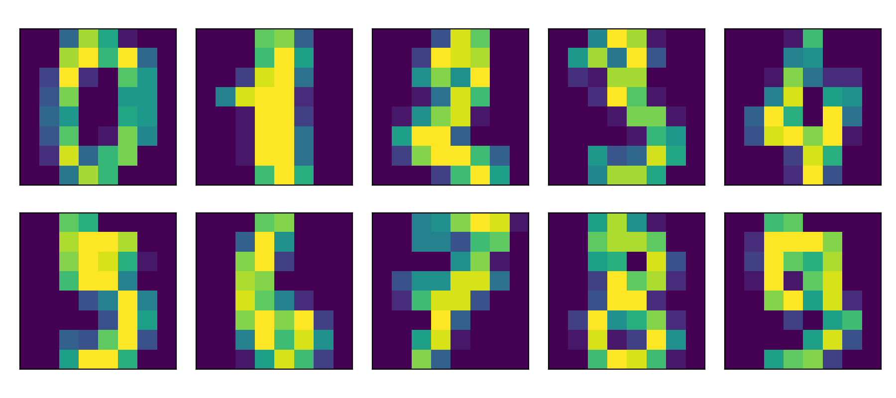
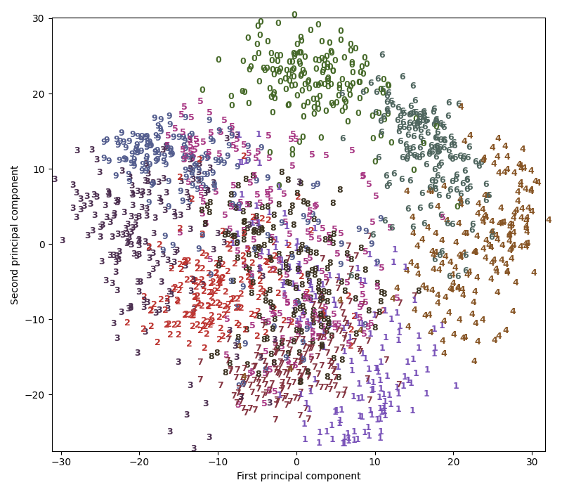
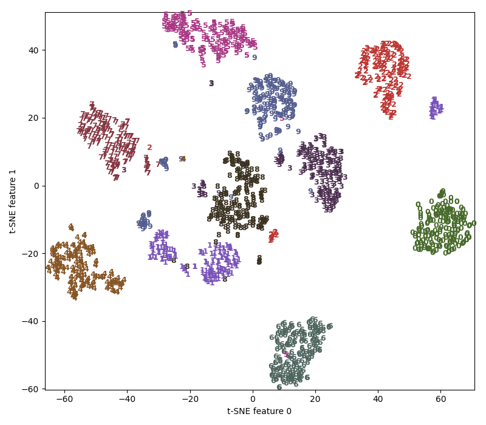

# Non-Negative Matrix Factorization

## Introduction of NMF

### NMF vs PCA

- **非负矩阵分解（non-negative matrix facrorization，NMF）** 是另一种无监督学习算法，其目的在于提取有用的特征
    - 工作原理类似于 PCA，也可以用于降维
    - 与 PCA 相同，试图将每个数据点写成一些分量的加权求和
    - 在 PCA 中，想要的是正交分量，并且能够解释尽可能多的数据方差，而在 NMF 中，希望分量和系数均为非负
    - NMF 方法只能应用于每个特征都是非负的数据，因为非负分量的非负求和不可能变为负值

- 将数据分解成非负加权求和的这个过程，对由多个独立源相加（或叠加）创建而成的数据特别有用
    - 比如多人说话的音轨或包含多种乐器的音乐，NMF 可以识别出组成合成数据的原始分量
    - 与 PCA 相比，NMF 得到的分量更容易解释，因为负的分量和系数可能导致难以解释的 **抵消效应（cancellation effect）**

- **反向变换的数据质量**
    - 与使用 PCA 时类似，但要稍差一些，因为 PCA 找到的是重建的最佳方向
    - NMF 通常并不用于对数据进行重建或编码，而是用于在数据中寻找有趣的模式

### NMF Development

NMF 是在矩阵中所有元素均为非负数约束条件之下的矩阵分解方法，由于科学研究中，很多大规模数据的分析方法需要通过矩阵形式进行有效处理，而 NMF 思想则为人类处理大规模数据提供了一种新的途径，其次，NMF 分解算法相较于传统的一些算法而言，具有实现上的简便性、分解形式和分解结果上的可解释性，以及占用存储空间少等诸多优点

为高效处理这些通过矩阵存放的数据，一个关键的必要步骤便是对矩阵进行分解操作，通过矩阵分解，一方面将描述问题的矩阵的维数进行削减，另一方面也可以对大量的数据进行压缩和概括

利用矩阵分解来解决实际问题的分析方法很多，如 PCA（主成分分析）、ICA（独立成分分析）、SVD（奇异值分解）、VQ（矢量量化）等，在所有这些方法中，原始的大矩阵 $V$ 被近似分解为低秩的 $V=WH$ 的形式，这些方法的共同特点是，因子 $W$ 和 $H$ 中的元素可为正或负，即使输入的初始矩阵元素是全正的，传统的秩削减算法也不能保证原始数据的非负性，在数学上，从计算的观点看，分解结果中存在负值是正确的，但负值元素在实际问题中可能是没有意义的，例如图像数据中不可能有负值的像素点，再比如在文档统计中，负值也是无法解释的

### Principles of NMF

传统的 NMF 问题可以描述为，给定矩阵 $V\in R_+^{m\times n}$，寻找非负矩阵 $W\in R_+^{m\times r}$ 和非负矩阵 $H \in R_+^{r\times n}$，使得

$$
V_{m\times n} \approx W_{m\times r} H_{r\times n} 
$$

之所以是约等于，是因为当前解法并非精确解，而只是数值上的近似解，其中 $r$ 远小于 $m$ 和 $n$，一般情况下

$$
(m+n)r< mn
$$

分解前后可理解为，原始矩阵 $V$ 的列向量是对左矩阵 $W$ 中所有列向量的加权和，而权重系数就是右矩阵 $H$ 对应列向量的元素，故称 $W$ 为基矩阵，$H$ 为系数矩阵，这种基于基向量组合的表示形式具有很直观的语义解释，它反映了人类思维中 **局部构成整体** 的概念，一般情况下 $r$ 的选择要比 $n$ 小，这时用系数矩阵代替原始矩阵，就可以实现对原始矩阵进行降维，得到数据特征的降维矩阵，从而减少存储空间，减少计算机资源

研究指出，非负矩阵分解是个 NP 问题，可以划为优化问题用迭代方法交替求解 $W$ 和 $V$，NMF 算法提供了基于简单迭代的求解 $W$，$V$ 的方法，求解方法具有收敛速度快、左右非负矩阵存储空间小的特点，它能将高维的数据矩阵降维处理，适合处理大规模数据,利用 NMF 进行文本、图像大规模数据的分析方法，较传统的处理算法速度更快、更便捷

由于 NMF 不允许基图像或中间的权重矩阵中出现负值，因此只有相加组合得到的正确基图像才允许，最后通过处理后的重构图像效果是比较满意的（对矩阵非负的限制使得这种分解能够达到用部分表达整体的效果，简单地说就是，整体由部分的叠加而没有正负抵消）

## NMF Example 

### Applying NMF to Synthetic Data

- 与使用 PCA 不同，需要保证数据是正的，NMF 才能够对数据进行操作
- 这说明数据相对于原点 $(0,0)$ 的位置实际上对 NMF 很重要，因此，可以将提取出来的非负分量看作是从 $(0,0)$ 到数据的方向

下面给出 NMF 对二维玩具数据上的结果

```python
import mglearn
import warnings
warnings.filterwarnings("ignore", category=Warning)

mglearn.plots.plot_nmf_illustration()
```



- 对于两个分量的 NMF（如上左图所示），显然所有数据点都可以写成两个分量的正数组合
    - 如果有足够多的分量能够完美地重建数据（分量个数与特征个数相同），那么算法会选择指向数据极值的方向
- 如果仅使用一个分量，那么 NMF 会创建一个指向平均值的分量，因为指向这里可以对数据做出最好的解释
    - 与 PCA 不同，减少分量个数不仅会删除一些方向，而且会创建一组完全不同的分量！
    - NMF 的分量也没有按任何特定方法排序，所以不存在 “第一非负分量”，所有分量的地位平等
- NMF 使用了随机初始化，根据随机种子的不同可能会产生不同的结果
    - 在相对简单的情况下（比如两个分量的模拟数据），所有数据都可以被完美地解释，那么随机性的影响很小（虽然可能会影响分量的顺序或尺度）
    - 在更加复杂的情况下，影响可能会很大

### Applying NMF to Decompose 3 Different Signal Sources for Superposition

假设一个信号是由三个不同信号源合成的


```python
import matplotlib.pyplot as plt
S = mglearn.datasets.make_signals()
plt.figure(figsize=(11, 2))
plt.plot(S, '-')
plt.xlabel("Time")
plt.ylabel("Signal")
plt.tight_layout()
```



此时无法观测到原始信号，只能观测到三个信号的叠加信号，但是又想将混合信号分解为原始信号

假设有许多不同的方法来观测混合信号（比如有 $100$ 台测量装置），每种方法都提供了一系列测量结果

```python
import numpy as np
# 将数据混合成 100 维的状态
A = np.random.RandomState(0).uniform(size=(100, 3))
X = np.dot(S, A.T)
print("Shape of measurements: {}".format(X.shape))
```

**Output**

```console
Shape of measurements: (2000, 100)
```

可以用 NMF 来还原这三个信号

```python
from sklearn.decomposition import NMF
nmf = NMF(n_components=3, random_state=42)
S_ = nmf.fit_transform(X)
print("Recovered signal shape: {}".format(S_.shape))
```

**Output**

```console
Recovered signal shape: (2000, 3)
```

#### Discovery of Signals Using NMF and PCA

应用 PCA 来对比查看

```python
from sklearn.decomposition import PCA
pca = PCA(n_components=3)
H = pca.fit_transform(X)
```

NMF 和 PCA 的效果对比

```python
models = [X, S, S_, H]
names = ['Observations (first three measurements)',
         'True sources',
         'NMF recovered signals',
         'PCA recovered signals']

fig, axes = plt.subplots(4, figsize=(8, 4), gridspec_kw={'hspace': .5},
                         subplot_kw={'xticks': (), 'yticks': ()})

for model, name, ax in zip(models, names, axes):
    ax.set_title(name)
    ax.plot(model[:, :3], '-')
```




- 图片中包含来自 `X` 的 $100$ 次测量中的 $3$ 次，用于参考
- NMF 在发现原始信号源时得到了不错的结果，而仅使用第一个成分来解释数据中的大部分变化的 PCA 则失败了
- NMF 生成的分量是没有顺序的，在这个例子中，NMF 分量的顺序与原始信号完全相同（参见三条曲线的颜色），但这纯属偶然

还有许多其他算法可以用于将每个数据点分解为一系列固定分量的加权求和，比如独立成分分析（ICA）、因子分析（FA）和稀疏编码（字典学习）等内容

## Manifold Learning with t-SNE

- 虽然 PCA 通常是用于变换数据的首选方法，使你能够用散点图将其可视化，但这一方法的性质（先旋转然后减少方向）限制了其有效性
    - 有一类用于可视化的算法叫做 **流形学习算法（namifold learning algorithm）**，它允许进行更复杂的映射，通常也可以给出更好地可视化
    - 其中特别有用的就是 **t-SNE 算法**

- 流形学习算法主要用于可视化，因此很少用来生成两个以上的新特征
    - 其中一些算法（包括 t-SNE）计算训练数据的一种新表示，但不允许变换新数据
    - 所以这些算法不能用于测试集，更确切地说，他们只能变换用于训练的数据

- t-SNE 背后的思想是 **找到数据的一个二维表示**，尽可能地保持数据点之间的距离
    - 尝试让原始特征空间中距离较近的点更加靠近，原始特征空间中相距较远的点更加远离，试图保存那些表示哪些点比较靠近的信息

```python
from sklearn.datasets import load_digits
digits = load_digits()

fig, axes = plt.subplots(2, 5, figsize=(10, 5),
                         subplot_kw={'xticks':(), 'yticks': ()})
for ax, img in zip(axes.ravel(), digits.images):
    ax.imshow(img)
```



用 PCA 将降到二维的数据可视化，对前两个主成分作图，并按类别对数据点着色

```python
# 构建一个 PCA 模型
pca = PCA(n_components=2)
pca.fit(digits.data)
# 将 digits 数据变换到前两个主成分的方向上
digits_pca = pca.transform(digits.data)
colors = ["#476A2A", "#7851B8", "#BD3430", "#4A2D4E", "#875525",
          "#A83683", "#4E655E", "#853541", "#3A3120", "#535D8E"]
plt.xlim(digits_pca[:, 0].min(), digits_pca[:, 0].max())
plt.ylim(digits_pca[:, 1].min(), digits_pca[:, 1].max())
for i in range(len(digits.data)):
    # 将数据实际绘制成文本，而不是散点
    plt.text(digits_pca[i, 0], digits_pca[i, 1], str(digits.target[i]),
             color=colors[digits.target[i]], fontdict={'weight': 'bold', 'size': 9})
plt.xlabel("First principal component")
plt.ylabel("Second principal component")
```



实际上，这里用每个类别对应的数字作为符号来显示每个类别的位置
- 利用前两个主成分可以将数字 $0$、$6$ 和 $4$ 比较好地分开，尽管仍有重叠
- 大部分其他数字都大量重叠在一起

将 t-SNE 应用于同一数据集，并对结果进行比较
- 由于 t-SNE 不支持变换新数据，所以 TSNE 类没有 transform 方法
- 可以调用 fit_transform 方法来代替，它会构建模型并立刻返回变换后的数据

```python
from sklearn.manifold import TSNE
tsne = TSNE(random_state=42)
# 使用 fit_transform 而不是 fit，因为 t-SNE 没有 transform 方法
digits_tsne = tsne.fit_transform(digits.data)
```

```python
plt.figure(figsize=(8, 7))
plt.xlim(digits_tsne[:, 0].min(), digits_tsne[:, 0].max() + 1)
plt.ylim(digits_tsne[:, 1].min(), digits_tsne[:, 1].max() + 1)
for i in range(len(digits.data)):
    # 将数据实际绘制成文本，而不是散点
    plt.text(digits_tsne[i, 0], digits_tsne[i, 1], str(digits.target[i]),
             color=colors[digits.target[i]],
             fontdict={'weight': 'bold', 'size': 9})
plt.xlabel("t-SNE feature 0")
plt.ylabel("t-SNE feature 1")
```



- t-SNE 的结果非常棒。所有类别都被明确分开
    - 数字 $1$ 和 $9$ 被分成几块，但大多数类别都形成一个密集的组
    - 这种方法并不知道类别标签，它完全是无监督的
    - 但它能够找到数据的一种二维表示，仅根据原始空间中数据点之间的靠近程度就能够将各个类别明确分开
- t-SNE 算法有一些调节参数，虽然默认参数的效果通常就很好
    - 可以尝试修改 `perplexity` 和 `early_exaggeration`，但作用一般很小