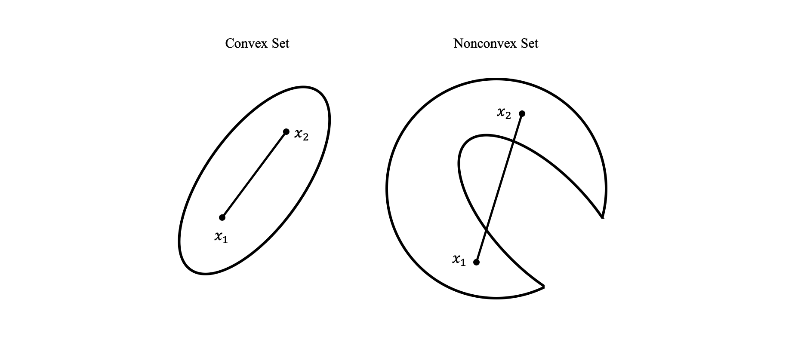

# k-Means Algorithm

## Introduction of k-Means

在非监督学习中，**聚类（clustering）** 是将数据集划分成组的任务，这些组叫作簇（cluster），其目标是划分数据，使得一个簇内的数据点相似且不同簇内的数据点非常不同，与分类算法类似，聚类算法为每个数据点分配（或预测）一个数字，表示这个点属于哪个簇

**k-Means 算法** 是在非监督学习比较容易理解的一个算法，也是聚类算法中最著名的算法，它试图找到代表数据特定区域的 **簇中心（cluster certer）** 算法交替执行以下两个步骤

- 将每个数据点分配给最近的簇中心
- 然后将每个簇中心设置为所分配的所有数据点的平均值
- 如果簇的分配不再发生变化，那么算法结束

### Principle of k-Means

k-Means 是典型的聚类算法，k-Means 算法中的 $k$ 表示的是聚类为 $k$ 个簇，Means 代表取每一个聚类中数据值的均值作为该簇的中心，或者称为质心，即用每一个的类的质心对该簇进行描述

### k-Means Steps

1. 创建 $k$ 个点作为起始质心
2. 计算每一个数据点到 $k$ 个质心的距离，把这个点归到距离最近的那个质心
3. 根据每个质心所聚集的点，重新更新质心的位置
4. 重复 2，3，直到前后两次质心的位置的变化小于一个阈值

整个变化的过程如果用图呈现出来会形象很多，下面的图就是 $k=3$ 的 k-Means 的过程

```python
import mglearn
mglearn.plots.plot_kmeans_algorithm()
```


- 簇中心用三角形表示，而数据点用圆形表示，颜色表示簇成员
- 指定要寻找三个簇，所以通过声明三个随机数据点为簇中心来将算法初始化，然后开始迭代算法
    - 首先，每个数据点被分配给距离最近的簇中心
    - 接下来，将簇中心修改为所分配点的平均值
    - 然后将这一个过程再重复两次
    - 在第三次迭代之后，为簇中心分配的数据点保持不变，因此算法结束
- 给定新的数据点，k-Means 聚类将其分配给最近的簇中心

下面展示学到的簇中心边界

```python
mglearn.plots.plot_kmeans_boundaries()
```


### Determination of the k-Value

k-Means 算法一般都只有一个超参数，就是 $k$ ，确定过程可以考虑如下步骤

1. 首先一个具体的问题肯定有它的具体的业务场景，$k$ 值需要根据业务场景来定义
1. 如果业务场景无法确定 $k$ 值，我们也有技术手段来找一个合适的 $k$ ，这个方法就是手肘法

#### Elbow Method

k-Means 算法中每一步都可以计算出 $loss$ 值又称为 $SSE$ 

$loss$ 值的计算方式就是每个聚类的点到它们质心的距离的平方

$$
SSE=\sum\limits_{i=1}^k\sum\limits_{x\in C_i}^{N_C} \vert x-\mu_i \vert ^2
$$

其中，$\mu_i$ 表示第 $i$ 类 $C_i$ 中的所有点的中心位置，$N_c$ 表示 $C_i$ 类中的总点数

指定一个 $\max$ 值，即可能的最大类簇数，然后将类簇数 $k$ 从 $1$ 开始递增，一直到 $\max$ ，计算出 $\max$ 个 $SSE$ ，根据数据的潜在模式，当设定的类簇数不断逼近真实类簇数时，$SSE$ 呈现快速下降态势，而当设定类簇数超过真实类簇数时，$SSE$ 也会继续下降，但下降会迅速趋于缓慢，通过画出 $k-SSE$ 曲线，找出下降途中的拐点，即可较好的确定 $k$ 值


这样手肘图的拐点应该是 $k=4$ 的时候，所以我们可以定 $k=4$ 的时候聚类效果比较好

### k-Means v.s. kNN

虽然 k-Means 和 kNN 名称接近，但两者其实差别还是很大的

- k-Means 是无监督学习的聚类算法，没有样本输出；而 kNN 是监督学习的分类算法，有对应的类别输出
- kNN 基本不需要训练，对测试集里面的点，只需要找到在训练集中最近的 $k$ 个点，用这最近的 $k$ 个点的类别来决定测试点的类别，而 k-Means 则有明显的训练过程，找到 $k$ 个类别的最佳质心，从而决定样本的簇类别
- 两者也有一些相似点，两个算法都包含一个过程，即找出和某一个点最近的点，两者都利用了最近邻 (nearest neighbors) 的思想

## k-Means Optimization

在使用 k-Means 过程中会遇到一些问题，如何选取初始质心的位置，如何处理距离计算的时候效率低的问题

### Choose the Location of the Initial Centroid

假设已经确定了质心数 $k$ 的大小，那如何确定 $k$ 个质心的位置呢？事实上，$k$ 个初始化的质心的位置选择对最后的聚类结果和运行时间都有很大的影响，因此需要选择合适的 $k$ 个质心，如果仅仅是完全随机的选择，有可能导致算法收敛很慢，k-Means++ 算法就是对 k-Means 随机初始化质心的方法的优化

k-Means++ 的对于初始化质心的优化策略也很简单，如下

1. 从输入的数据点集合中随机选择一个点作为第一个聚类中心 $\mu_1$
1. 对于数据集中的每一个点 $x_i$ ，计算它与已选择的聚类中心中最近聚类中心的距离

    $$
    D(x_i)=\arg\min \vert x_i−\mu_r \vert ^2,\qquad r=1,2,\cdots,k_{selected}
    $$

1. 选择一个新的数据点作为新的聚类中心，选择的原则是，$D(x)$ 较大的点，被选取作为聚类中心的概率较大
1. 重复 2. 和 3. 直到选择出 $k$ 个聚类质心
1. 利用这 $k$ 个质心来作为初始化质心去运行标准的 k-Means 算法

### Distance Calculation Optimization

#### Elkan k-Means

在传统的 k-Means 算法中，当每轮迭代时，要计算所有的样本点到所有质心的距离，这样会比较耗时，Elkan k-Means 算法就是从这块入手加以改动，它的目标是减少不必要的距离计算

Elkan k-Means 利用了两边之和大于等于第三边，以及两边之差小于第三边的三角形性质，来减少距离的计算

第一种规律是对于一个样本点 $x$ 和两个质心 $\mu_{j_1}, \mu_{j_2}$，如果我们预先计算出了这两个质心之间的距离 $D(j_1,j_2)$ ，则如果计算发现 $2D(x,j_1) \leq D(j_1,j_2)$，我们立即就可以知道 $D(x,j_1) \leq D(x,j_2)$ ，此时我们不需要再计算 $D(x,j_2)$ ，也就是说省了一步距离计算

第二种规律是对于一个样本点 $x$ 和两个质心 $\mu_{j_1},\mu_{j_2}$， 我们可以得到 $D(x,j_2) \geq  \max\{0,D(x,j_1)-D(j_1,j_2)\}$ ，这个从三角形的性质也很容易得到。

利用上边的两个规律，Elkan k-Means 比起传统的 k-Means 迭代速度有很大的提高，但是如果我们的样本的特征是稀疏的，有缺失值的话，这个方法就不适用了，此时某些距离无法计算，则不能使用该算法

#### Mini Batch k-Means

在传统的 k-Means 算法中，要计算所有的样本点到所有的质心的距离，如果样本量非常大，比如达到 $10$ 万以上，特征有 $100$ 以上，此时用传统的 k-Means 算法非常的耗时，就算加上 Elkan k-Means 优化也依旧缓慢，在大数据时代，这样的场景越来越多，此时 Mini Batch k-Means 应运而生

顾名思义，Mini Batch，也就是用样本集中的一部分的样本来做传统的 k-Means，这样可以避免样本量太大时的计算难题，算法收敛速度大大加快，当然此时的代价就是我们的聚类的精确度也会有一些降低，一般来说这个降低的幅度在可以接受的范围之内

在 Mini Batch k-Means 中，我们会选择一个合适的批样本大小 batch size ，我们仅仅用 batch size 个样本来做 k-Means 聚类，一般是通过无放回的随机采样得到 batch size 个样本

为了增加算法的准确性，我们一般会多跑几次 Mini Batch k-Means 算法，用得到不同的随机采样集来得到聚类簇，选择其中最优的聚类簇

## k-Means Clustering Samples

### k-Means Parameters in Sklearn

- `n_clusters`，聚类的个数 $k$，default 为 `8`
- `init`，初始化的方式，default 为 [k-means++](#Choose-the-Location-of-the-Initial-Centroid)
- `n_init`，运行 k-Means 的次数，最后取效果最好的一次， default 为 `10`
- `max_iter`，最大迭代次数， default 为 `300`
- `tol`，收敛的阈值，default 为 `1e-4`
- `n_jobs`，多线程运算，default 为 `None`，`None` 代表一个线程，`-1` 代表启用计算机的全部线程
- `algorithm`，有 `'auto'`，`'full'` 或 `'elkan'` 三种选择，`'full'` 就是我们传统的 k-Means 算法，`'elkan'` 是我们讲的 [Elkan k-Means](#Elkan-k-Means) 算法，默认的 `'auto'` 则会根据数据值是否是稀疏的，来决定如何选择 `'full'` 和 `'elkan'` ，一般数据是稠密的，那么就是 `'elkan'` ，否则就是 `'full'` ，一般来说建议直接用默认的 `'auto'` 

下面在一个模拟数据集上对这一算法进行说明

### k-Means in a Simulate Dataset

用 sickit-learn 应用 k-Means 相当简单
- 将 k-Means 类实例化，并设置要寻找的簇个数
- 然后对数据调用 `fit` 方法

```python
from sklearn.datasets import make_blobs
from sklearn.cluster import KMeans

# 生成模拟的二维数据
X, y = make_blobs(random_state=1)

# 构建聚类模型
kmeans = KMeans(n_clusters=3)
kmeans.fit(X)
```

**Output**

```console
KMeans(algorithm='auto', copy_x=True, init='k-means++', max_iter=300,
       n_clusters=3, n_init=10, n_jobs=None, precompute_distances='auto',
       random_state=None, tol=0.0001, verbose=0)
```

算法运行期间，为 `X` 中的每个训练数据点分配一个簇标签，可以在 `kmeans.lables_` 属性中找到这些标签

```python
print("Cluster memberships:\n{}".format(kmeans.labels_))
```

**Output**

```console
Cluster memberships:
[1 0 0 0 2 2 2 0 1 1 0 0 2 1 2 2 2 1 0 0 2 0 2 1 0 2 2 1 1 2 1 1 2 1 0 2 0
 0 0 2 2 0 1 0 0 2 1 1 1 1 0 2 2 2 1 2 0 0 1 1 0 2 2 0 0 2 1 2 1 0 0 0 2 1
 1 0 2 2 1 0 1 0 0 2 1 1 1 1 0 1 2 1 1 0 0 2 2 1 2 1]
```

因为要找的是 $3$ 个簇，所以簇的编号是 $0$ 到 $2$

也可以用 `predict` 方法为新数据点分配簇标签
- 预测时会将最近的簇中心分配给每个新数据点，但现有模型不会改变
- 对训练集运行 `predict` 会返回与 `labels_` 相同的结果

```python
print(kmeans.predict(X))
```

**Output**

```console
[1 0 0 0 2 2 2 0 1 1 0 0 2 1 2 2 2 1 0 0 2 0 2 1 0 2 2 1 1 2 1 1 2 1 0 2 0
 0 0 2 2 0 1 0 0 2 1 1 1 1 0 2 2 2 1 2 0 0 1 1 0 2 2 0 0 2 1 2 1 0 0 0 2 1
 1 0 2 2 1 0 1 0 0 2 1 1 1 1 0 1 2 1 1 0 0 2 2 1 2 1]
```

- 聚类算法与分类算法有些相似，每个元素都有一个标签，但不存在真实的标签，因此标签本身并没有先验意义
- 对于刚刚在二维玩具数据集上运行的聚类算法，这意味着不应该为其中一组的标签是 `0`、另一组的标签是 `1` 这一事实赋予任何意义，再次运行该算法可能会得到不同的簇编号，原因在于初始化的随机性质

可以查看刚才模拟数据集的标签，簇中心被保存在 `cluster_centers_` 属性中，用三角形表示它们

```python
import mglearn
mglearn.discrete_scatter(X[:, 0], X[:, 1], kmeans.labels_, markers='o')
mglearn.discrete_scatter(
    kmeans.cluster_centers_[:, 0], kmeans.cluster_centers_[:, 1],
    [0, 1, 2], markers='^', markeredgewidth=2)
```

**Output**

```console
[<matplotlib.lines.Line2D at 0x1266a62d0>,
 <matplotlib.lines.Line2D at 0x1266a6890>,
 <matplotlib.lines.Line2D at 0x1266a6e10>]
```


也可以使用更多或更少的簇中心


```python
import matplotlib.pyplot as plt

fig, axes = plt.subplots(1, 2, figsize=(10, 5))

# 使用 2 个簇中心 
kmeans = KMeans(n_clusters=2)
kmeans.fit(X)
assignments = kmeans.labels_

mglearn.discrete_scatter(X[:, 0], X[:, 1], assignments, ax=axes[0])

# 使用 5 个簇中心
kmeans = KMeans(n_clusters=5)
kmeans.fit(X)
assignments = kmeans.labels_

mglearn.discrete_scatter(X[:, 0], X[:, 1], assignments, ax=axes[1])
```

**Output**

```console
[<matplotlib.lines.Line2D at 0x1283c5790>,
 <matplotlib.lines.Line2D at 0x1283c5c90>,
 <matplotlib.lines.Line2D at 0x127f8f210>,
 <matplotlib.lines.Line2D at 0x127f8f750>,
 <matplotlib.lines.Line2D at 0x127f8fd10>]
```


### Failure cases of k-Means

即使知道给定数据集中簇的 “正确” 个数，k-Means 可能也不是总能找到它们，每个簇仅由其中心定义，这意味着每个簇都是 **凸形（convex）**，因此，k-Means 只能找到相对简单的形状

这里我们给出 **凸集** 的一般定义来帮助理解，集合 $R_c \subset E^n$ 是凸集，如果对每对点 $x_1, x_2 \in R_c$，及任意实数 $\alpha,\; 0<\alpha<1$，都有点 $x\in R_c$，其中

$$
x=\alpha x_1 + (1-\alpha)x_2
$$



k-Means 还假设所有簇在某种程度上具有相同的 “直径”，它总是将簇之间的边界刚好画在簇中心的中间位置

```python
X_varied, y_varied = make_blobs(n_samples=200,
                                cluster_std=[1.0, 2.5, 0.5],
                                random_state=170)
y_pred = KMeans(n_clusters=3, random_state=0).fit_predict(X_varied)

mglearn.discrete_scatter(X_varied[:, 0], X_varied[:, 1], y_pred)
plt.legend(["cluster 0", "cluster 1", "cluster 2"], loc='best')
plt.xlabel("Feature 0")
plt.ylabel("Feature 1")
```

**Output**

```console
Text(0, 0.5, 'Feature 1')
```


左下方的密集区是第一个簇，右上方的密集区是第二个，中间密度较小的区域是第三个，但事实上，簇 $0$ 和簇 $1$ 都包含一些远离簇中其他点的点

k-Means 还假设所有方向对每个簇同等重要，如下显示了一个二维数据集，数据中包含明确分开的三部分，但是这三部分被沿着对角线方向拉长，由于 k-Means 仅考虑到最近簇中心的距离，所以它无法处理这种类型的数据

```python
import numpy as np

# 生成一些随机分组数据
X, y = make_blobs(random_state=170, n_samples=600)
rng = np.random.RandomState(74)

# 变换数据使其拉长
transformation = rng.normal(size=(2, 2))
X = np.dot(X, transformation)

# 将数据聚类成 3 个簇
kmeans = KMeans(n_clusters=3)
kmeans.fit(X)
y_pred = kmeans.predict(X)

# 画出簇分配和簇中心
mglearn.discrete_scatter(X[:, 0], X[:, 1], kmeans.labels_, markers='o')
mglearn.discrete_scatter(
    kmeans.cluster_centers_[:, 0], kmeans.cluster_centers_[:, 1],
    [0, 1, 2], markers='^', markeredgewidth=2)
plt.xlabel("Feature 0")
plt.ylabel("Feature 1")
```

**Output**

```console
Text(0, 0.5, 'Feature 1')
```


如果簇的形状更加复杂，那么 k-Means 表现也很差

```python
# 生成模拟的 two_moons 数据集（较小的噪声）
from sklearn.datasets import make_moons
X, y = make_moons(n_samples=200, noise=0.05, random_state=0)

# 将数据聚类成 2 个簇
kmeans = KMeans(n_clusters=2)
kmeans.fit(X)
y_pred = kmeans.predict(X)

# 画出簇分配和簇中心
plt.scatter(X[:, 0], X[:, 1], c=y_pred, cmap=mglearn.cm2, s=60, edgecolor='k')
plt.scatter(kmeans.cluster_centers_[:, 0], kmeans.cluster_centers_[:, 1],
            marker='^', c=[mglearn.cm2(0), mglearn.cm2(1)], s=100,
            linewidth=2, edgecolor='k')
plt.xlabel("Feature 0")
plt.ylabel("Feature 1")
```

**Output**

```console
Text(0, 0.5, 'Feature 1')
```


上图中，希望聚类算法能够发现两个半月形，但利用 k-Means 算法是不可能做到这一点的

### Vector Quantization, or Seeing k-Means as Decomposition

虽然 k-Means 是一种聚类算法，但 k-Means 和分解方法（比如 PCA 和 NMF）之间存在一些有趣的共同之处

PCA 试图找到数据中方差最大的方向，而 NMF 试图找到累加的分量，这通常对应与数据的 “极值” 和 “部分”，两种方法都试图将数据点表示为一些分量之和，与此相反，k-Means 则尝试利用簇中心来表示每个数据点，可以将其看作仅用一个分量来表示每个数据点，该分量由簇中心给出，这种观点将 k-Means 看作是一种分解方法，其中每个点利用单一分量来表示，这种观点被称为 **矢量化（vector quantization）**

利用 k-Means 做矢量量化的一个有趣之处在于，可以用比输入维度更多的簇来对数据进行编码

对于 two_moons 数据，使用 PCA 或 NMF 对这个数据无能为力，因为它只有两个维度，使用 PCA 或 NMF 将其降到一维，将会完全破坏数据的结构，但通过使用更多的簇中心，可以用 k-Means 找到一种更具表现力的表示


```python
X, y = make_moons(n_samples=200, noise=0.05, random_state=0)

kmeans = KMeans(n_clusters=10, random_state=0)
kmeans.fit(X)
y_pred = kmeans.predict(X)

plt.scatter(X[:, 0], X[:, 1], c=y_pred, s=60, cmap='Paired')
plt.scatter(kmeans.cluster_centers_[:, 0], kmeans.cluster_centers_[:, 1],
            s=60, marker='^', c=range(kmeans.n_clusters), linewidth=2,
            cmap='Paired')
plt.xlabel("Feature 0")
plt.ylabel("Feature 1")
print("Cluster memberships:\n{}".format(y_pred))
```

**Output**

```console
Cluster memberships:
[4 7 6 9 7 7 4 1 4 1 8 3 7 1 0 4 2 3 2 0 5 1 2 1 8 6 7 5 6 2 4 8 1 6 4 5 3
 4 0 6 3 8 2 6 7 8 4 0 6 1 0 3 5 9 1 4 2 1 2 8 3 9 7 4 1 9 8 7 8 9 3 9 3 6
 1 9 6 4 2 3 5 8 3 5 6 8 4 8 3 5 2 4 5 0 5 7 7 3 9 6 1 5 8 4 9 6 9 8 7 2 0
 8 8 9 4 1 2 5 3 4 4 0 6 8 6 0 4 6 1 5 4 0 9 3 1 7 1 9 5 4 6 6 2 8 8 4 6 1
 2 6 3 7 4 2 3 8 1 3 2 2 6 1 2 7 3 7 2 3 7 1 2 9 0 0 6 1 5 0 0 2 7 0 5 7 5
 2 8 3 9 0 9 2 4 4 6 0 5 6 2 7]
```


- 使用了 $10$ 个簇中心，现在每个点都被分配了 $0$ 到 $9$ 之间的一个数字，可以将其看作是 $10$ 个分量表示的数据（有 $10$ 个新特征），只有表示该点对应的簇中心特征不为 $0$，其他特征均为 $0$
- 利用这个 $10$ 维表示，现在可以用线性模型来划分两个半月形，而利用原始的两个特征是不可能做到这一点

将到每个簇中心的距离作为特征，还可以得到一种表现力更强的数据表示，可以利用 kmeans 的 `transform` 方法来完成这一点

```python
distance_features = kmeans.transform(X)
print("Distance feature shape: {}".format(distance_features.shape))
print("Distance features:\n{}".format(distance_features))
```

**Output**

```console
Distance feature shape: (200, 10)
Distance features:
[[1.54731274 1.03376805 0.52485524 ... 1.14060718 1.12484411 1.80791793]
 [2.56907679 0.50806038 1.72923085 ... 0.149581   2.27569325 2.66814112]
 [0.80949799 1.35912551 0.7503402  ... 1.76451208 0.71910707 0.95077955]
 ...
 [1.12985081 1.04864197 0.91717872 ... 1.50934512 1.04915948 1.17816482]
 [0.90881164 1.77871545 0.33200664 ... 1.98349977 0.34346911 1.32756232]
 [2.51141196 0.55940949 1.62142259 ... 0.04819401 2.189235   2.63792601]]
```

## Summary

k-Means 的原理是很简单，但是仔细想想我们处理 k-Means 的思想和别的方法不太一样，先去猜想想要的结果，然后根据这个猜想去优化损失函数，再重新调整我们的猜想，一直重复这两个过程

其实这个猜想就是我们要求出的隐藏变量，优化损失函数的过程，就是最大化释然函数的过程，k-Means 的算法就是一个 **EM 算法** 的过程

### Advantages

- k-Means 是非常流行的聚类算法，因为它不仅相对容易理解和实现，而且运行速度也相对较快
- k-Means 可以轻松扩展到大型数据集，scikit-learn 甚至在 MiniBatchMeans 类中包含了一种更具可扩展性的变体，可以处理非常大的数据集

### Disadvantages

- 依赖于随机初始化，即算法的输出依赖于随机种子，默认情况下，scikit-learn 用 $10$ 种不同的随机初始化将算法运行 $10$ 次，并返回最佳结果
- 对簇形状的假设的约束性较强，而且还要求指定所要寻找的簇的个数 （在现实世界的应用中可能并不知道这个数字）