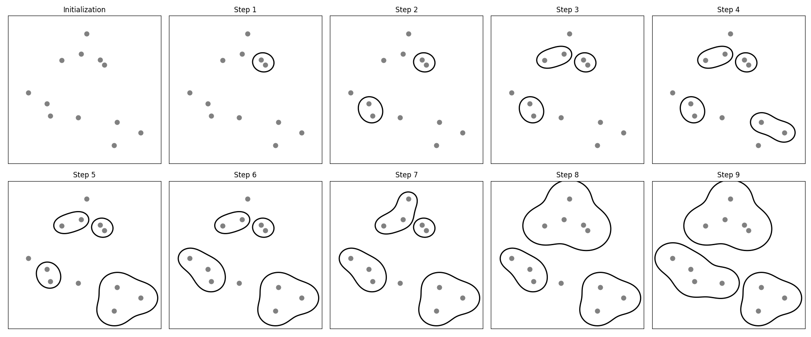
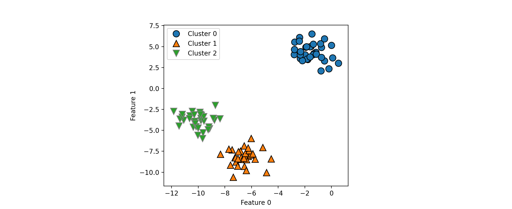
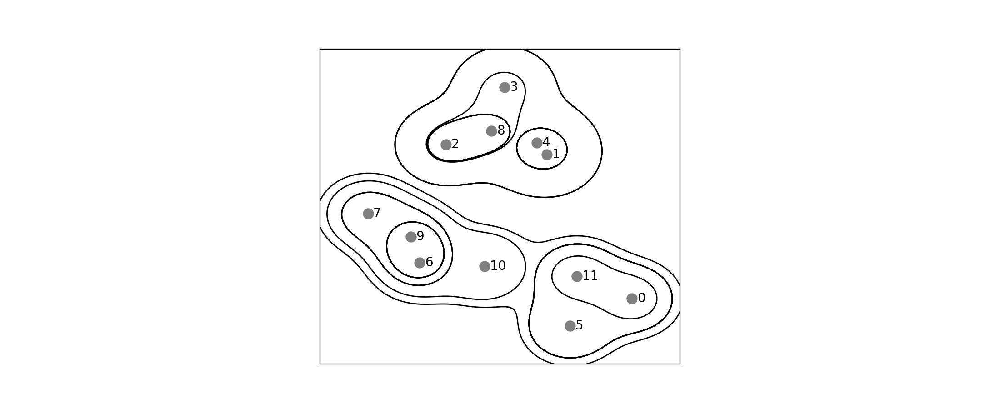
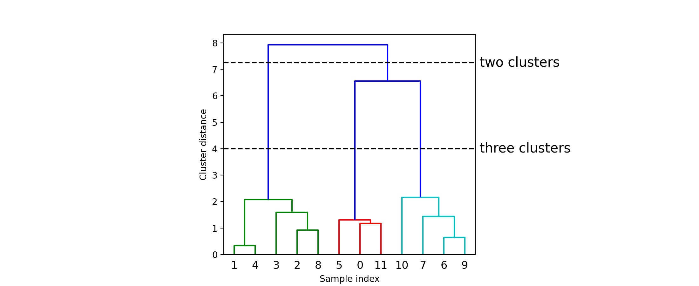

# Agglomerative Clustering

## Introduction of Agglomerative Clustering
**凝聚聚类（agglomerative clustering）** 指的是许多基于相同原则构建的聚类算法
- 算法首先声明每个点是自己的簇，然后合并两个最相似的簇，直到满足某种停止准则为止
- scikit-learn 中实现的停止准则是簇的个数，因此相似的簇被合并，直到仅剩下指定个数的簇
- 链接（linkage）准则，规定如何度量 “最相似的簇”，这种度量总是定义在两个现有的簇之间，scikit-learn 中实现了以下三种选项
    - `ward`，默认选项，`ward` 挑选两个簇来合并，使得所有簇中方差增加最小，这通常会得到大小差不多相等的簇
    - `average` 链接将簇中所有点之间平均距离最小的两个簇合并
    - `complete` 链接（也称为最大链接）将簇中点之间最大距离最小的两个簇合并

`ward` 适用于大多数数据集，如果簇中的成员个数非常不同（比如其中一个比其他所有都大得多），那么 `average` 或 `complete` 可能效果更好

```python
import mglearn

mglearn.plots.plot_agglomerative_algorithm()
```



看一下凝聚聚类对上面的三簇数据的效果如何

由于算法的工作原理，凝聚聚类不能对新数据点做出预测，因此 AgglomerativeClustering 没有 `predict` 方法，为了构造模型并得到训练集上簇的成员关系，可以改用 `fit_predict` 方法，结果如下

```python
from sklearn.datasets import make_blobs
from sklearn.cluster import AgglomerativeClustering
import matplotlib.pyplot as plt

X, y = make_blobs(random_state=1)

agg = AgglomerativeClustering(n_clusters=3)
assignment = agg.fit_predict(X)

mglearn.discrete_scatter(X[:, 0], X[:, 1], assignment)
plt.legend(["Cluster 0", "Cluster 1", "Cluster 2"], loc="best")
plt.xlabel("Feature 0")
plt.ylabel("Feature 1")
```



凝聚聚类算法完美地完成了聚类，虽然凝聚聚类的 sikit-learn 实现需要指定希望算法找到的簇的个数，但凝聚聚类方法为选择正确的个数提供了一些帮助

## Hierarchical Clustering and Dendrograms

```python
mglearn.plots.plot_agglomerative()
```



- 虽然这种可视化为层次聚类提供了非常详细地视图，但它依赖于数据的二维性质，因此不能用于具有两个以上特征的数据集
- 还有另一个将层次聚类可视化的工具，叫作树状图（dendrogram）,它可以处理多维数据集

借助 Scipy 可以绘制树状图

```python
# Import the dendrogram function and the ward clustering function from SciPy
from scipy.cluster.hierarchy import dendrogram, ward

X, y = make_blobs(random_state=0, n_samples=12)
# 将 ward 聚类应用于数据数组 X
# Scipy 的 ward 函数返回一个数组，指定执行凝聚聚类时跨越的距离
linkage_array = ward(X)
# 现在为包含簇之间距离的 linkage_array 绘制树状图
dendrogram(linkage_array)

# 在树中标记划分成两个簇或三个簇的位置
ax = plt.gca()
bounds = ax.get_xbound()
ax.plot(bounds, [7.25, 7.25], '--', c='k')
ax.plot(bounds, [4, 4], '--', c='k')

ax.text(bounds[1], 7.25, ' two clusters', va='center', fontdict={'size': 15})
ax.text(bounds[1], 4, ' three clusters', va='center', fontdict={'size': 15})
plt.xlabel("Sample index")
plt.ylabel("Cluster distance")
```



树状图将数据点显示为底部横轴上的点（图中下方 $0\sim 11$），然后，用这些点（代表单点集群）作为叶子节点绘制一棵树，并为所连接的每两个集群添加一个新的父节点

从下往上读取，首先，数据点 $1$ 和 $4$ 连接在一起，接下来，将点 $6$ 和 $9$ 连接到一个群集中，依此类推，顶层有两个分支，一个分支由点 $11,0,5,10,7,6$ 和 $9$ 组成，另一个分支由点 $1,4,3,2$ 和 $8$ 组成

树状图中的 $y$ 轴不仅指定在凝聚算法中何时将两个聚类合并，每个分支的长度还显示了合并的簇之间的距离，此树状图中最长的分支是 $y$ 轴上 $4$ 标记附近 “three cluster” 的三条线，表明从三个集群到两个集群意味着合并一些非常遥远的点，我们在图表的顶部再次看到了这一点，将剩下的两个群集合并为一个群集再次桥接了很大的距离

不幸的是，凝聚聚类仍然无法分离复杂的形状，如 two_moons 数据集
