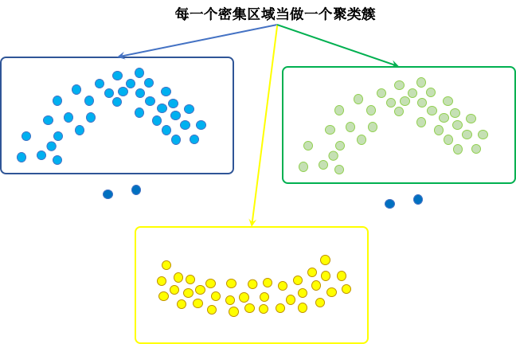
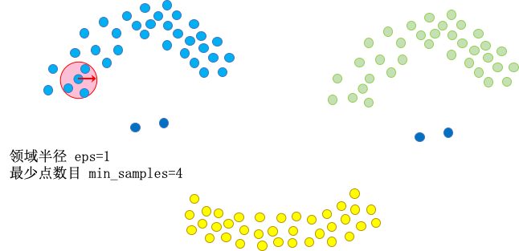
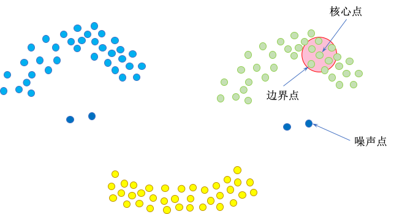
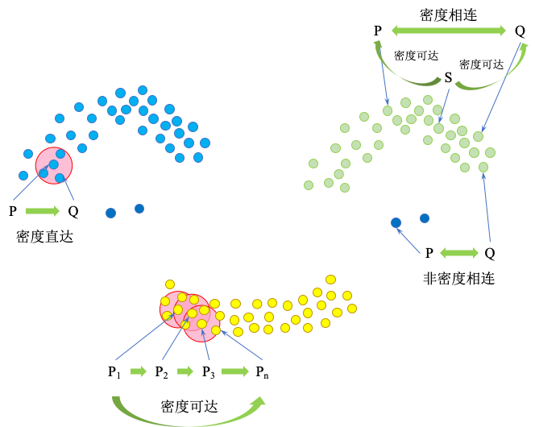
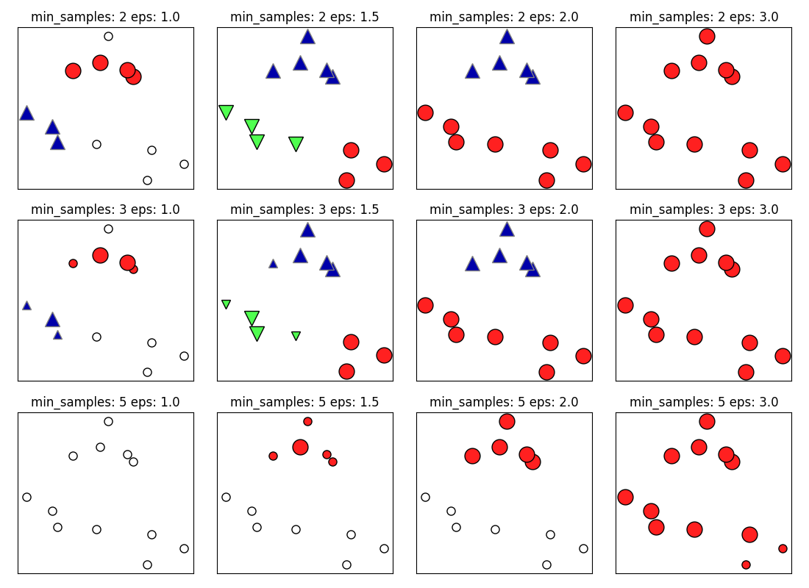
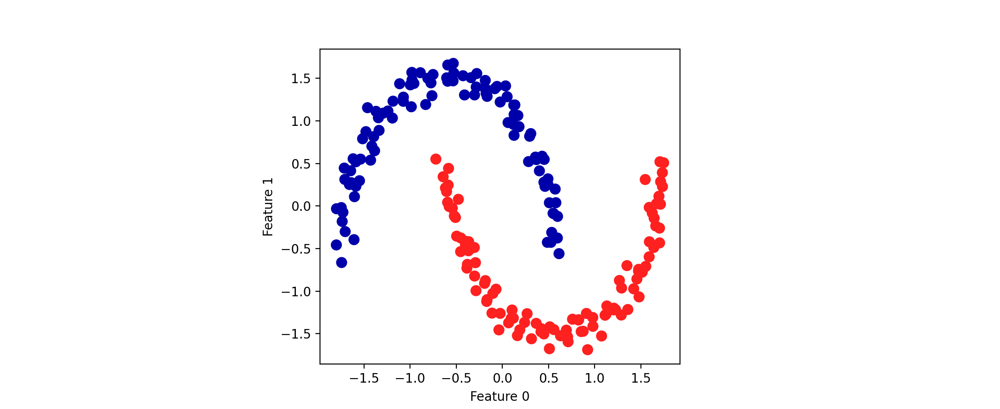
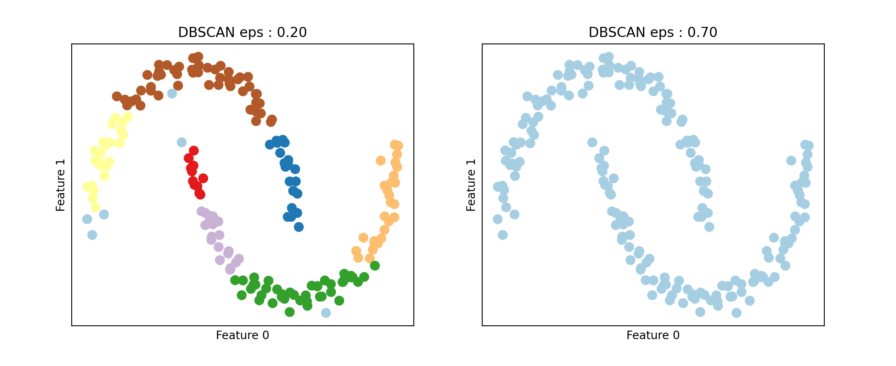
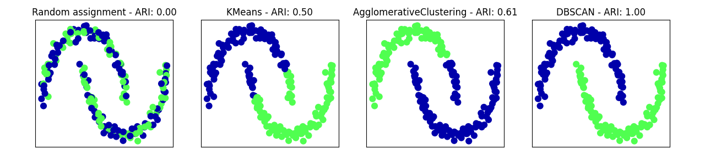
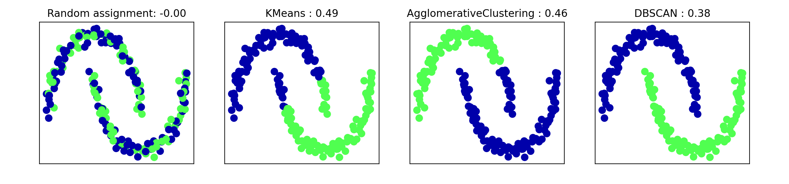

# DBSCAN

## Introduction of DBSCAN

**DBSCAN** 是一种非常著名的基于密度的聚类算法，其英文全称是 **Density-Based Spatial Clustering of Applications with Noise**，意即，一种基于密度，对噪声鲁棒的空间聚类算法，直观效果上看，DBSCAN 算法可以找到样本点的全部密集区域，并把这些密集区域当做一个一个的聚类簇

- DBSCAN 的主要优点是它不需要用户先验地设置簇的个数，可以划分具有复杂形状的簇（几乎允许所有形状的簇），还可以找出不属于任何簇的点，DBSCAN 比凝聚聚类和 k-Means 聚类稍慢，但仍可以扩展到相对较大的数据集
- DBSCAN 的原理是识别特征空间的 “拥挤” 区域中的点，在这些区域中许多数据点靠近在一起，这些区域被称为特征空间中的 **密集（dense）** 区域
- DBSCAN 背后的思想是，簇形成数据的密集区域，并由相对较空的区域隔开

## Basic Concept

### Core Idea

DBSCAN 的核心思想是基于密度，正如前面所说 DBSCAN 算法可以找到样本点的全部密集区域，并把这些密集区域当做一个一个的聚类簇



### Two Parameters

DBSCAN 有两个算法参数，**邻域半径** `eps` 和 **最少点数目** `min_samples`，这两个算法参数实际可以刻画什么叫密集 —— 当邻域半径`eps` 内的点的个数大于等于最少点数目 `min_samples` 时，就是密集



### Three Categories of Point

- 如果在距一个给定数据点 `eps` 的距离内至少有 `min_samples` 个数据点，那么这个数据点就是核心样本（core sample，或 **核心点**），DBSCAN 将彼此距离小于 `eps` 的核心样本放到同一个簇中
- 不属于核心点但在某个核心点的邻域内的点叫做 **边界点**
- 既不是核心点也不是边界点的是 **噪声点**



### Four Types of Relationship between Points

- 如果 $P$ 为核心点，$Q$ 在 $P$ 的 $R$ 邻域内（`eps` 半径内），那么称 $P$ 到 $Q$ **密度直达**，任何核心点到其自身密度直达，密度直达不具有对称性，如果 $P$ 到 $Q$ 密度直达，那么 $Q$ 到 $P$ 不一定密度直达
- 如果存在核心点 $P_1,P_2,\cdots,P_{n-1}$，且 $P_1$ 到 $P_2$ 密度直达，$P_2$ 到 $P_3$ 密度直达，$\cdots$，$P_{n-1}$ 到 $P_n$ 密度直达，则称 $P_1$ 到 $P_n$ **密度可达**，密度可达也不具有对称性
- 如果存在核心点 $S$，使得 $S$ 到 $P$ 和 $Q$ 都密度可达，则称 $P$ 和 $Q$ **密度相连**，密度相连具有对称性，如果 $P$ 和 $Q$ 密度相连，那么 $Q$ 和 $P$ 也一定密度相连，**密度相连的两个点属于同一个聚类簇**
- 如果两个点不属于密度相连关系，则两个点 **非密度相连**，非密度相连的两个点属于不同的聚类簇，或者其中存在噪声点



## Algorithmic Steps

1. 寻找核心点形成临时聚类簇

    - 扫描全部样本点，如果某个样本点 `eps` 半径范围内点数目 $\geq$ `min_samples`，则将其纳入核心点列表，并将其密度直达的点形成对应的临时聚类簇

2. 合并临时聚类簇得到聚类簇

    - 对于每一个临时聚类簇，检查其中的点是否为核心点，如果是，将该点对应的临时聚类簇和当前临时聚类簇合并，得到新的临时聚类簇

    - 重复此操作，直到当前临时聚类簇中的每一个点要么不在核心点列表，要么其密度直达的点都已经在该临时聚类簇，该临时聚类簇升级成为聚类簇

    - 继续对剩余的临时聚类簇进行相同的合并操作，直到全部临时聚类簇被处理

## Example of DBSCAN

### Example in Blobs Datasets

将 DBSCAN 应用于演示凝聚聚类的模拟数据集

与凝聚聚类类似，DBSCAN 也不允许对新的测试数据进行预测，将使用 `fit_predict` 方法来执行聚类并返回簇标签

```python
from sklearn.datasets import make_blobs
from sklearn.cluster import DBSCAN
X, y = make_blobs(random_state=0, n_samples=12)

dbscan = DBSCAN()
clusters = dbscan.fit_predict(X)
print("Cluster memberships:\n{}".format(clusters))
```

**Output**

```console
Cluster memberships:
[-1 -1 -1 -1 -1 -1 -1 -1 -1 -1 -1 -1]
```

所有数据点都被分配了标签 `-1`，这代表噪声，这是 `eps` 和 `min_samples` 默认参数设置的结果，对于小型的玩具数据集并没有调节这些参数

`min_samples` 和 `eps` 取不同值时的簇分类如下所示，其可视化结果如下图

```python
import mglearn

mglearn.plots.plot_dbscan()
```

**Output**

```console
min_samples: 2 eps: 1.000000  cluster: [-1  0  0 -1  0 -1  1  1  0  1 -1 -1]
min_samples: 2 eps: 1.500000  cluster: [0 1 1 1 1 0 2 2 1 2 2 0]
min_samples: 2 eps: 2.000000  cluster: [0 1 1 1 1 0 0 0 1 0 0 0]
min_samples: 2 eps: 3.000000  cluster: [0 0 0 0 0 0 0 0 0 0 0 0]
min_samples: 3 eps: 1.000000  cluster: [-1  0  0 -1  0 -1  1  1  0  1 -1 -1]
min_samples: 3 eps: 1.500000  cluster: [0 1 1 1 1 0 2 2 1 2 2 0]
min_samples: 3 eps: 2.000000  cluster: [0 1 1 1 1 0 0 0 1 0 0 0]
min_samples: 3 eps: 3.000000  cluster: [0 0 0 0 0 0 0 0 0 0 0 0]
min_samples: 5 eps: 1.000000  cluster: [-1 -1 -1 -1 -1 -1 -1 -1 -1 -1 -1 -1]
min_samples: 5 eps: 1.500000  cluster: [-1  0  0  0  0 -1 -1 -1  0 -1 -1 -1]
min_samples: 5 eps: 2.000000  cluster: [-1  0  0  0  0 -1 -1 -1  0 -1 -1 -1]
min_samples: 5 eps: 3.000000  cluster: [0 0 0 0 0 0 0 0 0 0 0 0]
```



在上述图中，属于簇的点是实心的，而噪声点则显示为空心的，核心样本显示为较大的标记，而边界点则显示为较小的标记
- 增大 `eps`（在图中从左到右），更多的点会被包含在一个簇中，这让簇变大，但可能也会导致多个簇合并成一个
- 增大 `min_samples`（在图中从上到下），核心点会变的更少，更多的点被标记为噪声
- 参数 `eps` 在某种程度上更加重要，因为它决定了点与点之间 “接近” 的含义
    - 将 `eps` 设置得非常小，意味着没有点是核心样本，可能会导致所有点都被标记为噪声
    - 将 `eps` 设置得非常大，可能会导致所有点形成单个簇
- 设置 `min_samples` 主要是为了判断稀疏区域内的点被标记为异常值还是形成自己的簇
    - 如果增大 `min_samples`，任何一个包含少于 `min_samples` 个样本的簇现在将被标记为噪声
    - `min_samples` 决定簇的最小尺寸，在上图中 `eps=1.5` 时，从 `min_samples=3` 到 `min_samples=5` 可以清楚地看到这一点    
        - `min_samples=3` 时有三个簇，一个包含 $4$ 个点，一个包含 $5$ 个点，一个包含 $3$ 个点
        - `min_samples=5` 时，两个较小的簇（分别包含 $3$ 个点和 $4$ 个点）现在都被标记为噪声，只保留包含 $5$ 个样本的簇
- 虽然 DBSCAN 不需要显示地设置簇的个数，但设置 `eps` 可以隐式地控制找到的簇的个数
    - 使用 `StandardScaler` 或 `MinMaxScaler` 对数据进行缩放之后，有时会更容易找到 `eps` 的较好取值，因为将确保所有特征具有相似的范围

### Example in Two Moons Datasets

下面将展示在 two_moons 数据集上运行 DBSCAN 的结果，利用默认设置，算法找到了两个半圆形并将其分开

```python
from sklearn.datasets import make_moons
from sklearn.preprocessing import StandardScaler
from sklearn.cluster import DBSCAN

X, y = make_moons(n_samples=200, noise=0.05, random_state=0)

# # 将数据缩放成平均值为 0，方差为 1
scaler = StandardScaler()
scaler.fit(X)
X_scaled = scaler.transform(X)

dbscan = DBSCAN()
clusters = dbscan.fit_predict(X_scaled)
# 绘制簇分配
plt.scatter(X_scaled[:, 0], X_scaled[:, 1], c=clusters, cmap=mglearn.cm2, s=60)
plt.xlabel("Feature 0")
plt.ylabel("Feature 1")
```



由于算法找到了想要的簇的个数（$2$ 个），因此默认参数设置的效果似乎很好
- 如果将 `eps` 减小到 $0.2$（默认值为 $0.5$），将会得到 $8$ 个簇，这显然太多了
- 将 `eps` 增大到 $0.7$ 则会导致只有一个簇

```python
fig, axes = plt.subplots(1, 2, figsize=(11, 4.5),
                         subplot_kw={'xticks': (), 'yticks': ()})
# make a list of eps to use
eps_diffs = [DBSCAN(eps=0.2), DBSCAN(eps=0.7)]

for ax, eps_diff in zip(axes, eps_diffs):
    clusters = eps_diff.fit_predict(X_scaled)
    # plot the cluster assignments
    ax.scatter(X_scaled[:, 0], X_scaled[:, 1], c=clusters, cmap='Paired',s=60)
    ax.set_title("DBSCAN eps : {:.2f}".format(eps_diff.eps))
    ax.set_xlabel("Feature 0")
    ax.set_ylabel("Feature 1")
```



在使用 DBSCAN 时，需要谨慎处理返回的簇分配，如果使用簇标签对另一个数据进行索引，那么使用 $-1$ 表示噪声可能会产生意料之外的结果

## Comparing and Evaluating Clustering Algorithms

在应用聚类算法时，其挑战之一就是很难评估一个算法的效果好坏，也很难比较不同算法的结果

在讨论完 k-Means 聚类、凝聚聚类和 DBSCAN 算法之后，下面将在一些现实世界的数据集上比较它们

### Evaluating Clustering with Ground Truth

有一些指标可用于评估聚类算法相对于真实聚类的结果，其中最重要的是 **调整 rand 指数（adjusted rand index，ARI）** 和 **归一化互信息（normalized mutual information，NMI）**，二者都给出了定量的度量，其最佳值为 $1, 0$ 表示不相关的聚类（虽然 ARI 可以取负值）

下面使用 ARI 来比较 k-Means 聚类，凝聚聚类和 DBSCAN 算法，为了对比，还添加了将点随机分配到两个簇中的图像

```python
import numpy as np
from sklearn.preprocessing import StandardScaler
from sklearn.datasets import make_moons
from sklearn.metrics.cluster import adjusted_rand_score
from sklearn.cluster import KMeans, AgglomerativeClustering, DBSCAN
import matplotlib.pyplot as plt
import mglearn

X, y = make_moons(n_samples=200, noise=0.05, random_state=0)

# 将数据缩放成平均值为 0，方差为 1
scaler = StandardScaler()
scaler.fit(X)
X_scaled = scaler.transform(X)

fig, axes = plt.subplots(1, 4, figsize=(15, 3),
                         subplot_kw={'xticks': (), 'yticks': ()})

# 列出要使用的算法
algorithms = [KMeans(n_clusters=2), AgglomerativeClustering(n_clusters=2),
              DBSCAN()]

# 创建一个随机的簇分配，作为参考
random_state = np.random.RandomState(seed=0)
random_clusters = random_state.randint(low=0, high=2, size=len(X))

# 绘制随机分配
axes[0].scatter(X_scaled[:, 0], X_scaled[:, 1], c=random_clusters,
                cmap=mglearn.cm3, s=60)
axes[0].set_title("Random assignment - ARI: {:.2f}".format(
        adjusted_rand_score(y, random_clusters)))

for ax, algorithm in zip(axes[1:], algorithms):
    # 绘制簇分配和簇中心
    clusters = algorithm.fit_predict(X_scaled)
    ax.scatter(X_scaled[:, 0], X_scaled[:, 1], c=clusters,
               cmap=mglearn.cm3, s=60)
    ax.set_title("{} - ARI: {:.2f}".format(algorithm.__class__.__name__,
                                           adjusted_rand_score(y, clusters)))
```



**ARI** 给出了符合直觉的结果，随机簇分配的分数为 $0$，而 DBSCAN（完美地找到了期望中的聚类）的分数为 $1$

- 用这种方式评估聚类时，一个常见的错误是使用 `accuracy_score` 而不是 `adjusted_rand_score`，`normalized_mutual_info_score` 或其他聚类指标
- 使用精度的问题在于，它要求分配的簇标签与真实值完全匹配，但簇标签本身毫无意义——唯一重要的是哪些点位于同一个簇中


```python
from sklearn.metrics import accuracy_score

# 这两种点标签对应于相同的聚类
clusters1 = [0, 0, 1, 1, 0]
clusters2 = [1, 1, 0, 0, 1]
# 精度为 0，因为二者标签完全不同
print("Accuracy: {:.2f}".format(accuracy_score(clusters1, clusters2)))
# 调整 rand 分数为 1，因为二者聚类完全相同
print("ARI: {:.2f}".format(adjusted_rand_score(clusters1, clusters2)))
```

**Output**

```console
Accuracy: 0.00
ARI: 1.00
```

### Evaluating Clustering without Ground Truth

在实践中，通常没有真实值来比较结果
- 如果知道了数据的正确聚类，那么可以使用这一信息构建一个监督模型（比如分类器），因此，使用类似 ARI 和 NMI 的指标通常仅有助于开发算法，但对评估应用是否成功没有帮助
- 在一些聚类的评分指标不需要真实值，比如 **轮廓系数（silhouette coeffient）**，但它们在实践中的效果并不好
    - 轮廓分数计算一个簇的紧致度，其值越大越好，最高分数为 $1$
    - 虽然紧致的簇很好，但紧致度不允许复杂的形状

下面是一个例子，利用轮廓分数在 two_moons 数据集上比较 k-Means 聚类，凝聚聚类和 DBSCAN


```python
import numpy as np
from sklearn.preprocessing import StandardScaler
from sklearn.datasets import make_moons
from sklearn.metrics.cluster import silhouette_score
from sklearn.cluster import KMeans, AgglomerativeClustering, DBSCAN
import matplotlib.pyplot as plt
import mglearn

X, y = make_moons(n_samples=200, noise=0.05, random_state=0)

# 将数据缩放成平均值为 0，方差为 1
scaler = StandardScaler()
scaler.fit(X)
X_scaled = scaler.transform(X)

fig, axes = plt.subplots(1, 4, figsize=(15, 3),
                         subplot_kw={'xticks': (), 'yticks': ()})

# 创建一个随机的簇分配，作为参考
random_state = np.random.RandomState(seed=0)
random_clusters = random_state.randint(low=0, high=2, size=len(X))

# 绘制随机分配
axes[0].scatter(X_scaled[:, 0], X_scaled[:, 1], c=random_clusters,
                cmap=mglearn.cm3, s=60)
axes[0].set_title("Random assignment: {:.2f}".format(
    silhouette_score(X_scaled, random_clusters)))

algorithms = [KMeans(n_clusters=2), AgglomerativeClustering(n_clusters=2),
              DBSCAN()]

for ax, algorithm in zip(axes[1:], algorithms):
    clusters = algorithm.fit_predict(X_scaled)
    # 绘制簇分配和簇中心
    ax.scatter(X_scaled[:, 0], X_scaled[:, 1], c=clusters, cmap=mglearn.cm3,
               s=60)
    ax.set_title("{} : {:.2f}".format(algorithm.__class__.__name__,
                                      silhouette_score(X_scaled, clusters)))
```



如上图所示，k-Means 聚类的轮廓分数最高，尽管 DBSCAN 的结果更理想

- 对于评估聚类，稍好的策略是使用基于 **鲁棒性（robustness-based）** 的聚类指标，并对结果进行比较，其思想是，如果许多算法和许多数据扰动返回相同的结果，那么它很可能是可信的，不幸的是，sickit-learn 还没有实现这一策略
- 在实践中，即使得到一个鲁棒性很好的聚类或非常高的轮廓分数，但仍然不知道聚类中是否有任何语义含义，或者聚类是否反映了数据中感兴趣的某个方面，要想知道聚类是否对应于感兴趣的内容，唯一的办法就是对簇进行人工分析

## Summary of Clustering Methods

聚类的应用与评估是一个非常定性的过程，通常在数据分析的探索阶段很有帮助

- k-Means 聚类可以用簇的平均值来表示簇，它还可以被看作是一种分解方法，每个数据点都由其簇中心表示
- 凝聚聚类可以提供数据的可能划分的整个层次结果，可以通过树状图轻松查看
- DBSCAN 可以检测到没有分配任何簇的 “噪声点”，还可以帮助自动判断簇的数量
    - 与其他两种方法不同，它允许簇具有复杂的形状
    - DBSCAN 有时会生成大小差别很大的簇，这可能是它的优点，也可能是缺点
