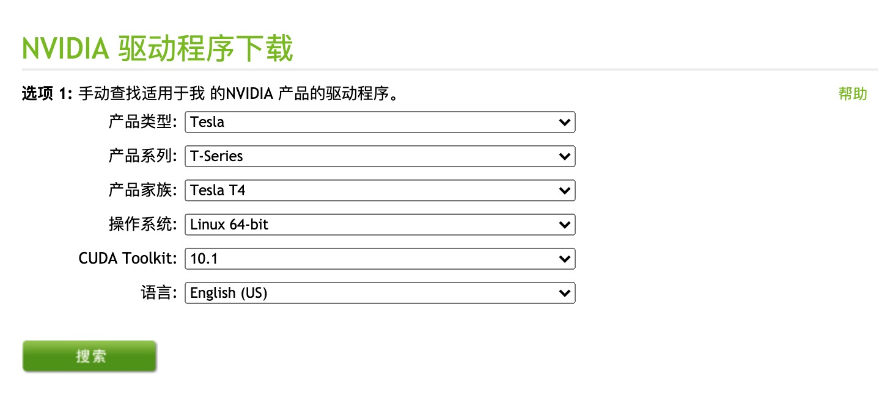
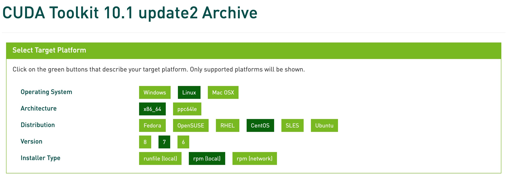

# Using GPU for AI Demo

## About GPU

- 机器登录方式
    - 172.16.130.171
    - 172.16.130.172

- GPU 型号
    - RTX2080TI
    - Tesla T4

- 驱动
    - NIVIDA 官网驱动 [下载网址](https://www.nvidia.cn/Download/index.aspx?lang=cn) ，根据实际情况选择

    

    - 随后可以进入下载页面，在 CentOS 7 中，我们可以根据下载链接进行下载

    ```bash
    wget http://us.download.nvidia.com/tesla/418.152.00/NVIDIA-Linux-x86_64-418.152.00.run
    ```

    - 解压后使用

    ```bash
    chmod a+x NVIDIA-Linux-x86_64-418.152.00.run
    ./NVIDIA-Linux-x86_64-418.152.00.run
    ```

- CUDA

    - [历史版本列表](https://developer.nvidia.com/cuda-toolkit-archive)
    - 以 10.1 Update 2 为例，根据实际需求进行选择

    

    - 根据步骤下载

    ```bash
    wget http://developer.download.nvidia.com/compute/cuda/10.1/Prod/local_installers/cuda-repo-rhel7-10-1-local-10.1.243-418.87.00-1.0-1.x86_64.rpm
    ```

    - 详细【[使用方式](https://developer.nvidia.com/cuda-10.1-download-archive-update2?target_os=Linux&target_arch=x86_64&target_distro=CentOS&target_version=7&target_type=rpmlocal)】

    ```bash
    sudo rpm -i cuda-repo-rhel7-10-1-local-10.1.243-418.87.00-1.0-1.x86_64.rpm
    sudo yum clean all
    sudo yum -y install nvidia-driver-latest-dkms cuda
    ```

- 成功之后可以使用 `nvidia-smi` 命令查看显存的使用情况

    - 单次查看

    ```console
    $ nvidia-smi

    Mon Aug 10 14:06:00 2020
    +-----------------------------------------------------------------------------+
    | NVIDIA-SMI 440.33.01    Driver Version: 440.33.01    CUDA Version: 10.2     |
    |-------------------------------+----------------------+----------------------+
    | GPU  Name        Persistence-M| Bus-Id        Disp.A | Volatile Uncorr. ECC |
    | Fan  Temp  Perf  Pwr:Usage/Cap|         Memory-Usage | GPU-Util  Compute M. |
    |===============================+======================+======================|
    |   0  Tesla T4            Off  | 00000000:5E:00.0 Off |                    0 |
    | N/A   44C    P0    27W /  70W |      0MiB / 15109MiB |      0%      Default |
    +-------------------------------+----------------------+----------------------+
    |   1  GeForce RTX 208...  Off  | 00000000:AF:00.0 Off |                  N/A |
    | 34%   40C    P0    16W / 250W |      0MiB / 11019MiB |      0%      Default |
    +-------------------------------+----------------------+----------------------+

    +-----------------------------------------------------------------------------+
    | Processes:                                                       GPU Memory |
    |  GPU       PID   Type   Process name                             Usage      |
    |=============================================================================|
    |  No running processes found                                                 |
    +-----------------------------------------------------------------------------+
    ```

    - 持续查看

    ```bash
    watch -n 1 nvidia-smi
    ```

## About Conda Env

### Install Miniconda

由于个人喜好及方便快捷的原因，还是使用 Conda 来部署，本次采用较为轻量级的 Miniconda 代替以往最长使用的 Anaconda，Miniconda 的清华镜像 [链接](https://mirrors.tuna.tsinghua.edu.cn/anaconda/miniconda/)

首先我们下载 Miniconda 的安装包并进行安装

```bash
cd ~
wget https://mirrors.tuna.tsinghua.edu.cn/anaconda/miniconda/Miniconda3-py38_4.8.2-Linux-x86_64.sh
sh ./Miniconda3-py38_4.8.2-Linux-x86_64.sh
```

可以选择删除安装包

```bash
# delete the installer after successful run
rm Miniconda3-latest-Linux-x86_64.sh
```

添加 `miniconda3` 的相关路径至环境变量

```bash
# add the conda path to our shell config files
echo 'export PATH="/root/miniconda3/bin:$PATH"' >> ~/.bashrc
```

如果在安装中默认启动 Conda 的 base 环境，又想取消，需要在 `~/.bashrc` 中注释掉相应部分

```console
$ cp ~/.bashrc ~/.bashrc.bak

# 编译 .bashrc 文件，防止每次启动都直接运行 conda 的 base 环境

$ diff ~/.bashrc ~/.bashrc.bak

16,26c16,26
< # __conda_setup="$('/root/miniconda3/bin/conda' 'shell.bash' 'hook' 2> /dev/null)"
< # if [ $? -eq 0 ]; then
< #     eval "$__conda_setup"
< # else
< #     if [ -f "/root/miniconda3/etc/profile.d/conda.sh" ]; then
< #         . "/root/miniconda3/etc/profile.d/conda.sh"
< #     else
< #         export PATH="/root/miniconda3/bin:$PATH"
< #     fi
< # fi
< # unset __conda_setup
---
> __conda_setup="$('/root/miniconda3/bin/conda' 'shell.bash' 'hook' 2> /dev/null)"
> if [ $? -eq 0 ]; then
>     eval "$__conda_setup"
> else
>     if [ -f "/root/miniconda3/etc/profile.d/conda.sh" ]; then
>         . "/root/miniconda3/etc/profile.d/conda.sh"
>     else
>         export PATH="/root/miniconda3/bin:$PATH"
>     fi
> fi
> unset __conda_setup
```

### Conda Mirror Help

可以通过修改用户目录下的 `.condarc` 文件来配置镜像，如果无法直接创建名为 `.condarc` 的文件，可先执行 `conda config --set show_channel_urls yes` 生成该文件之后再修改

```console
channels:
  - defaults
show_channel_urls: true
channel_alias: https://mirrors.tuna.tsinghua.edu.cn/anaconda
default_channels:
  - https://mirrors.tuna.tsinghua.edu.cn/anaconda/pkgs/main
  - https://mirrors.tuna.tsinghua.edu.cn/anaconda/pkgs/free
  - https://mirrors.tuna.tsinghua.edu.cn/anaconda/pkgs/r
  - https://mirrors.tuna.tsinghua.edu.cn/anaconda/pkgs/pro
  - https://mirrors.tuna.tsinghua.edu.cn/anaconda/pkgs/msys2
custom_channels:
  conda-forge: https://mirrors.tuna.tsinghua.edu.cn/anaconda/cloud
  msys2: https://mirrors.tuna.tsinghua.edu.cn/anaconda/cloud
  bioconda: https://mirrors.tuna.tsinghua.edu.cn/anaconda/cloud
  menpo: https://mirrors.tuna.tsinghua.edu.cn/anaconda/cloud
  pytorch: https://mirrors.tuna.tsinghua.edu.cn/anaconda/cloud
  simpleitk: https://mirrors.tuna.tsinghua.edu.cn/anaconda/cloud
```

### Create Conda Env

pypi 镜像使用帮助

```bash
pip install -i https://pypi.tuna.tsinghua.edu.cn/simple pip -U
pip config set global.index-url https://pypi.tuna.tsinghua.edu.cn/simple
```

查看 conda 版本信息

```console
$ conda -V
conda 4.8.2
```

**创建** 一个 conda 虚拟环境来使用 TensorFlow 的 GPU 版本

```bash
conda create --name tf-gpu python=3.7
```

查看已经创建好的环境，名为 `tf-gpu`

```console
$ conda env list

# or
$ conda info --envs

#
base                  *  /root/miniconda3
tf-gpu                   /root/miniconda3/envs/tf-gpu
```

如果想 **复制** 环境

```bash
conda create -n tf --clone tf-gpu
```

如果想 **<font color='red'>删除</font>** 环境

```bash
conda remove -n tf-gpu --all
```

### Activate or Deactivate the Env

激活 `tf-gpu` 虚拟环境

```bash
conda activate tf-gpu
```

在 `conda` 没有 init 时，也可以采用如下命令来激活 `tf-gpu` 虚拟环境

```bashe
source activate tf-gpu
```

取消激活虚拟环境

```bash
conda deactivate
```

虚拟环境前有类似 `(tf-gpu)` 这样的前缀标记，可以查看虚拟环境中的 Python 版本

```bash
python --version
```

### Install CUDA Toolkit & cuDNN

在 Miniconda 环境下，推荐使用

```console
conda install cudatoolkit=X.X
conda install cudnn=X.X.X
```

安装 CUDA Toolkit 和 cuDNN，其中 X.X 和 X.X.X 分别为需要安装的 CUDA Toolkit 和 cuDNN 版本号，必须严格按照 TensorFlow 官方网站所说明的版本 安装。例如，对于 TensorFlow 2.1，可使用:

```bash
conda install cudatoolkit=10.1
conda install cudnn=7.6.5
```

在安装前，可使用 `conda search cudatoolkit` 和 `conda search cudnn` 搜索 conda 源中可用的版本号

当然，也可以按照 [TensorFlow 官方网站上的说明](https://www.tensorflow.org/install/gpu) 手动下载 CUDA Toolkit 和 cuDNN 并安装，不过过程会稍繁琐

安装 Tensorflow 的 GPU 版本，目前 `tensorflow-gpu` 的最新版本是 `2.3.0`

## Using Pypi Install TensorFlow

### Pypi Settings

如果默认的 pip 网络连接速度慢，可以尝试使用镜像，将显著提升 pip 的下载速度（具体效果视您所在的网络环境而定）

- 临时使用镜像站来升级 pip

```bash
pip install -i https://pypi.tuna.tsinghua.edu.cn/simple pip -U
```

- 配置镜像源

```console
$ pip config set global.index-url https://pypi.tuna.tsinghua.edu.cn/simple
Writing to /root/.config/pip/pip.conf

# 查看镜像配置
$ pip config list
global.index-url='https://pypi.tuna.tsinghua.edu.cn/simple'
```

- 查看 `pip` 版本

```console
$ pip --version
pip 20.2.2 from /root/miniconda3/envs/tf-gpu/lib/python3.7/site-packages/pip (python 3.7)
```

### Install TensorFlow

从 TensorFlow 2.1 开始，pip 包 tensorflow 即同时包含 GPU 支持，无需通过特定的 pip 包 tensorflow-gpu 安装 GPU 版本。如果对 pip 包的大小敏感，可使用 tensorflow-cpu 包安装仅支持 CPU 的 TensorFlow 版本

当然可以使用 Python 包管理器 pip 安装 TensorFlow 的 GPU 版本进行一个示例，在命令行下输入

```bash
pip install tensorflow-gpu
```

**特别提醒**，如果在安装 `tensorflow-gpu` 出现部分包损毁或者中途各种原因退出时，可以进行毁天灭地、无差别攻击式升级安装

```bash
pip install --upgrade --ignore-installed tensorflow-gpu
```

### Install Dependencies

我们可以通过 pip 的命令来安装一些依赖的工具包

```bash
pip install -r requirments.txt
```

也可以快速生成一个 `requirements.txt` ，以便下次快速安装依赖的工具包

```bash
pip freeze > requirements.txt
```

## Running a Demo with AI

当我们完成配置之后，可以尝试进行一个有 TensorFlow Backend 的 Demo 查看效果，比如 [application-restful-api](http://gitlab.sh.99cloud.net/openshift_origin/application-restful-api) 项目，其中包含了目标检测的 API


1. 切换回本项目的根目录，安装 pip 依赖

    ```console
    $ ls
    README.md        cache            gpu-demo         main.gpu.py      media            templates
    apps             doc              hangzhou         main.py          requirements.txt testcase

    $ pip install -r gpu-demo/requirements.txt
    ```

1. 关于 `face-recognition` ，在 `pip install` 之前，需要一定的配置，可以参考 [安装文档](https://github.com/ageitgey/face_recognition/blob/master/README_Simplified_Chinese.md#%E5%AE%89%E8%A3%85)

1. 目前暂时没有在 GPU 的环境下配置过 **OpenVINO**，请先 **忽略** 这部分功能

1. 部署的服务器通常不会带 Web 浏览器，我们需要在生产模式下查看 Restful API 的效果，可以适当修改启动站点的代码，如

    ```console
    $ diff main.py main.gpu.py

    10,11c10,11
    < # from apps.dl_distinction import dl_distinction
    < from apps.openvino_distinction import vino_distinction
    ---
    > from apps.dl_distinction import dl_distinction
    > # from apps.openvino_distinction import vino_distinction
    40,41c40,41
    < # api.add_namespace(dl_distinction)
    < api.add_namespace(vino_distinction)
    ---
    > api.add_namespace(dl_distinction)
    > # api.add_namespace(vino_distinction)
    58c58
    <     app.run(debug=True)
    ---
    >     app.run(host='0.0.0.0', port=10200)
    ```

1. 在根目录下，运行站点，可用本地浏览器访问 **[Swagger](http://172.16.130.172:10200/docs)** 文档

    ```console
    $ python main.gpu.py

    2020-08-20 09:36:56.395878: I tensorflow/stream_executor/platform/default/dso_loader.cc:48] Successfully opened dynamic library libcudart.so.10.1
     * Serving Flask app "main" (lazy loading)
     * Environment: production
     WARNING: This is a development server. Do not use it in a production deployment.
     Use a production WSGI server instead.
     * Debug mode: off
     * Running on http://0.0.0.0:10200/ (Press CTRL+C to quit)
    ```

1. 在名为 **Deep Learning -- Distinction** 的 Namespace 下，`/api/v1/deep_learning/distinction` 的 API 用到了 TensorFlow Backend，并且在 CPU 环境下响应时间较长，可以对比在 GPU 环境下的速度以及查看显存使用情况，并且可以了解更多关于 [Keras 模型存储](#keras) 以及可能在 [导入图片中存在的问题](#keras-preprocessing)

## About Packages

### Package References

- **[Flask](https://flask.palletsprojects.com/en/1.1.x/)**
    - [Chinese Version](https://dormousehole.readthedocs.io/en/latest/)
- **[Flask-RESTPlus](https://flask-restplus.readthedocs.io/en/stable/)**
- **[NumPy](https://numpy.org/)**
    - [Chinese Version](https://www.numpy.org.cn/)
- **[Pandas](https://pandas.pydata.org/)**
    - [Chinese Version](https://www.pypandas.cn/)
- **[SciPy](https://www.scipy.org/)**
- **[Request](http://2.python-requests.org/en/latest/)**
    - [Chinese Version](http://2.python-requests.org/en/latest/)
- **[DateTime](https://docs.python.org/3/library/datetime.html)**
    - [Chinese Version](https://docs.python.org/zh-cn/3/library/datetime.html)
- **[FaceRecognition](https://github.com/ageitgey/face_recognition)**
    - [Chinese Version](https://github.com/ageitgey/face_recognition/blob/master/README_Simplified_Chinese.md)
- **[Scikit-Learn](https://scikit-learn.org/stable/)**
    - [Chinese Version I](https://sklearn.apachecn.org/),&emsp;[Chinese Version II](http://www.scikitlearn.com.cn/),&emsp;[Chinese Version III](https://www.cntofu.com/book/170/index.html) 
- **[Mglearn](https://github.com/amueller/introduction_to_ml_with_python)**
- **[TensorFlow](https://tensorflow.google.cn/)**
    - [Chinese Version I](http://www.tensorfly.cn/),&emsp;[Chinese Version II](https://tf.wiki/)

### Warnings and Errors

#### Flask-RESTPlus

##### Werkzeug

在 `import flask_restplus` 时， 因为 werkzeung 兼容性的关系可能会遇到如下异常

```console
ImportError: cannot import name 'cached_property' from 'werkzeug'
```

需要将 `site-packages/werkzeung/__init__.py` 文件中显式导入该模块

```python
from werkzeug.utils import cached_property
```

以解决问题

#### Keras

目前，`keras` 关于识别的预训练模型包括

- VGG16
- VGG19
- Xception
- ResNet50
- InceptionV3

共 5 个，在第一次使用时会自动由 GitHub 下载至 `$HOME/.keras/models/` 路径下，因为网络访问速度限制，也可以使用已经打包好的 [云盘](https://pan.baidu.com/s/1c0IokrHBAYe5LrEE945Kww) 去下载（提取码 `wian`），在解压后，存储至前述路径下

如果想对上述网络有一些宏观的了解，可以阅读介绍文档 **[imageNet with Keras](http://172.16.30.21/openshift_origin/application-restful-api/blob/master/doc/imageNetWithKeras.md)**

##### Keras-Preprocessing

在 `load_image` 中可能会存在无法读取 FileStorage 格式的情况，例如报如下错误

```console
TypeError: expected str, bytes or os.PathLike object, not FileStorage
```

这是高版本的 Keras-Preprocessing 普遍存在的问题，我们可以将其调整为 `1.1.0` 版本即可

```bash
pip install keras-preprocessing==1.1.0
```

或者在运行前，我们保证 Keras-Preprocessing 的版本号即可

```console
$ conda list keras

# packages in environment at /root/miniconda3/envs/tf-gpu:
#
# Name                    Version                   Build  Channel
keras                     2.4.3                    pypi_0    pypi
keras-preprocessing       1.1.0                    pypi_0    pypi
```
